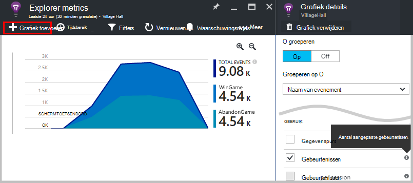
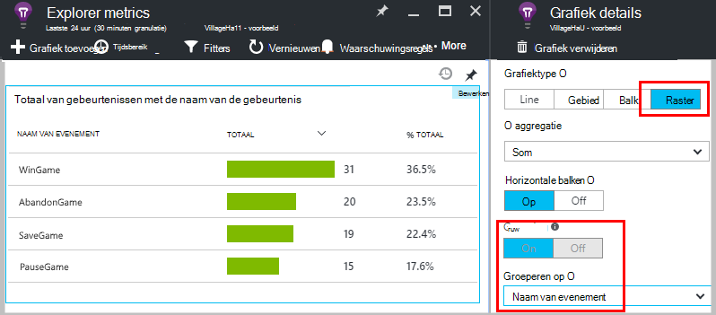
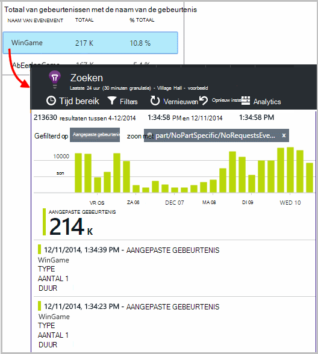
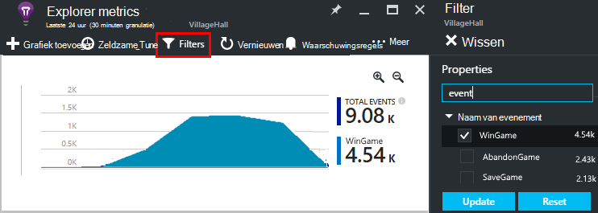
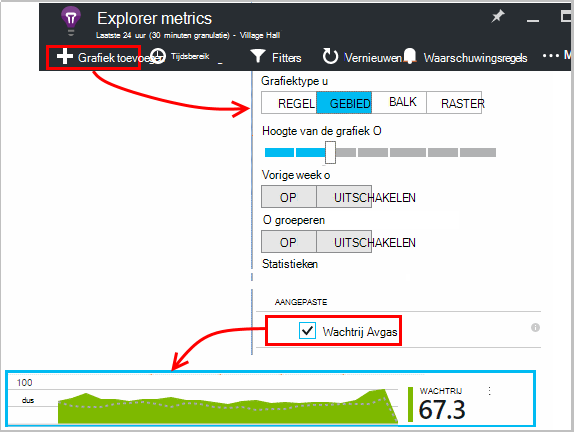
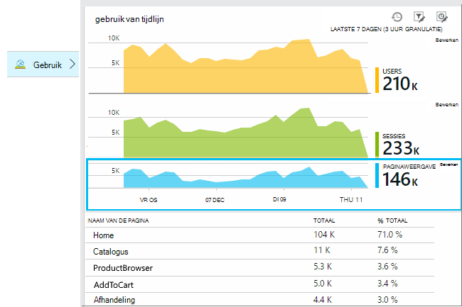
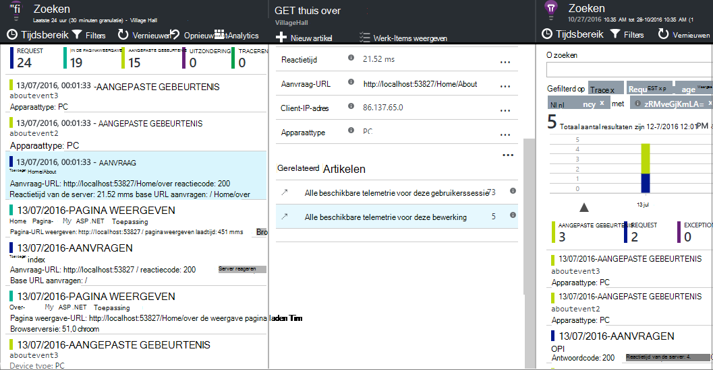
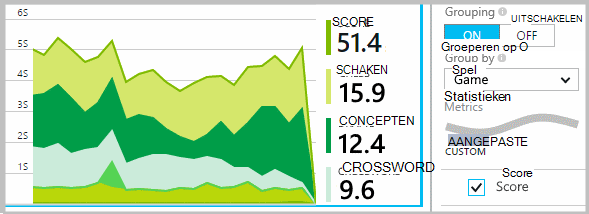
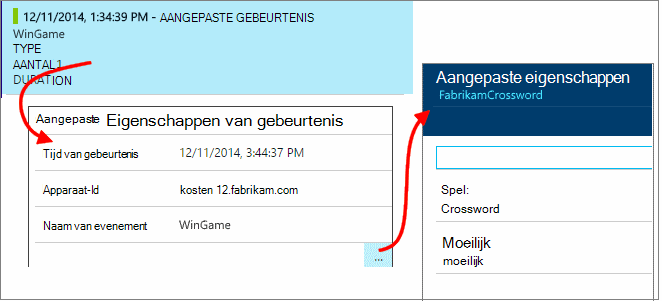
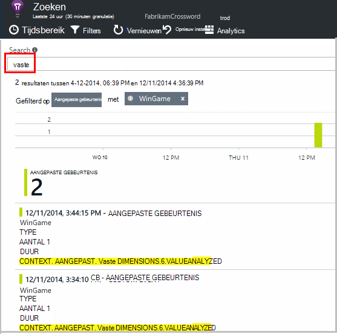

<properties 
    pageTitle="Toepassing inzichten API voor aangepaste gebeurtenissen en statistieken | Microsoft Azure" 
    description="Een paar regels code invoegen in uw apparaat of desktop app, webpagina of -service, gebruik bijhouden en vaststellen van problemen." 
    services="application-insights"
    documentationCenter="" 
    authors="alancameronwills" 
    manager="douge"/>
 
<tags 
    ms.service="application-insights" 
    ms.workload="tbd" 
    ms.tgt_pltfrm="ibiza" 
    ms.devlang="multiple" 
    ms.topic="article" 
    ms.date="10/19/2016" 
    ms.author="awills"/>

# <a name="application-insights-api-for-custom-events-and-metrics"></a>Toepassing inzichten API voor aangepaste gebeurtenissen en statistieken 

*Inzichten van toepassing is in het afdrukvoorbeeld.*

Voeg een paar regels code in uw toepassing om te bepalen wat gebruikers ermee doen of om u te helpen bij het vaststellen van problemen. U kunt telemetrie verzenden van het apparaat en de pc apps webclients en webservers. De [Visual Studio-toepassing inzichten](app-insights-overview.md) core telemetrie API kunt u aangepaste gebeurtenissen en statistieken en uw eigen versies van standaard telemetrie verzenden. Deze API is het dezelfde API die wordt gebruikt door de standaard toepassing inzichten gegevensverzamelaars.

## <a name="api-summary"></a>API-overzicht

De API is uniform op alle platforms, afgezien van enkele kleine variaties.

Methode | Gebruikt voor
---|---
[`TrackPageView`](#page-views) | Pagina's, schermen, blades of formulieren
[`TrackEvent`](#track-event) | Acties van de gebruiker en andere evenementen. Gebruikt voor het bijhouden van gebruikersgedrag of om prestaties te controleren.
[`TrackMetric`](#track-metric) | Metingen van de prestaties zoals wachtrij lengtes die niet gerelateerd zijn aan specifieke gebeurtenissen
[`TrackException`](#track-exception)|Meld u uitzonderingen voor diagnose. Waar zij ten opzichte van andere gebeurtenissen plaatsvinden en onderzoeken stacktraces traceren.
[`TrackRequest`](#track-request)| Meld de frequentie en duur van de serveraanvragen voor het analyseren van de prestaties.
[`TrackTrace`](#track-trace)|Het diagnoselogboek van berichten. U kunt ook Logboeken 3de partij vastleggen.
[`TrackDependency`](#track-dependency)|Meld de duur en de frequentie van aanroepen voor externe onderdelen waarvan de toepassing afhankelijk is.

U kunt [Eigenschappen en parameters toevoegen](#properties) aan de meeste van deze oproepen telemetrie. 


## <a name="prep"></a>Voordat u begint

Als u dit nog niet hebt gedaan:

* De toepassing inzichten SDK toevoegen aan het project:
 * [ASP.NET-project][greenbrown]
 * [Java-project][java] 
 * [JavaScript op elke webpagina][client]   

* Neem in uw code apparaat of web server:

    *C#:*`using Microsoft.ApplicationInsights;`

    *VB:*`Imports Microsoft.ApplicationInsights`

    *Java:*`import com.microsoft.applicationinsights.TelemetryClient;`

## <a name="construct-a-telemetryclient"></a>Een TelemetryClient maken

Samenstellen van een exemplaar van de TelemetryClient (behalve in JavaScript in webpagina's):

*C#:* 

    private TelemetryClient telemetry = new TelemetryClient();

*VB:* 

    Private Dim telemetry As New TelemetryClient

*Java*

    private TelemetryClient telemetry = new TelemetryClient();

TelemetryClient is een thread-safe.

Aangeraden dat u een exemplaar van `TelemetryClient` voor elke module van uw app. Bijvoorbeeld, kan er een `TelemetryClient` in de webservice verslag binnenkomende HTTP-aanvragen en een andere in een klasse middleware rapport zakelijke logica gebeurtenissen. U kunt eigenschappen instellen, zoals `TelemetryClient.Context.User.Id` voor het bijhouden van gebruikers en sessies, of `TelemetryClient.Context.Device.Id` voor het identificeren van de machine. Deze informatie is gekoppeld aan alle gebeurtenissen die worden verzonden door de sessie.


## <a name="track-event"></a>Evenement bijhouden

In toepassing van inzichten, een *aangepaste gebeurtenis* is het gegevenspunt dat u kunt weergeven in zowel in als [Metrische Explorer] [ metrics] als een geaggregeerde aantal, en ook als afzonderlijke exemplaren in [Diagnostische zoeken][diagnostic]. (Dit is niet verwant aan MVC of andere framework 'Evenementen'.) 

TrackEvent aanroepen invoegen in uw code om te tellen hoe vaak gebruikers kiezen een bepaalde functie, hoe vaak verwezenlijking van bepaalde doelstellingen, of misschien maken bepaalde typen fout. 

Verzenden, een gebeurtenis telkens wanneer een gebruiker het spel wint in een spel app: 

*JavaScript*

    appInsights.trackEvent("WinGame");

*C#*
    
    telemetry.TrackEvent("WinGame");

*VB*


    telemetry.TrackEvent("WinGame")

*Java*

    telemetry.trackEvent("WinGame");


### <a name="view-your-events-in-the-azure-portal"></a>De gebeurtenissen in de Azure portal weergeven

Overzicht van een aantal van de evenementen, open een [Explorer Metric](app-insights-metrics-explorer.md) blade, een nieuwe grafiek toevoegen en selecteer gebeurtenissen.  



Om het vergelijken van de aantallen van de verschillende gebeurtenissen, stelt u het grafiektype op raster en groep met de gebeurtenisnaam:




Klik op het raster, door de naam van een gebeurtenis voor een overzicht van de afzonderlijke exemplaren van deze gebeurtenis.



Klik op een voorval in om meer details zichtbaar.

Te richten op specifieke gebeurtenissen in Search of Explorer Metric, instellen van de blade-filter aan de gebeurtenisnamen waarin u bent geïnteresseerd in:



## <a name="track-metric"></a>Metrische gegevens bijhouden

Gebruik TrackMetric voor het verzenden van gegevens die niet zijn gekoppeld aan bepaalde gebeurtenissen. U kan bijvoorbeeld een lengte van wachtrij controleren met regelmatige tussenpozen. 

Maatstaven als statistische grafieken in metrische explorer worden weergegeven, maar in tegenstelling tot de gebeurtenissen, u kunt niet zoeken naar afzonderlijke exemplaren in diagnostische zoeken.

Metrische waarden moet > = 0 moet correct worden weergegeven.


*JavaScript*

    appInsights.trackMetric("Queue", queue.Length);

*C#*

    telemetry.TrackMetric("Queue", queue.Length);

*VB*

    telemetry.TrackMetric("Queue", queue.Length)

*Java*

    telemetry.trackMetric("Queue", queue.Length);

In feite kunt u dit doen in een thread op de achtergrond:

*C#*

    private void Run() {
     var appInsights = new TelemetryClient();
     while (true) {
      Thread.Sleep(60000);
      appInsights.TrackMetric("Queue", queue.Length);
     }
    }


U kunt de resultaten Metrics Explorer te openen en een nieuwe grafiek toevoegen. Stel de metric weergegeven.



Er zijn enkele [beperkingen op het aantal parameters](#limits) die kunt u.

## <a name="page-views"></a>Paginaweergaven

In een apparaat of webpagina app pagina weergave telemetrie standaard verzonden wanneer het scherm of de pagina wordt geladen. Maar u kunt deze instelling wijzigen voor het bijhouden van bezoekers op aanvullende of afwijkende tijden. Bijvoorbeeld in een app waarin tabs of blades, raadzaam om bij te houden van een "pagina" wanneer de gebruiker een nieuwe blade opent. 



Gebruikers-en wordt verzonden als de eigenschappen paginaweergaven, zodat de gebruiker- en sessieobjecten grafieken tot leven komen wanneer de pagina weergave telemetrie.

#### <a name="custom-page-views"></a>Aangepaste weergaven

*JavaScript*

    appInsights.trackPageView("tab1");

*C#*

    telemetry.TrackPageView("GameReviewPage");

*VB*

    telemetry.TrackPageView("GameReviewPage")


Als u meerdere tabbladen in een andere HTML-pagina's hebt, kunt u de URL te:

    appInsights.trackPageView("tab1", "http://fabrikam.com/page1.htm");

#### <a name="timing-page-views"></a>Timing paginaweergaven

Standaard tijden gemeld 'Laadtijd pagina bekijken' worden gemeten vanaf wanneer de browser de aanvraag, stuurt totdat de pagina van de browser de gebeurtenis load wordt genoemd.

In plaats daarvan kunt u:

* Stel een expliciete duur in de aanroep van [trackPageView](https://github.com/Microsoft/ApplicationInsights-JS/blob/master/API-reference.md#trackpageview) .
 * `appInsights.trackPageView("tab1", null, null, null, durationInMilliseconds);`
* De timing van de gesprekken in de paginaweergave gebruiken `startTrackPage` en `stopTrackPage`.

*JavaScript*

    // To start timing a page:
    appInsights.startTrackPage("Page1");

... 

    // To stop timing and log the page:
    appInsights.stopTrackPage("Page1", url, properties, measurements);

De naam die u gebruikt als de eerste parameter de gesprekken starten en stoppen koppelt. Wordt standaard de naam van de huidige pagina. 

De resulterende pagina laden duur weergegeven in Verkenner Metric zijn afgeleid van het interval tussen de begin- en eindtijd. Is het aan u wat u werkelijk tijd interval.

## <a name="track-request"></a>Aanvraag bijhouden

Door de server SDK gebruikt HTTP-aanvragen moeten worden geregistreerd. 

U kunt ook aanroepen deze zelf als u wilt simuleren aanvragen in een context waar u hoeft niet de web servicemodule uitgevoerd.

*C#*

    // At start of processing this request:

    // Operation Id and Name are attached to all telemetry and help you identify
    // telemetry associated with one request:
    telemetry.Context.Operation.Id = Guid.NewGuid().ToString();
    telemetry.Context.Operation.Name = requestName;
    
    var stopwatch = System.Diagnostics.Stopwatch.StartNew();

    // ... process the request ...

    stopwatch.Stop();
    telemetry.TrackRequest(requestName, DateTime.Now,
       stopwatch.Elapsed, 
       "200", true);  // Response code, success


## <a name="operation-context"></a>Bewerking context

Telemetrie items kunnen samen worden gekoppeld met daaraan verbonden een veelgebruikte bewerking. De standaard aanvraag tracking module doet dit voor uitzonderingen en andere gebeurtenissen tijdens de verwerking van een HTTP-aanvraag zijn verzonden. Op [zoekpagina's](app-insights-diagnostic-search.md) en [Analytics](app-insights-analytics.md), kunt u de ID gemakkelijk vinden de gebeurtenissen die zijn gekoppeld aan de aanvraag. 

De eenvoudigste manier om de ID ingesteld is voor het instellen van de context van een bewerking met behulp van dit patroon:

    // Establish an operation context and associated telemetry item:
    using (var operation = telemetry.StartOperation<RequestTelemetry>("operationName"))
    {
        // Telemetry sent in here will use the same operation ID.
        ...
        telemetry.TrackEvent(...); // or other Track* calls
        ...
        // Set properties of containing telemetry item - for example:
        operation.Telemetry.ResponseCode = "200";
        
        // Optional: explicitly send telemetry item:
        telemetry.StopOperation(operation);

    } // When operation is disposed, telemetry item is sent.

En het instellen van de context van een bewerking, `StartOperation` maakt een telemetrie-item van het type dat u opgeeft en verzendt deze bij de buitengebruikstelling van de bewerking, of als u expliciet aanroepen `StopOperation`. Als u `RequestTelemetry` als het type telemetrie, wordt de duur ingesteld op de bepaalde tijdsinterval tussen de begin- en eindtijd.

Contexten bewerking kunnen niet worden genest. Als er al een context voor de bewerking, zijn de ID is gekoppeld aan alle de items, met inbegrip van het item dat is gemaakt met StartOperation.

Zoeken, wordt de bewerking-context gebruikt voor het maken van de lijst met verwante Items:




## <a name="track-exception"></a>Uitzondering bijhouden

Uitzonderingen verzenden naar inzichten van toepassing: [allemaal][metrics], een indicatie van de frequentie van een probleem; en onderzoeken van [afzonderlijke exemplaren][diagnostic]. De rapporten bevatten de stacktraces.

*C#*

    try
    {
        ...
    }
    catch (Exception ex)
    {
       telemetry.TrackException(ex);
    }

*JavaScript*

    try
    {
       ...
    }
    catch (ex)
    {
       appInsights.trackException(ex);
    }

De SDK's werkelijk veel uitzonderingen automatisch, zodat u niet altijd TrackException expliciet aanroepen.

* ASP.NET: [uitzonderingen catch-code schrijven](app-insights-asp-net-exceptions.md)
* J2EE: [uitzonderingen zijn gevangen, automatisch](app-insights-java-get-started.md#exceptions-and-request-failures)
* JavaScript: Automatisch gevangen. Als u uitschakelen van automatische verzameling wilt, een lijn toevoegen in het stukje code die u in uw webpagina's invoegt:

    ```
    ({
      instrumentationKey: "your key"
      , disableExceptionTracking: true
    })
    ```


## <a name="track-trace"></a>Bijhouden tracering 

Gebruik deze optie om u te helpen bij het vaststellen van problemen door een breadcrumb trail te sturen naar de inzichten van toepassing. Delen van diagnostische gegevens verzenden en onderzoeken in [Diagnostische zoeken][diagnostic]. 

 

[Meld u adapters] [ trace] deze API gebruiken voor het verzenden van derden logboeken op de portal.


*C#*

    telemetry.TrackTrace(message, SeverityLevel.Warning, properties);


U kunt zoeken op de inhoud van het bericht, maar (in tegenstelling tot de eigenschapswaarden) u kunt niet filteren op deze.

De maximale grootte op `message` veel hoger is dan de limiet op Eigenschappen.
Van TrackTrace heeft als voordeel dat u relatief lange gegevens in het bericht kunt plaatsen. Zo kan u er POST-gegevens te coderen.  


Bovendien kunt u een prioriteitsniveau aan uw bericht toevoegen. En net als andere telemetrie, kunt u waarden van de eigenschappen die u gebruiken kunt om te filteren of zoeken naar sporen van verschillende groepen toevoegen. Bijvoorbeeld:


    var telemetry = new Microsoft.ApplicationInsights.TelemetryClient();
    telemetry.TrackTrace("Slow database response",
                   SeverityLevel.Warning,
                   new Dictionary<string,string> { {"database", db.ID} });

Op deze manier, in de [zoekopdracht]kan[diagnostic], gemakkelijk om weg te filteren alle berichten van een bepaalde ernst is met betrekking tot een bepaalde database.

## <a name="track-dependency"></a>Bijhouden van afhankelijkheid

Met deze aanroep kunt bijhouden responstijden en succespercentages van oproepen naar een externe stuk code. De resultaten worden weergegeven in de grafieken afhankelijkheid in de portal. 

```C#

            var success = false;
            var startTime = DateTime.UtcNow;
            var timer = System.Diagnostics.Stopwatch.StartNew();
            try
            {
                success = dependency.Call();
            }
            finally
            {
                timer.Stop();
                telemetry.TrackDependency("myDependency", "myCall", startTime, timer.Elapsed, success);
            }
```

Houd er rekening mee dat de server die SDK 's opnemen in een [module afhankelijkheid](app-insights-dependencies.md) die ontdekt en bepaalde afhankelijkheid houdt automatisch - bijvoorbeeld databases en REST API's belt. U hebt een agent installeren op uw server te maken van de module werken. Gebruikt u deze oproep als u wilt bijhouden van gesprekken die niet worden tegengehouden door het geautomatiseerde volgen of als u niet wilt dat de agent installeren.

Uit te schakelen de afhankelijkheid standaard tracking module, [ApplicationInsights.config](app-insights-configuration-with-applicationinsights-config.md) bewerken en verwijderen van de verwijzing naar `DependencyCollector.DependencyTrackingTelemetryModule`.


## <a name="flushing-data"></a>Gegevens leegmaken

Normaal gesproken verzendt de SDK gegevens soms gekozen voor het minimaliseren van de gevolgen voor de gebruiker. Echter, in sommige gevallen raadzaam legen van de buffer - bijvoorbeeld als u in een toepassing die wordt afgesloten met de SDK.

*C#*

    telemetry.Flush();

    // Allow some time for flushing before shutdown.
    System.Threading.Thread.Sleep(1000);

Houd er rekening mee dat de functie is voor de [server telemetrie kanaal](https://www.nuget.org/packages/Microsoft.ApplicationInsights.WindowsServer.TelemetryChannel/)asynchrone maar synchrone als u kiest voor het kanaal in het geheugen of de [permanente kanaal](app-insights-api-filtering-sampling.md#persistence-channel).


## <a name="authenticated-users"></a>Geverifieerde gebruikers

In een web app worden gebruikers standaard geïdentificeerd door de cookie. Een gebruiker kan meer dan één keer worden geteld als ze toegang krijgen uw app vanaf een andere computer of browser tot of cookies verwijderen. 

Maar als gebruikers zich met uw app aanmelden, krijgt u een nauwkeuriger telling door de geverifieerde gebruikers-id in de code van de browser:

*JavaScript*

```JS
    // Called when my app has identified the user.
    function Authenticated(signInId) {
      var validatedId = signInId.replace(/[,;=| ]+/g, "_");
      appInsights.setAuthenticatedUserContext(validatedId);
      ...
    }
```

In een ASP.NET-webpagina MVC-toepassing, bijvoorbeeld:

*Razor*

        @if (Request.IsAuthenticated)
        {
            <script>
                appInsights.setAuthenticatedUserContext("@User.Identity.Name
                   .Replace("\\", "\\\\")"
                   .replace(/[,;=| ]+/g, "_"));
            </script>
        }

Het is niet nodig de werkelijke aanmelden gebruikersnaam gebruiken. Het heeft alleen een id die uniek is voor die gebruiker. Mag geen spaties of tekens bevatten `,;=|`. 

De gebruikers-id is ook instellen in een sessiecookie en naar de server verzonden. Als de server SDK is geïnstalleerd, de id van de geverifieerde gebruiker wordt verzonden als onderdeel van de contexteigenschappen van de client en de server telemetrie, zodat u kunt filteren en zoeken op het.

Als uw app gebruikers in rekeningen groepen, kunt u ook een id voor de account (met dezelfde tekenbeperkingen) doorgeven.


      appInsights.setAuthenticatedUserContext(validatedId, accountId);

In [explorer maatstelsel](app-insights-metrics-explorer.md), kunt u een grafiek die **gebruikers geverifieerd** en **gebruikersaccounts telt**. 

U kunt ook [Zoeken] [ diagnostic] voor client gegevenspunten met specifieke gebruikersnamen en accounts.

## <a name="properties"></a>Filteren, zoeken en segmenteren van uw gegevens met eigenschappen

U kunt eigenschappen en metingen koppelen aan de gebeurtenissen (en ook metrisch, pagina-weergaven, uitzonderingen en andere telemetriegegevens).

**Eigenschappen** zijn string-waarden die u kunt gebruiken voor het filteren van de telemetrie in de rapporten. Bijvoorbeeld als uw app vindt u verschillende spelletjes, u zult de naam van het spel toevoegen aan elke gebeurtenis, zodat u kunt zien welke spellen zijn meer populair. 

Er is een limiet van ongeveer 1k op de lengte van de tekenreeks. (Als u wilt voor het verzenden van grote delen van gegevens, gebruiken de parameter bericht van [TrackTrace](#track-trace).)

**Meetgegevens** worden numerieke waarden die kunnen worden weergegeven als geïllustreerd. U wilt weten of er een geleidelijke stijging van de verwezenlijking van de gamers scores. De grafieken kunnen worden gesegmenteerd door de eigenschappen die zijn verzonden met de gebeurtenis die u afzonderlijk kunt krijgen of gestapeld grafieken voor verschillende spellen.

Metrische waarden moet > = 0 moet correct worden weergegeven.


Er zijn enkele [beperkingen op het aantal eigenschappen, waarden van eigenschappen en parameters](#limits) die u kunt gebruiken.


*JavaScript*

    appInsights.trackEvent
      ("WinGame",
         // String properties:
         {Game: currentGame.name, Difficulty: currentGame.difficulty},
         // Numeric metrics:
         {Score: currentGame.score, Opponents: currentGame.opponentCount}
         );

    appInsights.trackPageView
        ("page name", "http://fabrikam.com/pageurl.html",
          // String properties:
         {Game: currentGame.name, Difficulty: currentGame.difficulty},
         // Numeric metrics:
         {Score: currentGame.score, Opponents: currentGame.opponentCount}
         );
          

*C#*

    // Set up some properties and metrics:
    var properties = new Dictionary <string, string> 
       {{"game", currentGame.Name}, {"difficulty", currentGame.Difficulty}};
    var metrics = new Dictionary <string, double>
       {{"Score", currentGame.Score}, {"Opponents", currentGame.OpponentCount}};

    // Send the event:
    telemetry.TrackEvent("WinGame", properties, metrics);


*VB*

    ' Set up some properties:
    Dim properties = New Dictionary (Of String, String)
    properties.Add("game", currentGame.Name)
    properties.Add("difficulty", currentGame.Difficulty)

    Dim metrics = New Dictionary (Of String, Double)
    metrics.Add("Score", currentGame.Score)
    metrics.Add("Opponents", currentGame.OpponentCount)

    ' Send the event:
    telemetry.TrackEvent("WinGame", properties, metrics)


*Java*
    
    Map<String, String> properties = new HashMap<String, String>();
    properties.put("game", currentGame.getName());
    properties.put("difficulty", currentGame.getDifficulty());
    
    Map<String, Double> metrics = new HashMap<String, Double>();
    metrics.put("Score", currentGame.getScore());
    metrics.put("Opponents", currentGame.getOpponentCount());
    
    telemetry.trackEvent("WinGame", properties, metrics);


> [AZURE.NOTE] Wees voorzichtig niet om persoonlijk identificeerbare informatie in het logboek.

**Als u metrische**Metric Verkenner openen en selecteert u de metric van de aangepaste groep:


*Als de waarde niet wordt weergegeven, of als de aangepaste koptekst is er niet, sluit het blad van de selectie en probeer het later. Het kost soms een uur voor de parameters kunnen worden samengevoegd door middel van de pijpleiding.*

**Als u eigenschappen en parameters**, de metric door de eigenschap segment:





**In diagnostische zoeken**, kunt u de eigenschappen en parameters van afzonderlijke exemplaren van een gebeurtenis weergeven.





Gebruik het veld zoeken voor een overzicht van de gebeurtenissen die hebben plaatsgevonden met een bepaalde eigenschappenwaarde.




[Meer informatie over zoekformules][diagnostic].

#### <a name="alternative-way-to-set-properties-and-metrics"></a>Eigenschappen en parameters instellen

Als het beter uitkomt, kunt u de parameters van een gebeurtenis in een afzonderlijk object:

    var event = new EventTelemetry();

    event.Name = "WinGame";
    event.Metrics["processingTime"] = stopwatch.Elapsed.TotalMilliseconds;
    event.Properties["game"] = currentGame.Name;
    event.Properties["difficulty"] = currentGame.Difficulty;
    event.Metrics["Score"] = currentGame.Score;
    event.Metrics["Opponents"] = currentGame.Opponents.Length;

    telemetry.TrackEvent(event);

> [AZURE.WARNING] Niet opnieuw gebruiken voor hetzelfde item exemplaar voor telemetrie (`event` in dit voorbeeld) Track*() meerdere keren aanroepen. Hierdoor kan de telemetrie met onjuiste configuratie worden verzonden.


## <a name="timed"></a>Timing-gebeurtenissen

Soms wilt u grafiek hoe lang het duurt enkele actie uit te voeren. Zo wilt u wellicht weten hoe lang gebruikers nemen rekening te houden met keuzemogelijkheden in een spel. Dit is een handig voorbeeld van het gebruik van de parameter meting.


*C#*

    var stopwatch = System.Diagnostics.Stopwatch.StartNew();

    // ... perform the timed action ...

    stopwatch.Stop();

    var metrics = new Dictionary <string, double>
       {{"processingTime", stopwatch.Elapsed.TotalMilliseconds}};

    // Set up some properties:
    var properties = new Dictionary <string, string> 
       {{"signalSource", currentSignalSource.Name}};

    // Send the event:
    telemetry.TrackEvent("SignalProcessed", properties, metrics);


## <a name="defaults"></a>Standaardeigenschappen voor aangepaste telemetrie

Als u wilt dat waarden van de eigenschap standaardwaarde instellen voor een aantal van de aangepaste gebeurtenissen die u schrijft, kunt u ze in een TelemetryClient instellen. Ze zijn gekoppeld aan elk telemetrie artikel vanuit dat de client verzonden. 

*C#*

    using Microsoft.ApplicationInsights.DataContracts;

    var gameTelemetry = new TelemetryClient();
    gameTelemetry.Context.Properties["Game"] = currentGame.Name;
    // Now all telemetry will automatically be sent with the context property:
    gameTelemetry.TrackEvent("WinGame");
    
*VB*

    Dim gameTelemetry = New TelemetryClient()
    gameTelemetry.Context.Properties("Game") = currentGame.Name
    ' Now all telemetry will automatically be sent with the context property:
    gameTelemetry.TrackEvent("WinGame")

*Java*

    import com.microsoft.applicationinsights.TelemetryClient;
    import com.microsoft.applicationinsights.TelemetryContext;
    ...


    TelemetryClient gameTelemetry = new TelemetryClient();
    TelemetryContext context = gameTelemetry.getContext();
    context.getProperties().put("Game", currentGame.Name);
    
    gameTelemetry.TrackEvent("WinGame");


    
Afzonderlijke telemetrie gesprekken kunnen negeren de standaardwaarden in de eigenschap woordenlijsten.

**Webclients voor JavaScript**, [JavaScript telemetrie begin gebruiken](#js-initializer).

**Eigenschappen van alle telemetrie toevoegen** met inbegrip van de gegevens uit de standaard collectie modules, [implementatie `ITelemetryInitializer` ](app-insights-api-filtering-sampling.md#add-properties).


## <a name="sampling-filtering-and-processing-telemetry"></a>Bemonstering, filteren en verwerken van telemetrie 

U kunt code schrijven voor uw telemetrie verwerken voordat het wordt verzonden uit de SDK. De verwerking van bevat gegevens die worden verzonden vanuit de standaard telemetrie modules, zoals HTTP-verzoek collectie en afhankelijkheid-collectie.

* [Eigenschappen toevoegen](app-insights-api-filtering-sampling.md#add-properties) aan telemetrie door het implementeren van `ITelemetryInitializer` - bijvoorbeeld getallen versie toevoegen of waarden berekend op basis van andere eigenschappen. 
* [Filteren](app-insights-api-filtering-sampling.md#filtering) kan wijzigen of telemetrie annuleren voordat deze uit de SDK wordt verzonden door het implementeren van `ITelemetryProcesor`. U bepalen wat wordt verzonden of verwijderd, maar u moet rekening houden met het effect van uw gegevens. Afhankelijk van hoe u items verwijderen, verliest u mogelijk de mogelijkheid om te navigeren tussen verwante items.
* [Bemonstering](app-insights-api-filtering-sampling.md#sampling) is een ingepakte oplossing ter vermindering van de omvang van de gegevens van uw app naar de portal verzonden. Dit gebeurt zonder dat de statistieken weergegeven en zonder de mogelijkheid om te diagnosticeren door te navigeren tussen verwante items als uitzonderingen, aanvragen en bezoekers.

[Meer informatie](app-insights-api-filtering-sampling.md)


## <a name="disabling-telemetry"></a>Telemetrie uitschakelen

**Dynamisch stoppen en starten van** de verzameling en overdracht van telemetrie:

*C#*

```C#

    using  Microsoft.ApplicationInsights.Extensibility;

    TelemetryConfiguration.Active.DisableTelemetry = true;
```

**Uitschakelen van geselecteerde standaard verzamelaars** - bijvoorbeeld prestatiemeteritems, HTTP-aanvragen of afhankelijkheden - verwijderen of de desbetreffende regels in [ApplicationInsights.config][config]. U kan dit bijvoorbeeld doen als u wilt TrackRequest gegevens verzenden.

## <a name="debug"></a>Modus voor ontwikkelaars

Tijdens de foutopsporing, is het nuttig te beschikken over uw telemetrie versneld door de pijplijn, zodat u direct de resultaten kunt zien. U ook get extra berichten die u helpen bij traceren eventuele problemen met de telemetrie. Schakel deze uit in de productie, als dit uw app kan vertragen.


*C#*
    
    TelemetryConfiguration.Active.TelemetryChannel.DeveloperMode = true;

*VB*

    TelemetryConfiguration.Active.TelemetryChannel.DeveloperMode = True


## <a name="ikey"></a>Stel de sleutel instrumentation voor geselecteerde aangepaste telemetrie

*C#*
    
    var telemetry = new TelemetryClient();
    telemetry.InstrumentationKey = "---my key---";
    // ...


## <a name="dynamic-ikey"></a>Dynamische instrumentation sleutel

Om te voorkomen dat de vermenging van de telemetrie van ontwikkeling, test en productie-omgevingen, kunt u [afzonderlijke toepassing inzichten resources maken] [ create] en wijzigt u de sleutels, afhankelijk van de omgeving.

In plaats van de sleutel instrumentation via het configuratiebestand ontvangt, kunt u deze instellen in de code. Stel de sleutel in een initialisatiemethode, zoals global.aspx.cs in een ASP.NET-service:

*C#*

    protected void Application_Start()
    {
      Microsoft.ApplicationInsights.Extensibility.
        TelemetryConfiguration.Active.InstrumentationKey = 
          // - for example -
          WebConfigurationManager.Settings["ikey"];
      ...

*JavaScript*

    appInsights.config.instrumentationKey = myKey; 


Webpagina's kunt u instellen vanuit de webserver staat, in plaats van letterlijk codering in het script. Bijvoorbeeld, in een webpagina die is gegenereerd in een ASP.NET-toepassing:

*JavaScript in Razor*

    <script type="text/javascript">
    // Standard Application Insights web page script:
    var appInsights = window.appInsights || function(config){ ...
    // Modify this part:
    }({instrumentationKey:  
      // Generate from server property:
      @Microsoft.ApplicationInsights.Extensibility.
         TelemetryConfiguration.Active.InstrumentationKey"
    }) // ...


## <a name="telemetrycontext"></a>TelemetryContext

TelemetryClient heeft een contexteigenschap, die een aantal waarden die worden verzonden en alle telemetriegegevens bevat. Normaal gesproken zijn ingesteld door de standaard telemetrie modules, maar u kunt ook ze zelf instellen. Bijvoorbeeld:

    telemetry.Context.Operation.Name = "MyOperationName";

Als u een van deze waarden zelf instellen, kunt u de betreffende regel verwijderen uit [ApplicationInsights.config][config], zodat de waarden en de waarden die niet veranderen.

* **Onderdeel** Identificeert de app en de versie
* **Apparaat** Gegevens over het apparaat waarop de toepassing wordt uitgevoerd (dit is in het web apps, de server of client-apparaat waarvan de telemetrie is verzonden)
* **InstrumentationKey** Geeft de bron toepassing inzichten in Azure waar de telemetrie wordt weergegeven. Meestal opgehaald uit ApplicationInsights.config
* **Locatie** Geeft de geografische locatie van het apparaat.
* **Bewerking** In web apps, de huidige HTTP-aanvraag. In andere typen app kunt u instellen als gebeurtenissen groeperen op elkaar.
 * **Id**: een gegenereerde waarde die verschillende gebeurtenissen, zodat wanneer u een gebeurtenis in diagnostische zoeken inspecteert, u vindt "verwante items"
 * **Naam**: een id, meestal de URL van de HTTP-aanvraag. 
 * **SyntheticSource**: als niet null of leeg is, deze tekenreeks geeft aan dat de bron van de aanvraag is geïdentificeerd als een robot of web test. Standaard wordt deze uitgesloten van berekeningen in Explorer Metrics.
* **Eigenschappen** Eigenschappen die met alle telemetriegegevens worden verzonden. In afzonderlijke Track * gesprekken kunnen worden opgeheven.
* **Sessie** De sessie identificeert. De Id wordt ingesteld op een gegenereerde waarde wordt gewijzigd wanneer de gebruiker niet actief is geweest voor een tijdje.
* **Gebruiker** Gebruikersgegevens. 

## <a name="limits"></a>Limieten


[AZURE.INCLUDE [application-insights-limits](../../includes/application-insights-limits.md)]

*Hoe kan ik voorkomen dat de limiet te raken?*

* Gebruik [de bemonstering](app-insights-sampling.md).

*Hoe lang is gegevens bewaard?*

* Zie [gegevens en privacy][data].


## <a name="reference-docs"></a>Referentie docs

* [ASP.NET-naslaginformatie](https://msdn.microsoft.com/library/dn817570.aspx)
* [Naslaginformatie over Java](http://dl.windowsazure.com/applicationinsights/javadoc/)
* [JavaScript reference](https://github.com/Microsoft/ApplicationInsights-JS/blob/master/API-reference.md)
* [Android SDK](https://github.com/Microsoft/ApplicationInsights-Android)
* [iOS SDK](https://github.com/Microsoft/ApplicationInsights-iOS)


## <a name="sdk-code"></a>SDK-Code

* [ASP.NET-Core SDK](https://github.com/Microsoft/ApplicationInsights-dotnet)
* [ASP.NET 5](https://github.com/Microsoft/ApplicationInsights-aspnet5)
* [Windows Server-pakketten](https://github.com/Microsoft/applicationInsights-dotnet-server)
* [Java SDK](https://github.com/Microsoft/ApplicationInsights-Java)
* [JavaScript-SDK](https://github.com/Microsoft/ApplicationInsights-JS)
* [Alle platforms](https://github.com/Microsoft?utf8=%E2%9C%93&query=applicationInsights)

## <a name="questions"></a>Vragen

* *Welke uitzonderingen mogelijk oproepen Track_() genereren*
    
    Geen. U hoeft niet te laten lopen ze in een try-catch-componenten. Als er problemen met de SDK, deze berichten die u te zien krijgt in de debug console-uitvoer en, als de berichten via - in diagnostische zoeken ophalen.


* *Is er een REST API voor het ophalen van gegevens uit de portal?*

    Ja, binnenkort. In de tussentijd [continue exporteren](app-insights-export-telemetry.md)gebruiken.

## <a name="next"></a>Volgende stappen


[Zoeken-gebeurtenissen en Logboeken][diagnostic]

[Voorbeelden en scenario 's](app-insights-code-samples.md)

[Het oplossen van problemen][qna]


<!--Link references-->

[client]: app-insights-javascript.md
[config]: app-insights-configuration-with-applicationinsights-config.md
[create]: app-insights-create-new-resource.md
[data]: app-insights-data-retention-privacy.md
[diagnostic]: app-insights-diagnostic-search.md
[exceptions]: app-insights-asp-net-exceptions.md
[greenbrown]: app-insights-asp-net.md
[java]: app-insights-java-get-started.md
[metrics]: app-insights-metrics-explorer.md
[qna]: app-insights-troubleshoot-faq.md
[trace]: app-insights-search-diagnostic-logs.md

 
