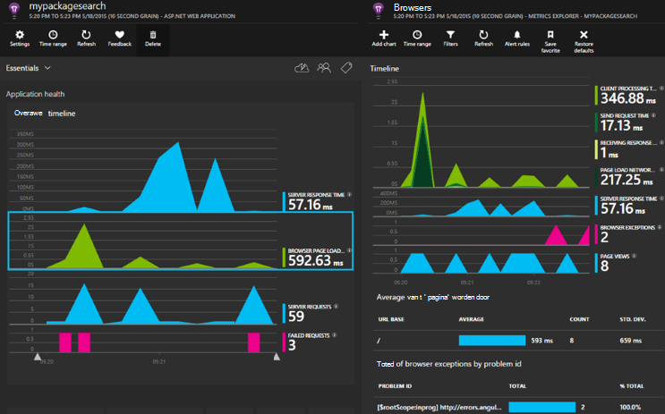

<properties 
    pageTitle="Toepassing inzichten voor ASP.NET-Core" 
    description="Webtoepassingen voor beschikbaarheid, prestaties en het gebruik controleren." 
    services="application-insights" 
    documentationCenter=".net"
    authors="alancameronwills" 
    manager="douge"/>

<tags 
    ms.service="application-insights" 
    ms.workload="tbd" 
    ms.tgt_pltfrm="ibiza" 
    ms.devlang="na" 
    ms.topic="article" 
    ms.date="08/30/2016" 
    ms.author="awills"/>

# Toepassing inzichten voor ASP.NET-Core

[Inzichten van Visual Studio-toepassing](app-insights-overview.md) kunt u uw webtoepassing voor beschikbaarheid, prestaties en het gebruik te controleren. Met de feedback die u over de prestaties en effectiviteit van uw app in de vrije natuur, kunt u weloverwogen keuzes over de richting van het ontwerp in elke ontwikkelcyclus.

Je hebt een abonnement met [Microsoft Azure](http://azure.com). Aanmelden met een Microsoft-account, moet u voor Windows, XBox Live, of andere cloud-services van Microsoft wellicht. Uw team kan een organisatie-abonnement op Azure hebben: vraag de eigenaar u aan met uw Microsoft-account toevoegen.

## Aan de slag

Volg de [handleiding aan de slag](https://github.com/Microsoft/ApplicationInsights-aspnetcore/wiki/Getting-Started).

## Met behulp van inzichten van toepassing

Inloggen op de [portal van Microsoft Azure](https://portal.azure.com) en blader naar de resource die u voor het controleren van uw app gemaakt.

Gebruik uw app voor een tijdje in een apart browservenster. Hier ziet u gegevens die worden weergegeven in de grafieken van de inzichten van toepassing. (Wellicht moet u op Vernieuwen te klikken.) Er is een kleine hoeveelheid gegevens terwijl u ontwikkelt, maar deze grafieken echt tot leven komen wanneer u uw app publiceert en veel gebruikers hebben. 

De overzichtspagina ziet u de grafieken prestaties u waarschijnlijk is geïnteresseerd in: responstijd van de server, laadtijd van de pagina en tellingen van mislukte aanvragen. Klik in een grafiek meer grafieken en gegevens.

Weergaven in het portaal worden onderverdeeld in twee hoofdcategorieën:

* [Metrics Explorer](app-insights-metrics-explorer.md) ziet u grafieken en tabellen met statistieken en telt zoals responstijden, defecten vertoont of parameters die u zelf maakt met de [API](app-insights-api-custom-events-metrics.md). Filteren en de gegevens in segmenten door de waarden van de eigenschappen voor een beter begrip van uw app en de gebruikers.
* [Search Explorer](app-insights-diagnostic-search.md) worden afzonderlijke gebeurtenissen, zoals specifieke verzoeken, uitzonderingen, logboek sporen of gebeurtenissen die u zelf hebt gemaakt met de [API](app-insights-api-custom-events-metrics.md). Filteren en zoeken in de gebeurtenissen en navigeren tussen verwante gebeurtenissen bij het onderzoeken van problemen.
* [Analytics](app-insights-analytics.md) kunt u SQL-achtige query's uitvoeren op uw Telemetrie en is een krachtige analytische en diagnostische hulpprogramma.

## Waarschuwingen

* U krijgt automatisch [proactieve Diagnostische signalen](app-insights-proactive-diagnostics.md) die vertellen over afwijkende wijzigingen in de fout en andere statistieken.
* [Beschikbaarheid van tests](app-insights-monitor-web-app-availability.md) instellen voor het testen van uw website voortdurend vanuit locaties over de hele wereld en e-mails ophalen als de test mislukt.
* [Metrische waarschuwingen](app-insights-monitor-web-app-availability.md) instellen om te weten als Maatstelsel van de reactietijden of uitzondering tarieven buiten aanvaardbare grenzen gaat.

## Krijg meer telemetrie

* [Telemetrie toevoegen aan uw webpagina's](app-insights-javascript.md) voor het gebruik van het beeldscherm en de prestaties.
* [Afhankelijkheden controleren](app-insights-dependencies.md) om te zien als REST, SQL of andere externe bronnen u vertragen.
* [Gebruik de API](app-insights-api-custom-events-metrics.md) voor het verzenden van uw eigen gebeurtenissen en statistieken voor een meer gedetailleerde weergave van de prestaties en het gebruik van uw app.
* [Beschikbaarheid van tests](app-insights-monitor-web-app-availability.md) gecontroleerd uw app voortdurend uit de hele wereld. 

## Bron openen

[Lezen en bij te dragen tot de code](https://github.com/Microsoft/ApplicationInsights-aspnetcore#recent-updates)

