<properties 
    pageTitle="Afhankelijkheid in inzichten toepassing bijhouden" 
    description="Analyseren van gebruik, beschikbaarheid en prestaties van uw op locatie of de webtoepassing Microsoft Azure met inzichten van toepassing." 
    services="application-insights" 
    documentationCenter=".net"
    authors="alancameronwills" 
    manager="douge"/>

<tags 
    ms.service="application-insights" 
    ms.workload="tbd" 
    ms.tgt_pltfrm="ibiza" 
    ms.devlang="na" 
    ms.topic="article" 
    ms.date="10/24/2016" 
    ms.author="awills"/>


# <a name="set-up-application-insights-dependency-tracking"></a>Inzichten van de toepassing instellen: afhankelijkheid bijhouden


[AZURE.INCLUDE [app-insights-selector-get-started-dotnet](../../includes/app-insights-selector-get-started-dotnet.md)]


Een *afhankelijkheid* is een extern onderdeel dat wordt aangeroepen door de app. Het is meestal een service aangeroepen met behulp van HTTP, of een database of een bestandssysteem. In Visual Studio-toepassing inzichten, kunt u eenvoudig zien hoe lang de toepassing afhankelijkheden wacht en hoe vaak een afhankelijkheid oproep mislukt.

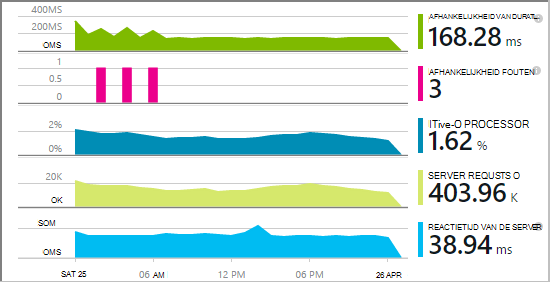

De afhankelijkheid van de out-of-the-box-monitor meldt momenteel aanroepen van deze typen afhankelijkheden:

* ASP.NET
 * SQL-databases
 * ASP.NET-webtoepassingen en WCF-services die gebruikmaken van HTTP-gebaseerde bindingen
 * Lokale of externe aanroepen van HTTP
 * DocumentDb, tabel, blob-opslag en wachtrij Azure
* Java
 * Gesprekken met een database via een [JDBC](http://docs.oracle.com/javase/7/docs/technotes/guides/jdbc/) -stuurprogramma, zoals MySQL, SQL Server, PostgreSQL of SQLite.
* JavaScript in webpagina's - de [webpagina SDK](app-insights-javascript.md) automatisch vastgelegd Ajax oproepen als afhankelijkheden.

U kunt uw eigen SDK-aanroepen voor het controleren van andere afhankelijkheden met de [API TrackDependency](app-insights-api-custom-events-metrics.md#track-dependency)schrijven.


## <a name="to-set-up-dependency-monitoring"></a>Monitoring van afhankelijkheid instellen

Moet u een abonnement op [Microsoft Azure](http://azure.com) .

### <a name="if-your-app-runs-on-your-iis-server"></a>Als uw app op de IIS-server wordt uitgevoerd

Als uw web app op .NET 4.6 of hoger wordt uitgevoerd, kunt u ofwel [de inzichten Application SDK installeren](app-insights-asp-net.md) in uw app, of toepassing inzichten Status Monitor niet installeren. U hoeft niet beide.

Statuscontrole van toepassingen inzichten anders op de server installeren:

1. Op de IIS webserver aanmelden met beheerdersreferenties.
2. Downloaden en uitvoeren van het [installatieprogramma Status Monitor](http://go.microsoft.com/fwlink/?LinkId=506648).
4. In de installatiewizard aanmelden bij Microsoft Azure.

    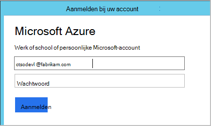

    *Verbindingsfouten? Zie [problemen oplossen](#troubleshooting).*

5. Kies de webtoepassing is geïnstalleerd of de website die u wilt controleren, moet u de bron waarin u de resultaten bekijken in het portal Application inzichten configureren.

    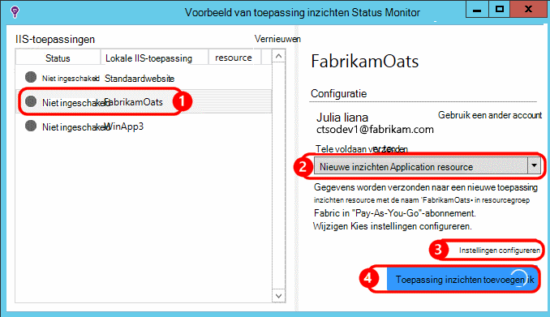

    Normaal gesproken kiest u voor het configureren van een nieuwe resource en de [resourcegroep][roles].

    Een bestaande bron anders gebruiken als u al een [website test] ingesteld[ availability] voor uw site of [web-client controleren][client].

6. IIS opnieuw starten.

    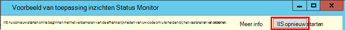

    Uw web-service worden onderbroken voor een korte tijd.

6. Merk op dat ApplicationInsights.config is ingevoegd in de webtoepassingen die u wilt controleren.

    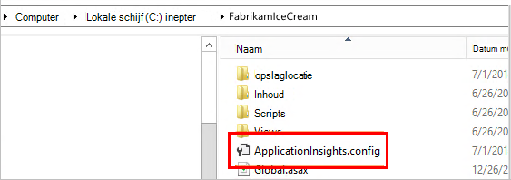

   Er zijn ook enkele wijzigingen in web.config.

#### <a name="want-to-reconfigure-later"></a>Wilt u (opnieuw) later configureren?

Nadat u de wizard hebt voltooid, kunt u de agent opnieuw configureren wanneer u maar wilt. U kunt dit ook gebruiken als u de agent hebt geïnstalleerd, maar er enkele problemen met de initiële installatie is.

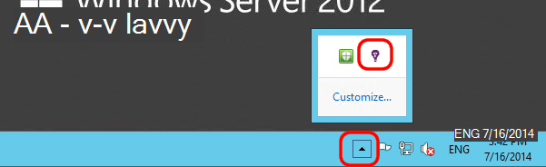


### <a name="if-your-app-runs-as-an-azure-web-app"></a>Als uw toepassing wordt uitgevoerd als een Azure Web App

Toevoegen in het Configuratiescherm van uw Web App in Azure, de uitbreiding van de inzichten van toepassing.

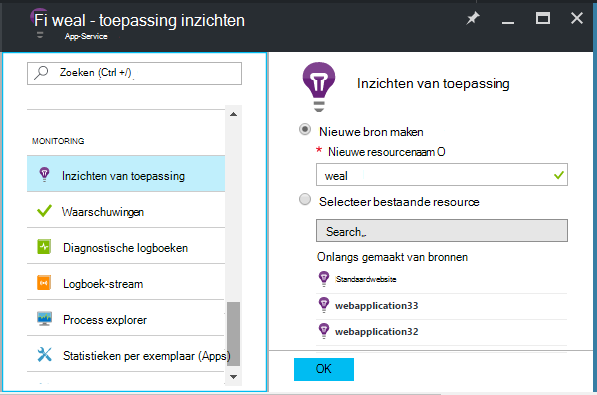


### <a name="if-its-an-azure-cloud-services-project"></a>Als het een Azure cloud services-project

[Scripts voor het web en werknemer rollen toevoegen](app-insights-cloudservices.md#dependencies). Of de [installatie van .NET framework 4.6 of hoger](../cloud-services/cloud-services-dotnet-install-dotnet.md).

## <a name="diagnosis"></a>Oplossen van prestatieproblemen afhankelijkheid

Voor de beoordeling van de prestaties van de aanvragen op uw server de prestaties blade open en Ga naar kijken of het raster van aanvragen:

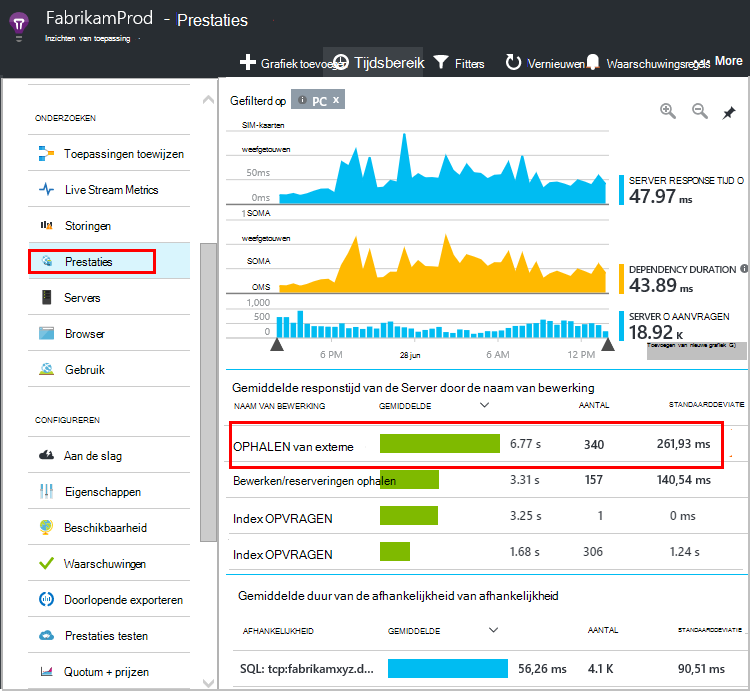

De bovenste een duurt erg lang. We zien als we kunt uitzoeken waar de tijd is besteed.

Klik op die rij om individueel verzoek gebeurtenissen te bekijken:


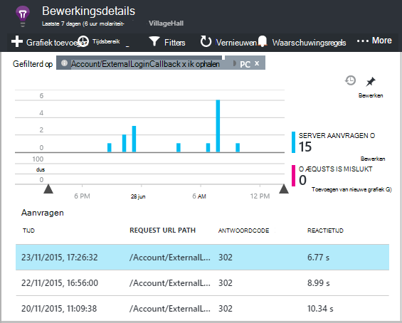

Klik op een langdurige instantie om deze verder te controleren.

Blader naar de externe afhankelijkheid oproepen die verband houdt met deze aanvraag:

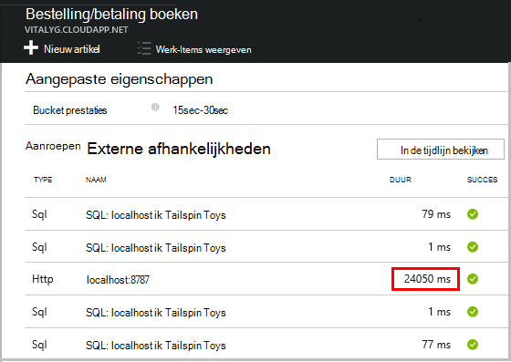

Het ziet eruit als de meeste van de tijd voor onderhoud die deze aanvraag is besteed in een aanroep naar een lokale service. 


Selecteer de rij voor meer informatie:

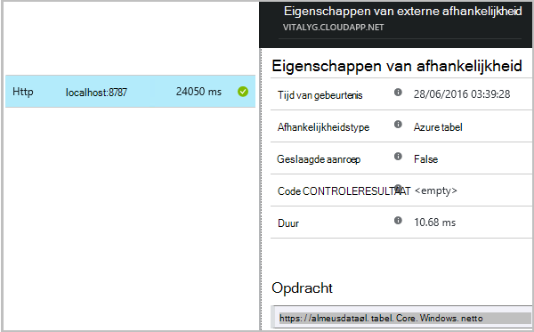

De details bevat voldoende informatie om een diagnose van het probleem.


In andere gevallen geen afhankelijkheid aanroep is lang, maar door over te schakelen naar de tijdlijn, kunnen we zien waar de vertraging is opgetreden in onze interne verwerking:


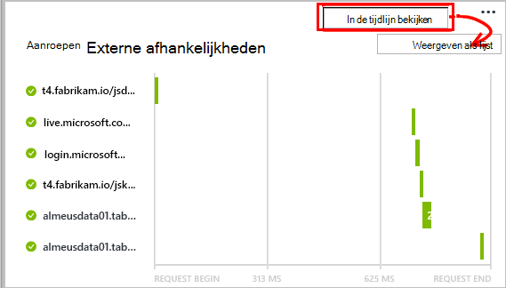


## <a name="failures"></a>Storingen

Als u mislukte aanvragen, klik op de grafiek.

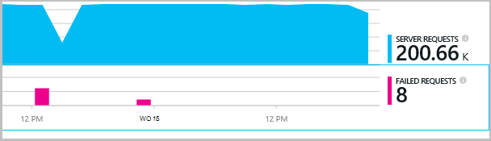

Klik op een aanvraagtype en een exemplaar van de aanvraag, een aanroep van een externe afhankelijkheid vinden.


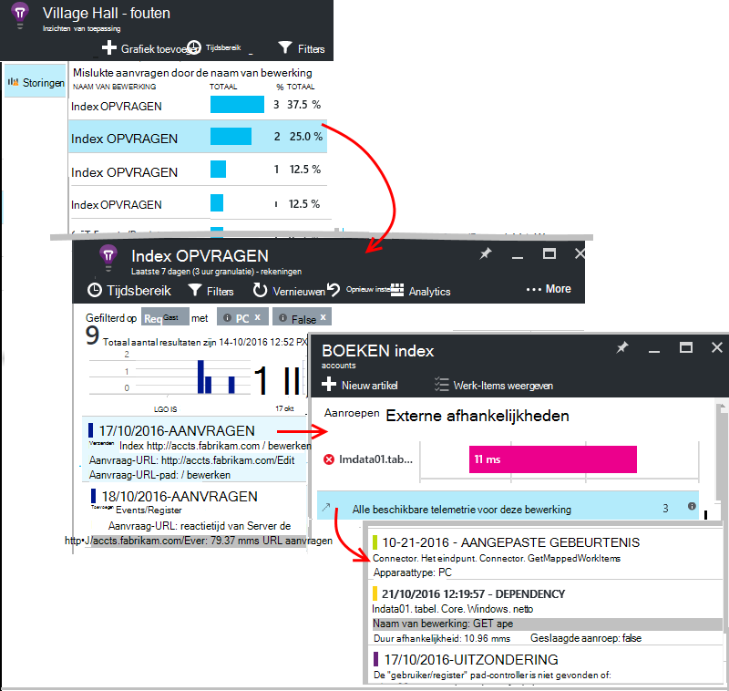


## <a name="custom-dependency-tracking"></a>Aangepaste afhankelijkheid bijhouden

De standaardmodule afhankelijkheid bijhouden detecteert automatisch externe afhankelijkheden, zoals databases en REST API's. Maar u kunt sommige extra onderdelen op dezelfde manier worden behandeld. 

U kunt code schrijven die afhankelijkheidsinformatie verzendt met dezelfde [TrackDependency-API](app-insights-api-custom-events-metrics.md#track-dependency) die wordt gebruikt door de standaardmodules.

Als u uw code met een assembly die u niet zelf schrijven bouwen, kan u bijvoorbeeld alle oproepen, om erachter te komen wat de bijdrage hiervan in de reactietijden bij de tijd. Als u wilt dat deze gegevens worden weergegeven in de grafieken afhankelijkheid in toepassing inzichten, verzenden met behulp van `TrackDependency`.

```C#

            var startTime = DateTime.UtcNow;
            var timer = System.Diagnostics.Stopwatch.StartNew();
            try
            {
                success = dependency.Call();
            }
            finally
            {
                timer.Stop();
                telemetry.TrackDependency("myDependency", "myCall", startTime, timer.Elapsed, success);
            }
```

Als u wilt dat de afhankelijkheid standaard tracking module uitschakelen, verwijdert u de verwijzing naar DependencyTrackingTelemetryModule in [ApplicationInsights.config](app-insights-configuration-with-applicationinsights-config.md).

## <a name="troubleshooting"></a>Het oplossen van problemen

*Afhankelijkheid succes vlag altijd geeft true of false.*

* Upgraden naar de nieuwste versie van de SDK. Als uw .NET versie minder dan 4,6 is, [Statusmonitor](app-insights-monitor-performance-live-website-now.md)niet installeren.

## <a name="next-steps"></a>Volgende stappen

- [Uitzonderingen](app-insights-asp-net-exceptions.md)
- [Gebr. & pagina gegevens][client]
- [Beschikbaarheid](app-insights-monitor-web-app-availability.md)


<!--Link references-->

[api]: app-insights-api-custom-events-metrics.md
[apikey]: app-insights-api-custom-events-metrics.md#ikey
[availability]: app-insights-monitor-web-app-availability.md
[azure]: ../insights-perf-analytics.md
[client]: app-insights-javascript.md
[diagnostic]: app-insights-diagnostic-search.md
[metrics]: app-insights-metrics-explorer.md
[netlogs]: app-insights-asp-net-trace-logs.md
[portal]: http://portal.azure.com/
[qna]: app-insights-troubleshoot-faq.md
[redfield]: app-insights-asp-net-dependencies.md
[roles]: app-insights-resources-roles-access-control.md

 
