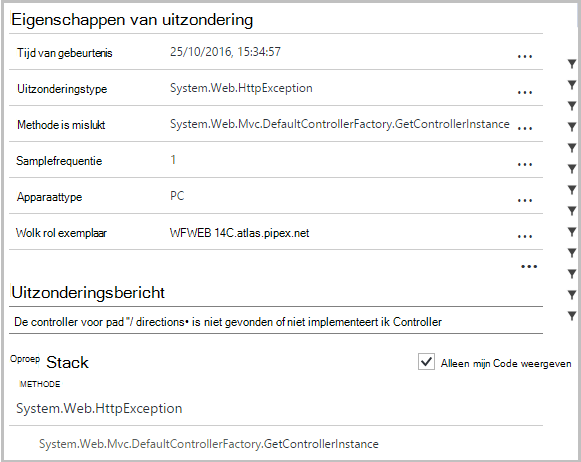
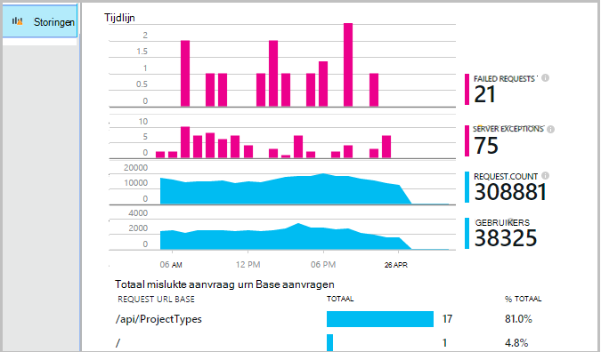
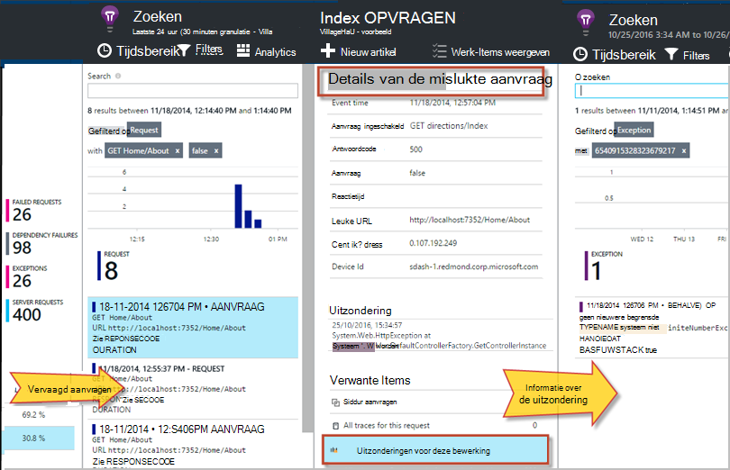
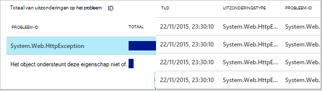
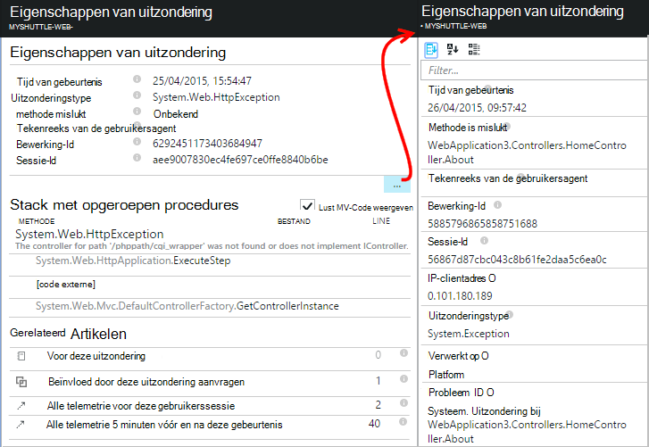
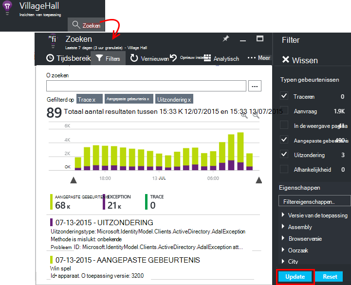
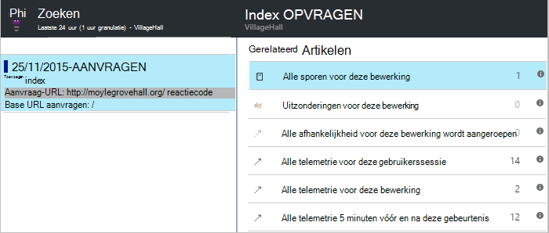

<properties 
    pageTitle="Opsporen van fouten en uitzonderingen in ASP.NET-toepassingen met de inzichten van toepassing" 
    description="Uitzonderingen van ASP.NET-toepassingen samen met de aanvraag telemetrie vastleggen." 
    services="application-insights" 
    documentationCenter=".net"
    authors="alancameronwills" 
    manager="douge"/>

<tags 
    ms.service="application-insights" 
    ms.workload="tbd" 
    ms.tgt_pltfrm="ibiza" 
    ms.devlang="na" 
    ms.topic="article" 
    ms.date="10/27/2016" 
    ms.author="awills"/>


# <a name="set-up-application-insights-diagnose-exceptions"></a>Inzichten van de toepassing instellen: uitzonderingen diagnosticeren

[AZURE.INCLUDE [app-insights-selector-get-started-dotnet](../../includes/app-insights-selector-get-started-dotnet.md)]


Door het controleren van uw toepassing met [Visual Studio-toepassing inzichten][start], u kunt mislukte aanvragen correleren met uitzonderingen en andere gebeurtenissen op de client en de server, zodat u kunt snel de oorzaken te analyseren.

Als u wilt controleren op een ASP.NET-toepassing, die u moet [toevoegen toepassing inzichten SDK] [ greenbrown] voor uw toepassing of [Status Monitor op de IIS-server installeren][redfield], of als uw app een Web App van Azure is, de [Inzichten toepassingsextensie](app-insights-azure-web-apps.md)toevoegen.

## <a name="diagnosing-exceptions-using-visual-studio"></a>Met behulp van Visual Studio uitzonderingen diagnosticeren

Open de app-oplossing in Visual Studio om te helpen bij het opsporen van fouten.

De app, worden uitgevoerd op uw server of op de ontwikkelcomputer door druk op F5.

Open het venster Application inzichten zoeken in Visual Studio en weergave van de gebeurtenissen van uw app. Terwijl u fouten opspoort, kunt u dit doen door te klikken op de knop toepassing inzichten.


U ziet dat u kunt het rapport filteren zodat alleen uitzonderingen. 

*Geen uitzonderingen weergegeven? Zie [uitzonderingen vastleggen](#exceptions).*

Klik op een uitzonderingenrapport op de stacktrace weergeven.



Klik op de verwijzing naar een regel in de stacktrace, het relevante bestand te openen.  

## <a name="diagnosing-failures-using-the-azure-portal"></a>Diagnose van problemen met de Azure portal

Uit het overzicht van de inzichten van de toepassing van de app, de tegel fouten ziet u de grafieken van uitzonderingen en HTTP-aanvragen, samen met een lijst van de aanvraag is mislukt URL's die ervoor zorgen de meest voorkomende storingen dat.



Klik op een van de mislukte aanvraagtypen in de lijst naar afzonderlijke exemplaren van de storing. Daar klikt u op via de uitzonderingen of enige traceringsgegevens gekoppeld:




**Ook** kunt u starten vanuit de lijst met uitzonderingen die u vindt verder naar beneden de blade storingen. Houd te klikken totdat u uiteindelijk in individuele uitzonderingen.




*Geen uitzonderingen weergegeven? Zie [uitzonderingen vastleggen](#exceptions).*

U kunt van daaruit Bekijk de stacktrace en uitgebreide eigenschappen van elke uitzondering en verwante logboek trace of andere gebeurtenissen vinden.




[Meer informatie over het zoeken van diagnostische][diagnostic].


## <a name="dependency-failures"></a>Afhankelijkheid fouten

Een *afhankelijkheid* is een service die uw toepassing wordt aangeroepen, meestal via een verbinding met REST API of de database. [Statuscontrole van toepassingen inzichten] [ redfield] automatisch gecontroleerd diverse typen afhankelijkheid gesprek, meten van de gespreksduur en geslaagd of mislukt. 

Als u de gegevens van de afhankelijkheid, hebt u [Status Monitor installeren] [ redfield] op de IIS-server, of als uw app een Web App van Azure is, gebruikt u de [Toepassingsextensie inzichten](app-insights-azure-web-apps.md). 

Mislukte aanroepen van afhankelijkheden worden weergegeven op het blad storingen en vindt u ook deze onder Verwante Items in de gegevens voor de aanvraag en de details van uitzondering.

*Geen afhankelijkheid fouten? Dat is goed. Maar om te controleren dat u gegevens afhankelijkheid krijgt, de prestaties blade openen en zoek naar de grafiek duur afhankelijkheid.*

 

## <a name="custom-tracing-and-log-data"></a>Aangepaste tracering en logboekgegevens

Als u de diagnostische gegevens specifiek voor uw app, kunt u de code voor het verzenden van uw eigen telemetriegegevens invoegen. Dit weergegeven in diagnostische zoeken naast het verzoek, in de paginaweergave en andere gegevens automatisch verzameld. 

U hebt verschillende opties:

* [TrackEvent()](app-insights-api-custom-events-metrics.md#track-event) wordt meestal gebruikt voor het controleren van de gebruikspatronen, maar de gegevens ook verzendt onder aangepaste gebeurtenissen in diagnostische zoeken weergegeven. Gebeurtenissen worden benoemd en string-eigenschappen en numerieke parameters waarop u [filteren uw zoekopdrachten diagnostische kunt]kunt uitvoeren[diagnostic].
* [TrackTrace()](app-insights-api-custom-events-metrics.md#track-trace) kunt u meer gegevens zoals informatie van de POST te verzenden.
* [TrackException()](#exceptions) verzendt stacktraces. [Meer informatie over uitzonderingen](#exceptions).
* Als u al een registratie kader zoals Log4Net of NLog gebruikt, kunt u [deze logboeken vastleggen] [ netlogs] en deze in diagnostische zoeken naast het verzoek en uitzonderingsgegevens.

Overzicht van deze gebeurtenissen, [zoekactie]openen[diagnostic]Filter openen en kies vervolgens aangepaste gebeurtenis, Trace of uitzondering.





> [AZURE.NOTE] De module Geavanceerde sampling als uw app een groot aantal telemetrie genereert, automatisch afgetrokken van het volume dat wordt verzonden naar de portal door alleen een representatief deel van de gebeurtenissen te sturen. Gebeurtenissen die deel van dezelfde bewerking uitmaken wordt ingeschakeld of uitgeschakeld als een groep, zodat u tussen verwante gebeurtenissen navigeren kunt. [Meer informatie over de bemonstering.](app-insights-sampling.md)

### <a name="how-to-see-request-post-data"></a>Aanvraag POST-gegevens weergeven

Aanvraag details bevatten geen gegevens verzonden naar uw app in een gesprek met boeken. Deze gegevens worden gerapporteerd:

* [De SDK installeren] [ greenbrown] in het toepassingsproject.
* Code invoegen in uw toepassing [Microsoft.ApplicationInsights.TrackTrace()][api]. De POST-gegevens in de parameter bericht verzenden. Er is een beperking van de toegestane grootte overschrijdt, dus u proberen moet te verzenden alleen de essentiële gegevens.
* Wanneer u een mislukte aanvraag onderzoeken, zoek de bijbehorende traces.  




## <a name="exceptions"></a>Uitzonderingen en diagnostische gegevens vastleggen

Op het eerste, wordt niet weergegeven in de portal de uitzonderingen die fouten in uw app veroorzaken. Ziet u een browser uitzonderingen (als u de [SDK voor JavaScript] [ client] in uw webpagina's). Maar de meeste uitzonderingen worden gevangen door IIS en u moet schrijven een stukje code te zien.

U kunt:

* **Meld u uitzonderingen expliciet** code invoegen in de uitzonderingshandlers voor aangifte van de uitzonderingen.
* **Automatisch vastleggen van uitzonderingen** configureren van uw ASP.NET-framework. De nodige toevoegingen zijn verschillend voor verschillende soorten framework.

## <a name="reporting-exceptions-explicitly"></a>Uitzonderingen expliciet melden

De eenvoudigste manier is een aanroep van TrackException() invoegen in een uitzonderings-handler.

JavaScript

    try 
    { ...
    }
    catch (ex)
    {
      appInsights.trackException(ex, "handler loc",
        {Game: currentGame.Name, 
         State: currentGame.State.ToString()});
    }

C#

    var telemetry = new TelemetryClient();
    ...
    try 
    { ...
    }
    catch (Exception ex)
    {
       // Set up some properties:
       var properties = new Dictionary <string, string> 
         {{"Game", currentGame.Name}};

       var measurements = new Dictionary <string, double>
         {{"Users", currentGame.Users.Count}};

       // Send the exception telemetry:
       telemetry.TrackException(ex, properties, measurements);
    }

VB

    Dim telemetry = New TelemetryClient
    ...
    Try
      ...
    Catch ex as Exception
      ' Set up some properties:
      Dim properties = New Dictionary (Of String, String)
      properties.Add("Game", currentGame.Name)

      Dim measurements = New Dictionary (Of String, Double)
      measurements.Add("Users", currentGame.Users.Count)
  
      ' Send the exception telemetry:
      telemetry.TrackException(ex, properties, measurements)
    End Try

De eigenschappen en afmetingen parameters zijn optioneel, maar zijn handig voor het [filteren en het toevoegen van] [ diagnostic] extra informatie. Als er een app die verschillende spelletjes kan worden uitgevoerd, kan u bijvoorbeeld alle de uitzondering rapporten met betrekking tot een bepaald spel vinden. U kunt zoveel objecten als u elke woordenlijst wilt toevoegen.

## <a name="browser-exceptions"></a>Browser-uitzonderingen

De meeste browser uitzonderingen worden gemeld.

Als de webpagina bevat de scriptbestanden van netwerken die inhoud leveren of de andere domeinen, zorgen de script-tag heeft het kenmerk ```crossorigin="anonymous"```, en dat de server [CORS headers](http://enable-cors.org/)verzonden. Hierdoor kunt u een stacktrace en Details ophalen voor niet-verwerkte uitzonderingen van JavaScript uit deze bronnen.

## <a name="web-forms"></a>Webformulieren

Voor webformulieren, de HTTP-Module kan worden voor het verzamelen van de uitzonderingen als er geen omleidingen geconfigureerd met CustomErrors.

Maar als er actieve omleidingen, de volgende regels toevoegen aan de functie Application_Error in Global.asax.cs. (Een Global.asax-bestand toevoegen als u nog niet hebt).

*C#*

    void Application_Error(object sender, EventArgs e)
    {
      if (HttpContext.Current.IsCustomErrorEnabled && Server.GetLastError  () != null)
      {
         var ai = new TelemetryClient(); // or re-use an existing instance

         ai.TrackException(Server.GetLastError());
      }
    }


## <a name="mvc"></a>MVC

Als de configuratie [CustomErrors](https://msdn.microsoft.com/library/h0hfz6fc.aspx) is `Off`, en vervolgens uitzonderingen beschikbaar voor de [Http-Module zijn](https://msdn.microsoft.com/library/ms178468.aspx) te verzamelen. Echter, als het `RemoteOnly` (standaard), of `On`, en vervolgens de uitzondering is uitgeschakeld en niet beschikbaar voor de inzichten van de toepassing automatisch te innen. U kunt dat verhelpen door de [klasse System.Web.Mvc.HandleErrorAttribute](http://msdn.microsoft.com/library/system.web.mvc.handleerrorattribute.aspx)overschrijven en het toepassen van de klasse overschreven zoals voor de verschillende versies van MVC onder ([github bron](https://github.com/AppInsightsSamples/Mvc2UnhandledExceptions/blob/master/MVC2App/Controllers/AiHandleErrorAttribute.cs)):

    using System;
    using System.Web.Mvc;
    using Microsoft.ApplicationInsights;

    namespace MVC2App.Controllers
    {
      [AttributeUsage(AttributeTargets.Class | AttributeTargets.Method, Inherited = true, AllowMultiple = true)] 
      public class AiHandleErrorAttribute : HandleErrorAttribute
      {
        public override void OnException(ExceptionContext filterContext)
        {
            if (filterContext != null && filterContext.HttpContext != null && filterContext.Exception != null)
            {
                //If customError is Off, then AI HTTPModule will report the exception
                if (filterContext.HttpContext.IsCustomErrorEnabled)
                {   //or reuse instance (recommended!). see note above  
                    var ai = new TelemetryClient();
                    ai.TrackException(filterContext.Exception);
                } 
            }
            base.OnException(filterContext);
        }
      }
    }

#### <a name="mvc-2"></a>MVC 2

Het kenmerk HandleError vervangen door het nieuwe kenmerk in uw domeincontrollers.

    namespace MVC2App.Controllers
    {
       [AiHandleError]
       public class HomeController : Controller
       {
    ...

[Monster](https://github.com/AppInsightsSamples/Mvc2UnhandledExceptions)

#### <a name="mvc-3"></a>MVC 3

Registreer `AiHandleErrorAttribute` als een globale filter in Global.asax.cs:

    public class MyMvcApplication : System.Web.HttpApplication
    {
      public static void RegisterGlobalFilters(GlobalFilterCollection filters)
      {
         filters.Add(new AiHandleErrorAttribute());
      }
     ...

[Monster](https://github.com/AppInsightsSamples/Mvc3UnhandledExceptionTelemetry)


#### <a name="mvc-4-mvc5"></a>MVC 4, MVC5

AiHandleErrorAttribute registreren als een globale filter in FilterConfig.cs:

    public class FilterConfig
    {
      public static void RegisterGlobalFilters(GlobalFilterCollection filters)
      {
        // Default replaced with the override to track unhandled exceptions
        filters.Add(new AiHandleErrorAttribute());
      }
    }

[Monster](https://github.com/AppInsightsSamples/Mvc5UnhandledExceptionTelemetry)

## <a name="web-api-1x"></a>Web-API 1.x


System.Web.Http.Filters.ExceptionFilterAttribute overschrijven:

    using System.Web.Http.Filters;
    using Microsoft.ApplicationInsights;

    namespace WebAPI.App_Start
    {
      public class AiExceptionFilterAttribute : ExceptionFilterAttribute
      {
        public override void OnException(HttpActionExecutedContext actionExecutedContext)
        {
            if (actionExecutedContext != null && actionExecutedContext.Exception != null)
            {  //or reuse instance (recommended!). see note above 
                var ai = new TelemetryClient();
                ai.TrackException(actionExecutedContext.Exception);    
            }
            base.OnException(actionExecutedContext);
        }
      }
    }

U kan dit overschreven kenmerk toevoegen aan specifieke domeincontrollers of toe te voegen aan de globale configuratie in de klasse WebApiConfig: 

    using System.Web.Http;
    using WebApi1.x.App_Start;

    namespace WebApi1.x
    {
      public static class WebApiConfig
      {
        public static void Register(HttpConfiguration config)
        {
            config.Routes.MapHttpRoute(name: "DefaultApi", routeTemplate: "api/{controller}/{id}",
                defaults: new { id = RouteParameter.Optional });
            ...
            config.EnableSystemDiagnosticsTracing();

            // Capture exceptions for Application Insights:
            config.Filters.Add(new AiExceptionFilterAttribute());
        }
      }
    }

[Monster](https://github.com/AppInsightsSamples/WebApi_1.x_UnhandledExceptions)

Er zijn een aantal gevallen die de uitzondering filters kunnen worden verwerkt. Bijvoorbeeld:

* Uitzonderingen van controller constructors. 
* Uitzonderingen van handlers weergegeven. 
* Uitzonderingen bij routering. 
* De uitzonderingen die tijdens de reactie inhoud serialisatie. 

## <a name="web-api-2x"></a>Web-API 2.x

Voeg een implementatie van IExceptionLogger:

    using System.Web.Http.ExceptionHandling;
    using Microsoft.ApplicationInsights;

    namespace ProductsAppPureWebAPI.App_Start
    {
      public class AiExceptionLogger : ExceptionLogger
      {
        public override void Log(ExceptionLoggerContext context)
        {
            if (context !=null && context.Exception != null)
            {//or reuse instance (recommended!). see note above 
                var ai = new TelemetryClient();
                ai.TrackException(context.Exception);
            }
            base.Log(context);
        }
      }
    }

Dit toevoegen aan de WebApiConfig-services:

    using System.Web.Http;
    using System.Web.Http.ExceptionHandling;
    using ProductsAppPureWebAPI.App_Start;

    namespace WebApi2WithMVC
    {
      public static class WebApiConfig
      {
        public static void Register(HttpConfiguration config)
        {
            // Web API configuration and services

            // Web API routes
            config.MapHttpAttributeRoutes();

            config.Routes.MapHttpRoute(
                name: "DefaultApi",
                routeTemplate: "api/{controller}/{id}",
                defaults: new { id = RouteParameter.Optional }
            );
            config.Services.Add(typeof(IExceptionLogger), new AiExceptionLogger()); 
        }
      }
  }

[Monster](https://github.com/AppInsightsSamples/WebApi_2.x_UnhandledExceptions)

Als alternatieven, kunt u het volgende doen:

2. De enige ExceptionHandler vervangen door een aangepaste implementatie van IExceptionHandler. Dit heet alleen als het kader nog steeds kunnen kiezen welke response-bericht is te verzenden (niet wanneer de verbinding wordt afgebroken, bijvoorbeeld) 
3. Uitzondering Filters (zoals beschreven in de sectie op het Web API 1.x controllers hierboven) - is niet in alle gevallen worden genoemd.


## <a name="wcf"></a>WCF

Een klasse die een uitgebreid kenmerk en IErrorHandler en IServiceBehavior toevoegen.

    using System;
    using System.Collections.Generic;
    using System.Linq;
    using System.ServiceModel.Description;
    using System.ServiceModel.Dispatcher;
    using System.Web;
    using Microsoft.ApplicationInsights;

    namespace WcfService4.ErrorHandling
    {
      public class AiLogExceptionAttribute : Attribute, IErrorHandler, IServiceBehavior
      {
        public void AddBindingParameters(ServiceDescription serviceDescription,
            System.ServiceModel.ServiceHostBase serviceHostBase,
            System.Collections.ObjectModel.Collection<ServiceEndpoint> endpoints,
            System.ServiceModel.Channels.BindingParameterCollection bindingParameters)
        {
        }

        public void ApplyDispatchBehavior(ServiceDescription serviceDescription, 
            System.ServiceModel.ServiceHostBase serviceHostBase)
        {
            foreach (ChannelDispatcher disp in serviceHostBase.ChannelDispatchers)
            {
                disp.ErrorHandlers.Add(this);
            }
        }

        public void Validate(ServiceDescription serviceDescription, 
            System.ServiceModel.ServiceHostBase serviceHostBase)
        {
        }

        bool IErrorHandler.HandleError(Exception error)
        {//or reuse instance (recommended!). see note above 
            var ai = new TelemetryClient();

            ai.TrackException(error);
            return false;
        }

        void IErrorHandler.ProvideFault(Exception error, 
            System.ServiceModel.Channels.MessageVersion version, 
            ref System.ServiceModel.Channels.Message fault)
        {
        }
      }
    }

Het kenmerk toevoegen aan de service-implementaties:

    namespace WcfService4
    {
        [AiLogException]
        public class Service1 : IService1 
        { 
         ...

[Monster](https://github.com/AppInsightsSamples/WCFUnhandledExceptions)

## <a name="exception-performance-counters"></a>Prestatiemeteritems van de uitzondering

Als u [geïnstalleerd, statuscontrole hebt] [ redfield] op uw server, kunt u een grafiek van de snelheid van uitzonderingen, gemeten door .NET krijgen. Dit omvat zowel verwerkte en onverwerkte uitzonderingen voor .NET.

Een Metric Explorer blade openen, een nieuwe grafiek toevoegen en selecteer **uitzondering tarief**, vermeld onder prestatiemeteritems. 

.NET framework wordt de rentevoet berekend door het tellen van het aantal uitzonderingen in een interval en te delen door de lengte van het interval. 

Houd er rekening mee dat deze van de 'Uitzonderingen' aantal berekend door de portal Application inzichten afwijken zullen te tellen TrackException rapporten. De intervallen zijn verschillend en de SDK TrackException rapporten voor alle verwerkte en onverwerkte uitzonderingen niet verzenden.

<!--Link references-->

[api]: app-insights-api-custom-events-metrics.md
[client]: app-insights-javascript.md
[diagnostic]: app-insights-diagnostic-search.md
[greenbrown]: app-insights-asp-net.md
[netlogs]: app-insights-asp-net-trace-logs.md
[redfield]: app-insights-monitor-performance-live-website-now.md
[start]: app-insights-overview.md

 
