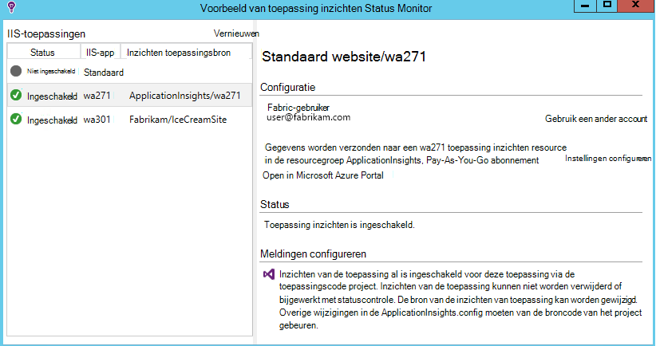
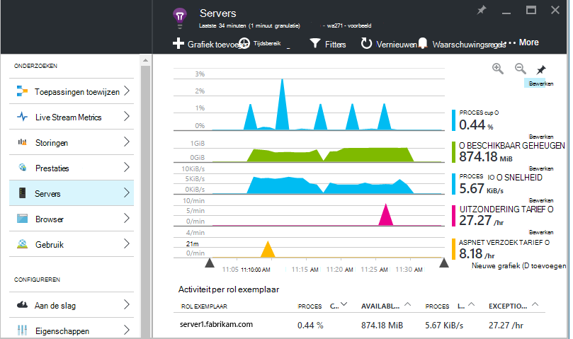
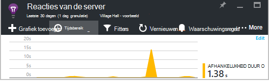
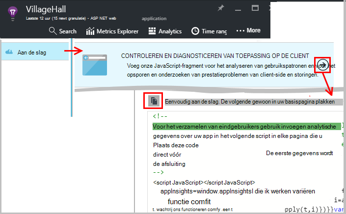
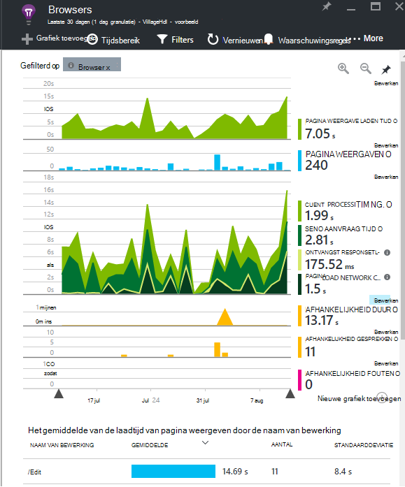
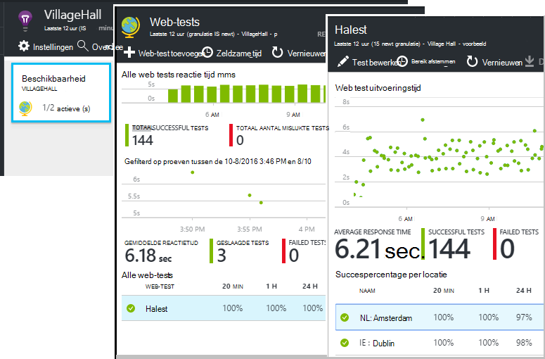
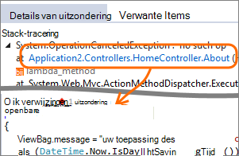
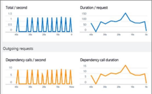
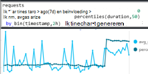
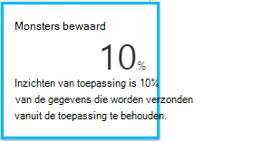

<properties 
    pageTitle="Haal meer uit de inzichten van de toepassing | Microsoft Azure" 
    description="Na het aan de slag met de inzichten van toepassing, volgt hier een overzicht van de functies die u kunt verkennen." 
    services="application-insights" 
    documentationCenter=".net"
    authors="alancameronwills" 
    manager="douge"/>

<tags 
    ms.service="application-insights" 
    ms.workload="tbd" 
    ms.tgt_pltfrm="ibiza" 
    ms.devlang="na" 
    ms.topic="article" 
    ms.date="10/27/2016" 
    ms.author="awills"/>

# <a name="more-telemetry-from-application-insights"></a>Meer telemetrie van toepassing inzichten

Nadat u hebt de [inzichten van de toepassing aan uw ASP.NET-code toegevoegd](app-insights-asp-net.md), zijn er een paar dingen die u doen kunt als u nog meer telemetrie. 

## <a name="if-your-app-runs-on-your-iis-server-"></a>Als uw app op de IIS-server wordt uitgevoerd...

Als uw app wordt gehost op IIS-servers in uw besturingselement, moet u de statuscontrole van toepassingen inzichten installeren op de servers. Als het al geïnstalleerd, moet u niet alles doen.

1. Aanmelden met beheerdersreferenties op elke IIS-webserver.
2. Downloaden en uitvoeren van het [installatieprogramma Status Monitor](http://go.microsoft.com/fwlink/?LinkId=506648).
3. In de installatiewizard aanmelden bij Microsoft Azure.

U hoeft te doen iets anders, maar u kunt bevestigen dat de controle is ingeschakeld voor uw app.



(Kun je Status Monitor [tijdens runtime-controle inschakelen](app-insights-monitor-performance-live-website-now.md), zelfs als u uw toepassingen in Visual Studio niet hebt instrument.)

### <a name="what-do-you-get"></a>Wat krijgt u?

Als de Status Monitor is geïnstalleerd op de servercomputers van uw, krijgt u enkele extra telemetrie:

* Afhankelijkheid telemetrie (SQL-aanroepen en aanroepen door uw app REST) voor toepassingen met .NET 4.5. (Voor latere versies van .NET Status Monitor is niet vereist voor afhankelijkheid telemetrie.) 
* Uitzondering stacktraces weergeven meer details.
* Prestatiemeteritems. Deze items worden weergegeven in de toepassing van inzichten, in de blade Servers. 



Overzicht van meer of minder items, [de diagrammen te bewerken](app-insights-metrics-explorer.md). Als het gewenste prestatiemeteritem niet in de set beschikbaar is, kunt u [toevoegen aan de set die wordt verzameld door de module prestatiemeteritems](app-insights-performance-counters.md).

## <a name="if-its-an-azure-web-app-"></a>Als het een Azure web app...

Als uw toepassing wordt uitgevoerd als een Azure web app, Ga naar Configuratiescherm Azure voor app of VM en open de toepassing inzichten blade. 

### <a name="what-do-you-get"></a>Wat krijgt u?

* Uitzondering stacktraces weergeven meer details.
* Afhankelijkheid telemetrie (SQL-aanroepen en aanroepen door uw app REST) voor toepassingen met .NET 4.5. (Voor latere versies van .NET de extensie is niet vereist voor afhankelijkheid telemetrie.) 



(U kunt ook deze methode gebruiken [inschakelen in runtime controleren van prestaties](app-insights-monitor-performance-live-website-now.md), zelfs als u niet uw app in Visual Studio instrument.)

## <a name="client-side-monitoring"></a>Controle van client-side

U kunt de SDK waarmee telemetriegegevens worden verzonden van de server (back-end) van de toepassing hebt geïnstalleerd. Nu kunt u client-side controle toevoegen. Dit biedt gegevens over gebruikers, sessies, paginaweergaven, en eventuele uitzonderingen of crashes verholpen die in de browser optreden. U zult ook mogelijk uw eigen code schrijven om te traceren hoe uw gebruikers werken met uw app, tot op het gedetailleerde niveau van muisklikken en toetsaanslagen.

De toepassing inzichten JavaScript-fragment toevoegen aan elke webpagina ophalen telemetrie van browsers van clients.

1. Open in Azure, de bron van de inzichten van toepassing voor uw app.
2. Open aan de slag, Monitor Client Side, en kopieer het fragment.
3. Plakken zodat deze wordt weergegeven in de kop van elke webpagina - meestal dat kunt u dit doen door plakken in de outpagina basispagina lay.



U ziet dat de code bevat de sleutel instrumenten waarmee de bron van uw toepassing.

### <a name="what-do-you-get"></a>Wat krijgt u?

* U kunt JavaScript voor het verzenden van [aangepaste telemetrie van uw webpagina's](app-insights-api-custom-events-metrics.md), bijvoorbeeld om bij te houden op een knop kunt schrijven.
* In [Analytics](app-insights-analytics.md), gegevens in `pageViews` en AJAX gegevens in `dependencies`. 
* [Prestaties van de client- en gebruiksgegevens](app-insights-javascript.md) in het blad Browsers.




[Meer informatie over webpagina's bijhouden.](app-insights-web-track-usage.md)


## <a name="track-application-version"></a>Versie van de toepassing bijhouden

Zorg ervoor dat `buildinfo.config` is gegenereerd door het proces MSBuild. In het bestand .csproj toevoegen:  

```XML

    <PropertyGroup>
      <GenerateBuildInfoConfigFile>true</GenerateBuildInfoConfigFile>    <IncludeServerNameInBuildInfo>true</IncludeServerNameInBuildInfo>
    </PropertyGroup> 
```

Wanneer de build-info heeft, de webmodule inzichten van toepassing **versie toepassing** als een eigenschap automatisch toegevoegd aan elk item van telemetrie. Dat kunt u filteren op versie bij het uitvoeren van [Diagnostische zoekopdrachten](app-insights-diagnostic-search.md) of wanneer [metrics verkennen](app-insights-metrics-explorer.md). 

Let echter dat het nummer van de build-versie wordt alleen gegenereerd door MS-Build niet door het opbouwen van de ontwikkelaar in Visual Studio.


## <a name="availability-web-tests"></a>Beschikbaarheid van web-tests

Verzend uw web app HTTP-aanvragen op gezette tijden uit de hele wereld. We een waarschuwing als het antwoord traag of onbetrouwbaar is.

In de bron van de inzichten van toepassing voor uw app, klik op de tegel beschikbaarheid wilt toevoegen, bewerken en testen van de webpagina bekijken.

U kunt meerdere tests uitgevoerd op meerdere locaties toevoegen.



[Meer informatie](app-insights-monitor-web-app-availability.md)

## <a name="custom-telemetry-and-logging"></a>Aangepaste Telemetrie en logboekregistratie

De inzichten van toepassing-pakketten die u hebt toegevoegd aan uw code biedt een API die u vanuit uw toepassing aanroepen kunt.

* [Uw eigen gebeurtenissen en statistieken te genereren](app-insights-api-custom-events-metrics.md), bijvoorbeeld naar een aantal zakelijke activiteiten of prestaties bewaken.
* [Vastleggen logboek sporen](app-insights-asp-net-trace-logs.md) van Log4Net, NLog of System.Diagnostics.Trace.
* [Filter wijzigen, of de uitbreiding van](app-insights-api-filtering-sampling.md) de standaard telemetrie verzonden vanaf uw app door te schrijven telemetrie-Processors. 


## <a name="powerful-analysis-and-presentation"></a>Krachtige analyse en presentatie

Er zijn tal van manieren om uw gegevens te verkennen. Als u onlangs met inzichten van toepassing gestart bent, controleert u deze artikelen:

||
|---|---
|[**Diagnostische zoeken bijvoorbeeld gegevens**](app-insights-visual-studio.md)<br/>Zoeken en filteren gebeurtenissen zoals aanvragen, uitzonderingen afhankelijkheid oproepen, logboek sporen en bezoekers. Ga naar code uit stacktraces in Visual Studio.|
|[**De Explorer metrics voor geaggregeerde gegevens**](app-insights-metrics-explorer.md)<br/>Verkennen, filteren en segmenteren van geaggregeerde gegevens, zoals aanvragen, fouten en uitzonderingen; responstijden, pagina laden tijden.|
|[**Dashboards**](app-insights-dashboards.md#dashboards)<br/>Gegevens uit meerdere bronnen verfijnen en delen met anderen. Ideaal voor samengestelde toepassingen en in de Teamkamer doorlopend weergeven.  |
|[**Live Stream Metrics**](app-insights-metrics-explorer.md#live-metrics-stream)<br/>Wanneer u een nieuwe build implementeert, bekijk deze bijna-real-time prestatie-indicatoren om te controleren of dat alles werkt zoals verwacht.|
|[**Analytics**](app-insights-analytics.md)<br/>Lastige vragen beantwoorden over de prestaties en het gebruik van uw app met behulp van deze krachtige querytaal.|
|[**Automatische en handmatige waarschuwingen**](app-insights-alerts.md)<br/>Automatische waarschuwingen aan te passen van uw app normale patronen van Telemetrie en trigger wanneer er iets buiten het gebruikelijke patroon. U kunt ook waarschuwingen instellen voor bepaalde niveaus van aangepaste of maatstaven.|

## <a name="data-management"></a>Gegevensbeheer

|||
|---|---|
|[**Doorlopende exporteren**](app-insights-export-telemetry.md)<br/>Kopieer alle uw telemetrie op te slaan zodat u uw eigen manier kunt analyseren.|
|**API voor gegevenstoegang**<br/>Binnenkort beschikbaar.|
|[**Bemonstering**](app-insights-sampling.md)<br/>Vermindert de snelheid en kunt u binnen de grenzen van de prijzen laag blijven.|