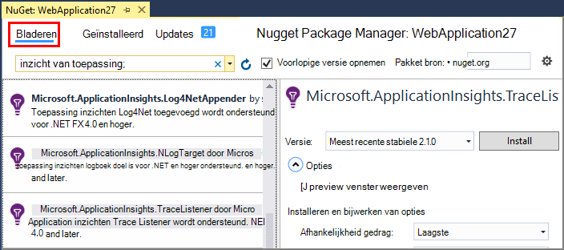
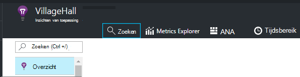
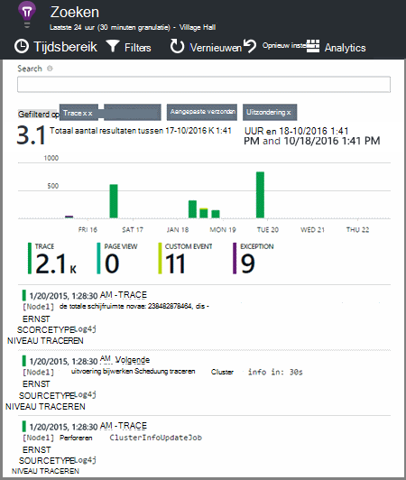

<properties 
    pageTitle="Logboeken voor het traceren van .NET in toepassing inzichten verkennen" 
    description="Zoeken in logboeken die zijn gegenereerd met Trace, NLog of Log4Net." 
    services="application-insights" 
    documentationCenter=".net"
    authors="alancameronwills" 
    manager="douge"/>

<tags 
    ms.service="application-insights" 
    ms.workload="tbd" 
    ms.tgt_pltfrm="ibiza" 
    ms.devlang="na" 
    ms.topic="article" 
    ms.date="07/21/2016" 
    ms.author="awills"/>
 
# <a name="explore-net-trace-logs-in-application-insights"></a>Logboeken voor het traceren van .NET in toepassing inzichten verkennen  

Als u NLog, log4Net of System.Diagnostics.Trace voor diagnostische tracering in uw ASP.NET-toepassing, kunt u de logboeken die zijn verzonden naar de [Inzichten van Visual Studio-toepassing]hebben[start], waarbij u kunt verkennen en ze zoeken. De logboeken worden samengevoegd met de andere telemetrie die afkomstig zijn van uw toepassing, zodat de sporen die zijn gekoppeld aan het onderhoud van elke aanvraag van de gebruiker te identificeren en correleren van hen met andere gebeurtenissen en rapporten van de uitzondering.


> [AZURE.NOTE] Moet u de logboekmodule vastleggen? Het is een handige adapter voor 3de partij loggers, maar als u niet al NLog, log4Net of System.Diagnostics.Trace gebruikt, kunt u alleen [Toepassing inzichten TrackTrace()](app-insights-api-custom-events-metrics.md#track-trace) rechtstreeks aanroepen.


## <a name="install-logging-on-your-app"></a>Aanmelden van uw app installeren

De gekozen registratie-framework installeren in uw project. Dit moet resulteren in een vermelding in app.config of web.config.

Als u System.Diagnostics.Trace gebruikt, moet u een vermelding toevoegen aan web.config:

```XML

    <configuration>
     <system.diagnostics>
       <trace autoflush="false" indentsize="4">
         <listeners>
           <add name="myListener" 
             type="System.Diagnostics.TextWriterTraceListener" 
             initializeData="TextWriterOutput.log" />
           <remove name="Default" />
         </listeners>
       </trace>
     </system.diagnostics>
   </configuration>
```

## <a name="configure-application-insights-to-collect-logs"></a>Inzichten van toepassing voor het verzamelen van logboeken configureren

**[Inzichten van toepassing toevoegen aan uw project](app-insights-asp-net.md)** als u dat nog niet hebt gedaan. Hier ziet u een optie voor het opnemen van de log verzamelaar.

Of **Toepassing inzichten configureren** door met de rechtermuisknop op het project in de Solution Explorer. De optie **Configure trace-collectie**.

*Geen toepassing inzichten menu of log verzamelaar optie?* Probeer op te [lossen](#troubleshooting).


## <a name="manual-installation"></a>Handmatige installatie

Gebruik deze methode als het projecttype wordt niet ondersteund door het installatieprogramma van de inzichten van de toepassing (bijvoorbeeld een Windows desktop project). 

1. Als u van plan bent om log4Net of NLog te gebruiken, kunt u deze in uw project installeren. 
2. In Solution Explorer met de rechtermuisknop op het project en kies **NuGet pakketten beheren**.
3. Zoek naar "Inzichten toepassing"

    

4. Selecteer het juiste pakket - een van:
  + Microsoft.ApplicationInsights.TraceListener voor het vastleggen (System.Diagnostics.Trace oproepen)
  + Microsoft.ApplicationInsights.NLogTarget
  + Microsoft.ApplicationInsights.Log4NetAppender

Het pakket NuGet de vereiste assembly's geïnstalleerd en ook web.config of app.config gewijzigd.

## <a name="insert-diagnostic-log-calls"></a>Het diagnoselogboek van gesprekken invoegen

Als u System.Diagnostics.Trace gebruikt, zou een normaal gesprek zijn:

    System.Diagnostics.Trace.TraceWarning("Slow response - database01");

Als u liever log4net of NLog:

    logger.Warn("Slow response - database01");


## <a name="using-the-trace-api-directly"></a>Het directe gebruik van de API-tracering

U kunt de toepassing inzichten trace API rechtstreeks aanroepen. De logboekregistratie-adapters gebruiken deze API. 

Bijvoorbeeld:

    var telemetry = new Microsoft.ApplicationInsights.TelemetryClient();
    telemetry.TrackTrace("Slow response - database01");

Van TrackTrace heeft als voordeel dat u relatief lange gegevens in het bericht kunt plaatsen. Zo kan u er POST-gegevens te coderen. 

Bovendien kunt u een prioriteitsniveau aan uw bericht toevoegen. En net als andere telemetrie, kunt u waarden van de eigenschappen die u gebruiken kunt om te filteren of zoeken naar sporen van verschillende groepen toevoegen. Bijvoorbeeld:


    var telemetry = new Microsoft.ApplicationInsights.TelemetryClient();
    telemetry.TrackTrace("Slow database response",
                   SeverityLevel.Warning,
                   new Dictionary<string,string> { {"database", db.ID} });

Op deze manier, in de [zoekopdracht]kan[diagnostic], gemakkelijk om weg te filteren alle berichten van een bepaalde ernst is met betrekking tot een bepaalde database.

## <a name="explore-your-logs"></a>Bekijk de logboeken

Uw app in debug-modus uitvoeren of deze live implementeren.

In het overzicht-blade van uw app in [de portal Application inzichten][portal], kiest u [Zoeken][diagnostic].





U kunt, bijvoorbeeld:

* Filteren op logboek sporen of op artikelen met specifieke eigenschappen
* Een specifiek artikel in detail controleren.
* Zoeken naar andere met betrekking tot de aanvraag van de gebruiker dezelfde telemetrie (dat wil zeggen met het bewerkingsnummer dezelfde) 
* De configuratie van deze pagina als favoriet opslaan

> [AZURE.NOTE] **Een steekproef.** Als uw toepassing veel gegevens worden verzonden en u de toepassing inzichten SDK voor ASP.NET versie 2.0.0-beta3 of hoger gebruikt, kan de functie apparaatafhankelijke bemonstering werken en slechts een percentage van de telemetrie verzenden. [Meer informatie over de bemonstering.](app-insights-sampling.md)

## <a name="next-steps"></a>Volgende stappen

[Opsporen van fouten en uitzonderingen in ASP.NET][exceptions]

[Meer informatie over zoeken][diagnostic].


## <a name="troubleshooting"></a>Het oplossen van problemen

### <a name="how-do-i-do-this-for-java"></a>Hoe kan ik dit voor Java?

Gebruik de [Java logboek adapters](app-insights-java-trace-logs.md).

### <a name="theres-no-application-insights-option-on-the-project-context-menu"></a>Er is geen toepassing inzichten optie in het contextmenu van het project

* Controleer tools inzichten van toepassing is geïnstalleerd op deze computer ontwikkeling. Zoek in het menu Extra van Visual Studio, uitbreidingen en Updates, hulpprogramma's inzichten. Als het niet op het tabblad geïnstalleerde, open het tabblad on line en te installeren.
* Dit kan een soort project niet wordt ondersteund door tools inzichten van toepassing zijn. Gebruik de [handmatige installatie](#manual-installation).

### <a name="no-log-adapter-option-in-the-configuration-tool"></a>Geen optie logboek adapter in het configuratieprogramma

* U moet eerst de logboekregistratie framework installeren.
* Als u System.Diagnostics.Trace gebruikt, moet u [configureert in `web.config` ](https://msdn.microsoft.com/library/system.diagnostics.eventlogtracelistener.aspx).
* Hebt u de nieuwste versie van toepassing inzichten's heb je? **Uitbreidingen en Updates**te kiezen in het menu **Extra** van Visual Studio en opent u het tabblad **Updates** . Als extra inzichten toepassing aanwezig is, klikt u op bijwerken.


### <a name="emptykey"></a>Ik krijg een foutmelding ' Instrumentation sleutel mag niet leeg zijn'

Lijkt erop dat u de logboekregistratie adapter Nuget package geïnstalleerd zonder te installeren toepassing inzichten.

In de Solution Explorer met de rechtermuisknop op `ApplicationInsights.config` en kies **Update toepassing inzichten**. Krijgt u een dialoogvenster met een uitnodiging aan te melden Azure en maak een bron inzichten van toepassing, of een bestaande opnieuw gebruiken. Die het probleem moet oplossen.

### <a name="i-can-see-traces-in-diagnostic-search-but-not-the-other-events"></a>Sporen in diagnostische zoeken, maar niet de andere gebeurtenissen worden weergegeven

Het kan soms even duren voor alle gebeurtenissen en aanvragen ophalen via de pijplijn.

### <a name="limits"></a>Hoeveel gegevens behouden?

Maximaal 500 gebeurtenissen per seconde van elke toepassing. Gebeurtenissen worden bewaard gedurende zeven dagen.

### <a name="im-not-seeing-some-of-the-log-entries-that-i-expect"></a>Ik zie niet sommige van de vermeldingen die ik verwacht

Als uw toepassing veel gegevens worden verzonden en u de toepassing inzichten SDK voor ASP.NET versie 2.0.0-beta3 of hoger gebruikt, kan de functie apparaatafhankelijke bemonstering werken en slechts een percentage van de telemetrie verzenden. [Meer informatie over de bemonstering.](app-insights-sampling.md)

## <a name="add"></a>Volgende stappen

* [Beschikbaarheid en reactievermogen testen][availability]
* [Het oplossen van problemen][qna]


<!--Link references-->

[availability]: app-insights-monitor-web-app-availability.md
[diagnostic]: app-insights-diagnostic-search.md
[exceptions]: app-insights-asp-net-exceptions.md
[portal]: https://portal.azure.com/
[qna]: app-insights-troubleshoot-faq.md
[start]: app-insights-overview.md

 
