<properties 
    pageTitle="Web app analytics instellen voor ASP.NET met inzichten toepassing | Microsoft Azure" 
    description="Prestaties, beschikbaarheid en gebruiksanalyse voor uw ASP.NET-website te configureren die zijn ondergebracht in ruimten of in Azure." 
    services="application-insights" 
    documentationCenter=".net"
    authors="NumberByColors" 
    manager="douge"/>

<tags 
    ms.service="application-insights" 
    ms.workload="tbd" 
    ms.tgt_pltfrm="ibiza" 
    ms.devlang="na" 
    ms.topic="get-started-article" 
    ms.date="10/13/2016" 
    ms.author="awills"/>


# <a name="set-up-application-insights-for-aspnet"></a>Inzichten van de toepassing instellen voor ASP.NET

[Inzichten van Visual Studio-toepassing](app-insights-overview.md) controleert uw live toepassing om u te helpen [opsporen en onderzoeken van prestatieproblemen en uitzonderingen](app-insights-detect-triage-diagnose.md)en [Ontdek hoe uw app wordt gebruikt](app-insights-overview-usage.md).  Het is geschikt voor toepassingen die worden gehost op uw eigen IIS-servers op de bedrijfsruimten of cloud VMs zoals Azure web apps.


## <a name="before-you-start"></a>Voordat u begint

Hebt u nodig:

* Visual Studio 2013 update 3 of hoger. Later is beter.
* Een abonnement op [Microsoft Azure](http://azure.com). Als uw team of organisatie een Azure-abonnement heeft, kunt de eigenaar u aan toevoegen, met uw [Microsoft-account](http://live.com). 

Er zijn alternatieve artikelen te bekijken als u bent geïnteresseerd in:

* [Opzetten van een web app tijdens runtime](app-insights-monitor-performance-live-website-now.md)
* [Azure Cloud services](app-insights-cloudservices.md)

## <a name="ide"></a>1. toepassing inzichten SDK toevoegen


### <a name="if-its-a-new-project"></a>Als het een nieuw project...

Zorg ervoor dat de dat inzichten van toepassing is geselecteerd wanneer u een nieuw project in Visual Studio maken. 


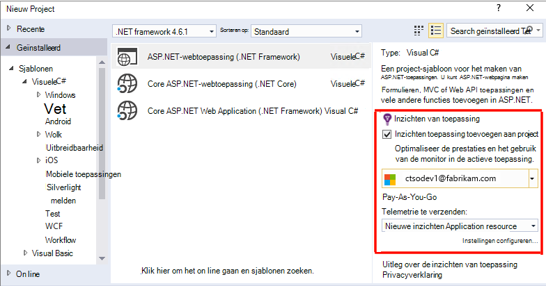


### <a name="-or-if-its-an-existing-project"></a>... of een bestaand project

Het project in de Solution Explorer met de rechtermuisknop en kies **Toepassing inzichten telemetrie toevoegen** of **Configureren toepassing inzichten**.

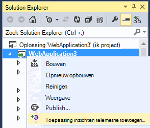

* Project voor ASP.NET-Core? - [Volg de instructies op te lossen, een paar regels code](https://github.com/Microsoft/ApplicationInsights-aspnetcore/wiki/Getting-Started#add-application-insights-instrumentation-code-to-startupcs). 


## <a name="run"></a>2. Start de app

Uw toepassing uitvoeren met F5 en probeer het zelf: verschillende pagina's voor het genereren van sommige telemetrie openen.

In Visual Studio ziet u een aantal van de gebeurtenissen die zijn geregistreerd. 

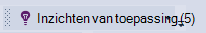

## <a name="3-see-your-telemetry"></a>3. de telemetrie bekijken...

### <a name="-in-visual-studio"></a>in Visual Studio...

Open het venster Application inzichten in Visual Studio: klik op de knop inzicht van de toepassing of het project in de Solution Explorer met de rechtermuisknop:

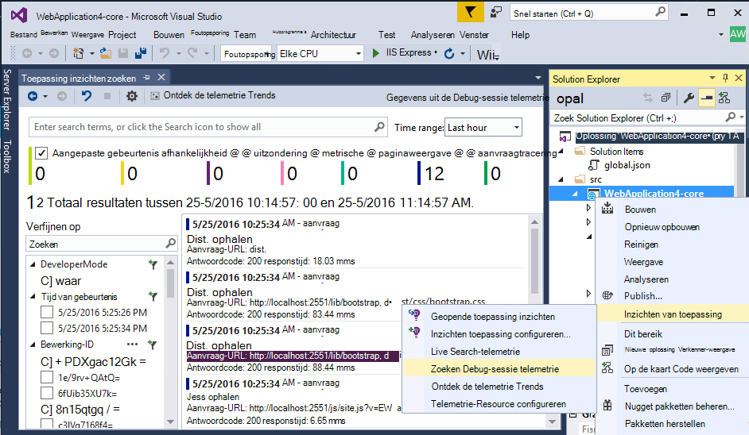

In deze weergave worden gegenereerd in de serverkant van uw app telemetrie. Experimenteren met filters en klikt u op een gebeurtenis om meer details zichtbaar.

[Meer informatie over hulpprogramma's voor toepassing inzichten in Visual Studio](app-insights-visual-studio.md).

<a name="monitor"></a> 
### <a name="-in-the-portal"></a>in de portal...

Tenzij u hebt gekozen *SDK hebt geïnstalleerd,* kunt u ook de telemetrie op het webportaal inzichten toepassing bekijken. 

De portal heeft meer diagrammen, analytische hulpmiddelen en dashboards dan Visual Studio. 


Open uw bron toepassing inzichten in [Azure portal](https://portal.azure.com/).

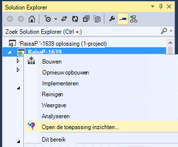

De portal wordt weergegeven in een weergave van de telemetrie van uw app: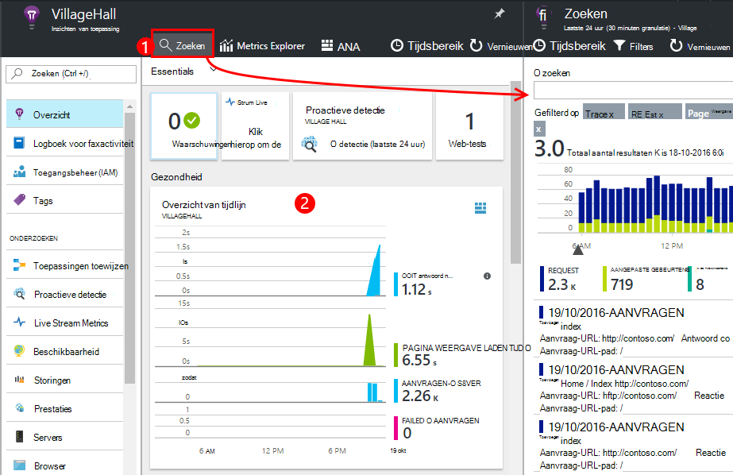

* De eerste telemetrie verschijnt in de [Live gegevensstroom van de statistieken](app-insights-metrics-explorer.md#live-metrics-stream).
* Afzonderlijke gebeurtenissen weergegeven in de **zoekresultaten** (1). Gegevens duurt een paar minuten worden weergegeven. Klik op een gebeurtenis om de eigenschappen ervan. 
* Geaggregeerde statistieken worden weergegeven in de grafieken (2). Het kan een paar minuten duren voor gegevens die hier worden weergegeven. Klik op de grafiek een blade openen met meer details.

[Meer informatie over het gebruik van de toepassing van inzichten in de portal Azure](app-insights-dashboards.md).

## <a name="4-publish-your-app"></a>4. uw app publiceren

Uw app publiceren naar de IIS-server of naar Azure. Bekijk [Live gegevensstroom van statistieken](app-insights-metrics-explorer.md#live-metrics-stream) om te controleren of dat alles goed wordt uitgevoerd.

Hier ziet u de telemetrie aanleggen in de portal Application inzichten kunt u statistieken controleren, uw telemetrie zoeken, en instellen van [dashboards](app-insights-dashboards.md). Ook kunt u de krachtige [Analytics query taal](app-insights-analytics.md) gebruik en de prestaties te analyseren of te zoeken naar specifieke gebeurtenissen. 

U kunt ook blijven uw telemetrie in [Visual Studio](app-insights-visual-studio.md) met hulpmiddelen voor diagnostische search en [Trends](app-insights-visual-studio-trends.md)te analyseren.

> [AZURE.NOTE] Als uw app voldoende telemetrie verzendt benadering de [limieten te beperken](app-insights-pricing.md#limits-summary), wordt automatisch [de bemonstering](app-insights-sampling.md) op. Bemonstering vermindert de hoeveelheid van de telemetrie verzonden vanaf uw app, behoud gecorreleerde gegevens voor diagnostische doeleinden.


##<a name="land"></a>Wat 'Toepassing inzichten toevoegen'?

Toepassing inzichten verzendt telemetrie van uw app naar de portal Application inzichten (dat wordt gehost in Microsoft Azure):

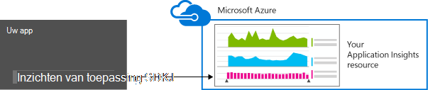

De opdracht is dus drie dingen:

1. Het pakket toepassing inzichten Web SDK NuGet toevoegen aan uw project. Als u wilt zien in Visual Studio, met de rechtermuisknop op het project en kies NuGet pakketten beheren.
2. Maak een bron toepassing inzichten in [de portal Azure](https://portal.azure.com/). Dit is waar u uw gegevens zult zien. *Instrumentation-sleutel* waarmee de resource opgehaald.
3. Hiermee voegt u de sleutel instrumentation in `ApplicationInsights.config`, zodat de SDK telemetrie naar de portal verzenden kunt.

Als u wilt, kunt u deze stappen handmatig doen voor [4 ASP.NET](app-insights-windows-services.md) of [ASP.NET Core](https://github.com/Microsoft/ApplicationInsights-aspnetcore/wiki/Getting-Started).

### <a name="to-upgrade-to-future-sdk-versions"></a>Upgrade naar toekomstige versies van de SDK

Als u wilt upgraden naar een [nieuwe versie van de SDK](https://github.com/Microsoft/ApplicationInsights-dotnet-server/releases), NuGet package manager opnieuw openen en filtert op geïnstalleerde pakketten. Selecteer Microsoft.ApplicationInsights.Web en kies Upgrade.

Als u aanpassingen hebt aangebracht in de ApplicationInsights.config, een kopie ervan opslaan voordat u een upgrade uitvoert en de wijzigingen later in de nieuwe versie samenvoegen.

## <a name="add-more-telemetry"></a>Meer telemetrie toevoegen

### <a name="web-pages-and-single-page-apps"></a>Webpagina's en apps met één pagina

1. [De JavaScript-fragment toevoegen](app-insights-javascript.md) aan uw webpagina's aan het licht van de Browser en het gebruik van blades met gegevens over bezoekers, laadtijden, browser uitzonderingen, AJAX gesprek prestaties, gebruikers- en telt.
2. [Aangepaste gebeurtenissen van code](app-insights-api-custom-events-metrics.md) te tellen, tijd of acties van de gebruiker meten.

### <a name="dependencies-exceptions-and-performance-counters"></a>Afhankelijkheden, beperkingen en prestatiemeteritems

[Status Monitor installeren](app-insights-monitor-performance-live-website-now.md) op elk van de servers verkrijgen van extra telemetrie over uw app. Dit is wat u krijgt:

* [Prestatiemeteritems voor](app-insights-performance-counters.md) - 
CPU, geheugen, schijf en andere prestatiemeters die betrekking hebben op uw app. 
* [Uitzonderingen](app-insights-asp-net-exceptions.md) - meer gedetailleerde telemetrie voor enkele uitzonderingen.
* [Afhankelijkheden](app-insights-asp-net-dependencies.md) - aanroepen voor de REST API of SQL-services. Uitzoeken of trage reacties door externe componenten prestatieproblemen in uw app veroorzaken. (Als uw toepassing wordt uitgevoerd op .NET 4.6, u hoeft niet Status Monitor om deze telemetrie.)

### <a name="diagnostic-code"></a>Diagnostische code

Heb je een probleem? Als u code invoegen in uw app om te helpen bij het opsporen wilt, hebt u verschillende opties:

* [Vastleggen logboek sporen](app-insights-asp-net-trace-logs.md): als u al Log4N, NLog of System.Diagnostics.Trace voor het traceren van gebeurtenissen, en vervolgens de uitvoer kan worden verzonden naar de inzichten van toepassing, zodat u kunt het correleren met aanvragen, het doorzoeken en analyseren. 
* [Aangepaste gebeurtenissen en statistieken](app-insights-api-custom-events-metrics.md): gebruik TrackEvent() en TrackMetric() in server of de code van de webpagina.
* [Label telemetrie met extra eigenschappen](app-insights-api-filtering-sampling.md#add-properties)

Met [Zoeken](app-insights-diagnostic-search.md) kunt zoeken en correleren van specifieke gebeurtenissen en [Analytics](app-insights-analytics.md) krachtige query's uitvoeren.

## <a name="alerts"></a>Waarschuwingen

Wees als eerste op de hoogte als uw app problemen heeft. (Wacht niet totdat u uw gebruikers vertellen!) 

* [Create web tests](app-insights-monitor-web-app-availability.md) om ervoor te zorgen dat uw site zichtbaar is op het web.
* [Proactieve diagnostics](app-insights-proactive-diagnostics.md) automatisch uitgevoerd (als uw app heeft een bepaalde minimale hoeveelheid verkeer). U hoeft te doen alles wat ze als u wilt instellen. Ze geven als uw app een ongebruikelijk aantal mislukte aanvragen heeft.
* [Metrische waarschuwingen instellen](app-insights-alerts.md) om u te waarschuwen als een metric een drempel overschrijdt. U kunt deze instellen op aangepaste metrische gegevens die u code in uw toepassing.

Standaard worden meldingen verzonden naar de eigenaar van het abonnement Azure. 

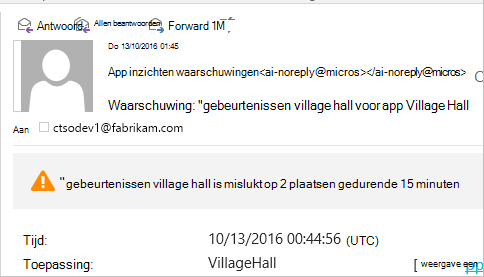

## <a name="version-and-release-tracking"></a>Versie en het bijbehorende bijhouden

### <a name="track-application-version"></a>Versie van de toepassing bijhouden

Zorg ervoor dat `buildinfo.config` is gegenereerd door het proces MSBuild. In het bestand .csproj toevoegen:  

```XML

    <PropertyGroup>
      <GenerateBuildInfoConfigFile>true</GenerateBuildInfoConfigFile>    <IncludeServerNameInBuildInfo>true</IncludeServerNameInBuildInfo>
    </PropertyGroup> 
```

Wanneer de build-info heeft, de webmodule inzichten van toepassing **versie toepassing** als een eigenschap automatisch toegevoegd aan elk item van telemetrie. Dat kunt u filteren op versie bij het uitvoeren van [Diagnostische zoekopdrachten](app-insights-diagnostic-search.md) of wanneer [metrics verkennen](app-insights-metrics-explorer.md). 

Let echter dat het nummer van de build-versie wordt alleen gegenereerd door MS-Build niet door het opbouwen van de ontwikkelaar in Visual Studio.

### <a name="release-annotations"></a>Release-aantekeningen

Als u Visual Studio Team Services gebruikt, kunt u [een aantekening met markering krijgen](app-insights-annotations.md) toegevoegd aan uw diagrammen wanneer u een nieuwe versie.


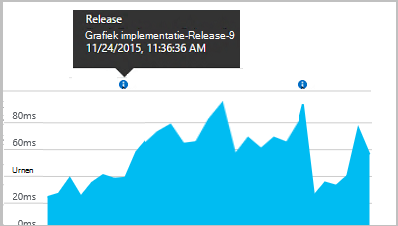

## <a name="next-steps"></a>Volgende stappen

| | 
|---|---
|**[Werken met de toepassing van inzichten in Visual Studio](app-insights-visual-studio.md)**<br/>Foutopsporing met telemetrie diagnostische zoeken, analyseren via code.|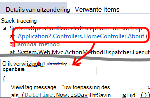
|**[Werken met de portal Application inzichten](app-insights-dashboards.md)**<br/>Dashboards, krachtige hulpmiddelen voor diagnose- en analytische, waarschuwingen, een kaart live afhankelijkheid van uw toepassing en telemetrie exporteren. |
|**[Meer gegevens toevoegen](app-insights-asp-net-more.md)**<br/>Gebruik, beschikbaarheid, afhankelijkheden, uitzonderingen controleren. Sporen van logboekregistratie frameworks integreren. Schrijf aangepaste telemetrie. | 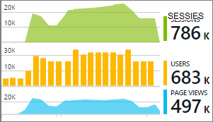


