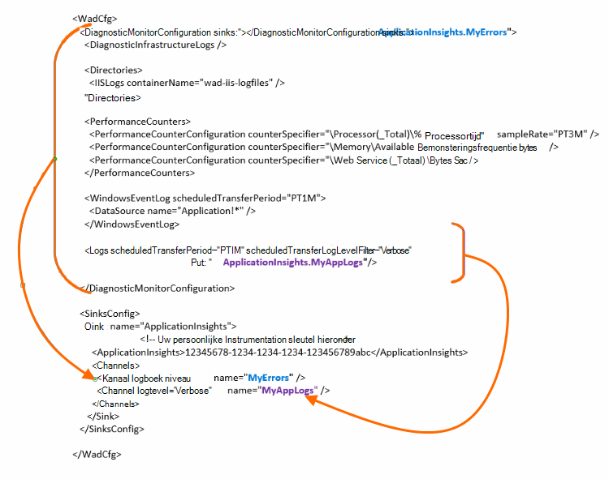

<properties
    pageTitle="Azure diagnostische logboeken naar inzichten toepassing verzenden"
    description="De details van de diagnostische logboeken van Azure Cloud-Services die worden verzonden naar de portal Application inzichten configureren."
    services="application-insights"
    documentationCenter=".net"
    authors="sbtron"
    manager="douge"/>

<tags
    ms.service="application-insights"
    ms.workload="tbd"
    ms.tgt_pltfrm="ibiza"
    ms.devlang="na"
    ms.topic="article"
    ms.date="11/17/2015"
    ms.author="awills"/>

# <a name="configure-azure-diagnostic-logging-to-application-insights"></a>Azure diagnostische gegevens vastleggen naar inzichten toepassing configureren

Bij het instellen van een Cloud Services-project of een virtuele Machine in Microsoft Azure, [Azure een diagnostische logboeken kunt genereren](../vs-azure-tools-diagnostics-for-cloud-services-and-virtual-machines.md). U kunt dit verzonden naar toepassing inzichten zodat kunt u het analyseren en diagnose en het gebruik telemetrie binnen de app uit verzonden door de toepassing inzichten SDK hebben. Het Azure logboek bevat gebeurtenissen in het beheer van de app zoals start, stop, crashes, en prestatiemeteritems. Het logboek bevat ook gesprekken in de app naar System.Diagnostics.Trace.

Configuratie van de diagnose opname in detail beschreven.

U moet de Azure SDK 2.8 in Visual Studio is geïnstalleerd.

## <a name="get-an-application-insights-resource"></a>De bron van een toepassing inzichten

Voor de beste ervaring, [de toepassing inzichten SDK aan elke rol van uw app Cloud Services toevoegen](app-insights-cloudservices.md)of [naar welke toepassing u wilt uitvoeren in uw VM](app-insights-overview.md). U kunt de diagnostische gegevens worden geanalyseerd vervolgens verzenden en dezelfde toepassing inzichten resource weergegeven.

Als u niet wilt dat de SDK - bijvoorbeeld, kunt als de app nog live - u ook gewoon [een nieuwe toepassing inzichten bron maken](app-insights-create-new-resource.md) in de portal voor Azure. Kies **Azure diagnostische gegevens** als het toepassingstype.


## <a name="send-azure-diagnostics-to-application-insights"></a>Azure diagnostische gegevens verzenden naar inzichten van toepassing

Als u het bijwerken van uw app-project, vervolgens in Visual Studio elke rol selecteert, kiest u de eigenschappen en op het tabblad configuratie, selecteer **verzenden**in de diagnostische gegevens van de inzichten van toepassing.

Gebruik als al uw app live is, Visual Studio Server Explorer of explorer Cloud Services te openen, de eigenschappen van de toepassing. Selecteer **verzenden van diagnostische gegevens van de inzichten van toepassing**.

In elk geval wordt u gevraagd voor de details van de toepassing inzichten resource die u hebt gemaakt.

[Meer informatie over het instellen van de inzichten van toepassing voor een app Cloud Services](app-insights-cloudservices.md).

## <a name="configuring-the-azure-diagnostics-adapter"></a>De adapter Azure diagnostische gegevens configureren

Alleen-lezen in als u wilt selecteren de onderdelen van het logboek dat u naar de inzichten van toepassing verzendt. Standaard alles wordt verzonden, met inbegrip van: Microsoft Azure gebeurtenissen; prestatiemeteritems; traceren vanuit de app naar System.Diagnostics.Trace.

Azure diagnostische gegevens naar Azure opslag tabellen opgeslagen. U kunt echter ook alle pipe of een subset van de gegevens naar de toepassing inzichten door 'put' en 'kanalen' in de configuratie van de bij het gebruik van diagnostische Azure uitbreiding 1.5 of hoger.

### <a name="configure-application-insights-as-a-sink"></a>Inzichten toepassing configureert als een Sink

De SDK Azure (2,8 of hoger) wordt toegevoegd wanneer u de eigenschappen in te stellen op 'Verzenden gegevens naar inzichten van toepassing', een `<SinksConfig>` element naar het openbare [configuratiebestand Azure diagnostische gegevens](https://msdn.microsoft.com/library/azure/dn782207.aspx) van de rol.

`<SinksConfig>`Hiermee definieert u de extra sink waar de Azure diagnostische gegevens kunnen worden verzonden.  Een voorbeeld van de `SinksConfig` ziet er als volgt:

```xml

    <SinksConfig>
     <Sink name="ApplicationInsights">
      <ApplicationInsights>{Insert InstrumentationKey}</ApplicationInsights>
      <Channels>
        <Channel logLevel="Error" name="MyTopDiagData"  />
        <Channel logLevel="Verbose" name="MyLogData"  />
      </Channels>
     </Sink>
    </SinksConfig>

```

De `ApplicationInsights` element geeft de sleutel aan instrumenten waarmee de toepassing inzichten resource waaraan de Azure diagnostische gegevens wordt verzonden. Als u de resource selecteert, wordt deze automatisch ingevuld op basis van de `APPINSIGHTS_INSTRUMENTATIONKEY` configuratie van de service. (Als u handmatig instellen wilt, krijgt u de sleutel van de Essentials-omlaag van de resource.)

`Channels`Definieer de gegevens die worden verzonden naar de sink. Het kanaal fungeert als een filter. De `loglevel` kenmerk kunt u het logboek instellen die het kanaal stuurt. De beschikbare waarden zijn: `{Verbose, Information, Warning, Error, Critical}`.

### <a name="send-data-to-the-sink"></a>Gegevens verzenden naar de sink

Verzenden van gegevens naar de toepassing inzichten opvangen door het kenmerk putten onder het knooppunt DiagnosticMonitorConfiguration toe te voegen. De PUT-element toe te voegen aan elk knooppunt geeft u aan dat gegevens die zijn verzameld via dat knooppunt of een willekeurig knooppunt onder het worden verzonden naar de opgegeven sink.

Gemaakt door de Azure SDK standaard wordt de Azure diagnostische gegevens verzenden:

```xml

    <DiagnosticMonitorConfiguration overallQuotaInMB="4096" sinks="ApplicationInsights">
```

Maar als u verzenden alleen foutenlogboeken wilt, komen in aanmerking de sink-naam met de naam van een kanaal:

```xml

    <DiagnosticMonitorConfiguration overallQuotaInMB="4096" sinks="ApplicationInsights.MyTopDiagdata">
```

U ziet dat we de naam van de Sink die we gedefinieerd gebruiken, samen met de naam van een kanaal dat hierboven is gedefinieerd.

Als alleen gewenste uitgebreide toepassingen verzenden naar inzichten van toepassing en vervolgens voegt u het kenmerk putten toe de `Logs` knooppunt.

```xml

    <Logs scheduledTransferPeriod="PT1M" scheduledTransferLogLevelFilter="Verbose" sinks="ApplicationInsights.MyLogData"/>
```

U kunt ook meerdere gootstenen opnemen in de configuratie op verschillende niveaus in de hiërarchie. In dat geval dient de sink die is opgegeven op het hoogste niveau van de hiërarchie als een globale instelling en bij de besluiten van het element afzonderlijk element zoals een overschrijving naar deze globale instelling wordt opgegeven.

Hier is een volledig voorbeeld van het openbare configuratiebestand waarmee alle fouten worden verzonden naar de inzichten van toepassing (op de `DiagnosticMonitorConfiguration` knooppunt) en bovendien uitgebreide niveau worden voor de toepassingslogboeken (opgegeven bij de `Logs` knooppunt).

```xml

    <WadCfg>
     <DiagnosticMonitorConfiguration overallQuotaInMB="4096"
       sinks="ApplicationInsights.MyTopDiagData"> <!-- All info below sent to this channel -->
      <DiagnosticInfrastructureLogs />
      <PerformanceCounters>
        <PerformanceCounterConfiguration counterSpecifier="\Processor(_Total)\% Processor Time" sampleRate="PT3M" sinks="ApplicationInsights.MyLogData/>
        <PerformanceCounterConfiguration counterSpecifier="\Memory\Available MBytes" sampleRate="PT3M" />
        <PerformanceCounterConfiguration counterSpecifier="\Web Service(_Total)\Bytes Total/Sec" sampleRate="PT3M" />
      </PerformanceCounters>
      <WindowsEventLog scheduledTransferPeriod="PT1M">
        <DataSource name="Application!*" />
      </WindowsEventLog>
      <Logs scheduledTransferPeriod="PT1M" scheduledTransferLogLevelFilter="Verbose"
            sinks="ApplicationInsights.MyLogData"/>
       <!-- This specific info sent to this channel -->
     </DiagnosticMonitorConfiguration>

     <SinksConfig>
      <Sink name="ApplicationInsights">
        <ApplicationInsights>{Insert InstrumentationKey}</ApplicationInsights>
        <Channels>
          <Channel logLevel="Error" name="MyTopDiagData"  />
          <Channel logLevel="Verbose" name="MyLogData"  />
        </Channels>
      </Sink>
     </SinksConfig>
    </WadCfg>
```



Er zijn enkele beperkingen rekening houden met deze functionaliteit:

* Kanalen zijn uitsluitend bedoeld om te werken met logboekbestanden en niet voor prestatiemeteritems. Als u een kanaal met een performance counter-element die wordt genegeerd.
* Het niveau voor vastleggen voor een kanaal niet meer dan het niveau voor vastleggen voor wat door Azure diagnostische gegevens worden verzameld. Bijvoorbeeld: u kan verzamelen van fouten in het logboek van de toepassing in het element logboeken en probeert te verzenden, uitgebreid Logboeken om de synchronisatie toepassing inzicht. Het kenmerk scheduledTransferLogLevelFilter moet altijd gelijk verzamelen of meer logboeken dan de logboeken u probeert te verzenden naar een sink.
* U kunt een blob-gegevens verzameld door uitbreiding van Azure diagnostische gegevens verzenden naar de inzichten van toepassing. Bijvoorbeeld iets onder het knooppunt mappen opgegeven. Voor Crash dumpen de werkelijke crashdump nog steeds worden verzonden naar een blob-opslag en alleen een melding dat de crashdump is gegenereerd wordt verzonden naar de inzichten van toepassing.

## <a name="related-topics"></a>Verwante onderwerpen

* [Azure Cloud-Services met de inzichten van de toepassing controleren](app-insights-cloudservices.md)
* [Met behulp van PowerShell Azure diagnostische gegevens verzenden naar inzichten van toepassing](app-insights-powershell-azure-diagnostics.md)
* [Diagnostische gegevens van het configuratiebestand Azure](https://msdn.microsoft.com/library/azure/dn782207.aspx)
