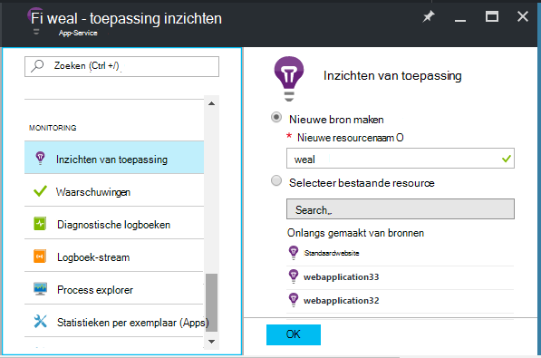
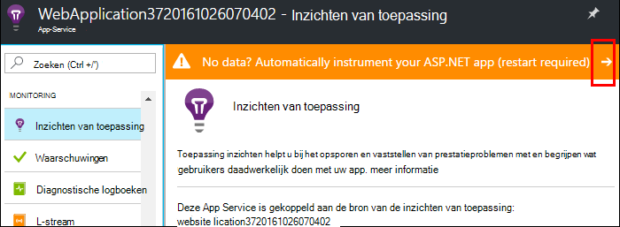
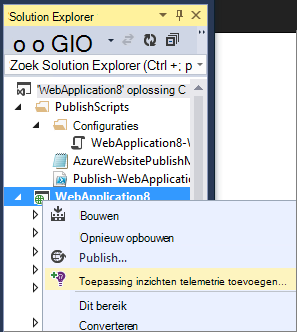
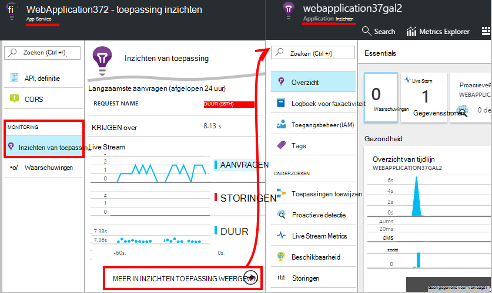
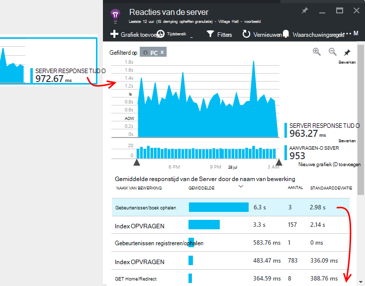
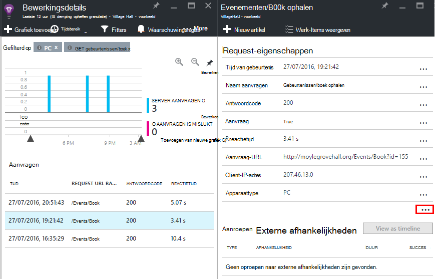

<properties
    pageTitle="Azure web app-prestaties controleren | Microsoft Azure"
    description="Toepassing voor prestatiecontrole voor Azure web apps. Grafiek laden en responstijd, afhankelijkheidsinformatie en waarschuwingen instellen op de prestaties."
    services="application-insights"
    documentationCenter=".net"
    authors="alancameronwills"
    manager="douge"/>

<tags
    ms.service="azure-portal"
    ms.workload="na"
    ms.tgt_pltfrm="na"
    ms.devlang="na"
    ms.topic="article"
    ms.date="10/24/2016"
    ms.author="awills"/>

# Azure web app-prestaties controleren

In [Azure Portal](https://portal.azure.com) kunt u instellen toepassing controleren van de prestaties voor uw [Azure web apps](../app-service-web/app-service-web-overview.md). [Visual Studio-toepassing inzichten](app-insights-overview.md) instruments uw app telemetrie over haar activiteiten naar de service Application inzichten, waar ze worden opgeslagen en geanalyseerd worden verzonden. Er, worden metrische grafieken en zoekprogramma's gebruikt om te helpen vaststellen van problemen, de prestaties verbeteren en gebruik te beoordelen.

## Runtime of bouwtijd

Kunt u controleren door de app op twee manieren implementeren:

* **Run-time** - kunt u een prestatiecontrole extensie als al uw web app live is. Het is niet nodig om te herstellen of opnieuw installeren van uw app. U krijgt een standaardset pakketten die responstijden, succespercentages, uitzonderingen, enzovoort en afhankelijkheden controleren. 
 
* **Bouwtijd** - u een pakket kunt installeren in uw app in ontwikkeling. Deze optie is veelzijdiger. Naast de standaard dezelfde pakketten, kunt u code de telemetrie aanpassen of uw eigen telemetrie verzenden. U kunt specifieke activiteiten of gebeurtenissen vastleggen volgens de semantiek van uw app domein registreren. 

## Tijd instrumentation met inzichten toepassing uitvoeren

Als u al een web app in Azure, al dat u sommige monitoring: aanvraag en fout. Toepassing inzichten te krijgen, zoals de responstijd meer toevoegen, controleren van oproepen naar afhankelijkheden, Slimme detectie en de krachtige Analytics query language. 

1. **Selecteer toepassing inzichten** in Azure Configuratiescherm voor uw web app.

    

 * Kies een nieuwe bron maken, tenzij u al een toepassing inzichten resource voor deze toepassing door een andere route instellen.

2. **Uw web app instrument** nadat inzichten van toepassing is geïnstalleerd. 

    

3. **Monitor uw app**.  [Expore de gegevens](#explore-the-data).

U kunt later, bouwen en implementeren de app met inzichten van toepassing als u wilt.

*Hoe ik inzichten toepassing verwijderen of Ga naar verzenden naar een ander middel?*

* In Azure, open de web app besturingselement blade en onder ontwikkelprogramma's, **extensies**. Verwijder de extensie inzichten van toepassing. Klik onder controle, kies toepassing inzichten en maken of selecteert u de gewenste bron.

## De app met inzichten toepassing bouwen

Toepassing inzichten kunnen gedetailleerdere telemetrie bieden door een SDK te installeren in uw app. U kunt met name traceerlogboeken, [aangepaste telemetrie schrijven](../application-insights/app-insights-api-custom-events-metrics.md), verzamelen en krijgt meer gedetailleerde rapporten met uitzondering.

1. **In Visual Studio** (2013 update 2 of hoger), de toepassing inzichten SDK aan uw project toevoegen.

    

    Als u wordt gevraagd aan te melden, moet u de referenties gebruikt voor uw account Azure.

    De bewerking heeft twee effecten:

 1. Maakt een bron toepassing inzichten in Azure, waar telemetrie is opgeslagen, geanalyseerd en wordt weergegeven.
 2. De toepassing inzichten NuGet package aan uw code toegevoegd en geconfigureerd voor telemetrie verzenden naar de resource Azure.

2. **Test de telemetrie** met behulp van de app in de ontwikkelcomputer (F5).

3. **De app publiceren** op Azure op de gebruikelijke manier. 

*Hoe schakel ik verzenden naar een andere toepassing inzichten resource?*

* Met de rechtermuisknop op het project in Visual Studio, kiest u **toepassing inzichten > configureren** en kies de gewenste bron. U kunt kiezen om een nieuwe bron te maken. Bouwen en implementeren.

## De gegevens verkennen

1. De blade toepassing inzichten van uw web app in het Configuratiescherm, ziet u Live Metrics, waarin aanvragen en storingen binnen een seconde of twee van hen die zich voordoen. Is het erg handig display bent u uw app publiceren - problemen direct kunt bekijken.

2. Klik door naar de volledige toepassing inzichten bron.

    
    

    U kunt ook gaan er rechtstreeks vanaf Azure resource navigatie.

2. Klik op een grafiek voor meer informatie:

    

    U kunt [parameters blades aanpassen](../application-insights/app-insights-metrics-explorer.md).

3. Klik door na Zie afzonderlijke gebeurtenissen en hun eigenschappen:

    

    U ziet de '...' koppelen om alle eigenschappen te openen.

    U kunt [zoekacties aanpassen](../application-insights/app-insights-diagnostic-search.md).

Gebruik de [Analytics query language](../application-insights/app-insights-analytics-tour.md)voor krachtige zoekopdrachten via de telemetrie.

## Volgende stappen

* [Azure inschakelen diagnostische gegevens](app-insights-azure-diagnostics.md) worden verzonden naar de inzichten van toepassing.
* [Monitor service gezondheid statistieken](../monitoring-and-diagnostics/insights-how-to-customize-monitoring.md) om te controleren of dat de service beschikbaar is en reageert.
* [Meldingen ontvangen](../monitoring-and-diagnostics/insights-receive-alert-notifications.md) wanneer operationele gebeurtenissen gebeuren of metrics cross een drempel.
* [Toepassing inzichten voor JavaScript-toepassingen en webpagina's](app-insights-web-track-usage.md) gebruiken om client telemetrie van de browsers die webpagina's bezoekt.
* [Beschikbaarheid van web tests instellen](app-insights-monitor-web-app-availability.md) om te worden gewaarschuwd als uw site niet actief is.
