<properties
   pageTitle="Toepassing inzichten voor Azure Cloud Services"
   description="Uw web- en werknemer rollen effectief met de inzichten van de toepassing controleren"
   services="application-insights"
   documentationCenter=""
   authors="soubhagyadash"
   manager="douge"
   editor="alancameronwills"/>

<tags
   ms.service="application-insights"
   ms.devlang="na"
   ms.tgt_pltfrm="ibiza"
   ms.topic="article"
   ms.workload="tbd"
   ms.date="03/02/2016"
   ms.author="sdash"/>

# <a name="application-insights-for-azure-cloud-services"></a>Toepassing inzichten voor Azure Cloud Services


*Inzichten van toepassing is in voorvertoning*

[Apps van Microsoft Azure Cloud-service](https://azure.microsoft.com/services/cloud-services/) kan worden gecontroleerd door de [Inzichten van Visual Studio-toepassing] [ start] voor beschikbaarheid, prestaties, storingen en gebruik. Met de feedback die u over de prestaties en effectiviteit van uw app in de vrije natuur, kunt u weloverwogen keuzes over de richting van het ontwerp in elke ontwikkelcyclus.

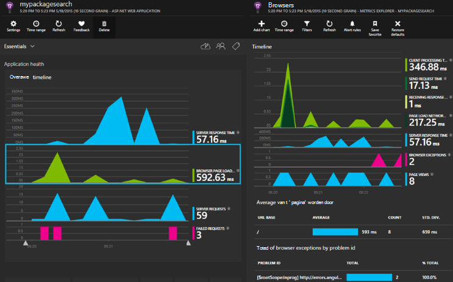

Je hebt een abonnement met [Microsoft Azure](http://azure.com). Aanmelden met een Microsoft-account, moet u voor Windows, XBox Live, of andere cloud-services van Microsoft wellicht. 


#### <a name="sample-application-instrumented-with-application-insights"></a>Voorbeeldtoepassing geïmplementeerd met inzichten van toepassing

Bekijk deze [voorbeeldtoepassing](https://github.com/Microsoft/ApplicationInsights-Home/tree/master/Samples/AzureEmailService) waarin inzichten van toepassing wordt toegevoegd aan een cloud service met twee werknemer rollen die worden gehost in Azure. 

Het volgende wordt beschreven hoe u uw eigen project cloud-service op dezelfde manier aan te passen.

## <a name="create-an-application-insights-resource-for-each-role"></a>Maak een bron van de inzichten van toepassing voor elke rol

Een bron inzichten van toepassing is indien de telemetriegegevens worden geanalyseerd en weergegeven.  

1.  In de [Azure portal][portal], maakt u een nieuwe toepassing inzichten bron. Kies soort toepassing ASP.NET-toepassing. 

    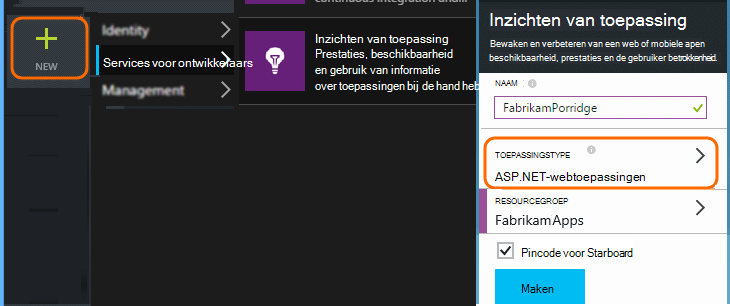

2.  Een kopie van de sleutel Instrumentation nemen. U moet dit kort voor het configureren van de SDK.

    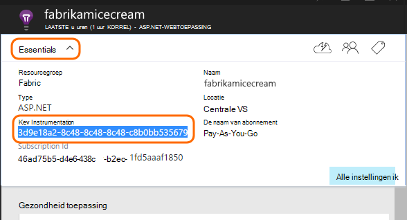


Meestal is het [raadzaam een afzonderlijke bron voor de gegevens van elke rol web en werknemer maken](app-insights-separate-resources.md). 

Als alternatief, u kunt gegevens uit alle rollen te verzenden naar slechts één bron, maar stelt u een [standaardwaarde voor de eigenschap] [ apidefaults] zodat u kunt filteren en groeperen van de resultaten van elke rol.

## <a name="sdk"></a>De SDK installeren in elk project


1. Bewerk NuGet pakketten van uw app cloud project in Visual Studio.

    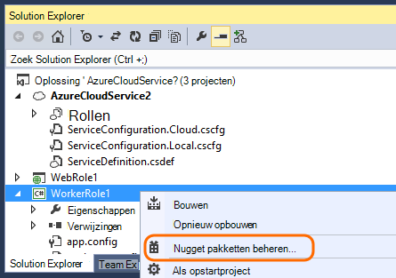


2. Voor web-rollen toevoegen de [Inzichten voor Web Application](http://www.nuget.org/packages/Microsoft.ApplicationInsights.Web) NuGet package. Deze versie van de SDK bevat modules die servercontext zoals rolgegevens toevoegen. Gebruik voor werknemer rollen, [Application inzichten voor Windows Servers](https://www.nuget.org/packages/Microsoft.ApplicationInsights.WindowsServer/).

    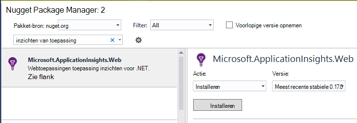


3. Configureer de SDK om gegevens te verzenden naar de bron van de inzichten van toepassing.

    De sleutel instrumentation instellen als een configuratie-instelling in het bestand `ServiceConfiguration.Cloud.cscfg`. ([Voorbeeld](https://github.com/Microsoft/ApplicationInsights-Home/blob/master/Samples/AzureEmailService/AzureEmailService/ServiceConfiguration.Cloud.cscfg)).
 
    ```XML
     <Role name="WorkerRoleA"> 
      <Setting name="APPINSIGHTS_INSTRUMENTATIONKEY" value="YOUR IKEY" /> 
     </Role>
    ```
 
    Stel de sleutel instrumentation van de configuratie-instelling in een functie geschikt opstarten:

    ```C#
     TelemetryConfiguration.Active.InstrumentationKey = RoleEnvironment.GetConfigurationSettingValue("APPINSIGHTS_INSTRUMENTATIONKEY");
    ```

    Opmerking, dezelfde naam `APPINSIGHTS_INSTRUMENTATIONKEY` instelling van de configuratie wordt gebruikt door Azure Diagnostics melden. 


    Doe dit voor elke rol in uw toepassing. Zie de voorbeelden:
 
 * [De Webrol van het](https://github.com/Microsoft/ApplicationInsights-Home/blob/master/Samples/AzureEmailService/MvcWebRole/Global.asax.cs#L27)
 * [Rol werknemer](https://github.com/Microsoft/ApplicationInsights-Home/blob/master/Samples/AzureEmailService/WorkerRoleA/WorkerRoleA.cs#L232)
 * [Voor webpagina 's](https://github.com/Microsoft/ApplicationInsights-Home/blob/master/Samples/AzureEmailService/MvcWebRole/Views/Shared/_Layout.cshtml#L13)   

4. Het bestand ApplicationInsights.config worden altijd gekopieerd naar de uitvoermap instellen. 

    (In het .config-bestand ziet u berichten waarin u wordt gevraagd de sleutel instrumentation er plaatsen. Voor cloud-toepassingen is het echter beter om het uit het bestand .cscfg. Dit zorgt ervoor dat de rol in de portal wordt geïdentificeerd.)


#### <a name="run-and-publish-the-app"></a>Uitvoeren en publiceren van de app.

Voer uw app en inloggen op Azure. Open de inzichten van toepassing resources die u hebt gemaakt en u ziet de afzonderlijke gegevenspunten worden weergegeven in [zoekresultaten](app-insights-diagnostic-search.md)en samengevoegde gegevens in [Metrisch Explorer](app-insights-metrics-explorer.md). 

Toevoegen meer telemetrie - Zie de secties hieronder - en publiceer uw app als u live diagnose en het gebruik van feedback. 


#### <a name="no-data"></a>Er zijn geen gegevens?

* Open de [zoekopdracht] [ diagnostic] tegel afzonderlijke gebeurtenissen bekijken.
* Gebruik de toepassing, zodat sommige telemetrie genereert verschillende pagina's te openen.
* Wacht enkele seconden en klik op vernieuwen.
* Zie [problemen oplossen bij][qna].


## <a name="more-telemetry"></a>Meer telemetrie

In de volgende secties tonen hoe u extra telemetrie van verschillende aspecten van de toepassing.


## <a name="track-requests-from-worker-roles"></a>Volg verzoeken van de rollen van de werknemer

In web-rollen, de module aanvragen automatisch worden gegevens verzameld over HTTP-aanvragen. Zie het [voorbeeld MVCWebRole](https://github.com/Microsoft/ApplicationInsights-Home/tree/master/Samples/AzureEmailService/MvcWebRole) voor voorbeelden van hoe u het standaardgedrag van de collectie kunt negeren. 

U kunt de prestaties van het aanroepen van functies van de werknemer vastleggen op dezelfde manier als HTTP-verzoeken kunt bijhouden. Het type aanvraag telemetrie maatregelen in toepassing van inzichten, een werkeenheid benoemde server side die kunnen worden gepland en kunnen onafhankelijk van elkaar slagen of mislukken. Terwijl de HTTP-aanvragen worden automatisch opgenomen door de SDK, kunt u uw eigen code aanvragen om in te houden rollen van de werknemer.

Zie de twee monster werknemer functies geïmplementeerd op rapport aanvragen: [WorkerRoleA](https://github.com/Microsoft/ApplicationInsights-Home/tree/master/Samples/AzureEmailService/WorkerRoleA) en [WorkerRoleB](https://github.com/Microsoft/ApplicationInsights-Home/tree/master/Samples/AzureEmailService/WorkerRoleB)

## <a name="azure-diagnostics"></a>Azure diagnostische gegevens

[Azure diagnostische](../vs-azure-tools-diagnostics-for-cloud-services-and-virtual-machines.md) gegevens omvatten rol gebeurtenissen, prestatiemeters en toepassingslogboeken. U kunt deze verzonden naar een toepassing inzichten hebben, zodat u ze samen met de rest van de telemetrie zien kunt, waardoor het gemakkelijker wordt problemen op te sporen.

Azure diagnostische gegevens zijn vooral handig als een rol onverwacht mislukt of niet gestart.

1. Klik met de rechtermuisknop op de rol (niet het project!) om de eigenschappen te openen en selecteer **Diagnostics inschakelen**, **verzenden van diagnostische gegevens van de inzichten van toepassing**.

    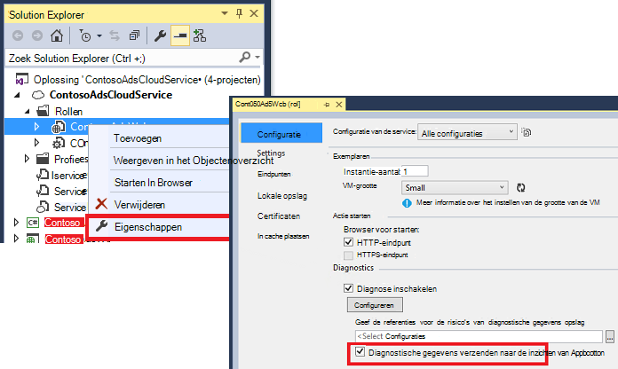

    **Of als uw app al gepubliceerd en wordt uitgevoerd is**, open Server Explorer of Cloud Explorer met de rechtermuisknop op uw app en selecteert u de optie hetzelfde.

3.  Selecteer dezelfde resource inzichten van toepassing als uw andere telemetrie.

    Als u wilt, kunt u een andere resource instellen in verschillende configuraties (Cloud, lokaal) om te voorkomen dat de gegevens voor de ontwikkeling van live-gegevens.

3. Eventueel [uitsluiten van de Azure diagnostische gegevens](app-insights-azure-diagnostics.md) die u wilt worden doorgestuurd naar de inzichten van toepassing. De standaardinstelling is alles.

### <a name="view-azure-diagnostic-events"></a>Azure diagnostische gebeurtenissen weergeven

Waar vind ik de diagnostische gegevens:

* Prestatiemeteritems worden weergegeven als aangepast maatstaven. 
* Windows-gebeurtenislogboeken worden weergegeven als de sporen en aangepaste gebeurtenissen.
* Toepassing Logboeken, logboeken ETW en alle diagnostische infrastructuur logboeken weergegeven als sporen.

Zie prestatiemeteritems en tellingen van gebeurtenissen, [Metrics Explorer](app-insights-metrics-explorer.md) te openen en een nieuwe grafiek toevoegen:


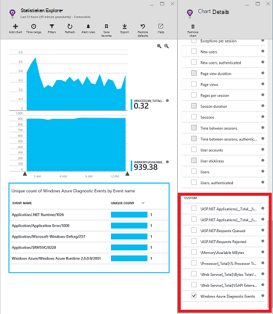

Gebruik de [zoekfunctie](app-insights-diagnostic-search.md) kunt u zoeken in de verschillende traceerlogboeken verzonden door Azure diagnostische gegevens. Bijvoorbeeld als u in een rol die de rol van vastlopen en recyclen veroorzaakt een uitzondering unhanded had, dat informatie zou worden weergegeven in het kanaal van Windows logboek voor toepassingsgebeurtenissen. De zoekfunctie kunt u kijken naar het gebeurtenislogboek van Windows-fout en de volledige stacktrace ophalen voor de uitzondering om te zoeken naar de oorzaak van het probleem.


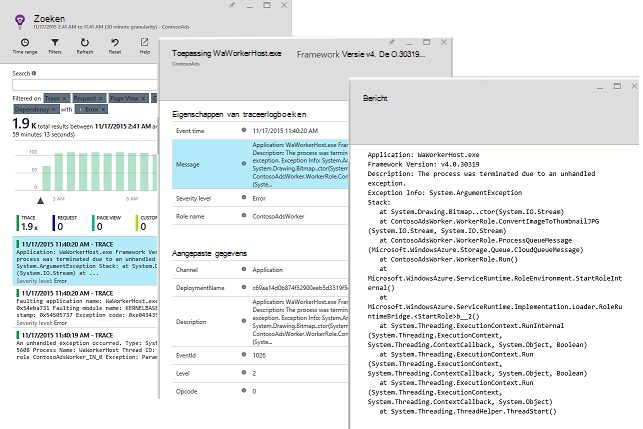

## <a name="app-diagnostics"></a>Diagnostische gegevens van App

Azure diagnostics automatisch opgenomen vermeldingen in het logboek dat uw app wordt gegenereerd met behulp van System.Diagnostics.Trace. 

Maar als u al de frameworks voor Log4N of NLog gebruikt, kunt u ook [hun sporen logboek vastleggen][netlogs].

[Aangepaste gebeurtenissen en statistieken bijhouden] [ api] in de client of server of beide, voor meer informatie over de prestaties en het gebruik van uw toepassing.

## <a name="dependencies"></a>Afhankelijkheden

Toepassing inzichten SDK kan aanroepen die uw app naar externe afhankelijkheden, zoals de REST API's en SQL-servers te rapporteren. Zo kunt u zien of een bepaalde afhankelijkheid veroorzaakt door trage reacties of fouten.

Als uw toepassing .NET framework 4.6 of hoger gebruikt, hoeft u niet iets anders doen. 

Stel de rol van het web/werknemer met de [Toepassing inzichten Agent](app-insights-monitor-performance-live-website-now.md) , ook wel bekend als 'Status Monitor".

De Agent te gebruiken toepassing inzichten met uw web/werknemer rollen:

* De map [AppInsightsAgent](https://github.com/Microsoft/ApplicationInsights-Home/tree/master/Samples/AzureEmailService/WorkerRoleA/AppInsightsAgent) en de twee bestanden in deze toevoegen aan uw web/werknemer rol projecten. Zorg ervoor dat hun build-eigenschappen zo instellen dat ze altijd worden gekopieerd naar de uitvoermap. De agent deze bestanden te installeren.
* Het begin van een taak toevoegen aan het bestand CSDEF als weergegeven [hier](https://github.com/Microsoft/ApplicationInsights-Home/tree/master/Samples/AzureEmailService/AzureEmailService/ServiceDefinition.csdef#L18).
* Opmerking: *Rollen van de werknemer* is als die [hier](https://github.com/Microsoft/ApplicationInsights-Home/tree/master/Samples/AzureEmailService/AzureEmailService/ServiceDefinition.csdef#L44)drie omgevingsvariabelen vereist. Dit is niet vereist voor web-rollen.

### <a name="dependency-reports"></a>Rapporten van afhankelijkheid

Hier volgt een voorbeeld van wat u op de portal van de inzichten van toepassing ziet:

* Uitgebreide diagnostische gegevens automatisch gecorreleerde aanvragen en afhankelijkheden:

    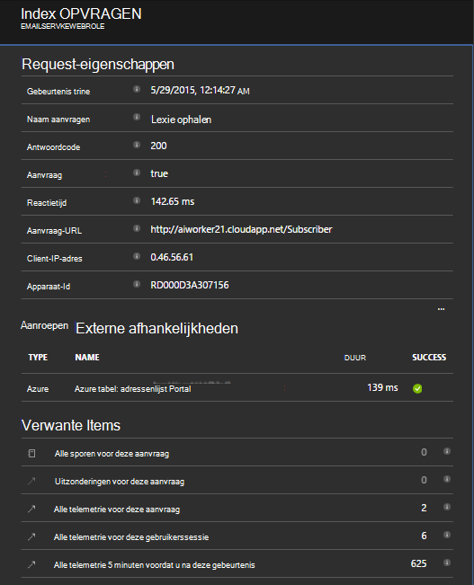

* De prestaties van de functie web met afhankelijkheidsinformatie:

    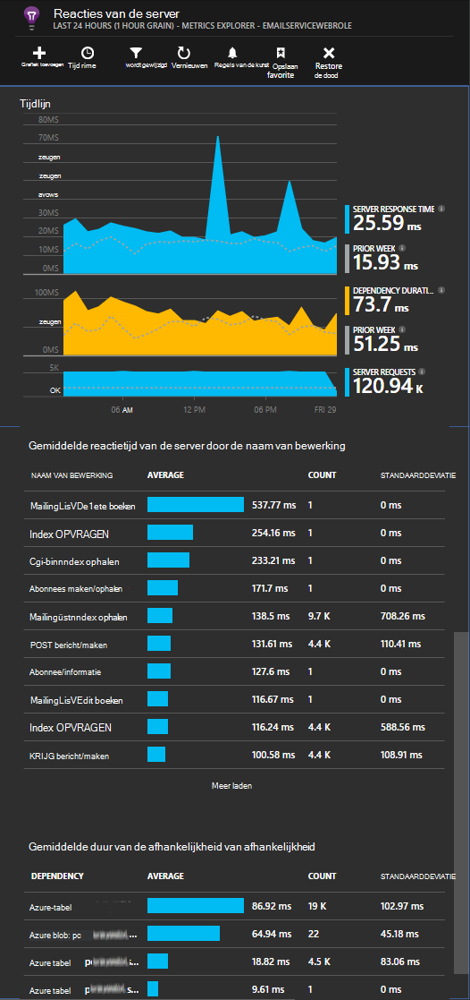

* Hier is een schermafdruk van de aanvragen en de afhankelijkheidsinformatie voor een functie van de werknemer:

    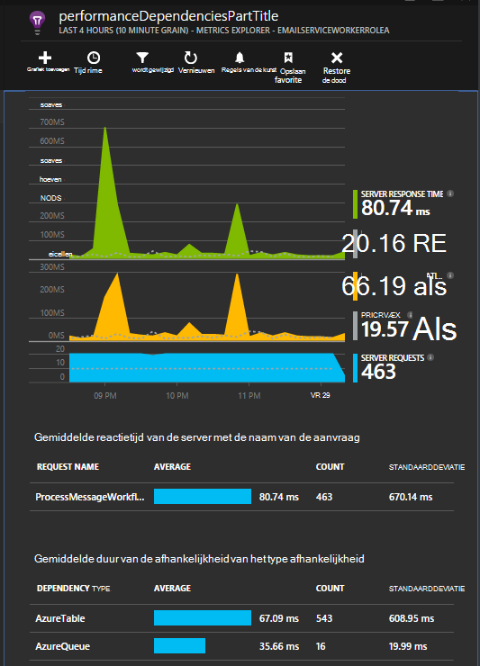

## <a name="exceptions"></a>Uitzonderingen

Zie [Controle uitzonderingen in de inzichten van de toepassing](app-insights-asp-net-exceptions.md) voor informatie over het verzamelen van niet-verwerkte uitzonderingen van toepassing voor verschillende webtypen.

De rol van de web monster heeft MVC5 en Web API 2-controllers. De niet-verwerkte uitzonderingen van de 2 zijn opgenomen met de volgende:

* [AiHandleErrorAttribute](https://github.com/Microsoft/ApplicationInsights-Home/blob/master/Samples/AzureEmailService/MvcWebRole/Telemetry/AiHandleErrorAttribute.cs) instellen [hier](https://github.com/Microsoft/ApplicationInsights-Home/blob/master/Samples/AzureEmailService/MvcWebRole/App_Start/FilterConfig.cs#L12) voor MVC5-controllers
* [AiWebApiExceptionLogger](https://github.com/Microsoft/ApplicationInsights-Home/blob/master/Samples/AzureEmailService/MvcWebRole/Telemetry/AiWebApiExceptionLogger.cs) instellen [hier](https://github.com/Microsoft/ApplicationInsights-Home/blob/master/Samples/AzureEmailService/MvcWebRole/App_Start/WebApiConfig.cs#L25) voor Web-API-2-controllers

Er zijn twee manieren om bij te houden van uitzonderingen voor werknemer-rollen.

* TrackException(ex)
* Als u de toepassing inzichten trace listener NuGet package hebt toegevoegd, kunt u System.Diagnostics.Trace aan te melden, uitzonderingen. [Voorbeeld van code.](https://github.com/Microsoft/ApplicationInsights-Home/blob/master/Samples/AzureEmailService/WorkerRoleA/WorkerRoleA.cs#L107)

## <a name="performance-counters"></a>Prestatiemeteritems

De volgende items worden standaard verzameld:

    * \Process(??APP_WIN32_PROC??)\% processortijd
    * \Memory\Available bytes
    * \.De CLR NET Exceptions(??APP_CLR_PROC??)\# van uitzonderingen gegenereerd per seconde
    * \Process (??. APP_WIN32_PROC??) \Private bytes
    * \Process (??. APP_WIN32_PROC??) \IO gegevens in Bytes per seconde
    * \Processor(_Total)\% processortijd

Daarnaast worden de volgende ook verzameld voor web-rollen:

    * \ASP.NET toepassingen (??. APP_W3SVC_PROC??) \Requests/sec    
    * \ASP.NET toepassingen (??. APP_W3SVC_PROC??) \Request tijd
    * \ASP.NET toepassingen (??. APP_W3SVC_PROC??) \Requests in Application Queue

Kunt u meer aangepaste of andere windows-prestatiemeteritems als weergegeven [hier](https://github.com/Microsoft/ApplicationInsights-Home/blob/master/Samples/AzureEmailService/WorkerRoleA/ApplicationInsights.config#L14)

  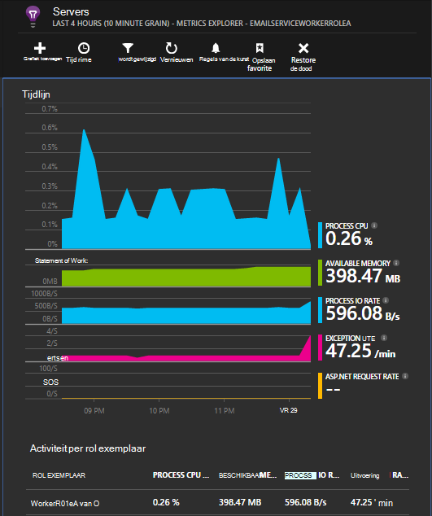

## <a name="correlated-telemetry-for-worker-roles"></a>Gecorreleerde telemetrie voor werknemer rollen

Het is een rijke ervaring van de diagnostische wanneer kunt u zien wat leidde tot een aanvraag is mislukt of hoge latentie. Met web-rollen, de SDK automatisch ingesteld correlatie tussen verwante telemetrie. Voor het rollen van de werknemer, kunt u een aangepaste telemetrie initialiseren een gemeenschappelijk kenmerk van Operation.Id context voor de telemetrie hiervoor instellen. Hierdoor kunt u zien of het probleem latentie/storing werd veroorzaakt door een afhankelijkheid of de code in een oogopslag! 

Hier ziet u hoe:

* De correlatie-Id in een CallContext instellen als weergegeven [hier](https://github.com/Microsoft/ApplicationInsights-Home/blob/master/Samples/AzureEmailService/WorkerRoleA/WorkerRoleA.cs#L36). In dit geval gebruiken we de aanvraag-ID als de correlatie-id
* Voeg een aangepaste implementatie van het TelemetryInitializer, dat de Operation.Id wordt ingesteld op de correlationId hierboven. Hier wordt weergegeven: [ItemCorrelationTelemetryInitializer](https://github.com/Microsoft/ApplicationInsights-Home/blob/master/Samples/AzureEmailService/WorkerRoleA/Telemetry/ItemCorrelationTelemetryInitializer.cs#L13)
* Voeg de aangepaste telemetrie initialiseren. U kunt dat doen in het bestand ApplicationInsights.config of in de programmacode als weergegeven [hier](https://github.com/Microsoft/ApplicationInsights-Home/blob/master/Samples/AzureEmailService/WorkerRoleA/WorkerRoleA.cs#L233)

Dat is alles. De portal ervaring is al bekabeld van alle bijbehorende telemetrie in één oogopslag vast te stellen:

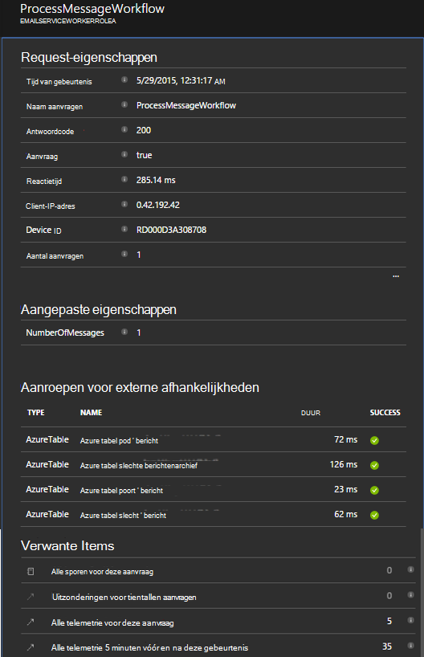


## <a name="client-telemetry"></a>Client telemetrie

[De SDK JavaScript toevoegen aan uw webpagina's] [ client] browser gebaseerde telemetrie zoals pagina weergave telt, pagina laden tijden, uitzonderingen script ophalen en kunt u aangepaste telemetrie in uw pagina scripts schrijven.

## <a name="availability-tests"></a>Beschikbaarheid van tests

[Web tests instellen] [ availability] controleren of uw toepassing blijft live en reageert.


## <a name="example"></a>Voorbeeld

[In het voorbeeld](https://github.com/Microsoft/ApplicationInsights-Home/tree/master/Samples/AzureEmailService) controleert een service die de rol van een webpagina en twee rollen van de werknemer.

## <a name="exception-method-not-found-on-running-in-azure-cloud-services"></a>Uitzondering 'methode niet gevonden' op in Azure Cloud Services wordt uitgevoerd

U voor .NET 4.6 opbouwen? 4.6 wordt niet automatisch ondersteund in Azure Cloud Services-rollen. [4.6 installeren op elke rol](../cloud-services/cloud-services-dotnet-install-dotnet.md) voordat de toepassing wordt uitgevoerd.

## <a name="related-topics"></a>Verwante onderwerpen

* [Azure diagnostische gegevens verzenden naar inzichten toepassing configureren](app-insights-azure-diagnostics.md)
* [Met behulp van PowerShell Azure diagnostische gegevens verzenden naar inzichten van toepassing](app-insights-powershell-azure-diagnostics.md)


[api]: app-insights-api-custom-events-metrics.md
[apidefaults]: app-insights-api-custom-events-metrics.md#default-properties
[apidynamicikey]: app-insights-separate-resources.md#dynamic-ikey
[availability]: app-insights-monitor-web-app-availability.md
[azure]: app-insights-azure.md
[client]: app-insights-javascript.md
[diagnostic]: app-insights-diagnostic-search.md
[netlogs]: app-insights-asp-net-trace-logs.md
[portal]: http://portal.azure.com/
[qna]: app-insights-troubleshoot-faq.md
[redfield]: app-insights-monitor-performance-live-website-now.md
[start]: app-insights-overview.md 
