<properties 
    pageTitle="Procedure: telemetrie SQL-database exporteren van toepassing inzichten" 
    description="Continu inzichten toepassing gegevens exporteren naar SQL met behulp van Analytics Stream." 
    services="application-insights" 
    documentationCenter=""
    authors="noamben" 
    manager="douge"/>

<tags 
    ms.service="application-insights" 
    ms.workload="tbd" 
    ms.tgt_pltfrm="ibiza" 
    ms.devlang="na" 
    ms.topic="article" 
    ms.date="03/06/2015" 
    ms.author="awills"/>
 
# <a name="walkthrough-export-to-sql-from-application-insights-using-stream-analytics"></a>Procedure: Exporteren naar SQL uit toepassing inzichten door middel van analyses van de Stream

In dit artikel ziet u hoe u uw telemetriegegevens van [Visual Studio-toepassing inzichten] [ start] in Azure SQL-database met behulp van [Continue exporteren] [ export] en [Azure Stream Analytics](https://azure.microsoft.com/services/stream-analytics/). 

Continue exporteren wordt uw telemetrie data in Azure opslag in JSON-indeling. We verdelen de JSON-objecten met Azure Stream Analytics en rijen in een databasetabel te maken.

(Meer in het algemeen doorlopend exporteren is de manier om uw eigen analyse van de telemetrie uw apps naar de inzichten van toepassing verzenden. U kunt aan te passen in deze voorbeeldcode om andere dingen met de geëxporteerde telemetrie, zoals aggregatie van gegevens.)

We beginnen met de veronderstelling dat u al de app die u wilt controleren.


In dit voorbeeld, we gebruiken de gegevens in de pagina, maar hetzelfde patroon kan eenvoudig worden uitgebreid naar andere gegevenstypen zoals aangepaste gebeurtenissen en uitzonderingen. 


## <a name="add-application-insights-to-your-application"></a>Inzichten van de toepassing aan uw toepassing toevoegen


Aan de slag:

1. [Inzichten van toepassing voor uw webpagina's instellen](app-insights-javascript.md). 

    (In dit voorbeeld wij aandacht besteed aan de verwerking van gegevens vanuit de browser van de client in de pagina, maar u ook inzichten voor de serverkant van uw app in [Java](app-insights-java-get-started.md) of [ASP.NET](app-insights-asp-net.md) en verwerking van aanvragen, afhankelijkheid en andere telemetrie server-toepassing kunt instellen.)


5. Publiceren van uw app en telemetriegegevens die voorkomen in uw toepassing inzichten resource bekijken.


## <a name="create-storage-in-azure"></a>Opslag in Azure maken

Continue exporteren wordt altijd gegevens aan een account Azure opslag, dus u moet eerst de opslag maken.

1. Een opslag-account maken in uw abonnement in de [Azure portal][portal].

    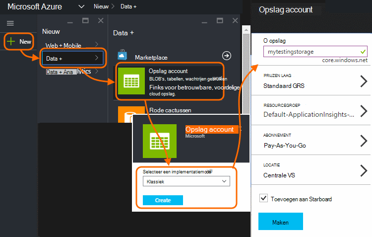

2. Maken van een container

    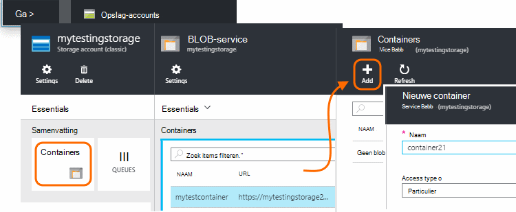

3. De toegangstoets opslag kopiëren

    Je hebt het snel voor het instellen van de invoer voor de stream analytics-service.

    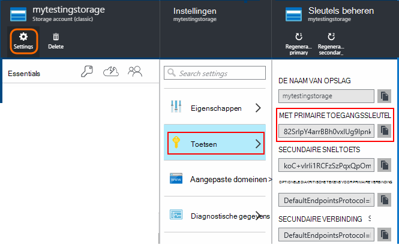

## <a name="start-continuous-export-to-azure-storage"></a>Doorlopende exporteren naar Azure opslag starten

1. Blader in de Azure portal naar de toepassing inzichten resource die u hebt gemaakt voor uw toepassing.

    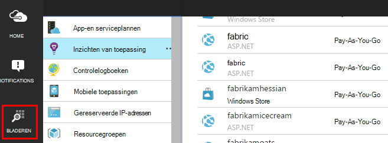

2. Een doorlopende export maken.

    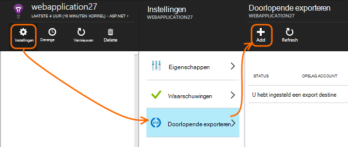


    Selecteer de opslag-account die u eerder hebt gemaakt:

    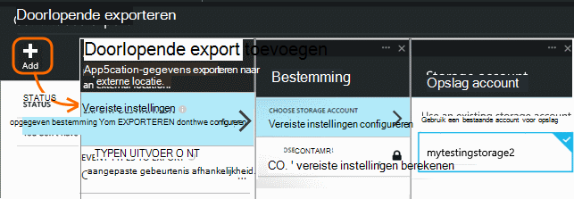
    
    Stel de gebeurtenistypen die u wilt zien:

    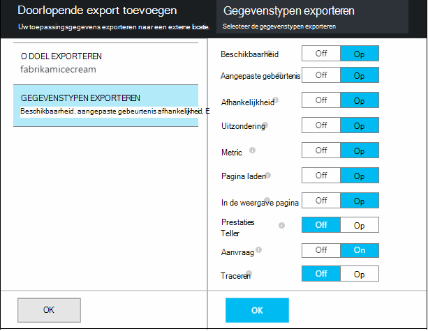


3. Laat enkele gegevens worden verzameld. Achteroverleunen en toestaan dat uw toepassing gebruikt voor een tijdje. Telemetrie komen en ziet u statistische grafieken in [metrische explorer](app-insights-metrics-explorer.md) en afzonderlijke gebeurtenissen in [Diagnostische zoeken](app-insights-diagnostic-search.md). 

    En ook de gegevens worden geëxporteerd naar de opslag. 

4. Inspecteer de geëxporteerde gegevens in de portal - kiest u **Bladeren**, selecteert u de account voor opslag en **Containers** - of Visual Studio. Kies in Visual Studio **bekijken / Cloud Explorer**, en open Azure / opslag. (Als u deze optie niet hebt, moet u de Azure SDK installeren: Open het dialoogvenster Nieuw Project en Visual C# / Cloud / Microsoft Azure SDK voor .NET ophalen.)

    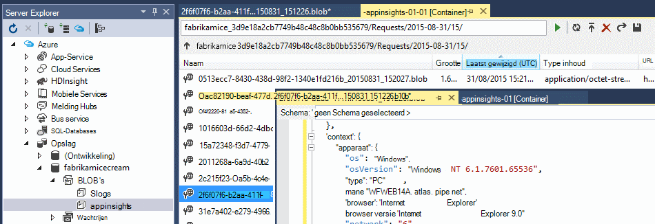

    Maak een notitie van het gemeenschappelijk gedeelte van de naam van het pad, die wordt afgeleid van de naam en instrumentatie toepassingstoets. 

De gebeurtenissen worden geregistreerd in de blob-bestanden in JSON-indeling. Elk bestand bevat mogelijk een of meer gebeurtenissen. Zo willen we lezen van gegevens van de gebeurtenis en de velden die we wilt uitfilteren. Er zijn allerlei dingen die we met de gegevens doen kunnen, maar onze plan is vandaag Stream Analytics gegevens verplaatsen naar een SQL-database gebruiken. Dat kunnen we gemakkelijk veel interessante query's uitvoeren.

## <a name="create-an-azure-sql-database"></a>Azure SQL-Database maken

Opnieuw starten van uw abonnement in [Azure portal][portal], maken van de database (en een nieuwe server, tenzij u deze al hebt gedacht) die u gaat het om gegevens te schrijven.

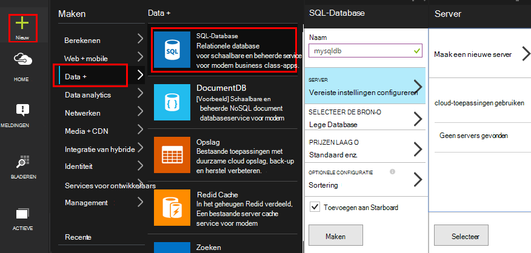


Zorg ervoor dat de databaseserver toegang tot Azure services biedt:


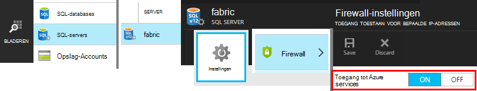

## <a name="create-a-table-in-azure-sql-db"></a>Een tabel maken in Azure SQL DB

Verbinding maken met de database gemaakt in de vorige sectie met het beheerprogramma van uw voorkeur. In dit scenario, we gebruiken [SQL Server Management Tools](https://msdn.microsoft.com/ms174173.aspx) (SSMS).

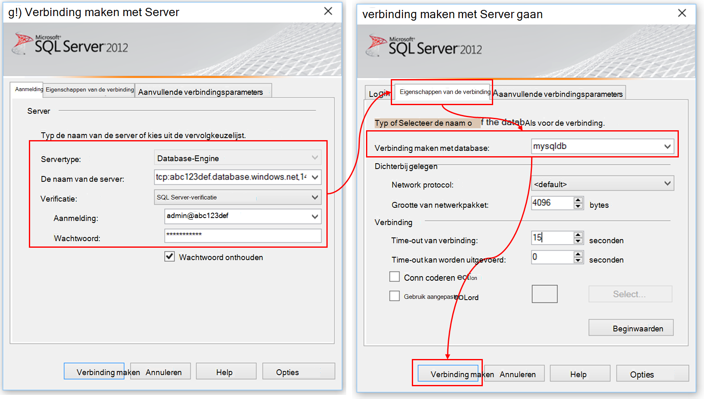

Een nieuwe query maken en de volgende T-SQL-instructies uitvoeren:

```SQL

CREATE TABLE [dbo].[PageViewsTable](
    [pageName] [nvarchar](max) NOT NULL,
    [viewCount] [int] NOT NULL,
    [url] [nvarchar](max) NULL,
    [urlDataPort] [int] NULL,
    [urlDataprotocol] [nvarchar](50) NULL,
    [urlDataHost] [nvarchar](50) NULL,
    [urlDataBase] [nvarchar](50) NULL,
    [urlDataHashTag] [nvarchar](max) NULL,
    [eventTime] [datetime] NOT NULL,
    [isSynthetic] [nvarchar](50) NULL,
    [deviceId] [nvarchar](50) NULL,
    [deviceType] [nvarchar](50) NULL,
    [os] [nvarchar](50) NULL,
    [osVersion] [nvarchar](50) NULL,
    [locale] [nvarchar](50) NULL,
    [userAgent] [nvarchar](max) NULL,
    [browser] [nvarchar](50) NULL,
    [browserVersion] [nvarchar](50) NULL,
    [screenResolution] [nvarchar](50) NULL,
    [sessionId] [nvarchar](max) NULL,
    [sessionIsFirst] [nvarchar](50) NULL,
    [clientIp] [nvarchar](50) NULL,
    [continent] [nvarchar](50) NULL,
    [country] [nvarchar](50) NULL,
    [province] [nvarchar](50) NULL,
    [city] [nvarchar](50) NULL
)

CREATE CLUSTERED INDEX [pvTblIdx] ON [dbo].[PageViewsTable]
(
    [eventTime] ASC
)WITH (PAD_INDEX = OFF, STATISTICS_NORECOMPUTE = OFF, SORT_IN_TEMPDB = OFF, DROP_EXISTING = OFF, ONLINE = OFF, ALLOW_ROW_LOCKS = ON, ALLOW_PAGE_LOCKS = ON)

```

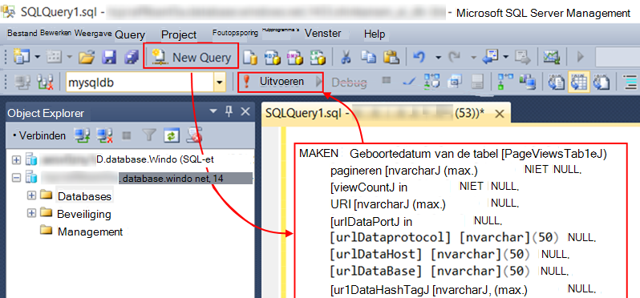

In dit voorbeeld gebruiken we gegevens van bezoekers. Overzicht van de gegevens beschikbaar inspecteren de JSON-uitvoer en Zie het [gegevensmodel exporteren](app-insights-export-data-model.md).

## <a name="create-an-azure-stream-analytics-instance"></a>Azure Stream Analytics exemplaar maken

[Klassieke Azure Portal](https://manage.windowsazure.com/), selecteer de Azure Stream Analytics-service en een nieuwe gegevensstroom Analytics taak maken:


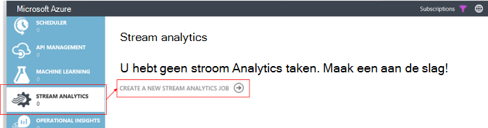


Wanneer de nieuwe taak wordt gemaakt, vouwt u de details:

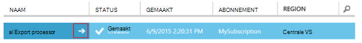

#### <a name="set-blob-location"></a>Blob-locatie instellen

Stel te treffen invoer uit de blob continue exporteren:

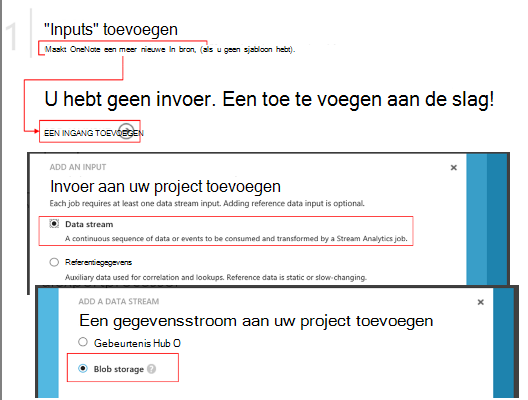

Nu moet u de primaire sleutel van de toegang van uw opslag-Account die u eerder hebt opgeschreven. Deze Account als opslag instellen.

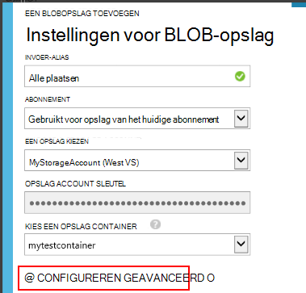

#### <a name="set-path-prefix-pattern"></a>Set path voorvoegselpatroon 

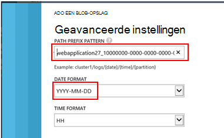

Zorg ervoor dat de notatie ingesteld op **Jjjj-MM-DD** (met **streepjes**).

Het patroon voorvoegsel van pad geeft aan hoe de invoerbestanden in Analytics Stream wordt gevonden in de opslag. U moet deze corresponderen met hoe continue exporteert de gegevens worden opgeslagen. Stel deze in als volgt:

    webapplication27_12345678123412341234123456789abcdef0/PageViews/{date}/{time}

In dit voorbeeld:

* `webapplication27`is de naam van de resource van toepassing inzichten, **alle in kleine letters**. 
* `1234...`de sleutel van de instrumenten van de toepassing inzichten resource **met streepjes verwijderd**is. 
* `PageViews`is het type van de gegevens wilt analyseren. De beschikbare typen is afhankelijk van het filter dat u in het doorlopende exporteren instelt. De geëxporteerde gegevens in het overzicht van de beschikbare typen onderzoek en Zie het [gegevensmodel exporteren](app-insights-export-data-model.md).
* `/{date}/{time}`een patroon er wordt letterlijk geschreven.

Als u de naam en het iKey van uw toepassing inzichten resource, Essentials open op de overzichtspagina, of instellingen.

#### <a name="finish-initial-setup"></a>Eerste setup voltooien

Bevestig de serialisatie-indeling:

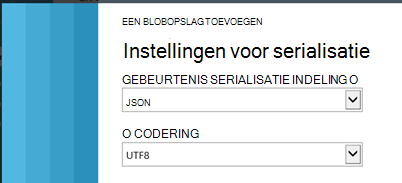

De wizard te sluiten en wachten op de installatie te voltooien.

>[AZURE.TIP] Voorbeeld van de functie gebruiken om het invoerpad correct ingesteld. Als dit mislukt: Controleer of er gegevens in de opslag voor het monster tijdsbereik die u hebt gekozen is. Bewerk de definitie van de invoer en controleert u de account van de opslag, pad prefix en datum de notatie correct.

## <a name="set-query"></a>Query instellen

Open het gedeelte query:

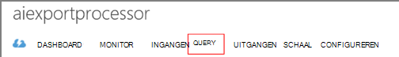

Vervang in de standaardquery met:

```SQL

    SELECT flat.ArrayValue.name as pageName
    , flat.ArrayValue.count as viewCount
    , flat.ArrayValue.url as url
    , flat.ArrayValue.urlData.port as urlDataPort
    , flat.ArrayValue.urlData.protocol as urlDataprotocol
    , flat.ArrayValue.urlData.host as urlDataHost
    , flat.ArrayValue.urlData.base as urlDataBase
    , flat.ArrayValue.urlData.hashTag as urlDataHashTag
      ,A.context.data.eventTime as eventTime
      ,A.context.data.isSynthetic as isSynthetic
      ,A.context.device.id as deviceId
      ,A.context.device.type as deviceType
      ,A.context.device.os as os
      ,A.context.device.osVersion as osVersion
      ,A.context.device.locale as locale
      ,A.context.device.userAgent as userAgent
      ,A.context.device.browser as browser
      ,A.context.device.browserVersion as browserVersion
      ,A.context.device.screenResolution.value as screenResolution
      ,A.context.session.id as sessionId
      ,A.context.session.isFirst as sessionIsFirst
      ,A.context.location.clientip as clientIp
      ,A.context.location.continent as continent
      ,A.context.location.country as country
      ,A.context.location.province as province
      ,A.context.location.city as city
    INTO
      AIOutput
    FROM AIinput A
    CROSS APPLY GetElements(A.[view]) as flat


```

U ziet dat de eerste paar eigenschappen specifiek voor de gegevens in de pagina zijn. De uitvoer van andere typen telemetrie heeft verschillende eigenschappen. Zie de [Naslaggids voor de typen eigenschappen en waarden voor model gedetailleerde.](app-insights-export-data-model.md)

## <a name="set-up-output-to-database"></a>Uitvoer naar de database instellen

Selecteer SQL als de uitvoer.

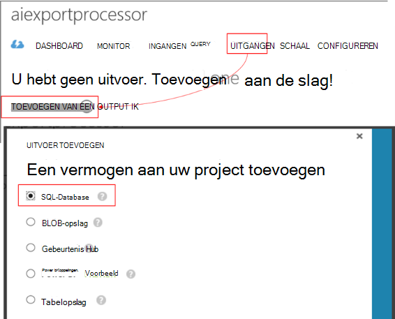

De SQL-database opgeven.


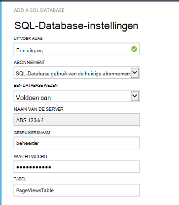

De wizard te sluiten en wachten op een melding dat de uitvoer zijn ingesteld.

## <a name="start-processing"></a>Verwerking starten

De taak van de actiebalk start:

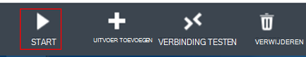

U kunt kiezen of u wilt beginnen met het verwerken van de gegevens die vanaf nu of beginnen met de eerdere gegevens. Deze laatste is handig als u doorlopend exporteren al een tijdje actief had.


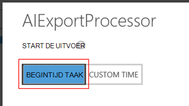

Ga terug naar SQL Server Management Tools en bekijk de gegevens die na een paar minuten. Gebruik bijvoorbeeld een query als volgt:

    SELECT TOP 100 *
    FROM [dbo].[PageViewsTable]


## <a name="related-articles"></a>Verwante artikelen

* [Exporteren naar SQL met behulp van de functie van een werknemer](app-insights-code-sample-export-telemetry-sql-database.md)
* [Exporteren naar PowerBI door middel van analyses van de Stream](app-insights-export-power-bi.md)
* [Gedetailleerde gegevens model voor typen eigenschappen en waarden.](app-insights-export-data-model.md)
* [Doorlopende exporteren in inzichten van toepassing](app-insights-export-telemetry.md)
* [Inzichten van toepassing](https://azure.microsoft.com/services/application-insights/)

<!--Link references-->

[diagnostic]: app-insights-diagnostic-search.md
[export]: app-insights-export-telemetry.md
[metrics]: app-insights-metrics-explorer.md
[portal]: http://portal.azure.com/
[start]: app-insights-overview.md

 