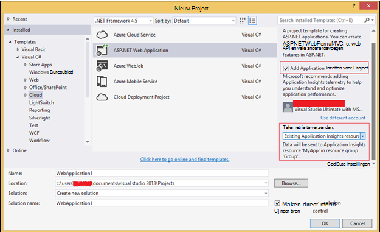
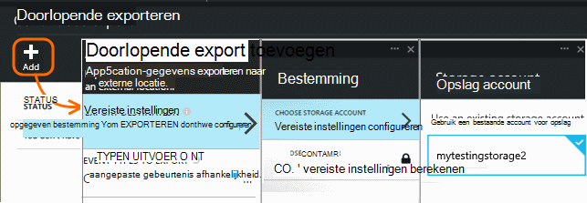
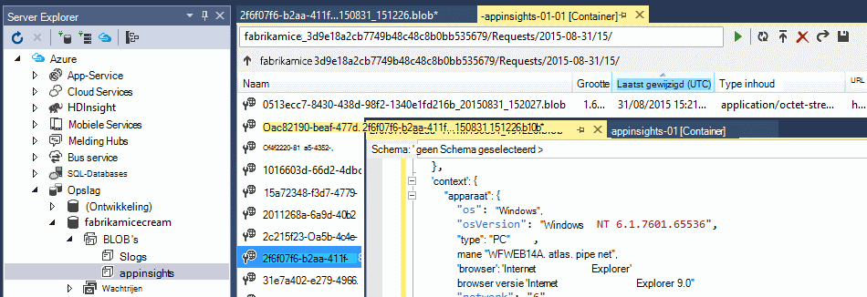

<properties 
    pageTitle="Voorbeeld: gegevens die zijn geëxporteerd uit een toepassing inzichten parseren" 
    description="Uw eigen analyse van de telemetrie in inzichten toepassing code met behulp van de functie continu exporteren. Gegevens opslaan in SQL." 
    services="application-insights" 
    documentationCenter=""
    authors="mazharmicrosoft" 
    manager="douge"/>

<tags 
    ms.service="application-insights" 
    ms.workload="tbd" 
    ms.tgt_pltfrm="ibiza" 
    ms.devlang="na" 
    ms.topic="article" 
    ms.date="01/05/2016" 
    ms.author="awills"/>
 
# Voorbeeld: gegevens die zijn geëxporteerd uit een toepassing inzichten parseren

In dit artikel ziet u hoe JSON-gegevens die zijn geëxporteerd uit een toepassing inzichten verwerken. Als u bijvoorbeeld schrijven we code om uw telemetriegegevens verplaatsen van [Visual Studio-toepassing inzichten] [ start] in Azure SQL-database met behulp van [Continue exporteren][export]. (Kunt u deze [met behulp van Analytics Stream](app-insights-code-sample-export-sql-stream-analytics.md)bereiken, maar hier ons doel is u sommige code weergeven.) 

Continue exporteren verplaatst de telemetrie in Azure opslag in JSON-indeling, zodat we je sommige code schrijven om te parseren de JSON-objecten en rijen in een databasetabel te maken.

Meer in het algemeen is doorlopend exporteren de manier om uw eigen analyse van de telemetrie uw apps naar de inzichten van toepassing verzenden. U kunt dit codevoorbeeld om andere dingen met de geëxporteerde telemetrie kan aanpassen.

We beginnen met de veronderstelling dat u al de app die u wilt controleren.

## Toepassing inzichten SDK toevoegen

Voor het controleren van uw toepassing, kunt u het [toevoegen van een toepassing inzichten SDK] [ start] voor uw toepassing. Er zijn verschillende SDK's en hulpprogramma's voor verschillende platforms, IDEs en talen. U kunt webpagina's, Java of ASP.NET webservers en mobiele apparaten van verschillende soorten controleren. De SDK's telemetrie verzenden naar de [toepassing inzichten portal][portal], waar u kunt onze krachtige analyse diagnostische hulpprogramma's en en de gegevens naar opslag exporteren.

Aan de slag:

1. Een [account in Microsoft Azure](https://azure.microsoft.com/pricing/)aanvragen.
2. In de [Azure portal][portal], een nieuwe resource inzichten van toepassing voor uw app toevoegen:

    

    (Uw type app en abonnement mogelijk anders.)
3. Open de Quick Start het instellen van de SDK voor uw type app vinden.

    

    Als uw type app niet wordt vermeld, kijk eens naar de [Introductie] [ start] pagina.

4. In dit voorbeeld bent we een web-app controle zodat we de Azure-hulpprogramma's in Visual Studio gebruiken kunnen voor de installatie van de SDK. We zien de naam van de bron van onze inzichten van toepassing:

    

## Opslag in Azure maken

Gegevens van de inzichten van toepassing is altijd op een rekening Azure opslag in JSON-indeling geëxporteerd. Vanuit deze opslag is dat de code de gegevens worden gelezen.

1. Een 'klassieke' opslag account maken in uw abonnement in de [Azure portal][portal].

    

2. Maken van een container

    

## Doorlopende exporteren naar Azure opslag starten

1. Blader in de Azure portal naar de toepassing inzichten resource die u hebt gemaakt voor uw toepassing.

    

2. Een doorlopende export maken.

    

    Selecteer de opslag-account die u eerder hebt gemaakt:

    
    
    Stel de gebeurtenistypen die u wilt zien:

    

3. Laat enkele gegevens worden verzameld. Achteroverleunen en toestaan dat uw toepassing gebruikt voor een tijdje. Telemetrie komen en ziet u statistische grafieken in [metrische explorer](app-insights-metrics-explorer.md) en afzonderlijke gebeurtenissen in [Diagnostische zoeken](app-insights-diagnostic-search.md). 

    En ook de gegevens worden geëxporteerd naar de opslag. 

4. De geëxporteerde gegevens te controleren. Kies in Visual Studio **bekijken / Cloud Explorer**, en open Azure / opslag. (Als u deze optie niet hebt, moet u de Azure SDK installeren: Open het dialoogvenster Nieuw Project en Visual C# / Cloud / Microsoft Azure SDK voor .NET ophalen.)

    

    Maak een notitie van het gemeenschappelijk gedeelte van de naam van het pad, die wordt afgeleid van de naam en instrumentatie toepassingstoets. 

De gebeurtenissen worden geregistreerd in de blob-bestanden in JSON-indeling. Elk bestand bevat mogelijk een of meer gebeurtenissen. Zo willen we lezen van gegevens van de gebeurtenis en de velden die we wilt uitfilteren. Er zijn allerlei dingen die we met de gegevens doen kunnen, maar onze plan is vandaag voor het schrijven van code om de gegevens te verplaatsen naar een SQL-database. Dat kunnen we gemakkelijk veel interessante query's uitvoeren.

## Azure SQL-Database maken

Bijvoorbeeld: we zullen code schrijven om te duwen van de gegevens in een database.

Opnieuw starten van uw abonnement in [Azure portal][portal], maken van de database (en een nieuwe server, tenzij u deze al hebt gedacht) die u gaat het om gegevens te schrijven.

Zorg ervoor dat de databaseserver toegang tot Azure services biedt:

## De rol van een werknemer maken 

Nu kunt eindelijk we schrijven [wat code](https://sesitai.codeplex.com/) om te verdelen de JSON in de geëxporteerde BLOB's en records in de database te maken. Omdat het archief exporteren en de database in Azure, zullen we de code uitvoeren in een rol Azure werknemer.

Deze code wordt automatisch opgehaald welke eigenschappen aanwezig zijn in de JSON. Zie voor een beschrijving van de eigenschappen [gegevensmodel exporteren](app-insights-export-data-model.md).

#### Werknemer rol project maken

Maak een nieuw project voor de rol van de werknemer in Visual Studio:

#### Verbinding maken met de account van de opslag

In Azure, moet u de verbindingsreeks ophalen uit uw account opslag:

In Visual Studio configureren werknemer rol met de verbindingsreeks opslag account:

#### Pakketten

In Solution Explorer met de rechtermuisknop op het project van de rol van de werknemer en kies NuGet pakketten beheren.
Zoeken en deze pakketten installeren: 

 * 6.1.2 EntityFramework of later - gebruikt deze voor het genereren van het schema van de DB tabel onderweg, op basis van de inhoud van de JSON in de blob.
 * JsonFx - We gebruiken deze voor het afvlakken van de JSON naar eigenschappen van de klasse C#.

Dit hulpprogramma gebruiken voor het genereren van C#-klasse uit onze één JSON-document. Er enkele kleine wijzigingen zoals JSON-matrices samenvoegen in één C# eigenschap in één kolom zet in DB (ex. urlData_port) 

 * [JSON-C#-klasse generator](http://jsonclassgenerator.codeplex.com/)

## Code 

U kunt deze code opnemen in `WorkerRole.cs`.

#### Invoer

    using Microsoft.WindowsAzure.Storage;

    using Microsoft.WindowsAzure.Storage.Blob;

#### De verbindingsreeks opslag ophalen

    private static string GetConnectionString()
    {
      return Microsoft.WindowsAzure.CloudConfigurationManager.GetSetting("StorageConnectionString");
    }

#### De werknemer met regelmatige intervallen uitgevoerd

Vervang de bestaande methode uitvoeren en kiest u het gewenste interval. Moet ten minste een uur, omdat de functie exporteren is voltooid een JSON-object in een uur.

    public override void Run()
    {
      Trace.TraceInformation("WorkerRole1 is running");

      while (true)
      {
        Trace.WriteLine("Sleeping", "Information");

        Thread.Sleep(86400000); //86400000=24 hours //1 hour=3600000
                
        Trace.WriteLine("Awake", "Information");

        ImportBlobtoDB();
      }
    }

#### Elke JSON-object als een rij in een tabel invoegen

    public void ImportBlobtoDB()
    {
      try
      {
        CloudStorageAccount account = CloudStorageAccount.Parse(GetConnectionString());

        var blobClient = account.CreateCloudBlobClient();
        var container = blobClient.GetContainerReference(FilterContainer);

        foreach (CloudBlobDirectory directory in container.ListBlobs())//Parent directory
        {
          foreach (CloudBlobDirectory subDirectory in directory.ListBlobs())//PageViewPerformance
          {
            foreach (CloudBlobDirectory dir in subDirectory.ListBlobs())//2015-01-31
            {
              foreach (CloudBlobDirectory subdir in dir.ListBlobs())//22
              {
                foreach (IListBlobItem item in subdir.ListBlobs())//3IAwm6u3-0.blob
                {
                  itemname = item.Uri.ToString();
                  ParseEachBlob(container, item);
                  AuditBlob(container, directory, subDirectory, dir, subdir, item);
                } //item loop
              } //subdir loop
            } //dir loop
          } //subDirectory loop
        } //directory loop
      }
      catch (Exception ex)
      {
        //handle exception
      }
    }

#### Elke blob parseren

    private void ParseEachBlob(CloudBlobContainer container, IListBlobItem item)
    {
      try
      {
        var blob = container.GetBlockBlobReference(item.Parent.Prefix + item.Uri.Segments.Last());
    
        string json;
    
        using (var memoryStream = new MemoryStream())
        {
          blob.DownloadToStream(memoryStream);
          json = System.Text.Encoding.UTF8.GetString(memoryStream.ToArray());
    
          IEnumerable<string> entities = json.Split('\n').Where(s => !string.IsNullOrWhiteSpace(s));
    
          recCount = entities.Count();
          failureCount = 0; //resetting failure count
    
          foreach (var entity in entities)
          {
            var reader = new JsonFx.Json.JsonReader();
            dynamic output = reader.Read(entity);
    
            Dictionary<string, object> dict = new Dictionary<string, object>();
    
            GenerateDictionary((System.Dynamic.ExpandoObject)output, dict, "");
    
            switch (FilterType)
            {
              case "PageViewPerformance":
    
              if (dict.ContainsKey("clientPerformance"))
                {
                  GenerateDictionary(((System.Dynamic.ExpandoObject[])dict["clientPerformance"])[0], dict, "");
                }
    
              if (dict.ContainsKey("context_custom_dimensions"))
              {
                if (dict["context_custom_dimensions"].GetType() == typeof(System.Dynamic.ExpandoObject[]))
                {
                  GenerateDictionary(((System.Dynamic.ExpandoObject[])dict["context_custom_dimensions"])[0], dict, "");
                }
              }
    
            PageViewPerformance objPageViewPerformance = (PageViewPerformance)GetObject(dict);
    
            try
            {
              using (var db = new TelemetryContext())
              {
                db.PageViewPerformanceContext.Add(objPageViewPerformance);
                db.SaveChanges();
              }
            }
            catch (Exception ex)
            {
              failureCount++;
            }
            break;
    
            default:
            break;
          }
        }
      }
    }
    catch (Exception ex)
    {
      //handle exception 
    }
    }

#### Een woordenlijst voor elk JSON-document voorbereiden

    private void GenerateDictionary(System.Dynamic.ExpandoObject output, Dictionary<string, object> dict, string parent)
        {
            try
            {
                foreach (var v in output)
                {
                    string key = parent + v.Key;
                    object o = v.Value;

                    if (o.GetType() == typeof(System.Dynamic.ExpandoObject))
                    {
                        GenerateDictionary((System.Dynamic.ExpandoObject)o, dict, key + "_");
                    }
                    else
                    {
                        if (!dict.ContainsKey(key))
                        {
                            dict.Add(key, o);
                        }
                    }
                }
            }
            catch (Exception ex)
            {
            //handle exception 
            }
        }

#### De JSON-document omgezet in C# klasse telemetrie objecteigenschappen

     public object GetObject(IDictionary<string, object> d)
        {
            PropertyInfo[] props = null;
            object res = null;

            try
            {
                switch (FilterType)
                {
                    case "PageViewPerformance":

                        props = typeof(PageViewPerformance).GetProperties();
                        res = Activator.CreateInstance<PageViewPerformance>();
                        break;

                    default:
                        break;
                }

                for (int i = 0; i < props.Length; i++)
                {
                    if (props[i].CanWrite && d.ContainsKey(props[i].Name))
                    {
                        props[i].SetValue(res, d[props[i].Name], null);
                    }
                }
            }
            catch (Exception ex)
            {
            //handle exception 
            }

            return res;
        }

#### PageViewPerformance klassebestand gegenereerd JSON-document

    public class PageViewPerformance
    {
        [DatabaseGenerated(DatabaseGeneratedOption.Identity)]
        public Guid Id { get; set; }

        public string url { get; set; }

        public int urlData_port { get; set; }

        public string urlData_protocol { get; set; }

        public string urlData_host { get; set; }

        public string urlData_base { get; set; }

        public string urlData_hashTag { get; set; }

        public double total_value { get; set; }

        public double networkConnection_value { get; set; }

        public double sendRequest_value { get; set; }

        public double receiveRequest_value { get; set; }

        public double clientProcess_value { get; set; }

        public string name { get; set; }

        public string internal_data_id { get; set; }

        public string internal_data_documentVersion { get; set; }

        public DateTime? context_data_eventTime { get; set; }

        public string context_device_id { get; set; }

        public string context_device_type { get; set; }

        public string context_device_os { get; set; }

        public string context_device_osVersion { get; set; }

        public string context_device_locale { get; set; }

        public string context_device_userAgent { get; set; }

        public string context_device_browser { get; set; }

        public string context_device_browserVersion { get; set; }

        public string context_device_screenResolution_value { get; set; }

        public string context_user_anonId { get; set; }

        public string context_user_anonAcquisitionDate { get; set; }

        public string context_user_authAcquisitionDate { get; set; }

        public string context_user_accountAcquisitionDate { get; set; }

        public string context_session_id { get; set; }

        public bool context_session_isFirst { get; set; }

        public string context_operation_id { get; set; }

        public double context_location_point_lat { get; set; }

        public double context_location_point_lon { get; set; }

        public string context_location_clientip { get; set; }

        public string context_location_continent { get; set; }

        public string context_location_country { get; set; }

        public string context_location_province { get; set; }

        public string context_location_city { get; set; }
    }

#### DBcontext voor SQL interactie door entiteit Framework

    public class TelemetryContext : DbContext
    {
        public DbSet<PageViewPerformance> PageViewPerformanceContext { get; set; }
        public TelemetryContext()
            : base("name=TelemetryContext")
        {
        }
    }

Toevoegen van de DB-verbindingsreeks met de naam `TelemetryContext` in `app.config`.

## Schema (alleen voor informatie)

Dit is het schema voor de tabel die wordt gegenereerd voor PageView.

> [AZURE.NOTE] U hebt geen dit script uitvoert. De kenmerken in de JSON bepalen welke kolommen in de tabel.

    CREATE TABLE [dbo].[PageViewPerformances](
    [Id] [uniqueidentifier] NOT NULL,
    [url] [nvarchar](max) NULL,
    [urlData_port] [int] NOT NULL,
    [urlData_protocol] [nvarchar](max) NULL,
    [urlData_host] [nvarchar](max) NULL,
    [urlData_base] [nvarchar](max) NULL,
    [urlData_hashTag] [nvarchar](max) NULL,
    [total_value] [float] NOT NULL,
    [networkConnection_value] [float] NOT NULL,
    [sendRequest_value] [float] NOT NULL,
    [receiveRequest_value] [float] NOT NULL,
    [clientProcess_value] [float] NOT NULL,
    [name] [nvarchar](max) NULL,
    [User] [nvarchar](max) NULL,
    [internal_data_id] [nvarchar](max) NULL,
    [internal_data_documentVersion] [nvarchar](max) NULL,
    [context_data_eventTime] [datetime] NULL,
    [context_device_id] [nvarchar](max) NULL,
    [context_device_type] [nvarchar](max) NULL,
    [context_device_os] [nvarchar](max) NULL,
    [context_device_osVersion] [nvarchar](max) NULL,
    [context_device_locale] [nvarchar](max) NULL,
    [context_device_userAgent] [nvarchar](max) NULL,
    [context_device_browser] [nvarchar](max) NULL,
    [context_device_browserVersion] [nvarchar](max) NULL,
    [context_device_screenResolution_value] [nvarchar](max) NULL,
    [context_user_anonId] [nvarchar](max) NULL,
    [context_user_anonAcquisitionDate] [nvarchar](max) NULL,
    [context_user_authAcquisitionDate] [nvarchar](max) NULL,
    [context_user_accountAcquisitionDate] [nvarchar](max) NULL,
    [context_session_id] [nvarchar](max) NULL,
    [context_session_isFirst] [bit] NOT NULL,
    [context_operation_id] [nvarchar](max) NULL,
    [context_location_point_lat] [float] NOT NULL,
    [context_location_point_lon] [float] NOT NULL,
    [context_location_clientip] [nvarchar](max) NULL,
    [context_location_continent] [nvarchar](max) NULL,
    [context_location_country] [nvarchar](max) NULL,
    [context_location_province] [nvarchar](max) NULL,
    [context_location_city] [nvarchar](max) NULL,
    CONSTRAINT [PK_dbo.PageViewPerformances] PRIMARY KEY CLUSTERED 
    (
     [Id] ASC
    )WITH (PAD_INDEX = OFF, STATISTICS_NORECOMPUTE = OFF, IGNORE_DUP_KEY = OFF, ALLOW_ROW_LOCKS = ON, ALLOW_PAGE_LOCKS = ON) ON [PRIMARY]
    ) ON [PRIMARY] TEXTIMAGE_ON [PRIMARY]

    GO

    ALTER TABLE [dbo].[PageViewPerformances] ADD  DEFAULT (newsequentialid()) FOR [Id]
    GO

Dit voorbeeld in actie, [download](https://sesitai.codeplex.com/) de volledige code werkt, wijzigt u de `app.config` instellingen en de rol van werknemer naar Azure publiceren.

## Verwante artikelen

* [Exporteren naar SQL met behulp van de functie van een werknemer](app-insights-code-sample-export-telemetry-sql-database.md)
* [Doorlopende exporteren in inzichten van toepassing](app-insights-export-telemetry.md)
* [Inzichten van toepassing](https://azure.microsoft.com/services/application-insights/)
* [Gegevens exporteren van model](app-insights-export-data-model.md)
* [Meer voorbeelden en zelfstudies](app-insights-code-samples.md)

<!--Link references-->

[diagnostic]: app-insights-diagnostic-search.md
[export]: app-insights-export-telemetry.md
[metrics]: app-insights-metrics-explorer.md
[portal]: http://portal.azure.com/
[start]: app-insights-overview.md

 
