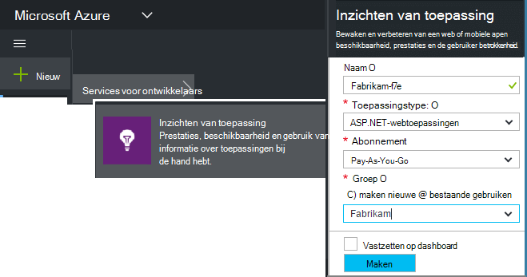
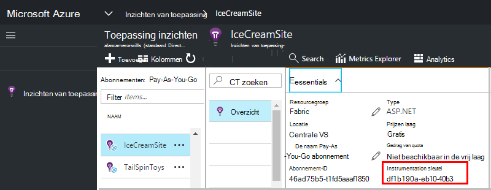

<properties 
    pageTitle="Een nieuwe toepassing inzichten bron maken | Microsoft Azure" 
    description="Inzichten van de toepassing controle voor een nieuwe toepassing live instellen. Web gebaseerde aanpak." 
    services="application-insights" 
    documentationCenter=""
    authors="alancameronwills" 
    manager="douge"/>

<tags 
    ms.service="application-insights" 
    ms.workload="tbd" 
    ms.tgt_pltfrm="ibiza" 
    ms.devlang="na" 
    ms.topic="article" 
    ms.date="08/26/2016" 
    ms.author="awills"/>

# Maak een bron toepassing inzichten

Inzichten van Visual Studio-toepassing worden gegevens over de toepassing in een Microsoft Azure *resource*weergegeven. Een nieuwe resource maken daarom deel uitmaakt van [instellen van toepassing inzichten te houden op de toepassing van een nieuwe][start]. In veel gevallen kan dit automatisch gedaan door de IDE, en dat is het beste waar het beschikbaar is. Maar in sommige gevallen kan u een bron handmatig maken.

Nadat u de bron hebt gemaakt, kunt u de sleutel instrumentation ophalen en die gebruiken voor het configureren van de SDK in de toepassing. Dit wordt de telemetrie verzonden aan de resource.

## Aanmelden voor Microsoft Azure

Als u een [Microsoft-account, Haal er nu](http://live.com)nog niet hebt gekregen. (Als u services, zoals Outlook.com, OneDrive, Windows Phone of XBox Live gebruikt, u hebt al een Microsoft-account.)

U moet ook een abonnement op [Microsoft Azure](http://azure.com). Als uw team of organisatie een Azure-abonnement heeft, de eigenaar, kunt u aan toevoegen, met uw Windows Live ID.

Of u kunt een nieuw abonnement maken. De gratis account kunt u proberen alles in Azure. Nadat de evaluatieperiode is verstreken, vindt u mogelijk het pay-as-you-go abonnement nodig, als u geen bedrag gratis services afgeschreven. 

Wanneer u hebt toegang tot een abonnement, het aanmelden bij de inzichten van toepassing op [http://portal.azure.com](https://portal.azure.com), en gebruik uw Live ID om in te loggen.

## Maak een bron toepassing inzichten
  

Toevoegen in de [portal.azure.com](https://portal.azure.com), een bron van de inzichten van toepassing:

* **Type toepassing** is van invloed op wat u ziet op het blad Overzicht en de eigenschappen die beschikbaar zijn in [metrische explorer][metrics]. Als u uw type app niet ziet, kiest u ASP.NET.
* **Resourcegroep** is nuttig voor het beheren van eigenschappen zoals toegangsbeheer. Als u nog andere Azure bronnen hebt gemaakt, kunt u deze nieuwe bron in dezelfde groep plaatsen.
* **Abonnement** is de rekening voor betalingen in Azure.
* **De locatie** is waar we uw gegevens bewaren. Op dit moment worden niet gewijzigd.
* **Toevoegen aan startboard** wordt een tegel voor snelle toegang voor de resource op de startpagina van Azure. Aanbevolen.

Wanneer uw toepassing is gemaakt, wordt een nieuwe blade geopend. Dit is waar ziet u prestaties en gebruiksgegevens over uw app. 

Om terug naar het zodra u login Azure, Kijk voor uw app van quick start naast elkaar op het bord start (beginscherm). Of klik op Bladeren om te zoeken.

## Kopieer de sleutel instrumentation

De sleutel instrumentation identificeert de resource die u hebt gemaakt. U hebt nodig om toegang te geven tot de SDK.

## De SDK installeren in uw app

De toepassing inzichten SDK in uw app installeren. Deze stap is sterk afhankelijk van het type van uw toepassing. 

De instrumentatie-toets gebruiken voor het configureren van [de SDK die u in uw toepassing installeren][start].

De SDK bevat standaard modules die telemetrie zonder dat u de code hoeft verzenden te schrijven. Gebruikersacties of vaststellen van problemen in meer detail, [gebruikmaken van de API] [ api] voor het verzenden van uw eigen telemetrie.

## Telemetriegegevens bekijken

Sluit het blad snel starten om terug te keren naar uw toepassing blade in Azure portal.

Klik op de tegel zoeken om te zien van [Diagnostische zoeken][diagnostic], waar de eerste gebeurtenissen worden weergegeven. 

Als u meer gegevens verwacht, klikt u op vernieuwen na een paar seconden.

## Het automatisch maken van een resource

U kunt schrijven een [PowerShell script](app-insights-powershell-script-create-resource.md) voor het automatisch maken van een resource.

## Volgende stappen

* [Een dashboard maken](app-insights-dashboards.md)
* [Diagnostische zoeken](app-insights-diagnostic-search.md)
* [Bekijk de metrics](app-insights-metrics-explorer.md)
* [Analytics query's schrijven](app-insights-analytics.md)

<!--Link references-->

[api]: app-insights-api-custom-events-metrics.md
[diagnostic]: app-insights-diagnostic-search.md
[metrics]: app-insights-metrics-explorer.md
[start]: app-insights-overview.md

 