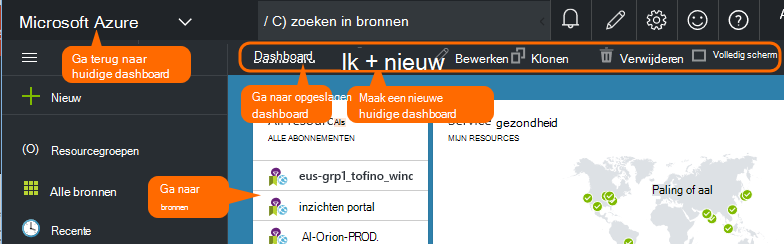
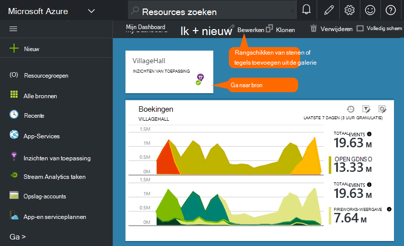

<properties
    pageTitle="Dashboards en navigatie in de portal Application Insights | Microsoft Azure"
    description="Weergaven maken van uw belangrijke APM-grafieken en -query's."
    services="application-insights"
    documentationCenter=""
    authors="alancameronwills"
    manager="douge"/>

<tags
    ms.service="application-insights"
    ms.workload="tbd"
    ms.tgt_pltfrm="ibiza"
    ms.devlang="multiple"
    ms.topic="article" 
    ms.date="10/18/2016"
    ms.author="awills"/>

# Navigatie en Dashboards in de portal Application inzichten

Nadat u [ingesteld inzichten van toepassing op het project hebt](app-insights-overview.md), verschijnt telemetriegegevens over de prestaties en het gebruik van uw app in toepassing inzichten-bron in de [Azure portal](https://portal.azure.com)van uw project.

## Zoek uw telemetrie

Aanmelden bij de [Azure portal](https://portal.azure.com) en navigeer naar de toepassing inzichten resource die u hebt gemaakt voor uw toepassing.

Het overzicht blade (pagina) voor uw app bevat een overzicht van de belangrijkste diagnostische prestatiemetingen van uw app en is een gateway naar de andere functies van de portal.

U kunt een van de overige grafieken en ze vastmaken aan een dashboard. Op die manier u kunt samenbrengen de belangrijkste grafieken van verschillende apps.

## Dashboards

Het eerste wat dat u ziet wanneer u bent aangemeld op de [portal van Microsoft Azure](https://portal.azure.com) is een dashboard. Hier kunt u overbrengen samen de diagrammen die uiterst belangrijk voor alle uw Azure bronnen zijn, met inbegrip van de telemetrie van [Visual Studio-toepassing inzichten](app-insights-overview.md).
 

1. **Navigeren naar specifieke bronnen** zoals uw app in inzichten van toepassing: de linker balk gebruiken.
2. **Terug naar het huidige dashboard**of overschakelen naar andere weergaven van de recente: Gebruik de vervolgkeuzelijst boven links.
3. **Switch dashboards**: Gebruik de vervolgkeuzelijst op de titel van het dashboard
4. **Maken, bewerken en delen dashboards** op de werkbalk van het dashboard.
5. **Bewerken van het dashboard**: een steen aanwijst en vervolgens met de bovenste balk verplaatsen, aanpassen of verwijderen.

## Aan een dashboard toevoegen

Als u op zoek bent op een blade of grafieken die vooral interessant is, kunt u een kopie ervan aan het dashboard kunt vastmaken. U ziet het volgende keer dat u terugkeert.

1. PIN-grafiek op het dashboard. Een kopie van de grafiek wordt weergegeven in het dashboard.
2. Het hele blad aan het dashboard-pins - wordt deze weergegeven op het dashboard als een tegel die kunt u via.
3. Klik op de linkerbovenhoek om terug te keren naar de huidige dashboard. Vervolgens kunt u het menu terug te keren naar de huidige weergave.

Merk op dat de grafieken zijn gegroepeerd in tegels: een steen kan meer dan één grafiek bevatten. U vastmaken de hele tegel aan het dashboard.

### Een query in Analytics vastmaken

U kunt ook [pin Analytics](app-insights-analytics-using.md#pin-to-dashboard) grafieken aan een [gedeelde](#share-dashboards-with-your-team) dashboard. Hiermee kunt u diagrammen van elke willekeurige query naast het standaard maatstelsel toevoegen. (Er is een toeslag voor deze functie.)

## Een steen op het dashboard aanpassen

Zodra een tegel op het dashboard is, kunt u deze wijzigen.

1. Een grafiek toevoegen aan de tegel. 
2. Metric, groeperen op dimensie en stijl (tabel, grafiek) van een grafiek instellen.
3. Sleep in het diagram om in te zoomen; Klik op de knop ongedaan maken om het opnieuw instellen van het interval; filtereigenschappen instellen voor de grafieken op de tegel.
4. Tegel titel instellen.

Tegels van metrische explorer blades vastgemaakt hebben meer bewerkingsopties dan tegels uit een overzicht van blade vastgemaakt.

De oorspronkelijke tegel die u vastgemaakt wordt niet beïnvloed door uw bewerkingen.

## Schakelen tussen dashboards

U kunt meer dan één dashboard opslaan en schakelen tussen hen. Wanneer u een grafiek of blade vastmaken, zijn ze toegevoegd aan het huidige dashboard.

Bijvoorbeeld, wellicht een dashboard voor het volledige scherm wordt weergegeven in de Teamkamer en een andere voor de algemene ontwikkeling.

Op het dashboard, een blade wordt weergegeven als een tegel: klik erop om naar het blad. Een grafiek wordt gerepliceerd van de grafiek op de oorspronkelijke locatie.

## Delen van dashboards

Wanneer u een dashboard hebt gemaakt, kunt u deze delen met andere gebruikers.

Informatie over [rollen en toegangsbeheer](app-insights-resources-roles-access-control.md).

## Navigatie App

Het overzicht blade is de gateway voor meer informatie over uw app.

* **Een grafiek of tegel** - en klik op een tegel of grafiek om meer details over wat wordt weergegeven.

### Overzicht blade-knoppen

* [**Metrics Explorer**](app-insights-metrics-explorer.md) - grafieken van prestaties en gebruik te maken.
* [**Zoeken**](app-insights-diagnostic-search.md) - specifieke exemplaren van gebeurtenissen zoals aanvragen, uitzonderingen, onderzoeken of meld u sporen.
* [**Analytics**](app-insights-analytics.md) - krachtige query's via uw telemetrie.
* **Bereik** - het bereik weergegeven van alle grafieken in het blad aanpassen.
* **Verwijderen** - de bron van de inzichten van toepassing voor deze toepassing verwijderen. U moet ook de toepassing inzichten pakketten verwijderen uit uw code app, of de [sleutel instrumentation](app-insights-create-new-resource.md#copy-the-instrumentation-key) in uw app telemetrie aan een andere resource van toepassing inzichten te bewerken.

### Tabblad Essentials

* [Sleutel instrumentation](app-insights-create-new-resource.md#copy-the-instrumentation-key) - geeft de bron van dit app. 
* Prijzen - functies caps volume is ingesteld en beschikbaar maken.

### Navigatiebalk-App

* **Overzicht** - terug naar de blade app-overzicht.
* **Logboek voor faxactiviteit** - Azure administratieve gebeurtenissen en waarschuwingen.
* [**Toegangsbeheer**](app-insights-resources-roles-access-control.md) - toegang bieden tot en teamleden.
* [**Tags**](../resource-group-using-tags.md) - codes gebruiken om uw app met anderen.

ONDERZOEKEN

* [**Kaart toepassing**](app-insights-app-map.md) - actieve map met de onderdelen van uw toepassing, afgeleid van de afhankelijkheidsinformatie.
* [**Proactieve diagnostics**](app-insights-proactive-diagnostics.md) - revisie recente prestaties meldingen.
* [**Live Stream**](app-insights-metrics-explorer.md#live-stream) - een vaste reeks handomdraai metrics, handig bij het implementeren van een nieuwe build of foutopsporing.
* [**Beschikbaarheid / Web tests**](app-insights-monitor-web-app-availability.md) -regelmatige aanvragen verzenden naar uw web app van rond de world.* 
* [**Storingen, prestaties**](app-insights-web-monitor-performance.md) - uitzonderingen, defecten vertoont en responstijden voor aanvragen voor uw app en voor het aanvragen van uw app om [afhankelijkheden](app-insights-asp-net-dependencies.md).
* [**Prestaties**](app-insights-web-monitor-performance.md) - responstijd, responstijden afhankelijkheid. 
* [Servers](app-insights-web-monitor-performance.md) - prestatiemeteritems. Beschikbaar als u [Status Monitor niet installeren](app-insights-monitor-performance-live-website-now.md).

* **Browser** - weergave voor pagina- en AJAX-prestaties. Beschikbaar als u [uw webpagina's instrument](app-insights-javascript.md).
* **Gebruik** - pagina weergeven, gebruiker en sessie geteld. Beschikbaar als u [uw webpagina's instrument](app-insights-javascript.md).

CONFIGUREREN

* **Aan de slag** - line zelfstudie.
* **Eigenschappen** - sleutel instrumentation, abonnement en resource-id.
* [Waarschuwingen](app-insights-alerts.md) - metrische alert configuratie.
* [Doorlopend exporteren](app-insights-export-telemetry.md) - export van telemetrie naar Azure opslag configureren.
* [Prestaties testen](app-insights-monitor-web-app-availability.md#performance-tests) - instellen van een synthetische belasting op uw website.
* [Quota en prijzen](app-insights-pricing.md) en [bemonstering van de opname](app-insights-sampling.md).
* **Toegang tot API** - [release-aantekeningen](app-insights-annotations.md) maken en voor de Data Access-API.
* [**Items werken**](app-insights-diagnostic-search.md#create-work-item) - verbinding maken met een systeem bijhouden, zodat u fouten maken kunt tijdens het controleren van de telemetrie werk.

Instellingen

* [**Vergrendeld**](..\resource-group-lock-resources.md) - Azure bronnen vergrendelen
* [**Automatiseringsscript**](app-insights-powershell.md) - een definitie van de resource Azure exporteren kunt u deze als sjabloon voor het maken van nieuwe resources.

ONDERSTEUNING

* **Ondersteuningsverzoek** - is een betaalde licentie vereist. Zie ook [Help-informatie opvragen](app-insights-get-dev-support.md).

## Hoe nu verder?

||
|---|---
|[Explorer metrics](app-insights-metrics-explorer.md) Filter en segment|
|[Diagnostische zoeken](app-insights-diagnostic-search.md) Zoeken en controleren van gebeurtenissen, verwante gebeurtenissen en fouten maken |
|[Analytics](app-insights-analytics.md) Krachtige querytaal| 

