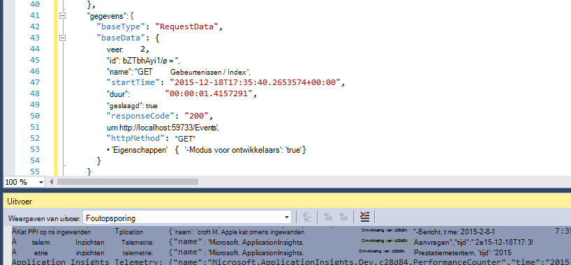
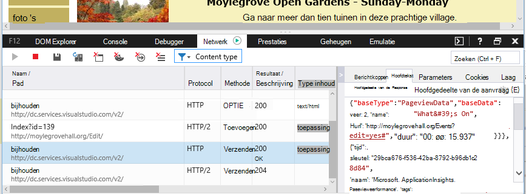

<properties 
    pageTitle="Gegevens en opslag in de inzichten van toepassing" 
    description="Beleidsverklaring vasthouden en privacy" 
    services="application-insights" 
    documentationCenter=""
    authors="alancameronwills" 
    manager="douge"/>

<tags 
    ms.service="application-insights" 
    ms.workload="tbd" 
    ms.tgt_pltfrm="ibiza" 
    ms.devlang="na" 
    ms.topic="article" 
    ms.date="05/17/2016" 
    ms.author="awills"/>

# Het verzamelen van gegevens, en opslag in de inzichten van toepassing 

*Inzichten van toepassing is in het afdrukvoorbeeld.*

Bij het installeren van [Visual Studio-toepassing inzichten] [ start] SDK in uw app, stuurt het verzamelen over uw app naar de Cloud. Verantwoordelijke ontwikkelaars wilt natuurlijk weten precies welke gegevens worden verzonden, wat gebeurt er met de gegevens en hoe ze nu de controle kunnen houden. In het bijzonder, kan gevoelige gegevens worden verzonden, waar wordt opgeslagen en hoe veilig is het? 

Eerste, het korte antwoord:

* De standaard telemetrie modules die worden uitgevoerd "out of the box" zijn waarschijnlijk geen gevoelige gegevens naar de service verzenden. De telemetrie heeft betrekking op belasting, prestatie- en gebruiksrapporten metrics uitzondering rapporten en andere diagnostische gegevens. De voornaamste gegevens zichtbaar zijn in de diagnostische rapporten zijn URL's; maar de app moet niet in ieder geval plaats vertrouwelijke gegevens in tekst zonder opmaak in een URL.
* U kunt code schrijven die aanvullende aangepaste telemetrie om u te helpen bij de diagnose en het gebruik van controle worden verzonden. (Deze uitbreidbaarheid is een geweldige functie van de inzichten van toepassing). Het is mogelijk, per ongeluk, dit om code te schrijven zodat het persoonlijke en andere vertrouwelijke gegevens bevat. Als uw toepassing met dergelijke gegevens werkt, moet u sterke revisie processen toepassen op de code die u schrijft.
* Tijdens het ontwikkelen en testen van uw app, is het gemakkelijk om te controleren wat door de SDK wordt verzonden. De gegevens worden weergegeven in het venster Foutopsporing output van de IDE- en browser. 
* De gegevens worden bewaard in [Microsoft Azure](http://azure.com) -servers in de Verenigde Staten. (Maar uw app overal kunt uitvoeren.) Azure is een [krachtige beveiliging voldoet aan een breed scala van naleving van normen en verwerkt](https://azure.microsoft.com/support/trust-center/). Alleen u en uw team aangewezen hebt toegang tot uw gegevens. Medewerkers van Microsoft kunt toegangsbeperkingen voor deze alleen onder bepaalde, beperkte omstandigheden met uw kennis. Het gecodeerd tijdens de overdracht, maar niet in de servers.

De rest van dit artikel meer volledig wordt ingegaan op wordt deze antwoorden. Het is ontworpen als op zichzelf staand, zodat u deze kunt weergeven naar collega's die geen deel uitmaken van uw directe team.

## Wat is de inzichten van toepassing?

[Visual Studio-toepassing inzichten] [ start] is een service van Microsoft die u bij het helpt verbeteren van de prestaties en het gebruiksgemak van de actieve toepassing. Controleert de toepassing altijd uitgevoerd, zowel tijdens de test en nadat u deze hebt gepubliceerd of gedistribueerd. Inzichten van toepassing wordt gemaakt van grafieken en tabellen waarin u, bijvoorbeeld, welke tijden van dag dat u de meeste gebruikers, hoe reageert de toepassing is en hoe goed wordt bediend door een externe services die afhankelijk zijn van. Als er crashes, fouten of problemen met de prestaties, kunt u zoeken via de telemetriegegevens in detail voor het vaststellen van de oorzaak. En de service stuurt u e-mails als er wijzigingen in de beschikbaarheid en prestaties van uw app.

Om deze functionaliteit kunt u een toepassing inzichten SDK installeren in uw toepassing, deel uit van de code maakt. Wanneer uw toepassing wordt uitgevoerd, worden de SDK controleert de werking en telemetrie verzendt naar de service Application inzichten. Dit is een cloud-service gehost door [Microsoft Azure](http://azure.com). (Maar inzichten toepassing werkt voor alle toepassingen, niet alleen met toepassingen die worden gehost in Azure).

De service Application inzichten worden opgeslagen en analyseert de telemetrie. Overzicht van de analyse of het zoeken via de opgeslagen telemetrie aanmelden bij uw account Azure en opent u de resource inzichten van toepassing voor uw toepassing. U kunt ook toegang tot de gegevens delen met andere leden van uw team of met opgegeven Azure abonnees.

U kunt gegevens uit de service Application inzichten geëxporteerd, bijvoorbeeld naar een database of externe hulpprogramma's hebben. U geeft een speciale sleutel die u via de service aanschaft elk hulpprogramma. De sleutel kan worden ingetrokken indien nodig. 

Toepassing inzichten SDK's beschikbaar zijn voor een aantal toepassingstypen: web-services die worden gehost in uw eigen servers J2EE of ASP.NET of in Azure; het web clients - dat wil zeggen, de code die wordt uitgevoerd in een webpagina. Desktop apps en diensten; apparaat apps zoals Windows Phone, iOS en Android. Alle verzenden telemetrie naar dezelfde service.

## Welke gegevens worden er verzameld?

### Hoe zijn de gegevens worden verzameld?

Er zijn drie gegevensbronnen:

* De SDK die u met uw app [in ontwikkeling](app-insights-asp-net.md) of [tijdens runtime](app-insights-monitor-performance-live-website-now.md). Er zijn verschillende SDK's voor verschillende toepassingstypen. Er is ook een [SDK voor webpagina's](app-insights-javascript.md), die in de browser van de eindgebruiker en de pagina wordt geladen.

 * De SDK bevat een aantal [modules](app-insights-configuration-with-applicationinsights-config.md), die het gebruik van verschillende technieken voor het verzamelen van verschillende soorten telemetrie.
 * Als u de SDK hebt geïnstalleerd in ontwikkeling, kunt u de API voor het verzenden van uw eigen telemetrie, naast de standaardmodules. Deze aangepaste telemetrie kunt opnemen van alle gegevens die u wilt verzenden.
* In sommige webservers zijn er ook agenten die naast de app en telemetrie over CPU, geheugen en netwerk exploitatievorm verzenden. Azure VMs, Docker hosts en [J2EE servers](app-insights-java-agent.md) kunnen bijvoorbeeld dergelijke agentia.
* [Beschikbaarheid van tests](app-insights-monitor-web-app-availability.md) zijn uitgevoerd door Microsoft processen die aanvragen verzenden naar uw web app met regelmatige tussenpozen. De resultaten worden verzonden naar de service Application inzichten.

### Welke typen gegevens worden verzameld?

De belangrijkste categorieën zijn:

* [Web server telemetrie](app-insights-asp-net.md) - HTTP-aanvragen.  URI, de tijd die nodig is voor het verwerken van de aanvraag, antwoordcode, IP-adres van de client. Sessie-id.
* [Webpagina's](app-insights-javascript.md) - pagina, de gebruiker en de sessie wordt geteld. Pagina laden tijden. Uitzonderingen. AJAX oproepen.
* Prestaties tellers - geheugen, CPU, IO, netwerk bezetting.
* Client- en context - OS, locatie, apparaattype, browser, schermresolutie.
* [Uitzonderingen](app-insights-asp-net-exceptions.md) en crashes - **stack dumpen**, bouw-id, CPU-type. 
* [Afhankelijkheden](app-insights-asp-net-dependencies.md) - gesprekken met externe services zoals REST, SQL, AJAX. URI of verbindingstekenreeks, duur, succes, opdracht.
* [Beschikbaarheid van tests](app-insights-monitor-web-app-availability.md) - duur van de test en stappen, antwoorden.
* [Traceerlogboeken](app-insights-search-diagnostic-logs.md) en [aangepaste telemetrie](app-insights-api-custom-events-metrics.md) - **Alles wat u in de logboeken of de telemetrie code**.

[Meer details](#data-sent-by-application-insights).

## Hoe kan ik nagaan wat wordt verzameld?

Als u het gebruik van Visual Studio, de toepassing uitvoeren in de foutopsporingsmodus (F5) app ontwikkelt. De telemetrie wordt weergegeven in het venster uitvoer. Van daaruit kunt u kopiëren en opmaken als JSON voor eenvoudige inspectie. 

Er is ook een beter leesbare weergave in het venster Diagnostiek.

Voor webpagina's, opent uw browservenster foutopsporing.

### Kan ik code schrijven voor de telemetrie filteren voordat deze wordt verzonden?

Dit zou mogelijk door het schrijven van een [invoegtoepassing voor telemetrie-processor](app-insights-api-filtering-sampling.md).

## Hoe lang is de gegevens bewaard? 

Onbewerkte gegevenspunten (dat wil zeggen, artikelen die in diagnostische zoeken kunt u controleren) worden 7 dagen bewaard. Als u langer dan de gegevens op te slaan, kunt u [doorlopend exporteren](app-insights-export-telemetry.md) om deze te kopiëren naar een opslag.

Geaggregeerde gegevens (dat wil zeggen, aantallen, gemiddelden en andere statistische gegevens dat wordt weergegeven in Verkenner Metric) worden op een korrel van 1 minuut voor 30 dagen, en 1 uur of 1 dag (afhankelijk van type) gedurende ten minste 90 dagen bewaard.

## Wie toegang heeft tot de gegevens?

De gegevens zijn zichtbaar voor u en als u een account van de organisatie, de teamleden van uw. 

Deze kan door u en uw teamleden worden geëxporteerd en kan worden gekopieerd naar andere locaties en doorgegeven aan andere mensen.

#### Wat doet Microsoft met de informatie die mijn app naar de inzichten van toepassing verzendt?

Microsoft gebruikt de gegevens alleen om de service aan u.

## Waar is de gegevens opgeslagen? 

* In de Verenigde Staten. 

#### Kan het ergens anders worden opgeslagen, bijvoorbeeld in Europa? 

* Niet op dit moment. 

#### Betekent dit dat mijn app heeft om te worden gehost in de VS?

* Nr. Uw toepassing kan overal uitgevoerd in op ruimten hosts of in de Cloud.

## Hoe veilig zijn mijn gegevens?  

Inzichten van toepassing is een Service Azure in voorvertoning. Terwijl in voorvertoning Wij werken tot de bescherming van uw gegevens op het beleid dat wordt beschreven in het [witboek Azure beveiliging, Privacy en naleving](http://go.microsoft.com/fwlink/?linkid=392408).

De gegevens worden opgeslagen in Microsoft Azure-servers. Voor accounts in de Portal Azure worden beperkingen beschreven in het [document Azure beveiliging, Privacy en naleving](http://go.microsoft.com/fwlink/?linkid=392408). Accounts in de Visual Studio Team Services Portal, het document van [Visual Studio Team Services bescherming van gegevens](http://download.microsoft.com/download/8/E/E/8EE6A61C-44C2-4F81-B870-A267F1DF978C/MicrosoftVisualStudioOnlineDataProtection.pdf) van toepassing is. 

Toegang tot uw gegevens door Microsoft-personeel is beperkt. Wij toegang tot uw gegevens alleen met uw toestemming en als het nodig is ter ondersteuning van het gebruik van de inzichten van toepassing is. 

Gegevens in een statistische functie voor al onze klanten toepassingen (zoals gegevenssnelheden en gemiddelde grootte van sporen) wordt gebruikt om de toepassing inzichten te verbeteren.

#### Kan de telemetrie van iemand anders verstoren mijn gegevens inzichten van toepassing?

Zij kunnen extra telemetrie verzenden naar uw account met behulp van de instrumentatie-toets u in de code van uw webpagina's vinden kunt. Met voldoende extra gegevens zou uw bevindingen niet exact overeen met de prestaties en het gebruik van uw app.

Als u code met andere projecten deelt, moet u uw sleutel instrumentation verwijderen.

## De gegevens gecodeerd? 

Niet binnen de servers op dit moment.

Alle gegevens worden gecodeerd als het wordt verplaatst tussen datacenters.

#### De gegevens gecodeerd tijdens de overdracht van mijn toepassing inzichten Application servers?

Ja, we https gebruiken om gegevens te verzenden naar de portal van bijna alle SDK's, met inbegrip van webservers, apparaten en HTTPS-webpagina's. De enige uitzondering is de gegevens die worden verzonden vanaf gewoon HTTP-webpagina's. 

## Persoonlijke informatie

#### Kan persoonlijk identificeerbare informatie (PII) worden verzonden naar de inzichten van toepassing? 

Ja, het is mogelijk. 

Als algemene richtlijnen:

* Meeste standaard telemetrie (dat wil zeggen, telemetrie verzonden zonder dat u code schrijven) bevat geen expliciete PII. Echter, het is mogelijk voor het identificeren van personen door interferentie uit een verzameling van gebeurtenissen.
* Uitzondering en trace berichten kunnen persoonlijke gegevens bevatten
* Aangepaste telemetrie - aanroepen zoals TrackEvent die u schrijft in code met behulp van de API of logboek traces - kunt u gegevens bevatten.

De tabel aan het einde van dit document bevat gedetailleerde beschrijvingen van de verzamelde gegevens.

#### Kan ik belast met de wettelijke en bestuursrechtelijke bepalingen met betrekking tot persoonlijke gegevens?

Ja. Het is uw verantwoordelijkheid om ervoor te zorgen dat het verzamelen en gebruiken van de gegevens in overeenstemming met de wettelijke en bestuursrechtelijke bepalingen en de voorwaarden van Microsoft Online Services.

U moet uw klanten op de juiste wijze informeren over de gegevens die uw toepassing worden verzameld en hoe de gegevens worden gebruikt.

#### Kunnen mijn gebruikers uitschakelen inzichten van toepassing?

Niet rechtstreeks. Wij niet een switch die uw gebruikers uitschakelen inzichten van toepassing kunnen worden uitgevoerd.

U kunt echter een dergelijke functie implementeren in uw toepassing. De SDK's bevatten een API-instelling waarmee uitgeschakeld telemetrie-collectie wordt. 

#### Mijn toepassing verzamelen onbedoeld vertrouwelijke informatie. Kan toepassing inzichten deze gegevens boenen zodat deze wordt niet behouden.

Toepassing inzichten niet filteren of verwijderen van uw gegevens. De gegevens op de juiste manier te beheren en u te voorkomen dat dergelijke gegevens worden verzonden naar de inzichten van toepassing.

## Gegevens die worden verzonden door de inzichten van toepassing

De SDK's variëren tussen platforms, en er zijn verschillende onderdelen die u kunt installeren. (Zie [toepassing inzichten - aan de slag][start].) Elk onderdeel worden verschillende gegevens verzonden.

#### Categorieën van gegevens die worden verzonden in verschillende scenario 's

Uw actie  | Gegevensklassen verzameld (Zie volgende tabel)
---|---
[Toepassing inzichten SDK aan een .NET webproject toevoegen][greenbrown] | ServerContext Toeval Prestatiemeteritems Aanvragen **Uitzonderingen** Sessie gebruikers
[Statuscontrole op IIS installeren][redfield]|Afhankelijkheden ServerContext Toeval Prestatiemeteritems
[Toepassing inzichten SDK toevoegen aan een Java web app.][java]|ServerContext Toeval Aanvraag Sessie gebruikers
[SDK JavaScript aan een webpagina toevoegen][client]|ClientContext  Toeval Pagina ClientPerf AJAX
[Standaardeigenschappen definiëren][apiproperties]|**Eigenschappen** van alle standaard- en aangepaste gebeurtenissen
[Oproep TrackMetric][api]|Numerieke waarden **Eigenschappen**
[Oproep Track *][api]|Naam van evenement **Eigenschappen**
[Oproep TrackException][api]|**Uitzonderingen** Stackdump **Eigenschappen**
SDK kan geen gegevens verzamelen. Bijvoorbeeld:   -geen toegang tot prestatiemeteritems  -uitzondering in de telemetrie initialiseren | Diagnostische gegevens van SDK
 

Voor de [SDK's voor andere platforms][platforms], hun documenten te zien.

#### De klassen van verzamelde gegevens

Klasse verzamelde gegevens | Bevat (geen uitputtende lijst) 
---|---
**Eigenschappen**|**Gegevens - bepaald door uw code**
DeviceContext |ID, IP, landinstelling, model met, netwerk, netwerk-id, OEM-naam, schermresolutie rol exemplaar, naam, Type apparaat
ClientContext |OS, land, taal, netwerk, venster resolutie
Sessie | sessie-id
ServerContext |Naam van de computer, landinstelling, OS, apparaat, gebruikerssessie, gebruikerscontext, bewerking 
Toeval |geografische locatie van IP-adres, tijdstempel, OS, browser
Statistieken | Metrische naam en waarde
Gebeurtenissen | Gebeurtenisnaam en de waarde
PageViews | Naam en URL van de pagina of scherm
Client prest | Naam van de URL/pagina, browser laadtijd
AJAX | HTTP-aanroepen van webpagina's naar server
Aanvragen |URL-, duur-, antwoordcode
Afhankelijkheden|Type (SQL, HTTP,...), de verbindingsreeks of URI, sync/async, duur, succes, SQL-instructie (met statuscontrole)
**Uitzonderingen** | Type, **bericht**, stacks met opgeroepen procedures, bestands- en bronnummer, thread-id
Loopt vast | Proces-id, het bovenliggende proces-id, crash thread-id; patch installeren, id, build;  uitzonderingstype, adres, reden; betekenisloze symbolen en registers, binaire adressen voor begin- en einddatum, binaire naam en pad, cpu-type
Traceren | **Bericht** -en ernst
Prestatiemeteritems | Processortijd, geheugen, verzoek tarief, uitzondering tarief, proces eigen bytes, i/o-snelheid, duur van de aanvraag, aanvraag wachtrijlengte
Beschikbaarheid | Antwoordcode van web-test, duur van elke stap test, test-naam, tijdstempel, succes, responstijd, testlocatie
Diagnostische gegevens van SDK | Trace-bericht of uitzondering 

U kunt [bepaalde gegevens door bewerkingen ApplicationInsights.config uitschakelen][config]

## Credits

Dit product bevat GeoLite2 gegevens gemaakt door MaxMind, verkrijgbaar op [http://www.maxmind.com](http://www.maxmind.com).

## Video 's

#### Inleiding

> [AZURE.VIDEO application-insights-introduction]

#### Aan de slag

> [AZURE.VIDEO getting-started-with-application-insights]

<!--Link references-->

[api]: app-insights-api-custom-events-metrics.md
[apiproperties]: app-insights-api-custom-events-metrics.md#properties
[client]: app-insights-javascript.md
[config]: app-insights-configuration-with-applicationinsights-config.md
[greenbrown]: app-insights-asp-net.md
[java]: app-insights-java-get-started.md
[platforms]: app-insights-platforms.md
[pricing]: http://azure.microsoft.com/pricing/details/application-insights/
[redfield]: app-insights-monitor-performance-live-website-now.md
[start]: app-insights-overview.md

 