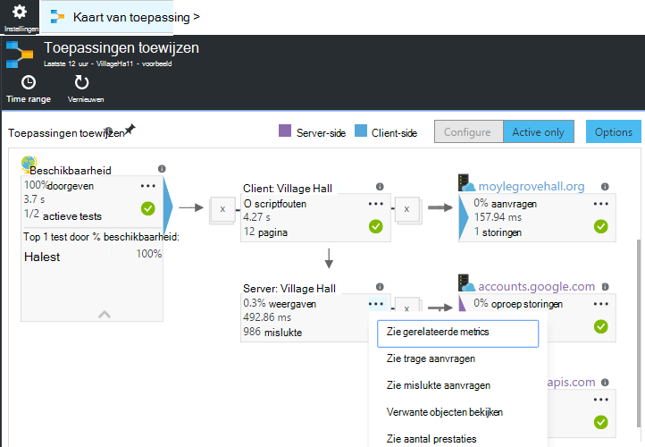
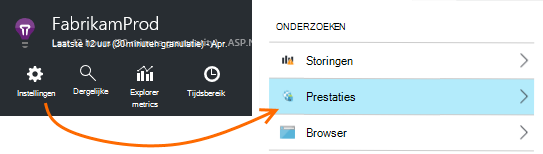
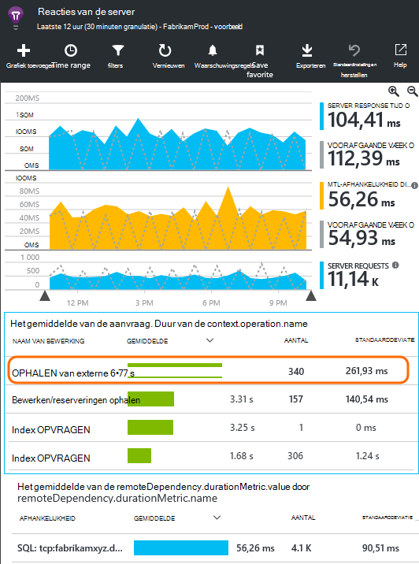
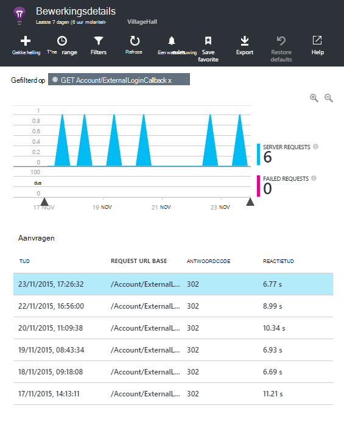
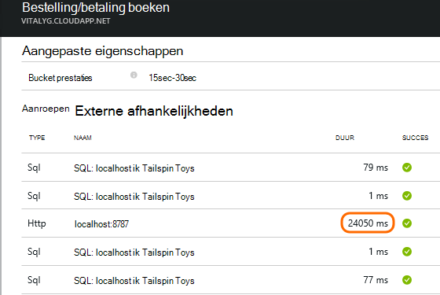
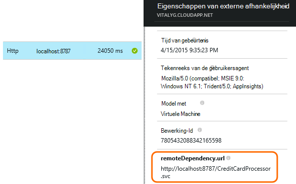
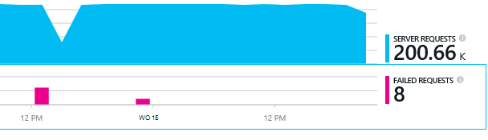
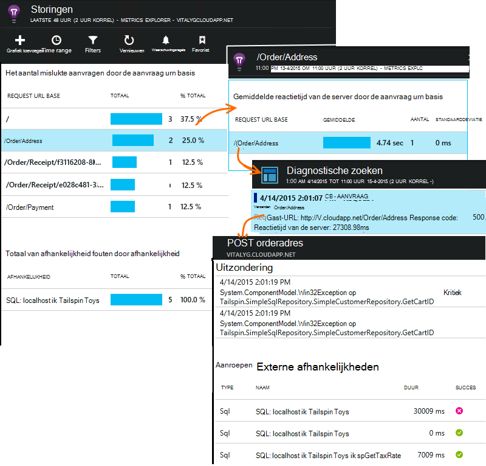

<properties 
    pageTitle="Diagnose van problemen met afhankelijkheden in inzichten van toepassing" 
    description="Zoeken naar fouten en vertragingen veroorzaakt door afhankelijkheden" 
    services="application-insights" 
    documentationCenter=""
    authors="alancameronwills" 
    manager="douge"/>

<tags 
    ms.service="application-insights" 
    ms.workload="tbd" 
    ms.tgt_pltfrm="ibiza" 
    ms.devlang="na" 
    ms.topic="article" 
    ms.date="05/12/2016" 
    ms.author="awills"/>
 
# <a name="diagnosing-issues-with-dependencies-in-application-insights"></a>Diagnose van problemen met afhankelijkheden in inzichten van toepassing


Een *afhankelijkheid* is een extern onderdeel dat wordt aangeroepen door de app. Het is meestal een service aangeroepen met behulp van HTTP, of een database of een bestandssysteem. Of in uw script webpagina kan een AJAX-oproep naar de server. In Visual Studio-toepassing inzichten, kunt u eenvoudig zien hoe lang de toepassing afhankelijkheden wacht en hoe vaak een afhankelijkheid oproep mislukt.

## <a name="where-you-can-use-it"></a>Waar kunt u

Uit de doos is controleren van afhankelijkheid momenteel beschikbaar voor:

* ASP.NET-webtoepassingen en -services die worden uitgevoerd op een IIS-server of Azure
* [Java web apps](app-insights-java-agent.md)
* [Webpagina 's](https://azure.microsoft.com/blog/ajax-collection-in-application-insights/)

U kunt uw eigen monitor met de [API TrackDependency](app-insights-api-custom-events-metrics.md#track-dependency)schrijven voor andere typen, zoals apparaat-apps.

De afhankelijkheid van de out-of-the-box-monitor meldt momenteel aanroepen van deze typen afhankelijkheden:

* ASP.NET
 * SQL-databases
 * ASP.NET-webtoepassingen en WCF-services die gebruikmaken van HTTP-gebaseerde bindingen
 * Lokale of externe aanroepen van HTTP
 * DocumentDb, tabel, blob-opslag en wachtrij Azure
* Java
 * Gesprekken met een database via een [JDBC](http://docs.oracle.com/javase/7/docs/technotes/guides/jdbc/) -stuurprogramma, zoals MySQL, SQL Server, PostgreSQL of SQLite.
* Webpagina 's
 * [AJAX oproepen](app-insights-javascript.md)

Nogmaals, u uw eigen SDK-aanroepen voor het controleren van andere afhankelijkheden kunt schrijven.

## <a name="to-set-up-dependency-monitoring"></a>Monitoring van afhankelijkheid instellen

De juiste agent voor de host-server installeren.

Platform | Installeren
---|---
IIS-Server | Ofwel [Status Monitor op uw server installeren](app-insights-monitor-performance-live-website-now.md) of [Upgrade van uw toepassing .NET framework 4.6 of hoger](http://go.microsoft.com/fwlink/?LinkId=528259) en installeer de [Toepassing inzichten SDK](app-insights-asp-net.md) in uw app.
Azure Web App | [Toepassingsextensie inzichten](app-insights-azure-web-apps.md)
Java webserver | [Java web apps](app-insights-java-agent.md)
Webpagina 's | [JavaScript-monitor](app-insights-javascript.md) (Geen extra instellingen buiten de controle van de webpagina)
Azure Cloud Service |  [Gebruik opstarten taak](app-insights-cloudservices.md#dependencies) of [Installeer .NET framework 4.6 +](../cloud-services/cloud-services-dotnet-install-dotnet.md)  

Niet moet de statuscontrole voor IIS-Servers u uw bronproject met de inzichten Application SDK opnieuw samen te stellen. 

## <a name="application-map"></a>Toepassingen toewijzen

Overzicht van de toepassing fungeert als een visueel hulpmiddel voor het ontdekken van afhankelijkheden tussen de onderdelen van uw toepassing. 



In de vakken, kunt u navigeren naar relevante afhankelijkheid en andere diagrammen.

Klik op de kleine [x] als u wilt een substructuur samenvouwen.

De toewijzing aan het [dashboard](app-insights-dashboards.md), volledig functioneel worden pincode.

[Meer informatie](app-insights-app-map.md).

## <a name="diagnosis"></a>Oplossen van prestatieproblemen afhankelijkheid in de webserver

Voor de beoordeling van de prestaties van de aanvragen op uw server:



Ga naar kijken of het raster van aanvragen:



De bovenste een duurt erg lang. We zien als we kunt uitzoeken waar de tijd is besteed.

Klik op die rij om individueel verzoek gebeurtenissen te bekijken:




Klik op een langdurige instantie om deze verder te controleren.

> [AZURE.NOTE] Schuif naar beneden een beetje een instantie kiezen. Latentie in de pijplijn kan betekenen dat de gegevens voor de bovenste exemplaren onvolledig is.

Blader naar de externe afhankelijkheid oproepen die verband houdt met deze aanvraag:



Het ziet eruit als de meeste van de tijd voor onderhoud die deze aanvraag is besteed in een aanroep naar een lokale service. 

Selecteer de rij voor meer informatie:




De details bevat voldoende informatie om een diagnose van het probleem.


## <a name="failures"></a>Storingen

Als u mislukte aanvragen, klik op de grafiek.



Klik op een aanvraagtype en een exemplaar van de aanvraag, een aanroep van een externe afhankelijkheid vinden.





## <a name="custom-dependency-tracking"></a>Aangepaste afhankelijkheid bijhouden

De standaardmodule afhankelijkheid bijhouden detecteert automatisch externe afhankelijkheden, zoals databases en REST API's. Maar u kunt sommige extra onderdelen op dezelfde manier worden behandeld. 

U kunt code schrijven die afhankelijkheidsinformatie verzendt met dezelfde [TrackDependency-API](app-insights-api-custom-events-metrics.md#track-dependency) die wordt gebruikt door de standaardmodules.

Als u uw code met een assembly die u niet zelf schrijven bouwen, kan u bijvoorbeeld alle oproepen, om erachter te komen wat de bijdrage hiervan in de reactietijden bij de tijd. Als u wilt dat deze gegevens worden weergegeven in de grafieken afhankelijkheid in toepassing inzichten, verzenden met behulp van `TrackDependency`.

```C#

            var success = false;
            var startTime = DateTime.UtcNow;
            var timer = System.Diagnostics.Stopwatch.StartNew();
            try
            {
                success = dependency.Call();
            }
            finally
            {
                timer.Stop();
                telemetry.TrackDependency("myDependency", "myCall", startTime, timer.Elapsed, success);
            }
```

Als u wilt dat de afhankelijkheid standaard tracking module uitschakelen, verwijdert u de verwijzing naar DependencyTrackingTelemetryModule in [ApplicationInsights.config](app-insights-configuration-with-applicationinsights-config.md).


## <a name="ajax"></a>AJAX

Zie [webpagina's](app-insights-javascript.md).


 