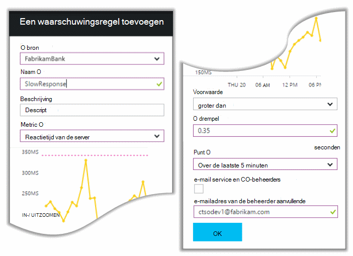

<properties
    pageTitle="Detecteren, uw beoordelen wanneer bent, Diagnose"
    description="Analyse van crashes en opsporen en onderzoeken van prestatieproblemen in uw toepassingen"
    authors="alancameronwills"
    services="application-insights"
    documentationCenter=""
    manager="douge"/>

<tags
    ms.service="application-insights"
    ms.workload="tbd"
    ms.tgt_pltfrm="ibiza"
    ms.devlang="na"
    ms.topic="article" 
    ms.date="11/06/2015"
    ms.author="awills"/>

# Opsporen, uw beoordelen wanneer bent en onderzoeken, met toepassingen inzichten

*Inzichten van toepassing is in het afdrukvoorbeeld.*

Toepassing inzichten kunt u nagaan hoe uw app presteert en wordt gebruikt wanneer het live is. En als er een probleem is, kunt u weten dat het helpt bij het beoordelen van het effect en helpt u de oorzaak bepalen.

Dit is een account van een team dat webtoepassingen ontwikkelt:

* *"Een paar dagen geleden, we hebben geïmplementeerd een"klein"hotfix. We een uitgebreide test pass niet hebt uitgevoerd, maar helaas een onverwachte wijziging in de nettolading, veroorzaakt door incompatibiliteit tussen de voor- en achterkant hebt samengevoegd. Uitzonderingen toenam, ons waarschuwing heeft geactiveerd onmiddellijk, en we zijn aangebracht op de hoogte van de situatie. Een paar muisklikken weg op de portal Application Insights wij voldoende informatie van de uitzondering callstacks om het probleem vast te stellen. We onmiddellijk hersteld en de schade beperkt. Toepassing inzichten heeft dit deel van de devops cyclus gedaan zeer eenvoudig en sneller."*

We gaan kijken hoe een typische web development team inzichten toepassing gebruikt om prestaties te controleren. Volgen we het team in Fabrikam Bank die het systeem on line bankieren (OBS) ontwikkelt.

Het team werkt op een cyclus als volgt:

Vereisten voor invoer in hun ontwikkeling reserve (lijst). Ze werken in korte sprints, die vaak werken software - meestal in de vorm van verbeteringen en uitbreidingen van bestaande toepassingen te bieden. De live app wordt regelmatig bijgewerkt met nieuwe functies. Het is live, het team houdt toezicht voor prestatie- en gebruiksrapporten met behulp van de inzichten van toepassing. Deze analyse-feeds in reserve voor hun ontwikkeling.

Het team gebruikt inzichten van toepassing om te controleren de live webtoepassing nauw voor:
* Prestaties. Ze willen begrijpen hoe responstijden verschillen naargelang het aantal aanvragen; hoeveel CPU, netwerk, schijf en andere bronnen worden gebruikt; en waar de knelpunten zich bevinden.
* Storingen. Als er uitzonderingen of mislukte aanvragen, of als een prestatiemeteritem buiten het bereik van comfortabele gaat, het team moet snel weten dat ze actie kunnen ondernemen.
* Gebruik. Wanneer er een nieuwe functie wordt uitgebracht, wil het team weet in welke mate wordt gebruikt en of gebruikers problemen mee hebt.

We gaan richten op het feedback deel van de cyclus:

## Slechte beschikbaarheid detecteren

Marcela Markova is een senior ontwikkelaar in het team van OBS, en wordt de potentiële klant op de online prestaties controleren. Zij stelt verschillende [tests web][availability]:

* Een test met één URL voor de belangrijkste pagina voor de app, http://fabrikambank.com/onlinebanking/. Zij stelt criteria van de code HTTP-200 en de tekst 'Welkom!'. Als deze test mislukt, is er een ernstig probleem met het netwerk of de servers of misschien een probleem voor implementatie. (Of iemand anders het welkomstscherm is gewijzigd! bericht op de pagina zonder dat haar weten.)

* Een diepere meerdere stappen test, die zich aanmeldt en krijgt een rekening-courant overzicht, controle van een paar belangrijke details op elke pagina. Deze test controleert of de koppeling naar de UAS-database werkt. Ze gebruikt een fictieve klant-id: een aantal worden bijgehouden voor testdoeleinden.

Marcela is deze tests is ingesteld, ervan overtuigd dat het team snel over een stroomstoring weten.  

Fouten worden weergegeven als rode puntjes op de grafiek web test:

Nog belangrijker is, wordt een melding over een storing in de worden gestuurd naar het ontwikkelteam maar. Op die manier weten ze over het eerder vrijwel alle klanten.

## Prestatiegegevens controleren

Op de overzichtspagina in inzichten van toepassing is een grafiek waarin een groot aantal [belangrijke metrics][perf].

Browser pagina laadtijd is afgeleid van de telemetrie van webpagina's rechtstreeks verzonden. Reactietijd van de server, aantal aanvragen en het aantal mislukte aanvragen zijn alle gemeten op de webserver en verzonden naar inzichten van toepassing vanaf daar.

Marcela is enigszins betrokken bij de server antwoord grafiek, waarin de gemiddelde tijd tussen de server een HTTP-aanvraag ontvangt van de browser van een gebruiker en het antwoord als resultaat wordt gegeven. Is het niet ongebruikelijk om te zien een variatie in deze grafiek als varieert van belasting van het systeem. Maar in dit geval blijkt te zijn dat een correlatie tussen kleine verhogingen van het aantal aanvragen, en grote stijgingen van de reactietijd. Dat kan duiden op het systeem werkt alleen bij de grenzen. 

Ze opent de grafieken van Servers:

Er lijkt geen teken van bronbeperking, dus misschien dat de schokken in de server response grafieken zijn alleen een samenvallen.

## Waarschuwingen

Toch wil ze de reactietijden gaten te houden. Als ze gaan te hoog, wil ze weten onmiddellijk.

Zodat ze een [waarschuwingen]stelt[metrics], voor meer dan een normale drempelwaarde responstijden. Dit geeft haar vertrouwen dat zij weten moet als reactietijden traag zijn.

Waarschuwingen kunnen worden ingesteld op een groot aantal andere maatstaven. Ontvangen kunnen berichten als de telling van de uitzondering wordt hoog, anders wordt het beschikbare geheugen laag, of als er een piek in de aanvragen van clients.

## Proactieve Diagnostische signalen

Volgende dag een waarschuwingsbericht van de toepassing inzichten binnenkomen. Maar wanneer ze het opent, zoekt she is niet de reactie tijd waarschuwing die zij heeft ingesteld. In plaats daarvan krijgt haar is er een plotselinge toename van mislukte aanvragen - dat wil zeggen aanvragen die codes van 500 of meer fout geretourneerd.

Mislukte aanvragen zijn waar een fout - meestal na een uitzondering in de code is weergegeven. Misschien zien ze een bericht tekst "Helaas wij uw gegevens nu niet bijwerken" of, bij absolute gênante, het ergste geval een Stackdump op het scherm van de gebruiker, door de webserver.

Deze waarschuwing is een verrassing, omdat de laatste keer dat zij, gezien het aantal mislukte aanvragen encouragingly laag was. Een klein aantal fouten is worden verwacht in de server druk bezet. 

Er was ook een beetje een verrassing voor haar omdat ze niet hebben voor het configureren van deze waarschuwing. In feite is proactieve diagnostische gegevens automatisch voorzien van inzichten van toepassing. Automatisch wordt aangepast aan de fout bij het gebruikelijke patroon van uw app en storingen op een bepaalde pagina of onder hoge belasting "wordt gebruikt om te" of andere criteria gekoppeld. Het alarm wordt alleen als er een stijging boven het te verwachten afkomstig is.

Dit is een zeer nuttige e-mailadres. Het wordt niet alleen verhogen alarm; het betekent te veel van de triage en diagnostische werk.

Het toont hoeveel klanten worden beïnvloed, en welke webpagina's of bewerkingen. Marcela kunnen beslissen of ze het hele team werken aan dit als een brandweeroefening wil of of kan worden genegeerd tot volgende week.

Ook ziet u het e-mailbericht dat een bijzondere uitzondering is opgetreden, en - zelfs meer interessante - dat de fout gekoppeld aan de mislukte oproepen met een bepaalde database is. Dit verklaart waarom de fout plotseling werd weergegeven, hoewel het team van Marcela updates niet onlangs geïmplementeerd. 

Ze hiermee de leider van het team van de database. Ja, ze vrijgegeven een hotfix in het afgelopen half uur; en Oeps, of er is een kleine schemawijziging...

Het probleem is dus op de manier waarop wordt vastgesteld, zelfs voordat de logboeken te onderzoeken en binnen 15 minuten van het gevolg. Echter, Marcela klikt op de koppeling naar de inzichten van de toepassing te openen. Het recht op een mislukte aanvraag wordt geopend en ziet zij de mislukte database aanroept in de bijbehorende lijst met aanroepen van afhankelijkheid. 

## Uitzonderingen opsporen

Met een beetje setup, worden [uitzonderingen](app-insights-asp-net-exceptions.md) gemeld aan de inzichten van de toepassing automatisch. Ze kunnen ook worden vastgelegd expliciet door het aanroepen van [TrackException()](app-insights-api-custom-events-metrics.md#track-exception) in te voegen in de code:  

    var telemetry = new TelemetryClient();
    ...
    try
    { ...
    }
    catch (Exception ex)
    {
       // Set up some properties:
       var properties = new Dictionary <string, string>
         {{"Game", currentGame.Name}};

       var measurements = new Dictionary <string, double>
         {{"Users", currentGame.Users.Count}};

       // Send the exception telemetry:
       telemetry.TrackException(ex, properties, measurements);
    }

Het team van Fabrikam Bank geëvolueerd telemetrie altijd te verzenden op een uitzondering, tenzij er een duidelijk herstel.  

Hun strategie is in feite zelfs breder dan dat: ze telemetrie verzenden in elk geval waar de klant gefrustreerd is in wat zij wilden doen, of het komt met een uitzondering in de code of niet overeen. Bijvoorbeeld, als het externe systeem voor interbancaire een bericht "kan deze transactie niet voltooien" om bepaalde operationele redenen (geen fout van de klant geeft) bijhouden vervolgens ze die gebeurtenis.

    var successCode = AttemptTransfer(transferAmount, ...);
    if (successCode < 0)
    {
       var properties = new Dictionary <string, string>
            {{ "Code", returnCode, ... }};
       var measurements = new Dictionary <string, double>
         {{"Value", transferAmount}};
       telemetry.TrackEvent("transfer failed", properties, measurements);
    }

TrackException wordt gebruikt voor aangifte van uitzonderingen, omdat deze een kopie van de stack stuurt; TrackEvent wordt gebruikt om andere gebeurtenissen. U kunt alle eigenschappen die van pas komen in diagnose misschien koppelen.

Uitzonderingen en gebeurtenissen weergegeven in het [Diagnostisch zoeken] [ diagnostic] blade. In deze extra eigenschappen bekijken en stack-tracering kunt u inzoomen.

## Gebruikersactiviteiten controleren

Wanneer responstijd consequent goed is en er enkele uitzonderingen zijn, kunt het team dev beschouwen over de gebruikers te verbeteren en aan te moedigen meer gebruikers om de gewenste doelstellingen te bereiken.

Een normale gebruiker reis via de website heeft bijvoorbeeld een duidelijke trechter: veel klanten Bekijk de tarieven van verschillende soorten leningen; enkele van deze Vul het offerte-formulier. en van degenen die een offerte opvragen, een paar doorgaan en verricht de lening.

Het bedrijf kan door rekening te houden waar het grootste aantal klanten van neerzetten, hoe meer gebruikers ophalen via naar de onderkant van de trechter werken. In sommige gevallen is er mogelijk een storing gebruiker ervaring (UX) - bijvoorbeeld de knop 'volgende' is moeilijk te vinden of de instructies niet duidelijk zijn. Er zijn meer waarschijnlijk meer belangrijke zakelijke redenen voor drop-outs: misschien de lening tarieven te hoog zijn.

Ongeacht de redenen waarom helpt de gegevens het team komen wat gebruikers doen. Meer bijhouden gesprekken kunnen u meer details worden ingevoegd. TrackEvent() kan worden gebruikt voor het tellen van de acties van de gebruiker van de kleine details op een afzonderlijke knop om significante resultaten zoals een lening af te betalen.

Het team wordt informatie over gebruikersactiviteiten ophalen gebruikt. Tegenwoordig, wanneer het ontwerpen van een nieuwe functie, werken ze uit hoe ze feedback over het gebruik ervan krijgen. Ze ontwerpen bijhouden roept de functie vanaf het begin. Ze gebruiken de feedback voor het verbeteren van de functie in de ontwikkelingscyclus.

## Proactieve bewaking  

Marcela rustig niet gewoon wachten waarschuwingen. Snel na elke nieuwe installatie, neemt zij kijken [responstijden] [ perf] -zowel in de gehele afbeelding en de tabel van de langzaamste aanvragen als uitzondering telt.  

Ze kan de gevolgen voor de prestaties van elke implementatie, meestal vergelijken per week met de laatste beoordelen. Als er een plotselinge verslechtering, verhoogt ze die met de desbetreffende ontwikkelaars.

## Triage

Triage - beoordeling van de ernst en de omvang van een probleem - is de eerste stap na detectie. Moeten we het team om middernacht benadrukken? Of kan deze blijven totdat de volgende handige tussenruimte in de reserve? Er zijn enkele belangrijke vragen in triage.

Wat gebeurt er? De grafieken in het blad overzicht geven sommige perspectief op een probleem. Bijvoorbeeld de toepassing van Fabrikam gegenereerd vier web test waarschuwingen één nacht. Kijken naar de grafiek in de ochtend, kan het team ziet er zijn inderdaad enkele rode puntjes, maar nog steeds de meeste tests groen zijn. Boren in de grafiek voor beschikbaarheid, was het duidelijk dat deze problemen van de testlocatie van een zijn. Dit is uiteraard een netwerkprobleem beïnvloeden slechts één route en zou waarschijnlijk automatisch gewist.  

Daarentegen is een dramatische en stabiele stijging in de grafiek van uitzondering antwoord of telt het aantal keren duidelijk iets raakt in paniek over.

Een handig triage tactiek is probeer het zelf. Als u hetzelfde probleem, weet u dat het echt is.

Welk gedeelte van de gebruikers worden beïnvloed? Als u wilt een ruw antwoord, het percentage mislukkingen door het aantal sessie te delen.

Voor de trage reactie, de tabel met de traagste reageert aanvragen met de frequentie van het gebruik van elke pagina te vergelijken.

Het is belangrijk de geblokkeerde scenario? Als dit een functionele probleem het verhaal van een bepaalde gebruiker blokkeren is, maakt het uit veel? Als klanten hun rekeningen niet kunnen betalen, is dit ernstige; Als ze hun voorkeuren scherm kleur niet wijzigen, kan of het wachten. De details van de gebeurtenis of de uitzondering of de identiteit van de langzame pagina kunt u zien wanneer klanten problemen ondervindt.

## Diagnose

Diagnose is niet helemaal hetzelfde als de foutopsporing. Voordat u traceren via de code start, hebt u een idee van waarom, waar en wanneer het probleem zich voordoet.

**Wanneer dit gebeuren?** De historische weergeven die door de gebeurtenis en de metric grafieken kunt effecten correleren met mogelijke oorzaken. Als er periodieke pieken in tijd of uitzondering respons, bekijkt u het aantal aanvragen: als deze waar de pieken op hetzelfde moment, is het er als een probleem met de bronnen uitziet. Moet u meer CPU of geheugen toewijzen? Of is het een afhankelijkheid die de belasting niet beheren?

**Het is ons?**  Als er een plotselinge daling van de prestaties van een bepaald type verzoek - bijvoorbeeld wanneer de klant wil een rekeningoverzicht - dan is er een mogelijkheid is het misschien een extern subsysteem in plaats van uw webtoepassing. Selecteer de afhankelijkheidsfout frequentie en duur afhankelijkheid tarieven Metrics Explorer en hun geschiedenis vergelijken over de afgelopen paar uren of dagen met het probleem gevonden. Als er wijzigingen zijn correleren, kan een extern subsysteem te wijten zijn.  

Sommige langzaam afhankelijkheidsproblemen zijn geolocation problemen. Fabrikam Bank Azure virtuele machines gebruikt en ontdekt dat zij had per ongeluk zich de webserver en de server van de accountpartner in verschillende landen. Een spectaculaire verbetering over werd gebracht door de migratie van een van hen.

**Wat we?** Als het probleem niet wordt weergegeven in een afhankelijkheid, zo niet altijd bevat, deze waarschijnlijk door een recente wijziging veroorzaakt wordt. Het historisch perspectief geleverd door de metric en gebeurtenis grafieken gemakkelijk de plotselinge wijzigingen correleren met implementaties. Die wordt het zoeken naar het probleem.

**Wat gebeurt er?** Sommige problemen slechts zelden en moeilijk te sporen door off line testen. We kunnen doen is om te proberen voor het vastleggen van de fout wanneer deze live optreedt. U kunt de stackdumps in uitzondering rapporten controleren. Bovendien kunt u gesprekken tracering, schrijven met uw favoriete logboekregistratie framework of met TrackTrace() of TrackEvent().  

Fabrikam had een tussentijds probleem met overdrachten tussen account, maar alleen met bepaalde rekeningsoorten. Om beter begrijpen wat er aan de hand is, ze oproepen TrackTrace() ingevoegd op belangrijke punten in de code, het accounttype als een eigenschap toevoegen aan elke aanroep. Die maakte het gemakkelijk voor het filteren van alleen de sporen in diagnostische zoeken. Ze ook parameterwaarden als eigenschappen en maatregelen gekoppeld aan de oproepen traceren.

## Omgaan met het

Nadat u hebt vastgesteld dat het probleem, kunt u een plan te herstellen. Misschien wilt u een recente wijziging terugdraaien of misschien u kunt gewoon doorgaan en op te lossen. Als de correctie wordt gedaan, bepalen inzichten toepassing of u is uitgevoerd.  

Het ontwikkelteam van Fabrikam Bank nemen een meer gestructureerde aanpak voor prestatiemeting ingeboet voordat ze de inzichten van de toepassing gebruikt.

* Deze doelstellingen prestaties in termen van specifieke maatregelen in de overzichtspagina van de inzichten van toepassing.

* Ontworpen voor prestaties maatregelen in de toepassing vanaf het begin, zoals de parameters die het meten van de voortgang van de gebruiker in 'schoorstenen'.  

## Gebruik

Inzichten van de toepassing kunnen ook worden gebruikt voor meer informatie over wat gebruikers doen met een app. Als het goed wordt uitgevoerd, als het team u wilt weten welke functies het populairst zijn wat gebruikers wel en hebben moeite met, en hoe vaak komen ze terug. Zodat ze hun toekomstige werkzaamheden prioriteit. En ze kunnen plannen voor het meten van het succes van elke functie als onderdeel van de ontwikkelingscyclus. [Meer][usage].

## Uw toepassingen

Dat is dus een team gebruik toepassing inzichten niet alleen afzonderlijke problemen opgelost, maar voor het verbeteren van de levenscyclus van de ontwikkeling. Ik hoop dat u enkele ideeën over hoe inzichten van toepassing kunnen helpen bij het verbeteren van de prestaties van uw eigen toepassingen heeft gegeven.

## Video

[AZURE.VIDEO performance-monitoring-application-insights]

<!--Link references-->

[api]: app-insights-api-custom-events-metrics.md
[availability]: app-insights-monitor-web-app-availability.md
[diagnostic]: app-insights-diagnostic-search.md
[metrics]: app-insights-metrics-explorer.md
[perf]: app-insights-web-monitor-performance.md
[usage]: app-insights-web-track-usage.md
 
