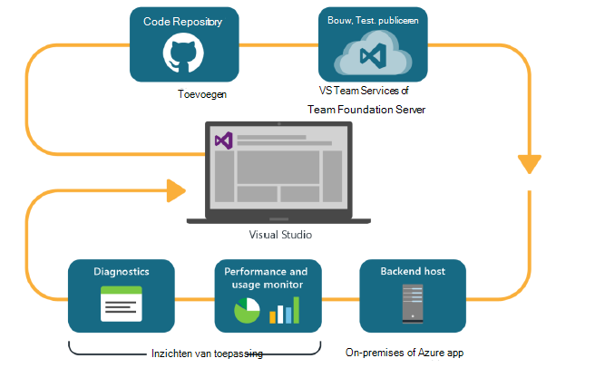
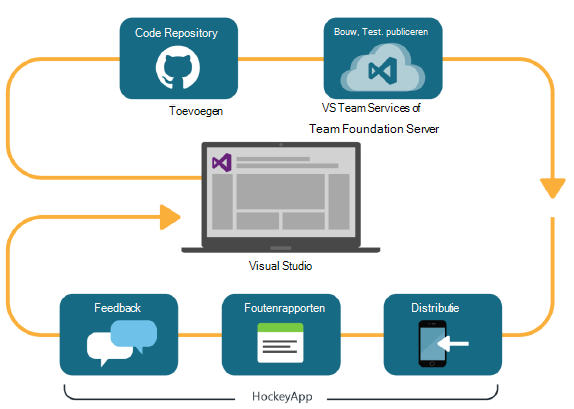

<properties
    pageTitle="Ontwikkelaars Analytics"
    description="DevOps met Visual Studio, toepassing inzichten en HockeyApp"
    authors="alancameronwills"
    services="application-insights"
    documentationCenter=""
    manager="douge"/>

<tags
    ms.service="application-insights"
    ms.workload="tbd"
    ms.tgt_pltfrm="ibiza"
    ms.devlang="na"
    ms.topic="article" 
    ms.date="05/18/2016"
    ms.author="awills"/>

# Ontwikkelaars Analytics met toepassing inzichten en HockeyApp

*Inzichten van toepassing is in het afdrukvoorbeeld.*

Veel projecten werken een snelle [DevOps](https://en.wikipedia.org/wiki/DevOps) cyclus. Zij bouwen hun toepassingen distribueren, krijgen feedback over hoe het wordt uitgevoerd en wat gebruikers ermee doen en die kennis vervolgens gebruiken voor het plannen van verdere ontwikkelingscycli. 

Als u wilt controleren en de prestaties, is het belangrijk de telemetrie van de actieve toepassing en feedback van de gebruikers zelf hebben. 

Veel systemen zijn opgebouwd uit meerdere componenten: een webservice, back-end-processors of opgeslagen gegevens en clientsoftware die wordt uitgevoerd in de browser van de gebruiker of als een toepassing in een telefoon of een ander apparaat. De telemetrie van deze verschillende onderdelen heeft moeten gezamenlijk worden genomen.

Sommige versies hebben beperkte distributie naar testers aangewezen; We hebben ook georganiseerd flighting (het testen van nieuwe functies met beperkte doelgroepen) en A | B (parallelle testen van alternatieve UI) te testen.

Verdelingen beheren en integreren van controle over meerdere client- en serveronderdelen is geen eenvoudige zaak. Dit proces is een essentieel onderdeel van de architectuur van de toepassing: kan niet maken we een systeem van dit soort zonder een iteratieve ontwikkelingscyclus en goede controlehulpprogramma's.

In dit artikel bekijken we hoe de controle aspecten van de cyclus devOps bij de andere onderdelen van het proces past. 

Als u dat wilt om een specifiek voorbeeld te bekijken, is er [een interessante case-study](http://aka.ms/mydrivingdocs) met meerdere client- en serveronderdelen.

## Een cyclus van DevOps

Visual Studio en Analytics Developer tools bieden een goed geïntegreerd devOps ervaring. Dit is bijvoorbeeld een typische cyclus voor een webtoepassing (die Java, Node.js of ASP.NET):

* Een ontwikkelaar de opslagplaats van de code gecontroleerd of samengevoegd met de belangrijkste tak. De opslagplaats is Git in deze afbeelding kan, maar het even [Versiebeheer voor Team Foundation](https://www.visualstudio.com/docs/tfvc/overview).
* De wijzigingen starten een build en unit test. De build-service kan worden in [Visual Studio Team Services of met diens tegenhanger op bedrijf, Team Foundation Server](https://www.visualstudio.com/docs/vsts-tfs-overview). 
* Een geslaagde bouwen en testen van eenheden kunnen [een automatische implementatie trigger](https://www.visualstudio.com/docs/release/author-release-definition/more-release-definition). De host web app kan zijn voor uw eigen webserver of Microsoft Azure. 
* Telemetrie van de live app wordt verzonden naar de [Inzichten van toepassing](app-insights-overview.md), zowel naar de server en [client-browsers](app-insights-javascript.md). Kunt u alleen de prestaties van de patronen en het gebruik van app te analyseren. Krachtige [zoekfuncties](app-insights-analytics.md) help u eventuele problemen opsporen. [Waarschuwingen](app-insights-alerts.md) moet u beschikken over een probleem zodra deze zich voordoet. 
* Volgende ontwikkelingscyclus in kennis wordt gesteld door de analyse van de telemetrie live.

### Apparaat en de pc apps

Apparaat en desktop apps verschilt deel van de verdeling van de cyclus enigszins, omdat we slechts naar één of twee servers worden niet uploaden. In plaats daarvan kunnen een geslaagde bouwen en testen van eenheden [trigger uploaden naar HockeyApp](https://support.hockeyapp.net/kb/third-party-bug-trackers-services-and-webhooks/how-to-use-hockeyapp-with-visual-studio-team-services-vsts-or-team-foundation-server-tfs). HockeyApp houdt toezicht op de distributie naar uw team test gebruikers (of het algemene publiek, als u liever). 

HockeyApp verzamelt ook prestaties en gegevens over het gebruik, in de vorm van:

* Verbatim gebruikerfeedback met screenshots
* Foutenrapporten
* Aangepaste telemetrie door u is gecodeerd.

Nogmaals, is de devOps cyclus voltooid terwijl u uw plannen voor toekomstige ontwikkeling in het licht van de feedback die is opgedaan.

## Ontwikkelaars Analytics instellen

Voor elk onderdeel van uw toepassing - Mobiel of Internet of desktop - zijn de stappen in principe hetzelfde. Voor veel soorten app kunt Visual Studio automatisch u bepaalde stappen.

1. De juiste SDK toevoegen aan uw app. Voor apparaat apps, is het HockeyApp en voor webservices inzichten van toepassing is. Elke heeft verschillende varianten voor verschillende platforms. (Het is ook mogelijk beide SDK gebruiken voor desktop-apps, maar wij raden aan HockeyApp.)
2. Registreer uw app bij de portal Application inzichten of HockeyApp, afhankelijk van de SDK die u gebruikt. Dit is waar ziet u analytics van uw live app. U krijgt een instrumentation sleutel of ID die u in uw toepassing zodanig configureren dat de SDK weet waar de telemetrie verzenden.
3. Voeg aangepaste code toe (indien gewenst) gebeurtenissen of metrics, om u te helpen met diagnostische gegevens of prestatie- of gebruiksrapport analyseren. Er is veel toezicht ingebouwd, dus u hoeft dit niet in de eerste cyclus.
3. Voor apps apparaat:
 * Een foutopsporingsversie uploaden naar HockeyApp. Van daaruit kunt u deze aan een team van testgebruikers distribueren. Wanneer u uploadt latere bouwt, krijgt het team.
 * Bij het instellen van de continue service bouwen, maken de definitie van een release die gebruikmaakt van de invoegtoepassing stap om te uploaden naar HockeyApp.

### Analytics en Export voor telemetrie van HockeyApp

U kunt aangepaste HockeyApp onderzoeken en meld u met de functies Analytics en continue exporteren van toepassing inzichten door [het instellen van een brug](app-insights-hockeyapp-bridge-app.md)telemetrie.

## Volgende stappen
 
Hier vindt u de gedetailleerde instructies voor verschillende soorten app:

* [ASP.NET web app.](app-insights-asp-net.md) 
* [Java web app.](app-insights-java-get-started.md)
* [Node.js web app.](https://github.com/Microsoft/ApplicationInsights-node.js)
* [iOS-app](https://support.hockeyapp.net/kb/client-integration-ios-mac-os-x-tvos/hockeyapp-for-ios)
* [Mac OS X app](https://support.hockeyapp.net/kb/client-integration-ios-mac-os-x-tvos/hockeyapp-for-mac-os-x)
* [Android app](https://support.hockeyapp.net/kb/client-integration-android/hockeyapp-for-android-sdk)
* [Universele Windows app](https://support.hockeyapp.net/kb/client-integration-windows-and-windows-phone/how-to-create-an-app-for-uwp)
* [App voor Windows Phone 8 en 8.1](https://support.hockeyapp.net/kb/client-integration-windows-and-windows-phone/hockeyapp-for-windows-phone-silverlight-apps-80-and-81)
* [Presentatie Windows Foundation-app](https://support.hockeyapp.net/kb/client-integration-windows-and-windows-phone/hockeyapp-for-windows-wpf-apps)

