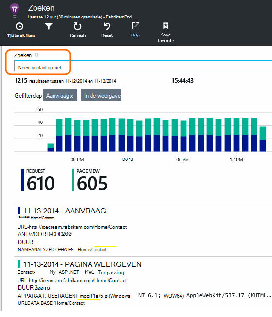

<properties 
    pageTitle="Met de diagnostische zoeken | Microsoft Azure" 
    description="Zoeken en filteren van afzonderlijke gebeurtenissen, aanvragen, en meld u sporen." 
    services="application-insights" 
    documentationCenter=""
    authors="alancameronwills" 
    manager="douge"/>

<tags 
    ms.service="application-insights" 
    ms.workload="tbd" 
    ms.tgt_pltfrm="ibiza" 
    ms.devlang="na" 
    ms.topic="article" 
    ms.date="06/09/2016" 
    ms.author="awills"/>
 
# Met behulp van Diagnostisch zoeken in toepassing inzichten

Diagnostische zoeken is een functie van [Toepassing inzichten] [ start] waarmee u kunt zoeken en verkennen telemetrie afzonderlijke items, zoals statistieken, uitzonderingen, of web-aanvragen. En u kunt weergeven, logboek sporen en gebeurtenissen die u hebt gecodeerd.

## Waar ziet u de diagnostische zoeken?

### In de portal voor Azure

U kunt expliciet diagnostische zoeken openen:

Ook wordt geopend wanneer u klikt op via bepaalde grafieken en raster artikelen. In dit geval zijn de filters vooraf ingesteld te concentreren op het type item dat u hebt geselecteerd. 

Als uw toepassing een webservice is, bevat het overzicht blade een grafiek van de omvang van de aanvragen. Klikt u op het en u krijgt een meer gedetailleerde grafiek met een aanbieding weergegeven hoeveel aanvragen zijn gemaakt voor elke URL. Klik op een rij en u krijgt een lijst van de afzonderlijke aanvragen voor die URL:

De hoofdtekst van de diagnostische zoekopdracht is een lijst pagina artikelen telemetrie - serveraanvragen, weergaven en aangepaste gebeurtenissen die u hebt gecodeerd. Is een overzichtstabel met tellingen van gebeurtenissen na verloop van tijd boven aan de lijst.

Gebeurtenissen meestal weergegeven in diagnostische zoeken voordat ze worden weergegeven in Verkenner metrische. Hoewel de bladeserver met tussenpozen wordt vernieuwd, klik u op vernieuwen als u voor een bepaalde gebeurtenis wacht.

### In Visual Studio

Open het venster Zoeken in Visual Studio:

Het venster zoeken heeft dezelfde functies als het webportaal:

## Bemonstering

Als uw app een groot aantal telemetrie genereert (en u de SDK van ASP.NET versie 2.0.0-beta3 of hoger), de module Geavanceerde sampling automatisch afgetrokken van het volume dat wordt verzonden naar de portal door alleen een representatief deel van de gebeurtenissen te sturen. Echter, gebeurtenissen die betrekking op dezelfde aanvraag hebben geselecteerd of uitgeschakeld als een groep, zodat u tussen verwante gebeurtenissen navigeren kunt. 

[Meer informatie over de bemonstering](app-insights-sampling.md).

## Afzonderlijke items controleren

Selecteer een item telemetrie sleutelvelden zien en aanverwante artikelen. Als u zien van de volledige lijst met velden wilt, klikt u op "...". 

Als u de volledige set velden zoekt, gebruik gewone tekenreeksen (zonder jokertekens). De beschikbare velden afhankelijk van het type telemetrie.

## Artikel maken

U kunt een bug in Visual Studio Team Services maken met de details van een item telemetrie. 

De eerste keer dat u dit doet, wordt u gevraagd een koppeling naar uw account Team Services en project configureren.

(Ook kunt u opvragen op het blad van de configuratie van instellingen > werkitems.)

## Typen gebeurtenissen filteren

Open de Filter blade en kiest u de typen gebeurtenissen die u wilt zien. (Als u later herstellen de filters waarmee u het blad hebt geopend wilt, klikt u op opnieuw instellen.)

De typen gebeurtenissen zijn:

* **Trace** - diagnostische logboeken met inbegrip van gesprekken met TrackTrace, log4Net, NLog en System.Diagnostic.Trace.
* **Aanvraag** - HTTP-aanvragen dat is ontvangen door de server-toepassing, met inbegrip van pagina's, scripts, afbeeldingen, bestanden in de stijl en gegevens. Deze gebeurtenissen worden gebruikt voor de aanvraag en het antwoord overzicht grafieken maken.
* **In de weergave pagina** - telemetrie verzonden door de webclient gebruikt voor het maken van rapporten voor pagina weergeven. 
* **Custom Event** - als u TrackEvent() aanroepen om het [gebruik van het beeldscherm][track], vindt u deze hier.
* **Uitzondering** - niet-afgevangen uitzonderingen in de server en die u zich aanmeldt met behulp van TrackException().

## Filteren op waarden van eigenschappen

U kunt filteren, gebeurtenissen op de waarden van de eigenschappen. De beschikbare eigenschappen zijn afhankelijk van de typen gebeurtenissen die u hebt geselecteerd. 

Kies bijvoorbeeld aanvragen met een specifiek antwoord.

Kiezen geen waarden van een bepaalde eigenschap heeft hetzelfde effect als het kiezen van alle waarden; het filteren op die eigenschap wordt stilgezet.

### Verfijn uw zoekopdracht

U ziet dat de aantallen aan de rechterkant van het filterwaarden weergeven hoeveel exemplaren er zijn in de huidige gefilterde set. 

In dit voorbeeld is het vanzelf dat de `Reports/Employees` resultaten in de meeste van de 500 fouten aanvragen:

Bovendien kunt u desgewenst ook Zie wat andere gebeurtenissen zijn gedurende deze tijd gebeurt, **inclusief gebeurtenissen met niet-gedefinieerde eigenschappen**controleren.

## Bot en web test verkeer verwijderen

Gebruik het filter **reële of synthetische verkeer** en **echte**controleren.

U kunt ook filteren op **bron van synthetische verkeer**.

## Afzonderlijke exemplaren controleren

Dat verzoek naam toevoegen aan de set filter en vervolgens controleert u afzonderlijke exemplaren van deze gebeurtenis.

Details weergeven voor aanvraag gebeurtenissen, uitzonderingen die zijn opgetreden tijdens het verwerken van de aanvraag.

Klik op een uitzondering op de details, met inbegrip van de stacktrace.

## Gebeurtenissen met dezelfde eigenschap zoeken

Zoeken naar alle items met dezelfde waarde voor de eigenschap:

## Zoeken op metrische waarde

Alle aanvragen responstijd > 5s ophalen.  Tijden worden weergegeven in de maten: 10 000 maten = 1ms.

## Gegevens zoeken

U kunt zoeken naar termen in een van de waarden van de eigenschap. Dit is vooral handig als u [aangepaste gebeurtenissen] hebt geschreven[ track] met de waarden van eigenschappen. 

U kunt een bereik, als zoekopdrachten via een korter bereik sneller zijn tijd in te stellen. 

Zoeken naar termen, niet subtekenreeksen. Voorwaarden zijn alfanumerieke tekenreeksen met bepaalde interpunctie, zoals '.' en '_'. Bijvoorbeeld:

term|*niet* overeenkomt met de|maar deze komen overeen met
---|---|---
HomeController.About|over Home|h\*over Home\*
IsLocal|lokale is \*lokale|ISL\* islocal i\*l\*
Nieuwe vertraging|w d|Nieuw vertraging n\* en d\*

Hier vindt u de zoekopdracht expressies die u kunt gebruiken:

Voorbeeldquery | Effect 
---|---
vertragen|Alle gebeurtenissen in het bereik waarvan de velden de term bevatten "langzame" zoeken
database??|Komt overeen met database01, databaseAB... ? is niet toegestaan aan het begin van een zoekterm.
database * |Komt overeen met de database, database01, databaseNNNN  * het is niet toegestaan aan het begin van een zoekterm
appel en banaan|Gebeurtenissen zoeken waarin beide termen. Gebruik van kapitaal "en", niet "en".
appel of banaan appel banaan|Zoeken naar gebeurtenissen die door een van beide termen bevatten. Gebruik 'OR', niet 'of'. < /br/ > korte vorm.
Apple geen banaan appel-banaan|Zoeken naar gebeurtenissen met een term, maar de andere niet. Korte vorm.
App * en banaan-(grape pear)|Logische operatoren en haakjes.
"Metrisch": 0-500 "Metrisch": 500 aan * | Zoeken naar gebeurtenissen met de naam meting binnen het geldige bereik.

## Uw zoekopdracht opslaan

Als u de gewenste filters hebt ingesteld, kunt u de zoekactie opslaan als favoriet. Als u in een organisatie-account werkt, kunt u kiezen of delen met andere teamleden.

Zie de zoekactie opnieuw uit en **Ga naar het overzicht blade** en Favorieten openen:

Als u met de relatieve periode opgeslagen, heeft de blade heropend de meest recente gegevens. Als u met een Absolute tijdsbereik opgeslagen, ziet u dezelfde gegevens elke keer.

## Meer telemetrie verzenden naar inzichten van toepassing

Naast de out-of-the-box telemetrie door toepassing inzichten SDK worden verzonden, kunt u het volgende doen:

* Sporen van uw favoriete logboekregistratie framework in [.NET] logboek vastleggen[ netlogs] of [Java][javalogs]. Dit betekent dat u kunt zoeken via de sporen van het logboek en deze te correleren met paginaweergaven, uitzonderingen en andere gebeurtenissen. 
* [Code schrijven] [ track] voor het verzenden van aangepaste gebeurtenissen, paginaweergaven en uitzonderingen. 

[Informatie over het verzenden van Logboeken en aangepaste telemetrie op toepassing inzichten][trace].

## Q & A

### Hoeveel gegevens behouden?

Maximaal 500 gebeurtenissen per seconde van elke toepassing. Gebeurtenissen worden bewaard gedurende zeven dagen.

### Hoe kan ik POST-gegevens weergeven in mijn serveraanvragen?

We niet de POST-gegevens automatisch aanmelden, maar u kunt [TrackTrace of log][trace]. De POST-gegevens in de parameter bericht geplaatst. U kunt niet filteren op het bericht de manier waarop die u eigenschappen kunt, maar de maximale grootte is langer.

## Volgende stappen

* [Logboeken en aangepaste telemetrie verzenden naar de inzichten van toepassing][trace]
* [Beschikbaarheid en reactievermogen testen][availability]
* [Het oplossen van problemen][qna]

<!--Link references-->

[availability]: app-insights-monitor-web-app-availability.md
[javalogs]: app-insights-java-trace-logs.md
[netlogs]: app-insights-asp-net-trace-logs.md
[qna]: app-insights-troubleshoot-faq.md
[start]: app-insights-overview.md
[trace]: app-insights-search-diagnostic-logs.md
[track]: app-insights-api-custom-events-metrics.md

 