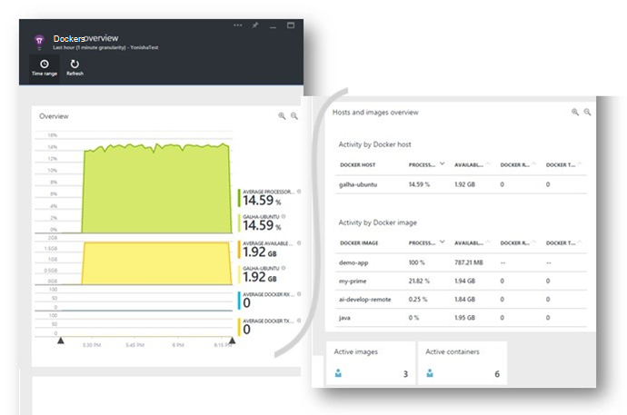

<properties 
    pageTitle="Toepassingen van Docker in inzichten toepassing controleren" 
    description="Docker prestatiemeteritems, gebeurtenissen en uitzonderingen kunnen worden weergegeven op de inzichten van toepassing, samen met de telemetrie van de beperkte apps." 
    services="application-insights" 
    documentationCenter=""
    authors="alancameronwills" 
    manager="douge"/>

<tags 
    ms.service="application-insights" 
    ms.workload="tbd" 
    ms.tgt_pltfrm="ibiza" 
    ms.devlang="na" 
    ms.topic="article" 
    ms.date="12/01/2015" 
    ms.author="awills"/>
 
# <a name="monitor-docker-applications-in-application-insights"></a>Toepassingen van Docker in inzichten toepassing controleren

Lifecycle gebeurtenissen en prestatiemeteritems van [Docker](https://www.docker.com/) containers kunnen worden uitgezet op inzichten van toepassing. Installatiekopie van de [Toepassing inzichten](app-insights-overview.md) in een container in uw host en wordt deze prestatiemeteritems voor de host, maar ook voor de andere afbeeldingen weergegeven.

Met Docker distribueert u uw toepassingen in de lichtgewicht containers, compleet met alle afhankelijkheden. Ze gaat uitvoeren op een hostcomputer waarop een Docker-Engine wordt uitgevoerd.

Als u de [afbeelding van de inzichten van toepassing](https://hub.docker.com/r/microsoft/applicationinsights/) op de host Docker uitvoert, krijgt u de volgende voordelen:

* Levenscyclus telemetrie over alle containers die worden uitgevoerd op de host - starten, stoppen, enzovoort.
* Prestatiemeteritems voor alle containers. CPU, geheugen, netwerkgebruik en meer.
* Als de [toepassing inzichten SDK hebt geïnstalleerd](app-insights-java-live.md) in de toepassingen uitgevoerd in de containers, de telemetrie van apps in deze aanvullende eigenschappen voor het identificeren van de container en de host-machine hebt. Dus bijvoorbeeld als u exemplaren van een toepassing die wordt uitgevoerd in meer dan één host, zult u gemakkelijk uw telemetrie app door host filteren.




## <a name="set-up-your-application-insights-resource"></a>Uw toepassing inzichten resource instellen

1. Aanmelden bij [Microsoft Azure Portal](https://azure.com) en open de toepassing inzichten bron voor uw app; of [een nieuwe maken](app-insights-create-new-resource.md). 

    *Welke bron moet ik gebruiken?* Als de toepassingen die u op de host uitvoert zijn ontwikkeld door iemand anders, vervolgens moet u [een nieuwe toepassing inzichten bron](app-insights-create-new-resource.md)maken. Dit is waar u weergeven en analyseren van de telemetrie. (Selecteer de andere voor het type app.)

    Maar als u de ontwikkelaar van de apps, vervolgens Hopelijk [toepassing inzichten SDK toegevoegd](app-insights-java-live.md) aan elk van hen. Als ze alle echt onderdelen van een enkele bedrijfstoepassing, vervolgens u al deze telemetrie verzendt aan een resource kunt configureren en kunt u dezelfde resource Docker levenscyclus- en gegevens weergeven. 

    Een derde scenario is dat u de meeste van de apps ontwikkeld, maar dat u met behulp van afzonderlijke resources hun telemetrie weergeven. In dat geval zult u waarschijnlijk ook wilt maken van een afzonderlijke bron voor de gegevens van Docker. 

2.  De tegel Docker toevoegen: kies **Toevoegen naast elkaar weergeven**, sleept u de tegel Docker uit de galerie en klik op **Gereed**. 

    


3. Klik op de vervolgkeuzelijst **Essentials** en kopieer de sleutel Instrumentation. U gebruikt dit de SDK vertellen waar de telemetrie.


    

Houd dat browservenster bij de hand, zoals u zult terugkomen om snel te kijken uw telemetrie.


## <a name="run-the-application-insights-monitor-on-your-host"></a>De monitor van de inzichten van toepassing op de host uitvoeren
 
Nu dat u ergens de telemetrie weergeven hebt, kunt u de beperkte app die verzamelen en verzenden instellen.

1.  Verbinding maken met de host Docker. 
2.  Bewerk uw instrumentation-sleutel in deze opdracht en vervolgens uit te voeren:
 
    ```

    docker run -v /var/run/docker.sock:/docker.sock -d microsoft/applicationinsights ikey=000000-1111-2222-3333-444444444
    ```

Slechts één toepassing inzichten afbeelding is per host Docker vereist. Als uw toepassing is geïmplementeerd op meerdere hosts van Docker, herhaalt u de opdracht op elke host.

## <a name="update-your-app"></a>Uw app bijwerken

Als uw toepassing is geïmplementeerd met de [Toepassing inzichten SDK voor Java](app-insights-java-get-started.md), voeg de volgende regel in het bestand ApplicationInsights.xml in uw project, onder de `<TelemetryInitializers>` element:

```xml

    <Add type="com.microsoft.applicationinsights.extensibility.initializer.docker.DockerContextInitializer"/> 
```

Hiermee voegt u Docker informatie als container en host-id toe aan elke telemetrie item verzonden vanuit de app.

## <a name="view-your-telemetry"></a>Uw telemetrie weergeven

Ga terug naar de bron toepassing inzichten in de portal Azure.

Klik op de tegel Docker.

Binnenkort ziet u gegevens die vanuit de app Docker met name als u andere containers waarop uw Docker-engine.


Hier zijn enkele van de weergaven die u kunt krijgen.

### <a name="perf-counters-by-host-activity-by-image"></a>Prestatiemeteritems door host activiteit per afbeelding


Klik op de naam van een host of een afbeelding voor meer details.


U kunt de weergave aanpassen, klikt u op de grafiek, de kop, raster of -grafiek toevoegen. 

[Meer informatie over parameters explorer](app-insights-metrics-explorer.md).

### <a name="docker-container-events"></a>Docker container gebeurtenissen


U kunt afzonderlijke gebeurtenissen onderzoeken, klikt u op [Zoeken](app-insights-diagnostic-search.md). Zoeken en filter de gebeurtenissen die u wilt zoeken. Klik op een willekeurige gebeurtenis als u meer informatie.
 
### <a name="exceptions-by-container-name"></a>Uitzonderingen op de naam van de container
 


### <a name="docker-context-added-to-app-telemetry"></a>Docker context toegevoegd aan app telemetrie

Telemetrie verzoek is verzonden vanuit de toepassing met AI SDK, verrijkt met Docker context geïmplementeerd:


Processortijd en geheugen prestatiemeteritems, verrijkt en gegroepeerd op de naam van de container Docker:


## <a name="q--a"></a>Q & A

*Wat toepassing inzichten geeft me dat ik niet kunnen van Docker bereiken?*

* Gedetailleerde uitsplitsing van de prestatiemeteritems van het container- en.
* Container- en app-gegevens in een dashboard integreren.
* [Telemetrie exporteren](app-insights-export-telemetry.md) voor verdere analyse naar een database, Power BI of andere dashboard.

*Hoe krijg ik telemetrie vanuit de app zelf.*

* Installeer de toepassing inzichten SDK in de app. Meer informatie over hoe u voor: [Java web apps](app-insights-java-get-started.md), [web-apps voor Windows](app-insights-asp-net.md).
