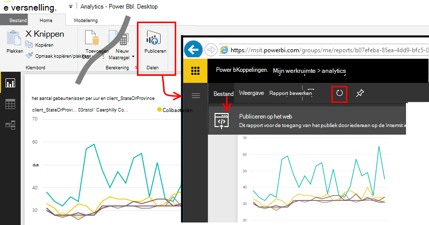

<properties 
    pageTitle="Exporteren naar Power BI van toepassing Insights | Microsoft Azure" 
    description="Analytics-query's kunnen worden weergegeven in Power BI." 
    services="application-insights" 
    documentationCenter=""
    authors="noamben" 
    manager="douge"/>

<tags 
    ms.service="application-insights" 
    ms.workload="tbd" 
    ms.tgt_pltfrm="ibiza" 
    ms.devlang="na" 
    ms.topic="article" 
    ms.date="10/18/2016" 
    ms.author="awills"/>

# Power BI-feed van de inzichten van toepassing

[Power BI](http://www.powerbi.com/) is een suite van business analytics tools die u helpen bij het analyseren van gegevens en inzichten te delen. Rich-dashboards zijn op elk apparaat beschikbaar. U kunt gegevens uit vele bronnen, waaronder Analytics query's van [Visual Studio-toepassing inzicht](app-insights-overview.md)combineren.

Er zijn drie aanbevolen manieren van inzichten die toepassing gegevens exporteren naar Power BI. U kunt ze afzonderlijk of samen gebruiken.

* [**Adapter met power BI**](#power-pi-adapter) - een volledige dashboard van telemetrie van uw app instellen. De set van grafieken is vooraf gedefinieerd, maar u kunt uw eigen query's uit alle andere bronnen toevoegen.
* [**Query's exporteren Analytics**](#export-analytics-queries) - schrijven van een query die u wilt met behulp van Analytics en exporteren naar Power BI. U kunt deze query op een dashboard en alle andere gegevens plaatsen.
* [**Continu exporteren en Stream Analytics**](app-insights-export-stream-analytics.md) - dit is meer werk om in te stellen. Het is handig als u wilt uw gegevens gedurende lange perioden behouden. Anders wordt worden de andere methoden aanbevolen.

## BI-stroomadapter

Deze methode maakt een volledige dashboard van telemetrie voor u. De eerste verzameling vooraf is gedefinieerd, maar kunt u meer gegevens aan toevoegen.

### Ophalen van de adapter

1. Aanmelden bij [Power BI](https://app.powerbi.com/).
2. **Gegevens ophalen**, **Services**, **inzichten toepassing** openen

    

3. De details van uw toepassing inzichten bron bevatten.

    

4. Wacht een minuut of twee voor de gegevens die moeten worden geïmporteerd.

    

U kunt het dashboard, de toepassing inzichten grafieken combineren met die van andere bronnen en met Analytics query's bewerken. Er is een visualisatie galerie kunt u een meer grafieken waarbij elke grafiek bevat een parameters die u kunt instellen.

Na de aanvankelijke import het dashboard en de rapporten worden dagelijks bijgewerkt. U kunt vernieuwen schema van de dataset regelen.

## Analytics query's exporteren

Deze route kunt u elke Analytics query die u wilt schrijven, en die vervolgens exporteren naar een Power BI-dashboard. (U kunt toevoegen aan het dashboard door de adapter wordt gemaakt.)

### Één keer: Power BI bureaublad installeren

Om uw toepassing inzichten query importeert, kunt u de bureaubladversie van Power BI gebruiken. Maar vervolgens kunt u deze publiceren op het web of op uw werkruimte Power BI-wolk. 

[Power BI-bureaublad](https://powerbi.microsoft.com/en-us/desktop/)te installeren.

### Een Analytics query exporteren

1. [Open Analytics en het schrijven van uw query](app-insights-analytics-tour.md).
2. Test en de query te verfijnen totdat u tevreden met de resultaten bent.
3. Kies in het menu **exporteren** **Power BI (M)**. Sla het tekstbestand.

    
4. **Gegevens ophalen, lege Query** selecteren en selecteer vervolgens **Geavanceerde Query Editor**in de query-editor onder **weergave** in Power BI-Desktop.

    De geëxporteerde M taalscript in geavanceerde Query Editor plakken.

    

5. Mogelijk moet de referenties van de Power BI voor toegang tot Azure dat. Gebruik 'organisatie-account' aan te melden met uw Microsoft-account.

    

6. Kies een visualisatie voor uw query en selecteer de velden voor de x-as, y-as en segmenteren dimensie.

    

7. Een rapport publiceren naar uw werkruimte Power BI-wolk. Daar kunt u een gesynchroniseerde versie insluiten in andere webpagina's.

    
 
8. De lijst handmatig te vernieuwen met tussenpozen of een geplande vernieuwing op de optiepagina instellen.

## Over bemonstering

Als uw toepassing veel gegevens worden verzonden, kan de functie apparaatafhankelijke bemonstering werken en slechts een percentage van de telemetrie. Hetzelfde geldt als u handmatig de bemonstering in de SDK of inslikken. [Meer informatie over de bemonstering.](app-insights-sampling.md)
 

## Volgende stappen

* [Power BI - informatie](http://www.powerbi.com/learning/)
* [Analytics-zelfstudie](app-insights-analytics-tour.md)
