<properties 
    pageTitle="Stream Analytics gebruiken voor het verwerken van gegevens die zijn geëxporteerd uit een toepassing inzichten | Microsoft Azure" 
    description="Stream Analytics kunt voortdurend transformatie, filteren en doorsturen van de gegevens die u uit inzichten van toepassing exporteert." 
    services="application-insights" 
    documentationCenter=""
    authors="noamben" 
    manager="douge"/>

<tags 
    ms.service="application-insights" 
    ms.workload="tbd" 
    ms.tgt_pltfrm="ibiza" 
    ms.devlang="na" 
    ms.topic="article" 
    ms.date="10/18/2016" 
    ms.author="awills"/>

# <a name="use-stream-analytics-to-process-exported-data-from-application-insights"></a>Stream Analytics gebruiken voor het verwerken van geëxporteerde gegevens van toepassing inzichten

[Azure Stream Analytics](https://azure.microsoft.com/services/stream-analytics/) is het ideale programma voor het verwerken van gegevens [geëxporteerd vanuit de inzichten van toepassing](app-insights-export-telemetry.md). Stream Analytics kunt gegevens ophalen uit verschillende bronnen. Het kan transformeren en de gegevens filteren en deze vervolgens doorsturen naar tal van putten.

In dit voorbeeld maken we een adapter die gegevens afkomstig van de inzichten van toepassing, naam en deze buizen in Power BI sommige velden verwerkt.

> [AZURE.WARNING] Er zijn veel beter en gemakkelijker [de aanbevolen manieren om gegevens in Power BI toepassing inzichten te geven](app-insights-export-power-bi.md). Het pad geïllustreerd hier is slechts een voorbeeld ter illustratie van de geëxporteerde gegevens verwerken.

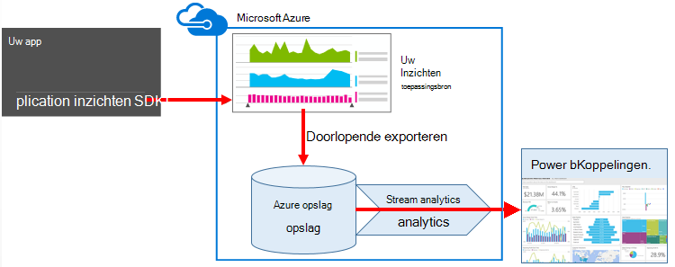


## <a name="create-storage-in-azure"></a>Opslag in Azure maken

Continue exporteren wordt altijd gegevens aan een account Azure opslag, dus u moet eerst de opslag maken.

1.  Maak een account 'klassieke' opslag in uw abonnement in de [portal Azure](https://portal.azure.com).

    

2. Maken van een container

    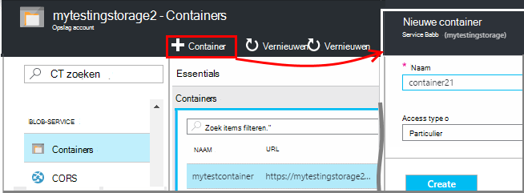

3. De toegangstoets opslag kopiëren

    Je hebt het snel voor het instellen van de invoer voor de stream analytics-service.

    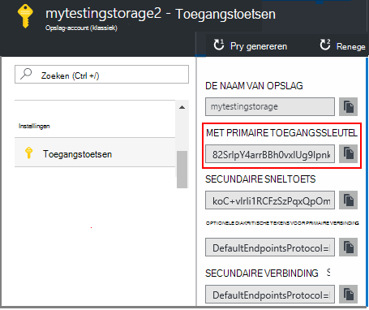

## <a name="start-continuous-export-to-azure-storage"></a>Doorlopende exporteren naar Azure opslag starten

Gegevens [exporteren doorlopend](app-insights-export-telemetry.md) van toepassing inzichten in Azure opslag worden verplaatst.

1. Blader in de Azure portal naar de toepassing inzichten resource die u hebt gemaakt voor uw toepassing.

    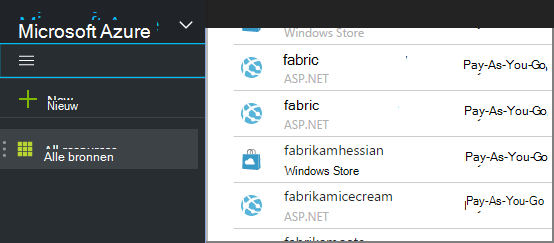

2. Een doorlopende export maken.

    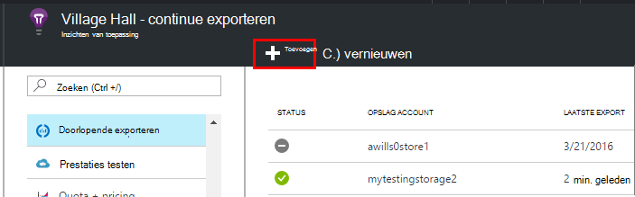


    Selecteer de opslag-account die u eerder hebt gemaakt:

    
    
    Stel de gebeurtenistypen die u wilt zien:

    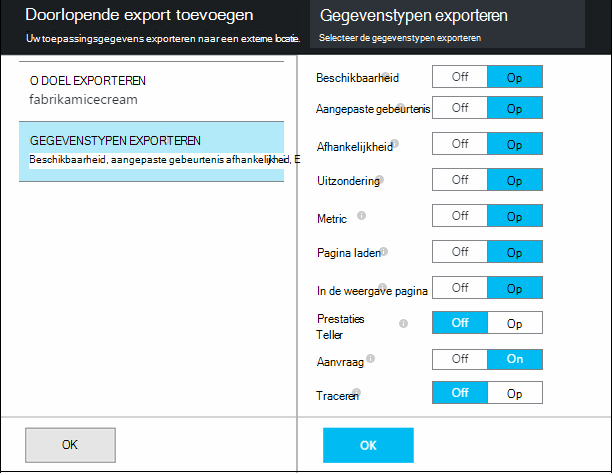

3. Laat enkele gegevens worden verzameld. Achteroverleunen en toestaan dat uw toepassing gebruikt voor een tijdje. Telemetrie komen en ziet u statistische grafieken in [metrische explorer](app-insights-metrics-explorer.md) en afzonderlijke gebeurtenissen in [Diagnostische zoeken](app-insights-diagnostic-search.md). 

    En ook de gegevens worden geëxporteerd naar de opslag. 

4. De geëxporteerde gegevens te controleren. Kies in Visual Studio **bekijken / Cloud Explorer**, en open Azure / opslag. (Als u deze optie niet hebt, moet u de Azure SDK installeren: Open het dialoogvenster Nieuw Project en Visual C# / Cloud / Microsoft Azure SDK voor .NET ophalen.)

    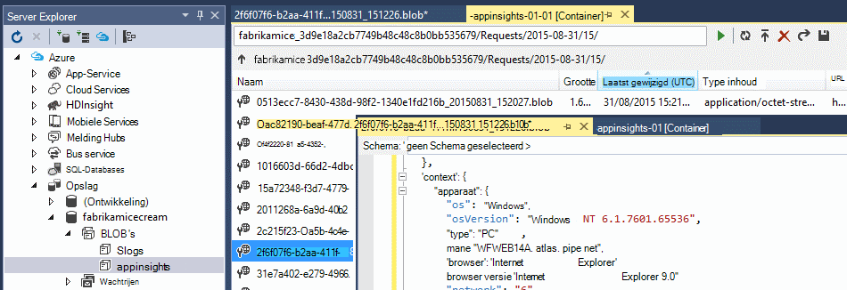

    Maak een notitie van het gemeenschappelijk gedeelte van de naam van het pad, die wordt afgeleid van de naam en instrumentatie toepassingstoets. 

De gebeurtenissen worden geregistreerd in de blob-bestanden in JSON-indeling. Elk bestand bevat mogelijk een of meer gebeurtenissen. Zo willen we lezen van gegevens van de gebeurtenis en de velden die we wilt uitfilteren. Er zijn allerlei dingen die we met de gegevens doen kunnen, maar onze plan is vandaag Analytics stroom naar de gegevens Power BI pipe gebruiken.

## <a name="create-an-azure-stream-analytics-instance"></a>Azure Stream Analytics exemplaar maken

[Klassieke Azure Portal](https://manage.windowsazure.com/), selecteer de Azure Stream Analytics-service en een nieuwe gegevensstroom Analytics taak maken:


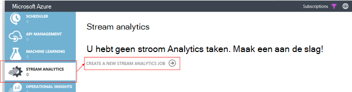


Wanneer de nieuwe taak wordt gemaakt, vouwt u de details:

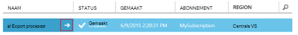


### <a name="set-blob-location"></a>Blob-locatie instellen

Stel te treffen invoer uit de blob continue exporteren:

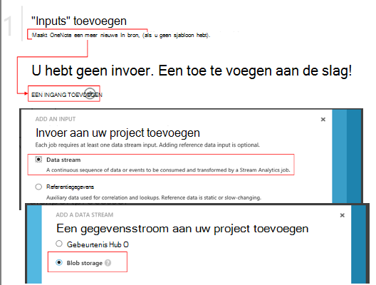

Nu moet u de primaire sleutel van de toegang van uw opslag-Account die u eerder hebt opgeschreven. Deze Account als opslag instellen.

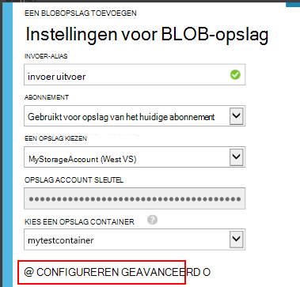

### <a name="set-path-prefix-pattern"></a>Set path voorvoegselpatroon 

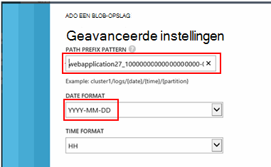


**Zorg ervoor dat de notatie ingesteld op jjjj-MM-DD (met streepjes).**

Het patroon voorvoegsel van pad geeft aan waar de invoerbestanden in Stream Analytics wordt gevonden in de opslag. U moet deze corresponderen met hoe continue exporteert de gegevens worden opgeslagen. Stel deze in als volgt:

    webapplication27_12345678123412341234123456789abcdef0/PageViews/{date}/{time}

In dit voorbeeld:

* `webapplication27`is de naam van de toepassing inzichten resource **alle kleine letters**.
* `1234...`is de sleutel van de instrumenten van de resource van toepassing inzichten, **zonder streepjes**. 
* `PageViews`is het type gegevens dat u wilt analyseren. De beschikbare typen is afhankelijk van het filter dat u in het doorlopende exporteren instelt. De geëxporteerde gegevens in het overzicht van de beschikbare typen onderzoek en Zie het [gegevensmodel exporteren](app-insights-export-data-model.md).
* `/{date}/{time}`een patroon er wordt letterlijk geschreven.

> [AZURE.NOTE] Controleer de opslag om ervoor te zorgen dat u het pad rechts.

### <a name="finish-initial-setup"></a>Eerste setup voltooien

Bevestig de serialisatie-indeling:

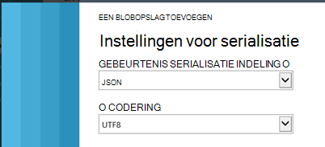

De wizard te sluiten en wachten op de installatie te voltooien.

> [AZURE.TIP] Gebruik de opdracht voorbeeld voor het downloaden van gegevens. Houd het als een monster voor foutopsporing van de query.

## <a name="set-the-output"></a>Stel de uitvoer

Nu selecteert u de taak en de uitvoer ingesteld.

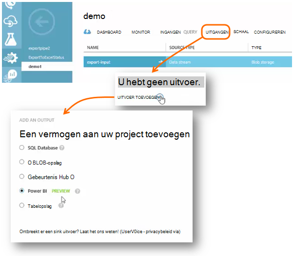

Uw **werk of school account** voor het autoriseren van Analytics voor toegang tot de bron van de Power BI stroom leveren. Plaats vervolgens een naam voor de uitvoer en de Power BI-dataset doel en de tabel.

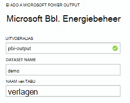

## <a name="set-the-query"></a>De query instellen

De query bepaalt de vertaling van de invoer naar uitvoer.

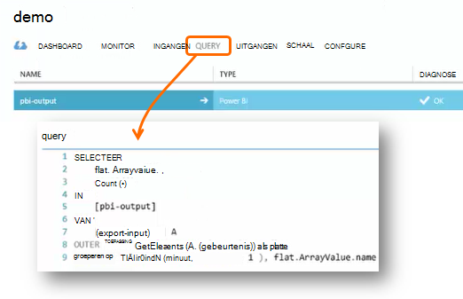


Gebruik de functie Test om te controleren dat u de juiste uitvoer krijgt. De voorbeeldgegevens die u hebt uitgevoerd vanaf de pagina "inputs" geven. 

### <a name="query-to-display-counts-of-events"></a>Query voor het weergeven van gebeurtenissen telt

Plak deze query:

```SQL

    SELECT
      flat.ArrayValue.name,
      count(*)
    INTO
      [pbi-output]
    FROM
      [export-input] A
    OUTER APPLY GetElements(A.[event]) as flat
    GROUP BY TumblingWindow(minute, 1), flat.ArrayValue.name
```

* invoer uitvoer is de alias wij naar de stroom invoer gaven
* pbi-uitvoer is de uitvoeralias die hebben we gedefinieerd
* We gebruiken de [Buitenste GetElements van toepassing](https://msdn.microsoft.com/library/azure/dn706229.aspx) omdat de naam van de gebeurtenis in een geneste JSON-arrray. Vervolgens neemt de selecteren de naam van de gebeurtenis met een telling van het aantal exemplaren met die naam in de periode. [Group By](https://msdn.microsoft.com/library/azure/dn835023.aspx) -component worden de elementen in de periode van 1 minuut.


### <a name="query-to-display-metric-values"></a>Query metrische waarden weergeven


```SQL

    SELECT
      A.context.data.eventtime,
      avg(CASE WHEN flat.arrayvalue.myMetric.value IS NULL THEN 0 ELSE  flat.arrayvalue.myMetric.value END) as myValue
    INTO
      [pbi-output]
    FROM
      [export-input] A
    OUTER APPLY GetElements(A.context.custom.metrics) as flat
    GROUP BY TumblingWindow(minute, 1), A.context.data.eventtime

``` 

* Deze query analyse niveau uitgevoerd in de telemetrie maatstaven voor de tijd van de gebeurtenis en de metrische waarde. De metrische waarden zijn in een array, zodat we het patroon van de buitenste GetElements van toepassing gebruiken om de rijen ophalen. 'myMetric' is in dit geval de naam van de metric. 

### <a name="query-to-include-values-of-dimension-properties"></a>Query als u de eigenschappen voor dimensie

```SQL

    WITH flat AS (
    SELECT
      MySource.context.data.eventTime as eventTime,
      InstanceId = MyDimension.ArrayValue.InstanceId.value,
      BusinessUnitId = MyDimension.ArrayValue.BusinessUnitId.value
    FROM MySource
    OUTER APPLY GetArrayElements(MySource.context.custom.dimensions) MyDimension
    )
    SELECT
     eventTime,
     InstanceId,
     BusinessUnitId
    INTO AIOutput
    FROM flat

```

* Deze query bevat de waarden van de eigenschappen voor dimensie zonder afhankelijk van een bepaalde dimensie wordt op een vaste index in de array dimensie.

## <a name="run-the-job"></a>De taak uitvoeren

U kunt een datum in het verleden aan de taak van start. 

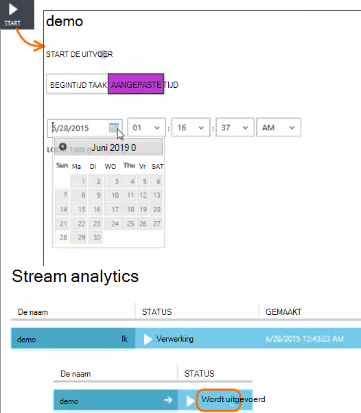

Wacht totdat de taak wordt uitgevoerd.

## <a name="see-results-in-power-bi"></a>Resultaten in Power BI

> [AZURE.WARNING] Er zijn veel beter en gemakkelijker [de aanbevolen manieren om gegevens in Power BI toepassing inzichten te geven](app-insights-export-power-bi.md). Het pad geïllustreerd hier is slechts een voorbeeld ter illustratie van de geëxporteerde gegevens verwerken.

Power BI openen met uw werk of school account en selecteer de gegevensset en de tabel die u hebt gedefinieerd als de uitvoer van de taak van de Stream Analytics.

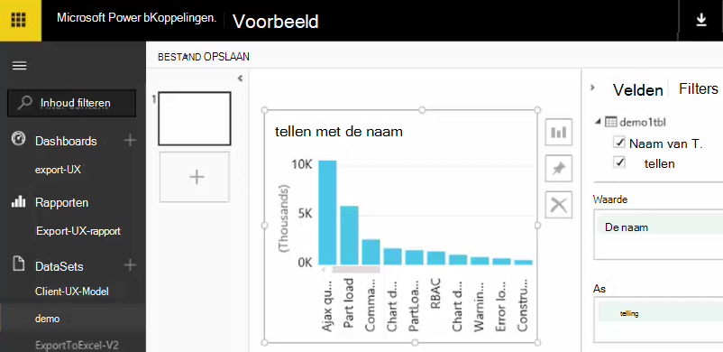

Nu kunt u deze dataset in rapporten en dashboards in [Power BI](https://powerbi.microsoft.com).


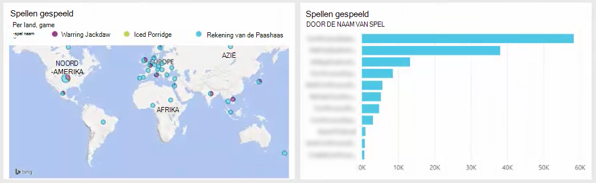


## <a name="no-data"></a>Er zijn geen gegevens?

* Controleer dat u [de datumnotatie instellen](#set-path-prefix-pattern) correct jjjj-MM-DD (met streepjes).


## <a name="video"></a>Video

Noam Ben Zeev wordt aangegeven hoe Stream Analytics geëxporteerde gegevens verwerken.

> [AZURE.VIDEO export-to-power-bi-from-application-insights]

## <a name="next-steps"></a>Volgende stappen

* [Doorlopende exporteren](app-insights-export-telemetry.md)
* [Gedetailleerde gegevens model voor typen eigenschappen en waarden.](app-insights-export-data-model.md)
* [Inzichten van toepassing](app-insights-overview.md)
* [Meer voorbeelden en zelfstudies](app-insights-code-samples.md)
 
