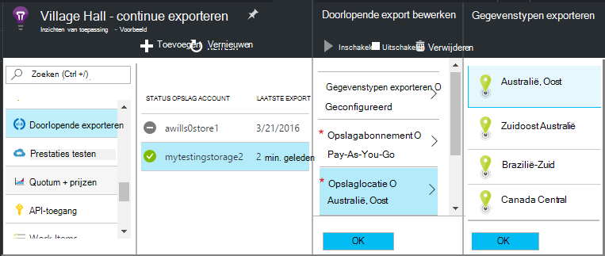

<properties 
    pageTitle="Doorlopende export van telemetrie van toepassing inzichten | Microsoft Azure" 
    description="En het gebruik van diagnostische gegevens exporteren naar de opslag in Microsoft Azure en van daaruit downloaden." 
    services="application-insights" 
    documentationCenter=""
    authors="alancameronwills" 
    manager="douge"/>

<tags 
    ms.service="application-insights" 
    ms.workload="tbd" 
    ms.tgt_pltfrm="ibiza" 
    ms.devlang="na" 
    ms.topic="article" 
    ms.date="10/18/2016" 
    ms.author="awills"/>
 
# Telemetrie van inzichten toepassing exporteren

Wilt u uw telemetrie langer dan de bewaarperiode standaard houden? Of op een speciale manier worden verwerkt? Continu-Export is ideaal voor dit. De gebeurtenissen die u in de portal Application inzichten ziet kunnen worden geëxporteerd naar de opslag in Microsoft Azure in JSON-indeling. Van daaruit kunt u downloaden van uw gegevens en schrijven wat u code hoeft te verwerken.  

Doorlopende exporteren is alleen beschikbaar in de gratis proefperiode en op de [Standard en Premium prijzen plannen](https://azure.microsoft.com/pricing/details/application-insights/).

Voordat u doorlopend exporteren, zijn er enkele alternatieven kunt u kiezen:

* [De exporteren knop](app-insights-metrics-explorer.md#export-to-excel) aan de bovenkant van een blade metrics of zoeken kunt u overbrengen van tabellen en grafieken op een Excel-werkblad. 
* [Analytics](app-insights-analytics.md) biedt een krachtige querytaal voor Telemetrie en ook resultaten kunt exporteren.
* Als u op zoek bent naar [Ontdek uw gegevens in Power BI](http://blogs.msdn.com/b/powerbi/archive/2015/11/04/explore-your-application-insights-data-with-power-bi.aspx)kunt u dat doen zonder continue exporteren.

## Maak een account voor opslag

Als u nog niet een rekening 'klassieke' opslag, maken nu.

1. Maak een account opslag in uw abonnement in de [portal Azure](https://portal.azure.com).

    

2. Maak een container.

    

## Instellen van de continue exporteren

Open op van uw toepassing overzicht blade in de portal Application inzichten, continue exporteren: 

Een doorlopende export toevoegen en kiest u de typen gebeurtenissen die u wilt exporteren:

Kies of maak de [Azure opslag account](../storage/storage-introduction.md) waar u de gegevens op te slaan:

Als u de uitvoer hebt gemaakt, wordt het gaat. (U alleen gegevens ophalen die binnenkomt nadat u de export maken.) 

Er is een vertraging van ongeveer een uur voordat de gegevens worden weergegeven in de blob.

Als u later de gebeurtenistypen wijzigen, bewerkt u gewoon de uitvoer:

Klik op uitschakelen als u wilt stoppen met de stroom. Wanneer u opnieuw inschakelen klikt, wordt de stroom opnieuw gestart met nieuwe gegevens. Won't krijgt u de gegevens die in de portal zijn binnengekomen terwijl de uitvoer is uitgeschakeld.

Om de stroom definitief stoppen, de export te verwijderen. Dit verwijdert niet uw gegevens van opslag.

#### Kan niet toevoegen of wijzigen van een uitvoer?

* Als u wilt toevoegen of wijzigen van de uitvoer, moet u eigenaar, medewerker of toepassing inzichten Inzender toegangsrechten. [Meer informatie over rollen][roles].

## Welke gebeurtenissen krijg?

De geëxporteerde gegevens is de ruwe telemetrie die we van uw toepassing ontvangen, behalve dat we de locatiegegevens die we berekenen van client-IP-adres toevoegen. 

Gegevens die zijn verwijderd door [middel van steekproeven](app-insights-sampling.md) is niet opgenomen in de geëxporteerde gegevens.

Andere berekende maatstaven worden niet opgenomen. Bijvoorbeeld, we gemiddelde CPU-gebruik hoeft te exporteren, maar we Exporteer de ruwe telemetrie waarvan het gemiddelde wordt berekend.

De gegevens omvatten ook de resultaten van eventuele [tests voor beschikbaarheid van web](app-insights-monitor-web-app-availability.md) die hebt ingesteld. 

> [AZURE.NOTE] **Een steekproef.** Als uw toepassing veel gegevens worden verzonden en u de toepassing inzichten SDK voor ASP.NET versie 2.0.0-beta3 of hoger gebruikt, kan de functie apparaatafhankelijke bemonstering werken en slechts een percentage van de telemetrie verzenden. [Meer informatie over de bemonstering.](app-insights-sampling.md)

## De gegevens controleren

Controleert u de opslag die rechtstreeks in de portal. Klik op **Bladeren**, selecteer uw opslag-account en open vervolgens **Containers**.

Azure opslag in Visual Studio inspecteren, **Beeld**, **Cloud Explorer**te openen. (Als u deze menuopdracht niet hebt, moet u de Azure SDK installeren: Open het dialoogvenster **Nieuw Project** uit, vouw Visual C# / Cloud en kies **Microsoft Azure SDK voor .NET ophalen**.)

Wanneer u uw winkel blob opent, ziet u een container met een set bestanden blob. De URI van elk bestand dat is afgeleid van de naam van de resource inzichten van toepassing, de instrumentation sleutel, telemetrie-type en datum/tijd. (Naam van de resource alleen kleine letters is en de sleutel instrumentation streepjes worden weggelaten).

De datum en tijd zijn UTC en zijn bij de telemetrie is nedergelegd in het archief - niet de tijd die is gegenereerd. Dus als u code schrijven om te downloaden van de gegevens, kunt het verplaatsen lineair door de gegevens.

Dit is de vorm van het pad:

    $"{applicationName}_{instrumentationKey}/{type}/{blobDeliveryTimeUtc:yyyy-MM-dd}/{ blobDeliveryTimeUtc:HH}/{blobId}_{blobCreationTimeUtc:yyyyMMdd_HHmmss}.blob"
  
Waar 

-   `blobCreationTimeUtc`is tijdelijke tijdstip waarop de blob is gemaakt in de interne opslag
-   `blobDeliveryTimeUtc`is de tijd wanneer blob wordt gekopieerd naar de opslag van uitvoer bestemming

## Gegevens opmaken

* Elke blob is een tekstbestand waarin meerdere ' \n'-separated rijen. Het bevat de telemetrie verwerkt gedurende een periode van ongeveer een halve minuut.
* Elke rij vertegenwoordigt een gegevenspunt telemetrie zoals een aanvraag of pagina.
* Elke rij is een niet-opgemaakte JSON-document. Als u wilt zitten en ze staart, in Visual Studio openen en bewerken, Geavanceerd, bestandsindeling:

Tijdsduur zijn in de maten, waar 10 000 bedraagt maten = 1ms. Deze waarden geven bijvoorbeeld een tijd van 1ms een aanvraag verzenden vanuit de browser, 3 MS te ontvangen en 1.8s voor het verwerken van de pagina in de browser:

    "sendRequest": {"value": 10000.0},
    "receiveRequest": {"value": 30000.0},
    "clientProcess": {"value": 17970000.0}

[Gedetailleerde gegevens model voor typen eigenschappen en waarden.](app-insights-export-data-model.md)

## Verwerken van de gegevens

Op kleine schaal kunt u schrijft wat code kunt u gegevens uit elkaar, in een spreadsheet te lezen, enzovoort. Bijvoorbeeld:

    private IEnumerable<T> DeserializeMany<T>(string folderName)
    {
      var files = Directory.EnumerateFiles(folderName, "*.blob", SearchOption.AllDirectories);
      foreach (var file in files)
      {
         using (var fileReader = File.OpenText(file))
         {
            string fileContent = fileReader.ReadToEnd();
            IEnumerable<string> entities = fileContent.Split('\n').Where(s => !string.IsNullOrWhiteSpace(s));
            foreach (var entity in entities)
            {
                yield return JsonConvert.DeserializeObject<T>(entity);
            }
         }
      }
    }

Zie [met behulp van de functie van een werknemer]voor een groter voorbeeld[exportasa].

## Uw oude gegevens verwijderen
Opmerking: u bent verantwoordelijk voor het beheren van uw opslagcapaciteit en het verwijderen van de oude gegevens indien nodig. 

## Als u uw sleutel opslag...

Als u de sleutel in uw opslag wijzigt, wordt niet meer continue exporteren. U ziet een melding in uw account Azure. 

De blade continue exporteren openen en bewerken van uw export. Wijzigt u de bestemming voor het exporteren, maar laat de dezelfde opslag hebt geselecteerd. Klik op OK om te bevestigen.

De continue export wordt opnieuw opgestart.

## Exporteren van monsters

* [Exporteren naar SQL met behulp van de functie van een werknemer][exportcode]
* [Exporteren naar SQL met behulp van Analytics Stream][exportasa]
* [Stream Analytics monster 2](app-insights-export-stream-analytics.md)

Op grotere schaal, rekening houden met [HDInsight](https://azure.microsoft.com/services/hdinsight/) - Hadoop clusters in de cloud. HDInsight biedt een scala van technologieën voor het beheren en analyseren van big data.

## Q & A

* *Maar ik wil, is een eenmalige download van een grafiek.*  
 
    Ja, u kunt dit doen. Klik op [Gegevens exporteren](app-insights-metrics-explorer.md#export-to-excel)aan de bovenkant van het blad.

* *Ik uitvoer ingesteld, maar er zijn geen gegevens in mijn winkel.*

    Heeft toepassing inzichten ontvangen een telemetrie uw app sinds u het exporteren instellen? Je ontvangt alleen de nieuwe gegevens.

* *Geprobeerd om de uitvoer in te stellen, maar de toegang is geweigerd*

    Als de account is eigendom van uw organisatie, moet u lid zijn van de groep Eigenaren of medewerkers.

* *Kan ik direct naar mijn eigen winkel op ruimten exporteren?* 

    Nee, helaas. De exportengine werkt momenteel alleen met Azure opslag op dit moment.  

* *Is er een limiet aan de hoeveelheid gegevens die u in mijn winkel plaatsen?* 

    Nr. Wij zullen grenzen verleggen gegevens totdat u de uitvoer verwijderen. We stopt als we druk op de buitenste grenzen voor blob-opslag, maar dat is vrij groot. Is het aan u om te bepalen hoeveel opslagruimte u gebruikt.  

* *Het aantal BLOB's moet ik Zie in de opslag?*

 * Voor elk gegevenstype dat u wilt exporteren hebt geselecteerd, wordt een nieuwe blob elke minuut gemaakt (indien gegevens beschikbaar is). 
 * Voor toepassingen met veel verkeer, worden bovendien extra partitie eenheden toegewezen. In dit geval elke eenheid wordt gemaakt een blob elke minuut.

* *Ik de sleutel gegenereerd voor de opslag of de naam van de container gewijzigd en nu de export niet werkt.*

    Bewerken van de export en de bestemming export blade open. Laat dezelfde opslag als voorheen geselecteerd en klik op OK. Uitvoer wordt opnieuw opgestart. Als de wijziging in de afgelopen paar dagen is, geen gegevens verloren gaan.

* *Kan ik de export onderbreken?*

    Ja. Klik op uitschakelen.

## Codevoorbeelden

* [Parseren van geëxporteerde JSON via een rol werknemer][exportcode]
* [Stream Analytics monster](app-insights-export-stream-analytics.md)
* [Exporteren naar SQL met behulp van Analytics Stream][exportasa]

* [Gedetailleerde gegevens model voor typen eigenschappen en waarden.](app-insights-export-data-model.md)

<!--Link references-->

[exportcode]: app-insights-code-sample-export-telemetry-sql-database.md
[exportasa]: app-insights-code-sample-export-sql-stream-analytics.md
[roles]: app-insights-resources-roles-access-control.md

 
