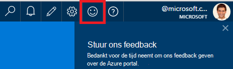
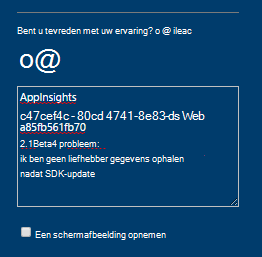
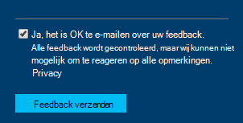

<properties 
    pageTitle="Technische ondersteuning verkrijgen van inzichten Application development team | Microsoft Azure" 
    description="Wanneer er een geval dat speciale ondersteuning van inzichten Application development team vereist, is dit hoe u de details voor ondersteuning kunt indienen." 
    services="application-insights" 
    documentationCenter=""
    authors="alexbulankou" 
    manager="douge"/>
 
<tags 
    ms.service="application-insights" 
    ms.workload="tbd" 
    ms.tgt_pltfrm="ibiza" 
    ms.devlang="na" 
    ms.topic="article" 
    ms.date="06/01/2016" 
    ms.author="albulank"/>
    
# <a name="how-to-get-technical-support-from-application-insights-development-team"></a>Technische ondersteuning verkrijgen van inzichten Application development team
    
Wanneer u een technisch probleem met de [Inzichten van Visual Studio-toepassing](app-insights-overview.md), vindt hier u de opties voor de Help-informatie opvragen:

## <a name="1-check-the-documents"></a>1. Controleer de documenten

* Ontbrekende gegevens? : [Bemonstering](app-insights-sampling.md), [quota en beperken](app-insights-pricing.md).
* Problemen oplossen: [ASP.NET](app-insights-troubleshoot-faq.md) | [Java](app-insights-java-troubleshoot.md)

## <a name="2-search-the-forums"></a>2. Zoek de forums

* [MSDN-forum](https://social.msdn.microsoft.com/Forums/vstudio/home?forum=ApplicationInsights)
* [StackOverflow](http://stackoverflow.com/questions/tagged/ms-application-insights)

## <a name="3-azure-support-plan"></a>3. azure ondersteuningsplan?

Er zijn situaties waarin u ontwikkelaars dat wilt bij het onderzoeken van uw specifieke geval. 

Als u beschikt over een [plan met Microsoft Azure ondersteuning](https://azure.microsoft.com/support/plans/) kunt u [een support ticket openen](https://portal.azure.com/?#blade/Microsoft_Azure_Support/HelpAndSupportBlade).

## <a name="4-contact-the-application-insights-team"></a>4. Neem contact op met het team inzichten van toepassing

Als u een ondersteuningsplan niet hebt, is ons ontwikkelingsteam blij beste inspanning ondersteuning te bieden aan klanten van toepassing inzichten zoals wij voorbereidingen voor de algemene beschikbaarheid mijlpaal treffen. We introduceert **een nieuwe ondersteuningsoptie**: kunt u beschrijven van uw aanvraag aan ons door het verzenden van een feedbackformulier in Azure portal en ontwikkelaar van de toepassing inzichten team contact u terug uw probleem op te lossen.


1. In de [portal Application inzichten](https://portal.azure.com), klikt u op het lachebekje in de rechterbovenhoek:  

       

2. Zorg ervoor dat u **AppInsights** als de eerste regel opgeeft in het opmerkingsvak en vervolgens de volgende gegevens bevatten:   

    ```

    AppInsights   
    ikey: <instrumentation key>   
    sdk: <SDK that you are using, including name and version>  
    issue: <please describe the problem you are having>

    ```   

       

3. Controleer de 'Ja, het is ok te e-mailen'. 

      

Een technicus op het team inzichten toepassing krijgt contact met u snel. Als deze service we op basis van beste inspanningen bieden, kan op dit moment geen formele SLA gegeven.


