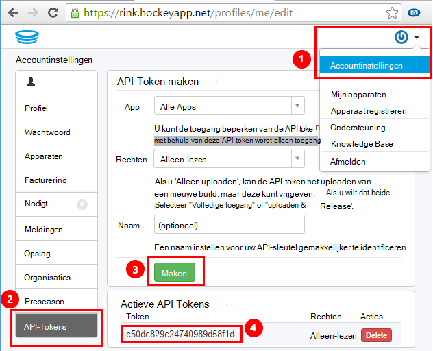
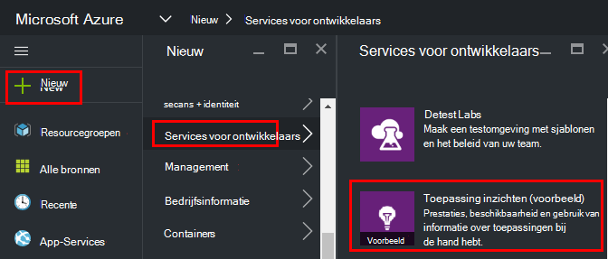
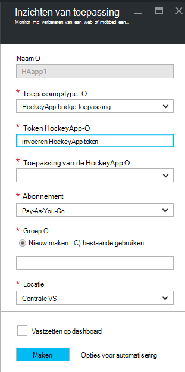
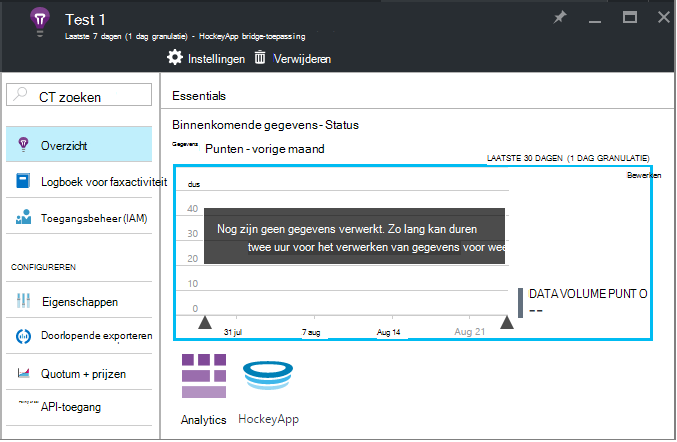
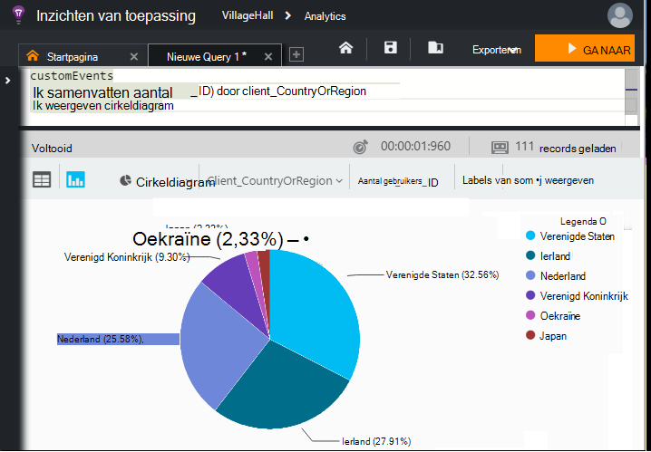

<properties 
    pageTitle="Verkennen van HockeyApp gegevens in inzichten toepassing | Microsoft Azure" 
    description="Gebruik en de prestaties van uw app met toepassing inzichten in Azure analyseren." 
    services="application-insights" 
    documentationCenter="windows"
    authors="alancameronwills" 
    manager="douge"/>

<tags 
    ms.service="application-insights" 
    ms.workload="tbd" 
    ms.tgt_pltfrm="ibiza" 
    ms.devlang="na" 
    ms.topic="article" 
    ms.date="08/25/2016" 
    ms.author="awills"/>

#  HockeyApp gegevens in inzichten toepassing verkennen

[HockeyApp](https://azure.microsoft.com/services/hockeyapp/) is het aanbevolen platform voor het controleren van de live desktop- en mobiele apps. Van HockeyApp, kunt u aangepaste verzenden en traceren van telemetrie gebruik controleren en helpen bij de diagnose (naast crash gegevens ophalen). Deze stroom van telemetrie kan worden opgevraagd met de krachtige [Analytics](app-insights-analytics.md) -functie van [Visual Studio-toepassing inzichten](app-insights-overview.md). Bovendien kunt u [de aangepaste exporteren en telemetrie traceren](app-insights-export-telemetry.md). Als u deze functies inschakelen, moet u een brug die de inzichten van toepassing HockeyApp gegevens doorstuurt instellen.

## De app HockeyApp-brug

De HockeyApp-brug-App is de core-functie waarmee u toegang tot uw gegevens HockeyApp in inzichten van toepassing tot en met de Analytics en exporteren van continue functies. Gegevens die worden verzameld door HockeyApp, na het maken van de brug HockeyApp App wordt via deze functies toegankelijk zijn. Gaan we een van deze Apps Bridge instellen.

Open in de HockeyApp, accountinstellingen, [API-Tokens](https://rink.hockeyapp.net/manage/auth_tokens). Een nieuwe beveiligingssleutel maken of een bestaande opnieuw gebruiken. De minimale rechten vereist zijn "alleen-lezen'. Een kopie van de API token nemen.

Open de Microsoft Azure portal en [maakt u een bron inzichten van toepassing](app-insights-create-new-resource.md). Type toepassing ingesteld op 'HockeyApp bridge toepassing':

U hoeft niet een naam - dit automatisch worden ingesteld met de naam HockeyApp.

De velden HockeyApp bridge worden weergegeven. 

Voer de token van de HockeyApp die u eerder hebt opgeschreven. Deze actie worden in het vervolgkeuzemenu 'Toepassing HockeyApp' met alle toepassingen van de HockeyApp. Selecteer het model dat u wilt gebruiken en vul de resterende velden. 

Open de nieuwe resource. 

Houd er rekening mee dat de gegevens duurt te starten die doorloopt.

Dat is alles. Gegevens die worden verzameld in uw HockeyApp-gestuurde app vanaf dit punt is nu ook beschikbaar zijn in de functies Analytics en continue exporteren van toepassing inzichten.

Laten we kort herzien elk van deze functies nu beschikbaar voor u.

## Analytics

Analytics is een krachtig hulpmiddel voor ad hoc query's van uw gegevens, zodat u kunt opsporen en analyseren van uw Telemetrie en snel hoofdoorzaken en patronen te ontdekken.

* [Meer informatie over Analytics](app-insights-analytics-tour.md)
* [Introductie video](https://channel9.msdn.com/events/Build/2016/T666)
* [Geavanceerde concepten video](https://channel9.msdn.com/Events/Build/2016/P591)

## Doorlopende exporteren

Doorlopende exporteren kunt u uw gegevens exporteren naar een container Azure Blob-opslag. Dit is handig als u wilt uw gegevens langer dan de retentietijd die momenteel worden aangeboden door de inzichten van toepassing. U kunt dat de gegevens in de blob-opslag, in een SQL-Database, of de beste oplossing voor gegevensopslag te verwerken.

[Meer informatie over het exporteren van continue](app-insights-export-telemetry.md)

## Volgende stappen

* [Analytics op uw gegevens toepassen](app-insights-analytics-tour.md)

