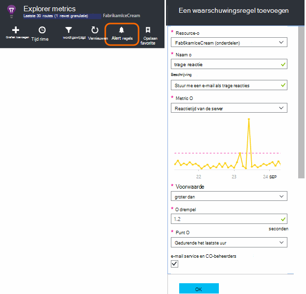
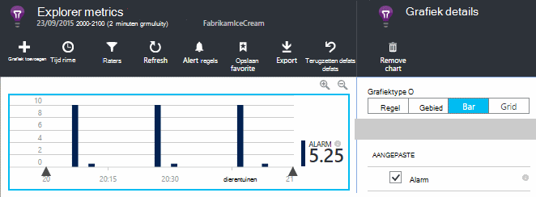
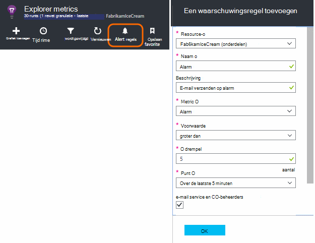
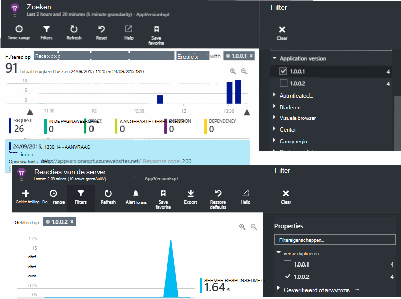
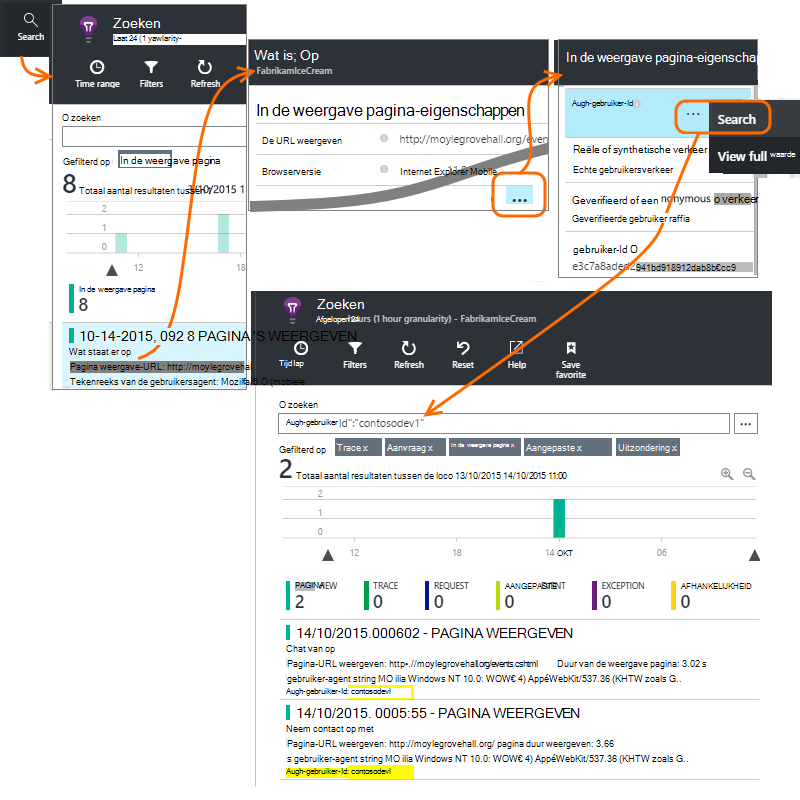
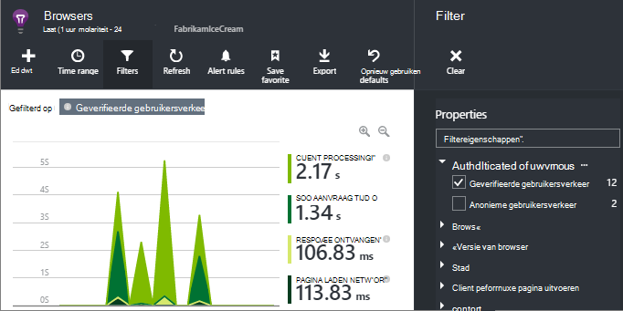
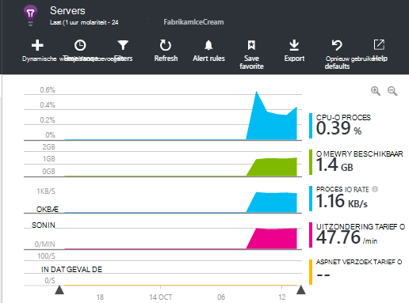

<properties 
    pageTitle="Hoe kan ik... in inzichten toepassing | Microsoft Azure" 
    description="Veelgestelde vragen in de inzichten van toepassing." 
    services="application-insights" 
    documentationCenter=""
    authors="alancameronwills" 
    manager="douge"/>

<tags 
    ms.service="application-insights" 
    ms.workload="tbd" 
    ms.tgt_pltfrm="ibiza" 
    ms.devlang="na" 
    ms.topic="article" 
    ms.date="02/05/2016" 
    ms.author="awills"/>

# <a name="how-do-i--in-application-insights"></a>Hoe kan ik... in inzichten van toepassing?

## <a name="get-an-email-when-"></a>Ontvang een e-mail wanneer...

### <a name="email-if-my-site-goes-down"></a>E-mailadres als Mijn site uitvalt

Stel een [beschikbaarheid van webonderdelen testen](app-insights-monitor-web-app-availability.md).

### <a name="email-if-my-site-is-overloaded"></a>Stuur een e-mail als Mijn site is overladen.

Een [Waarschuwing](app-insights-alerts.md) instellen voor de **reactietijd van de Server**. Een drempel tussen 1 en 2 seconden moet werken.



Uw app ook weergeven tekenen van stam door codes fout terug te keren. Een waarschuwing instellen voor **mislukte aanvragen**.

Als u wilt dat een waarschuwing instellen voor **uitzonderingen**, is het mogelijk [bepaalde extra instellingen](app-insights-asp-net-exceptions.md) doen om te kunnen zien van de gegevens.

### <a name="email-on-exceptions"></a>Uitzonderingen op een e-mail

1. [Uitzondering controle instellen](app-insights-asp-net-exceptions.md)
2. [Een waarschuwing instellen](app-insights-alerts.md) voor de uitzondering count metric


### <a name="email-on-an-event-in-my-app"></a>E-mail van een gebeurtenis in mijn app

Stel dat u wilt graag ontvang een e-mail wanneer een bepaalde gebeurtenis zich voordoet. Toepassing inzichten direct deze mogelijkheid niet bieden, maar kan het [verzenden van een waarschuwing wanneer een metric een drempel kruist](app-insights-alerts.md). 

Waarschuwingen kunnen worden ingesteld op [aangepaste maatstaven](app-insights-api-custom-events-metrics.md#track-metric), maar niet aangepaste gebeurtenissen. Sommige code schrijven voor een metric te vergroten wanneer de gebeurtenis plaatsvindt:

    telemetry.TrackMetric("Alarm", 10);

of:

    var measurements = new Dictionary<string,double>();
    measurements ["Alarm"] = 10;
    telemetry.TrackEvent("status", null, measurements);

Aangezien de waarschuwingen hebben twee lidstaten, hebt u een lage waarde verzenden als u de waarschuwing is beëindigd:

    telemetry.TrackMetric("Alarm", 0.5);

Een grafiek maken in [metrische explorer](app-insights-metrics-explorer.md) voor een overzicht van de wekker:



Stel nu een waarschuwing moet worden gestart zodra de metric boven een mid-waarde voor een korte periode wordt:




Stel de gemiddelde periode tot het minimum. 

U krijgt e-mailberichten wanneer de metric boven gaat en beneden de drempel.

Sommige punten te overwegen:

* Een waarschuwing heeft twee lidstaten ("waarschuwing" en "gezonde"). De status wordt alleen geëvalueerd wanneer een metric is ontvangen.
* Een e-mailbericht wordt alleen verzonden wanneer de status verandert. Dit is waarom u moet verzenden beide hoge en lage waarde metrics. 
* Evaluatie van de waarschuwing, het gemiddelde genomen van de waarden ontvangen over de voorgaande periode. Dit gebeurt telkens wanneer een metric is ontvangen, zodat e-mailberichten vaker dan de periode die u kunnen worden verzonden.
* Aangezien e-mailberichten worden verzonden, zowel op "waarschuwing" en "gezond", kunt u overwegen opnieuw denkt uw one-shot gebeurtenis als een voorwaarde voor de twee statussen. In plaats van een gebeurtenis 'taak voltooid' bijvoorbeeld een voorwaarde "taak in uitvoering" waar u e-mails krijgen aan het begin en einde van een taak.

### <a name="set-up-alerts-automatically"></a>Waarschuwingen automatisch instellen

[Gebruikt u PowerShell nieuwe waarschuwingen maken](app-insights-alerts.md#set-alerts-by-using-powershell)

## <a name="use-powershell-to-manage-application-insights"></a>PowerShell gebruiken voor het beheren van toepassing inzichten

* [Nieuwe resources maken](app-insights-powershell-script-create-resource.md)
* [Nieuwe waarschuwingen maken](app-insights-alerts.md#set-alerts-by-using-powershell)

## <a name="application-versions-and-stamps"></a>Versies van toepassingen en stempels

### <a name="separate-the-results-from-dev-test-and-prod"></a>De resultaten worden gescheiden van de dev-, test- en Prod.-order

* Instellen voor verschillende environmnents, verschillende ikeys
* Voor andere stempels (dev, testen, PO) de telemetrie met verschillende eigenschapswaarden van label

[Meer informatie](app-insights-separate-resources.md)
 

### <a name="filter-on-build-number"></a>Filteren op build-nummer

Wanneer u een nieuwe versie van uw app publiceert, zult u mogelijk te scheiden van de telemetrie van verschillende builds.

U kunt de toepassingsversie-eigenschap kunt instellen, zodat u, [zoekresultaten](app-insights-diagnostic-search.md) en [metrische explorer filteren kunt](app-insights-metrics-explorer.md) . 




Er zijn verschillende methoden van de instelling van de eigenschap Version van toepassing.

* Rechtstreeks instellen:

    `telemetryClient.Context.Component.Version = typeof(MyProject.MyClass).Assembly.GetName().Version;`

* Tekstterugloop toepassen op die regel in een [telemetrie initialiseren](app-insights-api-custom-events-metrics.md#telemetry-initializers) om ervoor te zorgen dat alle exemplaren van de TelemetryClient consistent moet zijn ingesteld.

* [ASP.NET] Instellen van de versie in de `BuildInfo.config`. De versie van het knooppunt BuildLabel komt de webmodule ophalen. Dit bestand in uw project opnemen en moet u de eigenschap altijd kopiëren instellen in de Solution Explorer.

    ```XML

    <?xml version="1.0" encoding="utf-8"?>
    <DeploymentEvent xmlns:xsi="http://www.w3.org/2001/XMLSchema-instance" xmlns:xsd="http://www.w3.org/2001/XMLSchema" xmlns="http://schemas.microsoft.com/VisualStudio/DeploymentEvent/2013/06">
      <ProjectName>AppVersionExpt</ProjectName>
      <Build type="MSBuild">
        <MSBuild>
          <BuildLabel kind="label">1.0.0.2</BuildLabel>
        </MSBuild>
      </Build>
    </DeploymentEvent>

    ```
* [ASP.NET] Automatisch BuildInfo.config genereren in MSBuild. U doet dit door toevoegen een paar regels aan het bestand .csproj:

    ```XML

    <PropertyGroup>
      <GenerateBuildInfoConfigFile>true</GenerateBuildInfoConfigFile>    <IncludeServerNameInBuildInfo>true</IncludeServerNameInBuildInfo>
    </PropertyGroup> 
    ```

    Hiermee wordt een bestand met de naam *yourProjectName*gegenereerd. BuildInfo.config. Het proces publiceren wordt de naam van het BuildInfo.config.

    Het build-label bevat een tijdelijke aanduiding (AutoGen_...) wanneer u met Visual Studio. Maar wanneer gebouwd met MSBuild, het is gevuld met de juiste versienummer.

    U MSBuild voor het genereren van versienummers, stellen de versie zoals `1.0.*` in AssemblyReference.cs

## <a name="monitor-backend-servers-and-desktop-apps"></a>Back-end servers en desktop apps controleren

[Gebruik de module Windows Server SDK](app-insights-windows-desktop.md).


## <a name="visualize-data"></a>Gegevens visualiseren

#### <a name="dashboard-with-metrics-from-multiple-apps"></a>Dashboard met metrische gegevens vanuit meerdere apps

* De grafiek aanpassen en als favoriet opslaan in [Explorer Metric](app-insights-metrics-explorer.md). Vastmaken aan het dashboard Azure.


#### <a name="dashboard-with-data-from-other-sources-and-application-insights"></a>Dashboard met gegevens uit andere bronnen en inzichten van toepassing

* [Telemetrie Power BI exporteren](app-insights-export-power-bi.md). 

Of

* SharePoint als uw dashboard, het weergeven van gegevens in SharePoint-webonderdelen gebruiken. [Doorlopende exporteren en Stream Analytics exporteren naar SQL gebruiken](app-insights-code-sample-export-sql-stream-analytics.md).  PowerView gebruiken om te controleren van de database en het maken van een webonderdeel SharePoint voor PowerView.


<a name="search-specific-users"></a>
### <a name="filter-out-anonymous-or-authenticated-users"></a>Anonieme of geverifieerde gebruikers uitfilteren

Als uw gebruikers zich aanmelden, kunt u de [gebruikers-id geverifieerd](app-insights-api-custom-events-metrics.md#authenticated-users)kunt instellen. (Dit gebeurt niet automatisch.) 

U kunt vervolgens:

* Zoeken op specifieke gebruikers-id 's



* Maatstelsel van anonieme of geverifieerde gebruikers filteren



## <a name="modify-property-names-or-values"></a>De namen van eigenschappen of waarden wijzigen

Een [filter](app-insights-api-filtering-sampling.md#filtering)maken. U kunt wijzigen of telemetrie filteren voordat deze wordt verzonden vanuit de app naar de inzichten van toepassing.

## <a name="list-specific-users-and-their-usage"></a>Specifieke gebruikers en hun gebruik

Als u [Zoeken naar specifieke gebruikers wilt](#search-specific-users), kunt u de [gebruikers-id geverifieerd](app-insights-api-custom-events-metrics.md#authenticated-users)kunt instellen.

Als u een lijst met gebruikers met de gegevens, zoals welke pagina's ze bekijken of hoe vaak ze zich aanmelden, hebt u twee mogelijkheden:

* [Set geverifieerde gebruikers-id](app-insights-api-custom-events-metrics.md#authenticated-users), [exporteren naar een database](app-insights-code-sample-export-sql-stream-analytics.md) en het gebruik geschikte hulpprogramma's voor het analyseren van de gegevens van de gebruiker.
* Als er slechts een klein aantal gebruikers, aangepaste gebeurtenissen of metrics, met behulp van de gegevens die van belang zijn als de naam van de metrische waarde of gebeurtenis en het instellen van de gebruikers-id als een eigenschap verzenden. Vervangen door de standaard JavaScript trackPageView aanroep voor het analyseren van statistieken. Gebruik voor het analyseren van server-side telemetrie, een telemetrie initialiseren de gebruikers-id toevoegen aan alle server telemetrie. U kunt vervolgens filter en segment en zoekopdrachten op de gebruikers-id.


## <a name="reduce-traffic-from-my-app-to-application-insights"></a>Verkeer vanuit Mijn app verkleinen tot inzichten van toepassing

* Schakel in de [ApplicationInsights.config](app-insights-configuration-with-applicationinsights-config.md), alle modules die u niet nodig hebt, die de performance counter collector.
* [Bemonstering en filteren](app-insights-api-filtering-sampling.md) op de SDK gebruiken.
* Beperk het aantal Ajax oproepen gerapporteerd voor de weergave van elke pagina in uw webpagina's. In het fragment script na `instrumentationKey:...` , invoegen: `,maxAjaxCallsPerView:3` (of een geschikte waarde).
* Als u [TrackMetric](app-insights-api-custom-events-metrics.md#track-metric)gebruikt, berekent u het totaal van batches van metrische waarden voordat u het resultaat. Er is een overbelasting van de TrackMetric() waarmee u die.


Meer informatie over [prijzen en de quota](app-insights-pricing.md).

## <a name="disable-telemetry"></a>Telemetrie uitschakelen

**Dynamisch stoppen en starten van** de verzameling en overdracht van de telemetrie van de server:

```

    using  Microsoft.ApplicationInsights.Extensibility;

    TelemetryConfiguration.Active.DisableTelemetry = true;
```


**Uitschakelen van geselecteerde standaard verzamelaars** - bijvoorbeeld prestatiemeteritems, HTTP-aanvragen of afhankelijkheden - verwijderen of de desbetreffende regels in de [ApplicationInsights.config](app-insights-api-custom-events-metrics.md). U kan dit bijvoorbeeld doen als u wilt TrackRequest gegevens verzenden.


## <a name="view-system-performance-counters"></a>Systeemprestatiemeteritems weergeven

Tussen de parameters die u in de explorer metrics weergeven kunt zijn systeem een set prestatiemeteritems. Er is een vooraf gedefinieerde blade- **Servers** die meerdere wordt weergegeven met de titel.



### <a name="if-you-see-no-performance-counter-data"></a>Als er geen gegevens van prestatiemeteritems

* **IIS-server** op uw computer of op een VM. [Statusmonitor niet installeren](app-insights-monitor-performance-live-website-now.md). 
* **Website van azure** - we prestatiemeters nog niet ondersteunen. Er zijn diverse maatstelsels u als standaard onderdeel van de website van Azure in het Configuratiescherm krijgt.
* **UNIX-server** - [collectd installeren](app-insights-java-collectd.md)

### <a name="to-display-more-performance-counters"></a>Meer items weergeven

* Eerst [een nieuwe grafiek toevoegen](app-insights-metrics-explorer.md) en om te zien als de teller in de basic die wij bieden.
* Als dat niet het geval is, wordt [het item naar de set die wordt verzameld door de module prestatiemeteritems toevoegen](app-insights-performance-counters.md).


