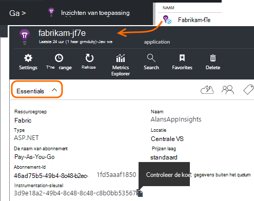
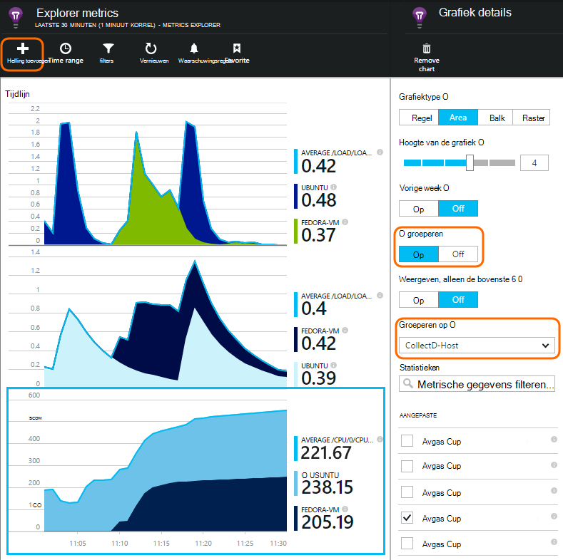

<properties 
    pageTitle="collectd: perf stats voor Java op Unix in inzichten van toepassing" 
    description="Uitgebreide controle van uw Java-website met de invoegtoepassing CollectD voor toepassing inzichten" 
    services="application-insights" 
    documentationCenter="java"
    authors="alancameronwills" 
    manager="douge"/>

<tags 
    ms.service="application-insights" 
    ms.workload="tbd" 
    ms.tgt_pltfrm="ibiza" 
    ms.devlang="na" 
    ms.topic="article" 
    ms.date="08/24/2016" 
    ms.author="awills"/>
 
# <a name="collectd-unix-performance-metrics-in-application-insights"></a>collectd: Unix-prestatiegegevens in inzichten van toepassing

*Inzichten van toepassing is in het afdrukvoorbeeld.*

Installeren om systeemprestaties Unix in [Toepassing inzichten](app-insights-overview.md), [collectd](http://collectd.org/), samen met de invoegtoepassing toepassing inzichten. Deze open source oplossing worden verschillende systeem- en netwerk statistieken verzameld.

Meestal gebruikt u collectd als u al hebt [geïmplementeerd, uw Java-webservice met de inzichten van toepassing][java]. Het biedt u meer gegevens kunt verbeteren de prestaties van uw app of problemen. 


## <a name="get-your-instrumentation-key"></a>Ophalen van uw sleutel instrumentation

In de [portal van Microsoft Azure](https://portal.azure.com), de [Toepassing inzichten](app-insights-overview.md) bron openen waar u de gegevens wilt weergeven. (Of [een nieuwe bron maken](app-insights-create-new-resource.md).)

Een kopie van de sleutel instrumentation de bron geeft in beslag nemen.




## <a name="install-collectd-and-the-plug-in"></a>Collectd en de invoegtoepassing installeren

Op de Unix-servers:

1. [Collectd](http://collectd.org/) versie 5.4.0 installeren of later.
2. De [toepassing inzichten collectd writer plugin](https://aka.ms/aijavasdk)downloaden. Noteer het versienummer.
3. Kopie in de invoegtoepassing JAR- `/usr/share/collectd/java`.
3. Bewerken `/etc/collectd/collectd.conf`:
 * Zorg ervoor dat [de Java-invoegtoepassing](https://collectd.org/wiki/index.php/Plugin:Java) is ingeschakeld.
 * De JVMArg voor de java.class.path om op te nemen van de volgende JAR bijwerken. Het versienummer overeen met de gedownloade update:
  * `/usr/share/collectd/java/applicationinsights-collectd-1.0.5.jar`
 * In dit fragment, met de sleutel van de instrumenten van de resource toevoegen:

```

     LoadPlugin "com.microsoft.applicationinsights.collectd.ApplicationInsightsWriter"
     <Plugin ApplicationInsightsWriter>
        InstrumentationKey "Your key"
     </Plugin>
```

Dit is onderdeel van een voorbeeld configuratiebestand:

    ...
    # collectd plugins
    LoadPlugin cpu
    LoadPlugin disk
    LoadPlugin load
    ...

    # Enable Java Plugin
    LoadPlugin "java"

    # Configure Java Plugin
    <Plugin "java">
      JVMArg "-verbose:jni"
      JVMArg "-Djava.class.path=/usr/share/collectd/java/applicationinsights-collectd-1.0.5.jar:/usr/share/collectd/java/collectd-api.jar"

      # Enabling Application Insights plugin
      LoadPlugin "com.microsoft.applicationinsights.collectd.ApplicationInsightsWriter"
                
      # Configuring Application Insights plugin
      <Plugin ApplicationInsightsWriter>
        InstrumentationKey "12345678-1234-1234-1234-123456781234"
      </Plugin>

      # Other plugin configurations ...
      ...
    </Plugin>
.   ...

Configureer andere [collectd Plug-ins](https://collectd.org/wiki/index.php/Table_of_Plugins), die verschillende gegevens uit verschillende bronnen verzamelen kunt.

Collectd volgens haar [handmatig](https://collectd.org/wiki/index.php/First_steps)opnieuw te starten.

## <a name="view-the-data-in-application-insights"></a>De gegevens in inzichten toepassing weergeven

Open in de bron toepassing inzichten [Explorer statistieken en grafieken toevoegen][metrics], selecteren van de parameters die u wilt zien in de categorie aangepast.



Standaard worden de cijfers samengevoegd alle host machines waarvan de cijfers werden verzameld. Om de statistieken per host in de grafiek gegevens blade bekijken, groepering inschakelen en kies vervolgens groeperen op CollectD-Host.


## <a name="to-exclude-upload-of-specific-statistics"></a>Uploaden van specifieke statistieken uitsluiten

Standaard verzendt de invoegtoepassing inzichten van toepassing de gegevens die zijn verzameld door de ingeschakelde collectd plugins lezen. 

Gegevens uitsluiten van specifieke Plug-ins of gegevens-bronnen:

* Bewerk het configuratiebestand. 
* In `<Plugin ApplicationInsightsWriter>`, richtlijn regels als volgt toevoegen:

Richtlijn | Effect
---|---
`Exclude disk` | Uitsluiten van alle gegevens die zijn verzameld door de `disk` plugin
`Exclude disk:read,write` | Uitsluiten van de bronnen met de naam `read` en `write` van de `disk` plugin.

Bijzondere richtlijnen met een nieuwe regel.


## <a name="problems"></a>Problemen?

*Ik zie geen gegevens in de portal*

* Open [Zoeken] [ diagnostic] om te zien als de ruwe gebeurtenissen zijn aangekomen. Soms duurt langer worden weergegeven in Verkenner maatstaven.
* Mogelijk moet u [firewall-uitzonderingen voor uitgaande gegevens instellen](app-insights-ip-addresses.md)
* Traceren inschakelen in de invoegtoepassing inzichten van toepassing. Voeg deze regel binnen `<Plugin ApplicationInsightsWriter>`:
 *  `SDKLogger true`
* Open een terminal en start collectd in de uitgebreide modus, om te zien of er problemen meldt:
 * `sudo collectd -f`


<!--Link references-->

[api]: app-insights-api-custom-events-metrics.md
[apiexceptions]: app-insights-api-custom-events-metrics.md#track-exception
[availability]: app-insights-monitor-web-app-availability.md
[diagnostic]: app-insights-diagnostic-search.md
[eclipse]: app-insights-java-eclipse.md
[java]: app-insights-java-get-started.md
[javalogs]: app-insights-java-trace-logs.md
[metrics]: app-insights-metrics-explorer.md
[usage]: app-insights-web-track-usage.md

 
