<properties 
    pageTitle="Aan de slag met de toepassing van inzichten met Java in Eclips" 
    description="Gebruik de invoegtoepassing Eclips prestaties en gebruik controleren van uw Java-website met de inzichten van toepassing toevoegen" 
    services="application-insights" 
    documentationCenter="java"
    authors="alancameronwills" 
    manager="douge"/>

<tags 
    ms.service="application-insights" 
    ms.workload="tbd" 
    ms.tgt_pltfrm="ibiza" 
    ms.devlang="na" 
    ms.topic="article" 
    ms.date="03/02/2016" 
    ms.author="awills"/>
 
# Aan de slag met de toepassing van inzichten met Java in Eclips

Zodat u en de prestaties analyseren kunt, de toepassing inzichten SDK telemetrie verzendt vanuit uw webtoepassing van Java. De invoegtoepassing voor toepassing inzichten Eclips installeert automatisch de SDK in uw project zodat u zich buiten het vak telemetrie, plus een API die u kunt gebruiken voor het schrijven van aangepaste telemetrie.   

## Vereisten

Op dit moment de plug-in werkt voor Maven projecten en dynamische Web-projecten in de Eclips. ([Toepassing inzichten toevoegen aan andere soorten Java project][java].)

U hebt het volgende nodig:

* Oracle JRE 1.6 of hoger
* Een abonnement op [Microsoft Azure](https://azure.microsoft.com/). (U kunt starten met de [gratis proefversie](https://azure.microsoft.com/pricing/free-trial/).)
* [Eclips IDE voor ontwikkelaars van Java EE](http://www.eclipse.org/downloads/), Indigo of hoger.
* Windows 7 of hoger, of Windows Server 2008 of hoger

## De SDK installeren op Eclips (eenmalig)

U hoeft alleen te doen dit één keer per computer. In deze stap installeert een toolkit die vervolgens de SDK aan elk dynamische Web Project kunt toevoegen.

1. In de Eclips, klikt u op Help, nieuwe Software installeren.

    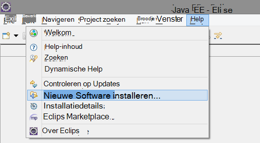

2. De SDK is in http://dl.windowsazure.com/eclipse onder Azure Toolkit. 
3. Schakel het selectievakje **contact opnemen met alle update-sites...**

    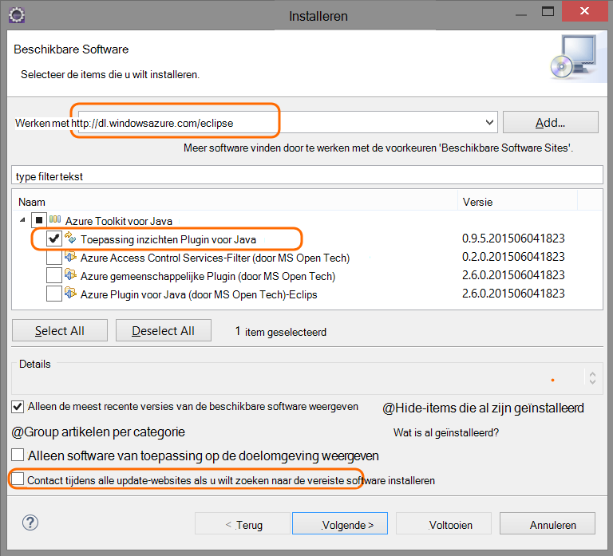

De overige stappen voor elk project van Java.

## Maakt u een bron toepassing inzichten in Azure

1. Log in om de [Azure portal](https://portal.azure.com).
2. Maak een nieuwe resource van toepassing inzichten.  

    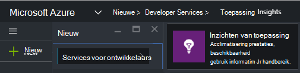  
3. Het toepassingstype Java webtoepassing instellen.  

    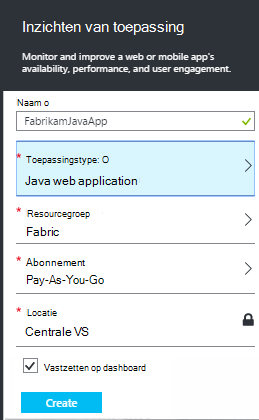  
4. De instrumentatie vinden van de nieuwe resource. U moet dit binnenkort in uw CodeProject plakken.  

      

## Inzichten van de toepassing aan uw project toevoegen

1. Toepassing inzichten in het contextmenu van het Java webproject toevoegen.

    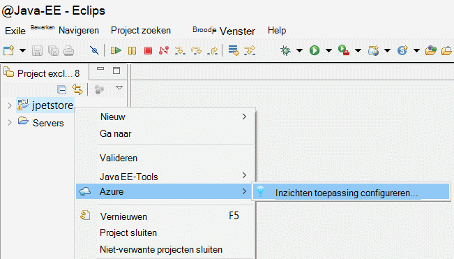

2. Plak de instrumentation sleutel die u hebt gekregen van het portal voor Azure.

    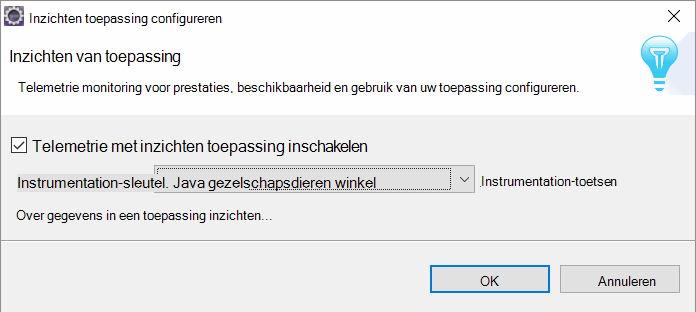

De sleutel wordt meegestuurd met alle items van Telemetrie en inzichten van de toepassing weer te geven in de bron wordt aangegeven.

## Start de toepassing en statistieken bekijken

De toepassing wordt uitgevoerd.

Terug naar de bron van de inzichten van de toepassing in Microsoft Azure.

HTTP-verzoeken gegevens worden weergegeven op het blad Overzicht. (Als deze er niet is, wacht een paar seconden en klik vervolgens op vernieuwen.)

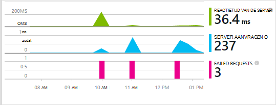
 

Klik op een grafiek om te zien meer gedetailleerde statistieken. 

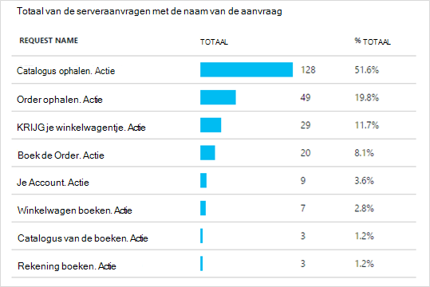

[Meer informatie over parameters.][metrics]

 

En wanneer de eigenschappen van een aanvraag, kunt u de telemetrie gebeurtenissen gekoppeld zoals aanvragen en uitzonderingen.
 
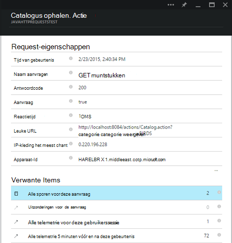

## Client-side telemetrie

Klik op Get code voor het controleren van mijn webpagina's van de bladeserver QuickStart: 

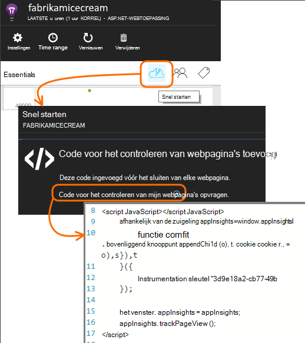

Het codefragment invoegen in de kop van de HTML-bestanden.

#### Client-side-gegevens weergeven

Bijgewerkte webpagina's openen en gebruiken. Wacht een minuut of twee, en vervolgens terug te keren naar de inzichten van de toepassing en het gebruik van blade open. (Het blad Overzicht Schuif naar beneden en klik op Taakgebruik.)

Pagina weergave, de gebruiker en de sessie statistieken worden weergegeven op het blad gebruik:

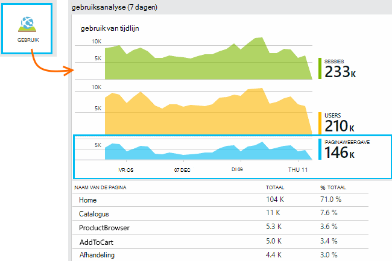

[Meer informatie over het instellen van client-side telemetrie.][usage]

## Publiceer de toepassing

Nu uw app publiceren naar de server, kunnen mensen gebruik en controle van de telemetrie op de portal weergegeven.

* Zorg ervoor dat uw firewall kan uw toepassing telemetrie verzenden tot deze poorten:

 * DC.Services.visualstudio.com:443
 * DC.Services.visualstudio.com:80
 * F5.Services.visualstudio.com:443
 * F5.Services.visualstudio.com:80

* Installeren op Windows-servers:

 * [Microsoft Visual C++ Redistributable](http://www.microsoft.com/download/details.aspx?id=40784)

    (Hiermee kunt u prestatiemeteritems.)

## Uitzonderingen en mislukte aanvraag

Niet-verwerkte uitzonderingen worden automatisch verzameld:

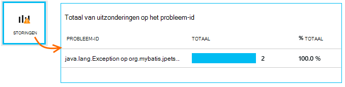

Om gegevens te verzamelen over andere uitzonderingen, hebt u twee mogelijkheden:

* Het [aanroepen van TrackException in uw code invoegen](app-insights-api-custom-events-metrics.md#track-exception). 
* [De Java-Agent op de server installeren](app-insights-java-agent.md). U de methoden die u wilt bekijken.

## Methodeaanroepen en externe afhankelijkheden controleren

[De Agent Java installeren](app-insights-java-agent.md) aanmelden opgegeven interne methoden en oproepen via JDBC, met timinggegevens.

## Prestatiemeteritems

Uw overzicht blade, schuif naar beneden en klik op de tegel **Servers** . Hier ziet u een reeks prestatiemeters.

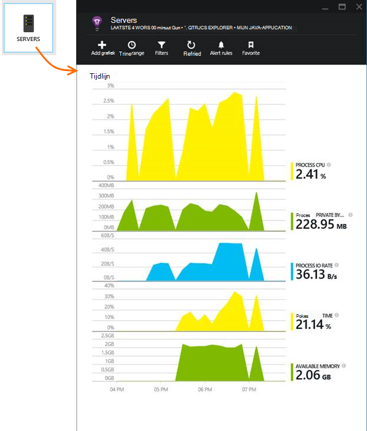

### Verzameling van prestatiemeteritems aanpassen

Collectie van de standaard set prestatiemeteritems uitschakelen, voeg de volgende code onder het hoofdknooppunt van het bestand ApplicationInsights.xml:

    <PerformanceCounters>
       <UseBuiltIn>False</UseBuiltIn>
    </PerformanceCounters>

### Aanvullende prestatie-items verzamelen

U kunt extra prestatiemeteritems te innen.

#### JMX-items (weergegeven door de Java Virtual Machine)

    <PerformanceCounters>
      <Jmx>
        <Add objectName="java.lang:type=ClassLoading" attribute="TotalLoadedClassCount" displayName="Loaded Class Count"/>
        <Add objectName="java.lang:type=Memory" attribute="HeapMemoryUsage.used" displayName="Heap Memory Usage-used" type="composite"/>
      </Jmx>
    </PerformanceCounters>

*   `displayName`-De naam die wordt weergegeven in de portal Application inzichten.
*   `objectName`-De naam van het object JMX.
*   `attribute`: Het kenmerk van de naam JMX-object op te halen
*   `type`(optioneel) - het type kenmerk JMX-object:
 *  Standaard: een eenvoudig type zoals integer of long.
 *  `composite`: de prestatiemetergegevens is de notatie 'Attribute.Data'
 *  `tabular`: de prestatiemetergegevens heeft de indeling van een tabelrij

#### Prestatiemeteritems van Windows

Elke [Windows Prestatiemeter](https://msdn.microsoft.com/library/windows/desktop/aa373083.aspx) is een lid van een categorie (op dezelfde manier dat een veld een lid van een klasse is). Categorieën kan zijn van globale, of niveaus of u benoemde exemplaren.

    <PerformanceCounters>
      <Windows>
        <Add displayName="Process User Time" categoryName="Process" counterName="%User Time" instanceName="__SELF__" />
        <Add displayName="Bytes Printed per Second" categoryName="Print Queue" counterName="Bytes Printed/sec" instanceName="Fax" />
      </Windows>
    </PerformanceCounters>

*   displayName: de naam die wordt weergegeven in de portal Application inzichten.
*   Categorienaam: het Prestatiemeteritem-categorie (prestatie-object) waaraan dit prestatiemeteritem gekoppeld is.
*   counterName – de naam van de Prestatiemeter.
*   instanceName – de naam van het exemplaar van het Prestatiemeteritem categorie of een lege tekenreeks (""), als de categorie een enkel exemplaar bevat. Als de categorienaam is een proces en de Prestatiemeter die u wilt verzamelen uit het huidige proces van JVM op die de toepassing wordt uitgevoerd, geeft u `"__SELF__"`.

De prestatiemeteritems zichtbaar zijn als aangepaste metrics in [Explorer Metrics][metrics].

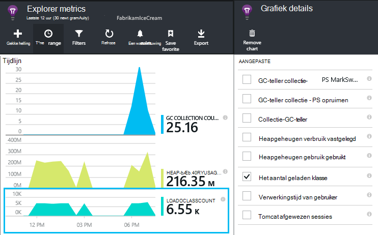

### Prestatiemeteritems voor UNIX

* [Collectd met de invoegtoepassing voor de inzichten van de toepassing installeren](app-insights-java-collectd.md) om een grote verscheidenheid aan gegevens en het netwerk.

## Beschikbaarheid van web-tests

Toepassing inzichten kunnen testen uw website regelmatig te controleren of is het goed reageert. [Voor het instellen van][availability], schuif naar beneden te klikken op beschikbaarheid.

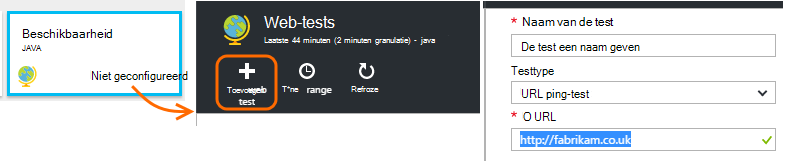

Krijgt u grafieken responstijden, plus e-mailberichten als uw site afgesloten wordt.

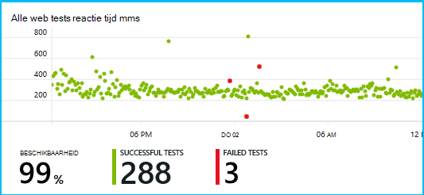

[Meer informatie over de beschikbaarheid van web-tests.][availability] 

## Diagnoselogboeken

Als u Logback of Log4J (v1.2 of v2.0) voor overtrekken, hebt u uw traceerlogboeken automatisch verzonden naar de inzichten van Application kunt u verkennen en zoeken op deze.

[Meer informatie over diagnostische logboeken][javalogs]

## Aangepaste telemetrie 

Een paar regels code invoegen in uw webtoepassing van Java om erachter te komen wat gebruikers ermee doen of om te helpen bij het vaststellen van problemen. 

U kunt een code invoegen in webpagina's, JavaScript en de server-side Java.

[Meer informatie over aangepaste telemetrie][track]

## Volgende stappen

#### Opsporen en onderzoeken van problemen

* [Toevoegen web client telemetrie] [ usage] prestaties telemetrie ophalen uit de-webclient.
* [Web tests instellen] [ availability] controleren of uw toepassing blijft live en reageert.
* [Gebeurtenissen en logboeken zoeken] [ diagnostic] om u te helpen bij het vaststellen van problemen.
* [Leggen van sporen van Log4J of Logback][javalogs]

#### Gebruik bijhouden

* [Toevoegen web client telemetrie] [ usage] monitor paginaweergaven en elementaire gebruiker statistieken.
* [Aangepaste gebeurtenissen en statistieken bijhouden] [ track] voor meer informatie over hoe uw toepassing wordt gebruikt, zowel op de client en de server.

<!--Link references-->

[availability]: app-insights-monitor-web-app-availability.md
[diagnostic]: app-insights-diagnostic-search.md
[java]: app-insights-java-get-started.md
[javalogs]: app-insights-java-trace-logs.md
[metrics]: app-insights-metrics-explorer.md
[track]: app-insights-api-custom-events-metrics.md
[usage]: app-insights-web-track-usage.md

 