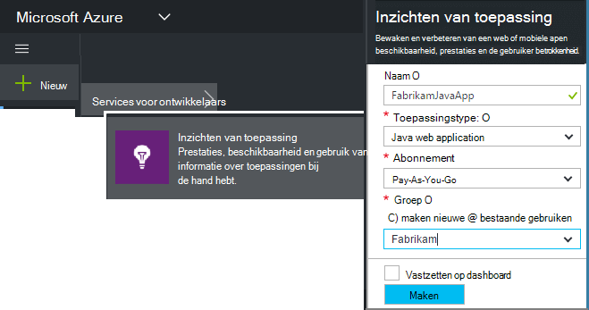
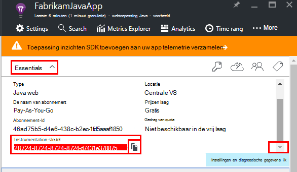
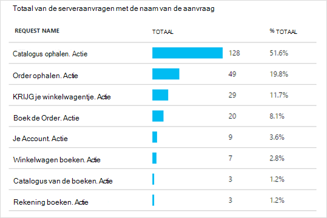
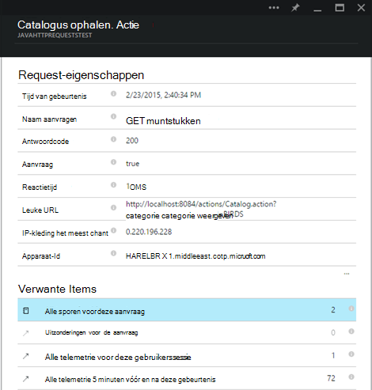
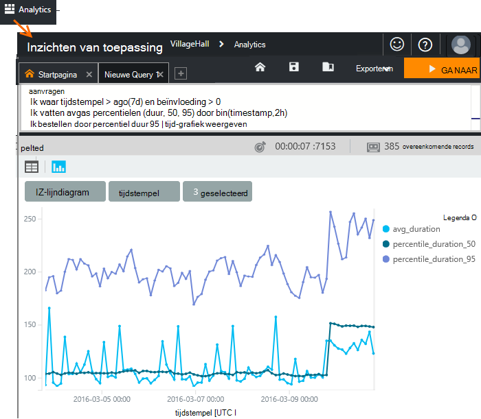
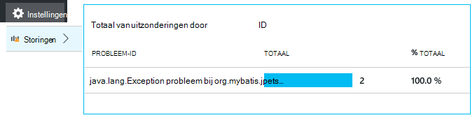
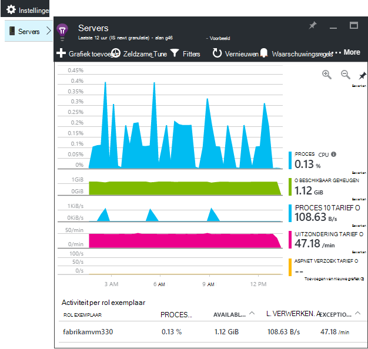
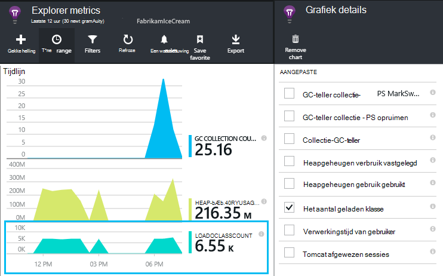
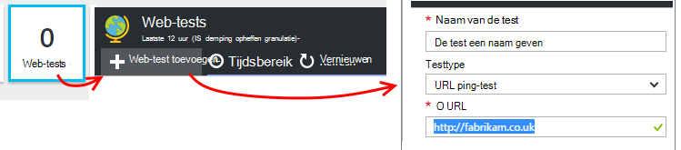
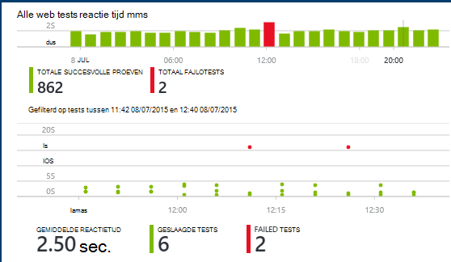

<properties
    pageTitle="Java web app analytics met inzichten toepassing | Microsoft Azure"
    description="Controleren van prestaties en het gebruik van uw Java-website met de inzichten van toepassing. "
    services="application-insights"
    documentationCenter="java"
    authors="alancameronwills"
    manager="douge"/>

<tags
    ms.service="application-insights"
    ms.workload="tbd"
    ms.tgt_pltfrm="ibiza"
    ms.devlang="na"
    ms.topic="get-started-article"
    ms.date="08/17/2016"
    ms.author="awills"/>

# Aan de slag met de inzichten van toepassing in Java webproject

*Inzichten van toepassing is in het afdrukvoorbeeld.*

[AZURE.INCLUDE [app-insights-selector-get-started](../../includes/app-insights-selector-get-started.md)]

[Inzichten van toepassing](https://azure.microsoft.com/services/application-insights/) is een uitbreidbare analytics-service waarmee u inzicht in de prestaties en het gebruik van de actieve toepassing. [Opsporen en onderzoeken van prestatieproblemen en uitzonderingen](app-insights-detect-triage-diagnose.md)en het [schrijven van code] [ api] voor het bijhouden van wat gebruikers doen met de app.

Toepassing inzichten biedt ondersteuning voor Java-toepassingen op Linux, Unix of Windows.

Hebt u nodig:

* Oracle JRE 1.6 of hoger of Zulu JRE 1.6 of hoger
* Een abonnement op [Microsoft Azure](https://azure.microsoft.com/). (U kunt starten met de [gratis proefversie](https://azure.microsoft.com/pricing/free-trial/).)

*Als u een web app dat al is live, kan u de alternatieve procedure volgen [de SDK in runtime op de webserver](app-insights-java-live.md)toevoegen. Die alternatieve vermijdt het opnieuw samenstellen van de code, maar u kunt niet kiezen voor het schrijven van code voor het bijhouden van gebruikersactiviteiten.*

## 1. een toepassing inzichten instrumentation-sleutel ophalen

1. Log in op de [portal van Microsoft Azure](https://portal.azure.com).
2. Maak een bron inzichten van toepassing. Het toepassingstype Java webtoepassing instellen.

    
4. De instrumentatie vinden van de nieuwe resource. U moet deze sleutel binnenkort in uw CodeProject plakken.

    

## 2. de toepassing inzichten SDK voor Java aan uw project toevoegen

*Kies de juiste manier voor uw project.*

#### Als u een dynamische website of Maven project maken Eclips...

De [Toepassing inzichten SDK voor Java-invoegtoepassing][eclipse].

#### Als u gebruikmaakt van Maven...

Als uw project is al ingesteld om Maven te gebruiken voor het bouwen, samen te voegen met de volgende code aan uw pom.xml bestand.

Vernieuw de Projectafhankelijkheden als u de binaire bestanden gedownload.

    <repositories>
       <repository>
          <id>central</id>
          <name>Central</name>
          <url>http://repo1.maven.org/maven2</url>
       </repository>
    </repositories>

    <dependencies>
      <dependency>
        <groupId>com.microsoft.azure</groupId>
        <artifactId>applicationinsights-web</artifactId>
        <!-- or applicationinsights-core for bare API -->
        <version>[1.0,)</version>
      </dependency>
    </dependencies>

* *Build of checksum validatiefouten?* Probeer met een specifieke versie, zoals: `<version>1.0.n</version>`. U vindt de meest recente versie in de [SDK release-opmerkingen](https://github.com/Microsoft/ApplicationInsights-Java#release-notes) of in onze [Maven artefacten](http://search.maven.org/#search%7Cga%7C1%7Capplicationinsights).
* *Moet bijwerken naar een nieuwe SDK?* Vernieuwen van uw project afhankelijkheden.

#### Als u gebruikmaakt van Gradle...

Als uw project is al ingesteld om Gradle te gebruiken voor het bouwen, samen te voegen met de volgende code aan het bestand build.gradle.

Vernieuw de Projectafhankelijkheden als u de binaire bestanden gedownload.

    repositories {
      mavenCentral()
    }

    dependencies {
      compile group: 'com.microsoft.azure', name: 'applicationinsights-web', version: '1.+'
      // or applicationinsights-core for bare API
    }

* *Versie en controlesom validatie fouten? Probeer met een specifieke versie, zoals:* `version:'1.0.n'`. *In de [SDK release-informatie](https://github.com/Microsoft/ApplicationInsights-Java#release-notes)vindt u de meest recente versie.*
* *Bij te werken naar een nieuwe SDK*
 * Vernieuwen van uw project afhankelijkheden.

#### Anders...

De SDK handmatig toevoegen:

1. Download de [toepassing inzichten SDK voor Java](https://aka.ms/aijavasdk).
2. De binaire bestanden in het zip-bestand uitpakken en toevoegen aan uw project.

### Vragen...

* *Wat is de relatie tussen de `-core` en `-web` -onderdelen in de zip?*

 * `applicationinsights-core`hebt u de BMR-API. U moet altijd dit onderdeel.
 * `applicationinsights-web`hebt u maatstelsel dat HTTP-verzoek tellingen en responstijden. U kunt deze component weglaten als u niet dat dit automatisch verzameld telemetrie wilt. Bijvoorbeeld, als u wilt schrijven zelf.

* *De SDK bijwerken wanneer we wijzigingen publiceren*
 * Download de meest recente [Toepassing inzichten SDK voor Java](https://aka.ms/qqkaq6) en vervang de oude cijfers.
 * Wijzigingen worden beschreven in de [SDK release-opmerkingen](https://github.com/Microsoft/ApplicationInsights-Java#release-notes).

## 3. een toepassing inzichten XML-bestand toevoegen

ApplicationInsights.xml toevoegen aan de map resources in uw project, of zorg ervoor dat deze is toegevoegd aan het klassepad voor implementatie van uw project. De volgende XML-code kopiëren naar het.

Vervangen door de sleutel instrumentatie die u hebt gekregen van het portal voor Azure.

    <?xml version="1.0" encoding="utf-8"?>
    <ApplicationInsights xmlns="http://schemas.microsoft.com/ApplicationInsights/2013/Settings" schemaVersion="2014-05-30">

      <!-- The key from the portal: -->

      <InstrumentationKey>** Your instrumentation key **</InstrumentationKey>

      <!-- HTTP request component (not required for bare API) -->

      <TelemetryModules>
        <Add type="com.microsoft.applicationinsights.web.extensibility.modules.WebRequestTrackingTelemetryModule"/>
        <Add type="com.microsoft.applicationinsights.web.extensibility.modules.WebSessionTrackingTelemetryModule"/>
        <Add type="com.microsoft.applicationinsights.web.extensibility.modules.WebUserTrackingTelemetryModule"/>
      </TelemetryModules>

      <!-- Events correlation (not required for bare API) -->
      <!-- These initializers add context data to each event -->

      <TelemetryInitializers>
        <Add   type="com.microsoft.applicationinsights.web.extensibility.initializers.WebOperationIdTelemetryInitializer"/>
        <Add type="com.microsoft.applicationinsights.web.extensibility.initializers.WebOperationNameTelemetryInitializer"/>
        <Add type="com.microsoft.applicationinsights.web.extensibility.initializers.WebSessionTelemetryInitializer"/>
        <Add type="com.microsoft.applicationinsights.web.extensibility.initializers.WebUserTelemetryInitializer"/>
        <Add type="com.microsoft.applicationinsights.web.extensibility.initializers.WebUserAgentTelemetryInitializer"/>

      </TelemetryInitializers>
    </ApplicationInsights>

* De sleutel instrumentation wordt meegestuurd met alle items van Telemetrie en inzichten van de toepassing weer te geven in de bron wordt aangegeven.
* Het onderdeel HTTP-aanvraag is optioneel. Telemetrie over aanvragen en responstijden wordt automatisch verzonden naar het portaal.
* Gebeurtenissen correlatie is een aanvulling op het onderdeel HTTP-aanvraag. Het wordt een id toegewezen aan elk verzoek dat door de server ontvangen en deze id als een eigenschap aan elk item van telemetrie toegevoegd als de eigenschap 'Operation.Id'. U kunt de telemetrie die is gekoppeld aan elke aanvraag door een filter in [Diagnostische zoeken]correleren[diagnostic].
* De toets toepassing inzichten dynamisch kan worden doorgegeven via de portal Azure als een systeemeigenschap (-DAPPLICATION_INSIGHTS_IKEY = your_ikey). Als er geen eigenschap is gedefinieerd, wordt gecontroleerd voor de omgevingsvariabele (APPLICATION_INSIGHTS_IKEY) in Azure App instellingen. Als beide eigenschappen gedefinieerd zijn, gebruikt de standaard InstrumentationKey van ApplicationInsights.xml. Deze reeks kunt u verschillende InstrumentationKeys voor verschillende omgevingen dynamisch beheren.

### Alternatieve manieren om de sleutel instrumentation instellen

Toepassing inzichten SDK wordt gezocht naar de sleutel in deze volgorde:

1. Systeemeigenschap:-DAPPLICATION_INSIGHTS_IKEY = your_ikey
2. Omgevingsvariabele: APPLICATION_INSIGHTS_IKEY
3. Configuratiebestand: ApplicationInsights.xml

U kunt ook [instellen in de code](app-insights-api-custom-events-metrics.md#ikey):

    telemetryClient.InstrumentationKey = "...";

## 4. een HTTP-filter toevoegen

De laatste configuratiestap kunt het onderdeel HTTP-aanvraag aan te melden, elk. (Niet vereist als u alleen de bare-API wilt).

Open het bestand web.xml in uw project en samenvoegen met de volgende code onder het knooppunt web app, waar de toepassingsfilters worden geconfigureerd.

Als u de meest nauwkeurige resultaten, moet het filter vóór alle andere filters worden toegewezen.

    <filter>
      <filter-name>ApplicationInsightsWebFilter</filter-name>
      <filter-class>
        com.microsoft.applicationinsights.web.internal.WebRequestTrackingFilter
      </filter-class>
    </filter>
    <filter-mapping>
       <filter-name>ApplicationInsightsWebFilter</filter-name>
       <url-pattern>/*</url-pattern>
    </filter-mapping>

#### Als u Web lente MVC 3.1 of hoger

Bewerk deze elementen om het pakket inzichten van toepassing zijn:

    <context:component-scan base-package=" com.springapp.mvc, com.microsoft.applicationinsights.web.spring"/>

    <mvc:interceptors>
        <mvc:interceptor>
            <mvc:mapping path="/**"/>
            <bean class="com.microsoft.applicationinsights.web.spring.RequestNameHandlerInterceptorAdapter" />
        </mvc:interceptor>
    </mvc:interceptors>

#### Als u gebruikmaakt van Struts 2

Dit item toevoegen aan het stutten voor configuratiebestand (meestal met de naam struts.xml of stutten voor default.xml):

     <interceptors>
       <interceptor name="ApplicationInsightsRequestNameInterceptor" class="com.microsoft.applicationinsights.web.struts.RequestNameInterceptor" />
     </interceptors>
     <default-interceptor-ref name="ApplicationInsightsRequestNameInterceptor" />

(Als u gedefinieerd in een stapel standaard interceptors hebt, de interceptor kan eenvoudig worden toegevoegd aan die stapel.)

## 5. de toepassing uitvoeren

U kunt uitvoeren in de foutopsporingsmodus op de ontwikkelcomputer of op de server publiceren.

## 6. uw telemetrie in inzichten toepassing weergeven

Terug naar de bron toepassing inzichten in [Microsoft Azure portal](https://portal.azure.com).

HTTP-verzoeken gegevens worden weergegeven op het blad Overzicht. (Als deze er niet is, wacht een paar seconden en klik vervolgens op vernieuwen.)

[Meer informatie over parameters.][metrics]

Klik op de grafiek meer gedetailleerde geaggregeerde statistieken zien.

> Toepassing inzichten wordt ervan uitgegaan dat de indeling van de HTTP-aanvragen voor MVC toepassingen: `VERB controller/action`. Bijvoorbeeld, `GET Home/Product/f9anuh81`, `GET Home/Product/2dffwrf5` en `GET Home/Product/sdf96vws` zijn gegroepeerd in `GET Home/Product`. Deze groepering kan zinvolle aggregaties van aanvragen, zoals het aantal aanvragen en gemiddelde verwerkingstijd voor aanvragen.

### Exemplaargegevens 

Klik op een specifiek verzoek type afzonderlijke exemplaren te zien. 

Twee soorten gegevens worden weergegeven in de toepassing inzichten: samengevoegde gegevens, opgeslagen en weergegeven als gemiddelden, aantallen en bedragen; en van de exemplaargegevens - afzonderlijke rapporten van HTTP-aanvragen, uitzonderingen, bezoekers of aangepaste gebeurtenissen.

Bij het bekijken van de eigenschappen van een aanvraag, ziet u de telemetrie gebeurtenissen gekoppeld zoals aanvragen en uitzonderingen.

### Analytics: Krachtige querytaal

Als u meer gegevens verzamelen, kunt u uitvoeren van query's met statistische gegevens en om afzonderlijke exemplaren te vinden. [Analytics]() is een krachtig hulpmiddel voor zowel voor informatie over prestaties en gebruik als voor diagnostische doeleinden.

## 7. uw app installeren op de server

Nu uw app publiceren naar de server, kunnen mensen gebruik en controle van de telemetrie op de portal weergegeven.

* Zorg ervoor dat uw firewall kan uw toepassing telemetrie verzenden tot deze poorten:

 * DC.Services.visualstudio.com:443
 * F5.Services.visualstudio.com:443

* Installeren op Windows-servers:

 * [Microsoft Visual C++ Redistributable](http://www.microsoft.com/download/details.aspx?id=40784)

    (Dit onderdeel kan prestatiemeteritems).

## Uitzonderingen en mislukte aanvraag

Niet-verwerkte uitzonderingen worden automatisch verzameld:

Om gegevens te verzamelen over andere uitzonderingen, hebt u twee mogelijkheden:

* [Aanroepen van trackException() in uw code invoegen][apiexceptions]. 
* [De Java-Agent op de server installeren](app-insights-java-agent.md). U de methoden die u wilt bekijken.

## Methodeaanroepen en externe afhankelijkheden controleren

[De Agent Java installeren](app-insights-java-agent.md) aanmelden opgegeven interne methoden en oproepen via JDBC, met timinggegevens.

## Prestatiemeteritems

Open **Instellingen**, **Servers**, om een bereik van prestatiemeteritems.

### Verzameling van prestatiemeteritems aanpassen

Collectie van de standaard set prestatiemeteritems uitschakelen, voeg de volgende code onder het hoofdknooppunt van het bestand ApplicationInsights.xml:

    <PerformanceCounters>
       <UseBuiltIn>False</UseBuiltIn>
    </PerformanceCounters>

### Aanvullende prestatie-items verzamelen

U kunt extra prestatiemeteritems te innen.

#### JMX-items (weergegeven door de Java Virtual Machine)

    <PerformanceCounters>
      <Jmx>
        <Add objectName="java.lang:type=ClassLoading" attribute="TotalLoadedClassCount" displayName="Loaded Class Count"/>
        <Add objectName="java.lang:type=Memory" attribute="HeapMemoryUsage.used" displayName="Heap Memory Usage-used" type="composite"/>
      </Jmx>
    </PerformanceCounters>

*   `displayName`-De naam die wordt weergegeven in de portal Application inzichten.
*   `objectName`-De naam van het object JMX.
*   `attribute`: Het kenmerk van de naam JMX-object op te halen
*   `type`(optioneel) - het type kenmerk JMX-object:
 *  Standaard: een eenvoudig type zoals integer of long.
 *  `composite`: de prestatiemetergegevens is de notatie 'Attribute.Data'
 *  `tabular`: de prestatiemetergegevens heeft de indeling van een tabelrij

#### Prestatiemeteritems van Windows

Elke [Windows Prestatiemeter](https://msdn.microsoft.com/library/windows/desktop/aa373083.aspx) is een lid van een categorie (op dezelfde manier dat een veld een lid van een klasse is). Categorieën kan zijn van globale, of niveaus of u benoemde exemplaren.

    <PerformanceCounters>
      <Windows>
        <Add displayName="Process User Time" categoryName="Process" counterName="%User Time" instanceName="__SELF__" />
        <Add displayName="Bytes Printed per Second" categoryName="Print Queue" counterName="Bytes Printed/sec" instanceName="Fax" />
      </Windows>
    </PerformanceCounters>

*   displayName: de naam die wordt weergegeven in de portal Application inzichten.
*   Categorienaam: het Prestatiemeteritem-categorie (prestatie-object) waaraan dit prestatiemeteritem gekoppeld is.
*   counterName – de naam van de Prestatiemeter.
*   instanceName – de naam van het exemplaar van het Prestatiemeteritem categorie of een lege tekenreeks (""), als de categorie een enkel exemplaar bevat. Als de categorienaam is een proces en de Prestatiemeter die u wilt verzamelen uit het huidige proces van JVM op die de toepassing wordt uitgevoerd, geeft u `"__SELF__"`.

De prestatiemeteritems zichtbaar zijn als aangepaste metrics in [Explorer Metrics][metrics].

### Prestatiemeteritems voor UNIX

* [Collectd met de invoegtoepassing voor de inzichten van de toepassing installeren](app-insights-java-collectd.md) om een grote verscheidenheid aan gegevens en het netwerk.

## Gebruiker- en sessieobjecten gegevens ophalen

OK, verzendt u telemetrie van uw webserver. Als u de 360 °-panorama-weergave van uw toepassing, kunt u nu toevoegen meer controle:

* [Telemetrie toevoegen aan uw webpagina's] [ usage] monitor paginaweergaven en maatstaven van de gebruiker.
* [Web tests instellen] [ availability] controleren of uw toepassing blijft live en reageert.

## Sporen in logboek vastleggen

U kunt toepassing inzichten Verkoopgegevens organiseren en analyseren van Logboeken van Log4J, Logback of kaderregelingen logboekregistratie. U kunt de logboeken correleren met HTTP-aanvragen en andere telemetrie. [Meer informatie over hoe][javalogs].

## Uw eigen telemetrie verzenden

Nu dat u de SDK hebt geïnstalleerd, kunt u de API voor het verzenden van uw eigen telemetrie.

* [Aangepaste gebeurtenissen en statistieken bijhouden] [ api] voor meer informatie over wat gebruikers doen met uw toepassing.
* [Gebeurtenissen en logboeken zoeken] [ diagnostic] om u te helpen bij het vaststellen van problemen.

## Beschikbaarheid van web-tests

Toepassing inzichten kunnen testen uw website regelmatig te controleren of is het goed reageert. [Voor het instellen van][availability], klikt u op Web-tests.

Krijgt u grafieken responstijden, plus e-mailberichten als uw site afgesloten wordt.

[Meer informatie over de beschikbaarheid van web-tests.][availability] 

## Heb je vragen? Problemen?

[Problemen met Java oplossen](app-insights-java-troubleshoot.md)

## Volgende stappen

Zie [Java Developer Center](/develop/java/)voor meer informatie.

<!--Link references-->

[api]: app-insights-api-custom-events-metrics.md
[apiexceptions]: app-insights-api-custom-events-metrics.md#track-exception
[availability]: app-insights-monitor-web-app-availability.md
[diagnostic]: app-insights-diagnostic-search.md
[eclipse]: app-insights-java-eclipse.md
[javalogs]: app-insights-java-trace-logs.md
[metrics]: app-insights-metrics-explorer.md
[usage]: app-insights-web-track-usage.md
