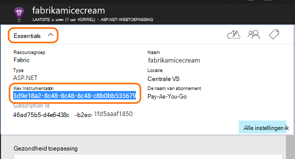
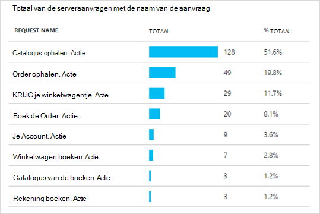

<properties 
    pageTitle="Inzichten van de toepassing voor Java web apps die al live" 
    description="Starten van de controle van een webtoepassing die al op uw server wordt uitgevoerd." 
    services="application-insights" 
    documentationCenter="java"
    authors="alancameronwills" 
    manager="douge"/>

<tags 
    ms.service="application-insights" 
    ms.workload="tbd" 
    ms.tgt_pltfrm="ibiza" 
    ms.devlang="na" 
    ms.topic="article" 
    ms.date="08/24/2016" 
    ms.author="awills"/>
 
# Inzichten van de toepassing voor Java web apps die al live

*Inzichten van toepassing is in het afdrukvoorbeeld.*

Als u een webtoepassing die al op uw J2EE-server wordt uitgevoerd, kunt u beginnen met het toezicht op deze met [Inzichten van toepassing](app-insights-overview.md) zonder code of het project opnieuw compileren. Met deze optie krijgt u informatie over HTTP-aanvragen die zijn verzonden naar de server, niet-verwerkte uitzonderingen en prestatiemeteritems.

Je hebt een abonnement op [Microsoft Azure](https://azure.com).

> [AZURE.NOTE] De procedure op deze pagina wordt de SDK toegevoegd aan uw web app tijdens runtime. Deze runtime-instrumentation is handig als u niet wilt bijwerken of opnieuw maken van de broncode. Maar als u kunt het beste u [de SDK op de broncode toevoegen](app-insights-java-get-started.md) in plaats daarvan. Dat biedt meer mogelijkheden zoals het schrijven van code voor het bijhouden van gebruikersactiviteiten.

## 1. een toepassing inzichten instrumentation-sleutel ophalen

1. Aanmelden bij de [Microsoft Azure portal](https://portal.azure.com)
2. Een nieuwe toepassing inzichten bron maken

    
3. Het toepassingstype Java webtoepassing instellen.

    
4. De instrumentatie vinden van de nieuwe resource. U moet deze sleutel binnenkort in uw CodeProject plakken.

    

## 2. de SDK downloaden

1. Download de [toepassing inzichten SDK voor Java](https://aka.ms/aijavasdk). 
2. Pak de inhoud van de SDK naar de map waarvan u de binaire project worden geladen op de server is. Als u Tomcat, deze map zijn normaalgesproken alleen onder`webapps\<your_app_name>\WEB-INF\lib`

## 3. een toepassing inzichten XML-bestand toevoegen

ApplicationInsights.xml maken in de map waarin u de SDK hebt toegevoegd. De volgende XML-code in deze plaatsen.

Vervangen door de sleutel instrumentatie die u hebt gekregen van het portal voor Azure.

    <?xml version="1.0" encoding="utf-8"?>
    <ApplicationInsights xmlns="http://schemas.microsoft.com/ApplicationInsights/2013/Settings" schemaVersion="2014-05-30">

      <!-- The key from the portal: -->

      <InstrumentationKey>** Your instrumentation key **</InstrumentationKey>

      <!-- HTTP request component (not required for bare API) -->

      <TelemetryModules>
        <Add type="com.microsoft.applicationinsights.web.extensibility.modules.WebRequestTrackingTelemetryModule"/>
        <Add type="com.microsoft.applicationinsights.web.extensibility.modules.WebSessionTrackingTelemetryModule"/>
        <Add type="com.microsoft.applicationinsights.web.extensibility.modules.WebUserTrackingTelemetryModule"/>
      </TelemetryModules>

      <!-- Events correlation (not required for bare API) -->
      <!-- These initializers add context data to each event -->

      <TelemetryInitializers>
        <Add   type="com.microsoft.applicationinsights.web.extensibility.initializers.WebOperationIdTelemetryInitializer"/>
        <Add type="com.microsoft.applicationinsights.web.extensibility.initializers.WebOperationNameTelemetryInitializer"/>
        <Add type="com.microsoft.applicationinsights.web.extensibility.initializers.WebSessionTelemetryInitializer"/>
        <Add type="com.microsoft.applicationinsights.web.extensibility.initializers.WebUserTelemetryInitializer"/>
        <Add type="com.microsoft.applicationinsights.web.extensibility.initializers.WebUserAgentTelemetryInitializer"/>

      </TelemetryInitializers>
    </ApplicationInsights>

* De sleutel instrumentation wordt meegestuurd met alle items van Telemetrie en inzichten van de toepassing weer te geven in de bron wordt aangegeven.
* Het onderdeel HTTP-aanvraag is optioneel. Telemetrie over aanvragen en responstijden wordt automatisch verzonden naar het portaal.
* Gebeurtenissen correlatie is een aanvulling op het onderdeel HTTP-aanvraag. Het wordt een id toegewezen aan elk verzoek dat door de server ontvangen en deze id als een eigenschap aan elk item van telemetrie toegevoegd als de eigenschap 'Operation.Id'. U kunt de telemetrie die is gekoppeld aan elke aanvraag door een filter in [Diagnostische zoeken](app-insights-diagnostic-search.md)correleren.

## 4. een HTTP-filter toevoegen

Open het bestand web.xml in uw project en samenvoegen in het volgende fragment van code onder het knooppunt web app, waar de toepassingsfilters worden geconfigureerd.

Als u de meest nauwkeurige resultaten, moet het filter vóór alle andere filters worden toegewezen.

    <filter>
      <filter-name>ApplicationInsightsWebFilter</filter-name>
      <filter-class>
        com.microsoft.applicationinsights.web.internal.WebRequestTrackingFilter
      </filter-class>
    </filter>
    <filter-mapping>
       <filter-name>ApplicationInsightsWebFilter</filter-name>
       <url-pattern>/*</url-pattern>
    </filter-mapping>

## 5. Controleer de firewall-uitzonderingen

Mogelijk moet u het [instellen van uitzonderingen op het verzenden van uitgaande gegevens](app-insights-ip-addresses.md).

## 6. Start uw web app

## 7. de telemetrie in inzichten toepassing weergeven

Terug naar de bron toepassing inzichten in [Microsoft Azure portal](https://portal.azure.com).

Telemetrie over HTTP-aanvragen op het blad overzicht wordt weergegeven. (Als deze er niet is, wacht een paar seconden en klik vervolgens op vernieuwen.)

 

Klik op een grafiek om te zien meer gedetailleerde statistieken. 

 

En wanneer de eigenschappen van een aanvraag, kunt u de telemetrie gebeurtenissen gekoppeld zoals aanvragen en uitzonderingen.
 

[Meer informatie over parameters.](app-insights-metrics-explorer.md)

## Volgende stappen

* [Telemetrie toevoegen aan uw webpagina's](app-insights-web-track-usage.md) monitor paginaweergaven en maatstaven van de gebruiker.
* [Web tests instellen](app-insights-monitor-web-app-availability.md) zodat de toepassing up-to-date live en reageert.
* [Sporen in logboek vastleggen](app-insights-java-trace-logs.md)
* [Zoeken-gebeurtenissen en logboeken](app-insights-diagnostic-search.md) om te helpen bij het vaststellen van problemen.

 
