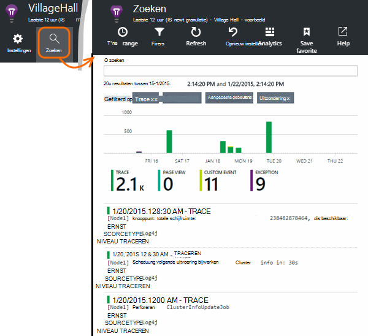

<properties 
    pageTitle="In toepassing inzichten traceerlogboeken Java verkennen" 
    description="Log4J zoeken of Logback sporen in inzichten van toepassing" 
    services="application-insights" 
    documentationCenter="java"
    authors="alancameronwills" 
    manager="douge"/>

<tags 
    ms.service="application-insights" 
    ms.workload="tbd" 
    ms.tgt_pltfrm="ibiza" 
    ms.devlang="na" 
    ms.topic="article" 
    ms.date="07/12/2016" 
    ms.author="awills"/>

# In toepassing inzichten traceerlogboeken Java verkennen

Als u Logback of Log4J (v1.2 of v2.0) voor overtrekken, hebt u uw traceerlogboeken automatisch verzonden naar de inzichten van Application kunt u verkennen en zoeken op deze.

[Toepassing inzichten SDK voor Java]installeren[java], als u die al niet hebt gedaan.

## Logboekregistratie van bibliotheken aan uw project toevoegen

*Kies de juiste manier voor uw project.*

#### Als u gebruikmaakt van Maven...

Als uw project is al ingesteld om Maven te gebruiken voor het bouwen, samenvoegen met een van de volgende codefragmenten uw pom.xml bestand.

Vernieuw de Projectafhankelijkheden, als u de binaire bestanden gedownload.

*Logback*

    <dependencies>
       <dependency>
          <groupId>com.microsoft.azure</groupId>
          <artifactId>applicationinsights-logging-logback</artifactId>
          <version>[1.0,)</version>
       </dependency>
    </dependencies>

*Log4J v2.0*

    <dependencies>
       <dependency>
          <groupId>com.microsoft.azure</groupId>
          <artifactId>applicationinsights-logging-log4j2</artifactId>
          <version>[1.0,)</version>
       </dependency>
    </dependencies>

*V1.2 Log4J*

    <dependencies>
       <dependency>
          <groupId>com.microsoft.azure</groupId>
          <artifactId>applicationinsights-logging-log4j1_2</artifactId>
          <version>[1.0,)</version>
       </dependency>
    </dependencies>

#### Als u gebruikmaakt van Gradle...

Als uw project is al ingesteld om Gradle te gebruiken voor het bouwen, toevoegen een van de volgende regels aan de `dependencies` groep in het bestand build.gradle:

Vernieuw de Projectafhankelijkheden, als u de binaire bestanden gedownload.

**Logback**

    compile group: 'com.microsoft.azure', name: 'applicationinsights-logging-logback', version: '1.0.+'

**Log4J v2.0**

    compile group: 'com.microsoft.azure', name: 'applicationinsights-logging-log4j2', version: '1.0.+'

**V1.2 Log4J**

    compile group: 'com.microsoft.azure', name: 'applicationinsights-logging-log4j1_2', version: '1.0.+'

#### Anders...

Downloaden en uitpakken van de juiste appender en vervolgens de juiste bibliotheek toevoegen aan het project:

Logger | Downloaden | Bibliotheek
----|----|----
Logback|[SDK met Logback appender](https://aka.ms/xt62a4)|registratie-applicationinsights-logback
Log4J v2.0|[SDK met Log4J v2 appender](https://aka.ms/qypznq)|registratie-applicationinsights-log4j2 
V1.2 Log4j|[SDK met Log4J v1.2-appender](https://aka.ms/ky9cbo)|registratie-applicationinsights-log4j1_2 

## De appender in het kader van uw registratie toevoegen

Samenvoegen om te starten met het ophalen van sporen, het relevante stukje code naar het configuratiebestand Log4J of Logback: 

*Logback*

    <appender name="aiAppender" 
      class="com.microsoft.applicationinsights.logback.ApplicationInsightsAppender">
    </appender>
    <root level="trace">
      <appender-ref ref="aiAppender" />
    </root>

*Log4J v2.0*

    <Configuration packages="com.microsoft.applicationinsights.Log4j">
      <Appenders>
        <ApplicationInsightsAppender name="aiAppender" />
      </Appenders>
      <Loggers>
        <Root level="trace">
          <AppenderRef ref="aiAppender"/>
        </Root>
      </Loggers>
    </Configuration>

*V1.2 Log4J*

    <appender name="aiAppender" 
         class="com.microsoft.applicationinsights.log4j.v1_2.ApplicationInsightsAppender">
    </appender>
    <root>
      <priority value ="trace" />
      <appender-ref ref="aiAppender" />
    </root>

De appenders toepassing inzichten kunnen worden verwezen door alle geconfigureerde logger en niet noodzakelijkerwijs de logger root (zoals in de bovenstaande voorbeelden van code).

## Ontdek de sporen in de portal Application inzichten

Nu u uw project om aan te sporen verzenden naar inzichten toepassing hebt geconfigureerd, kunt u bekijken en deze sporen zoeken in de portal Application inzichten in de [zoekopdracht] [ diagnostic] blade.

## Volgende stappen

[Diagnostische zoeken][diagnostic]

<!--Link references-->

[diagnostic]: app-insights-diagnostic-search.md
[java]: app-insights-java-get-started.md

 
