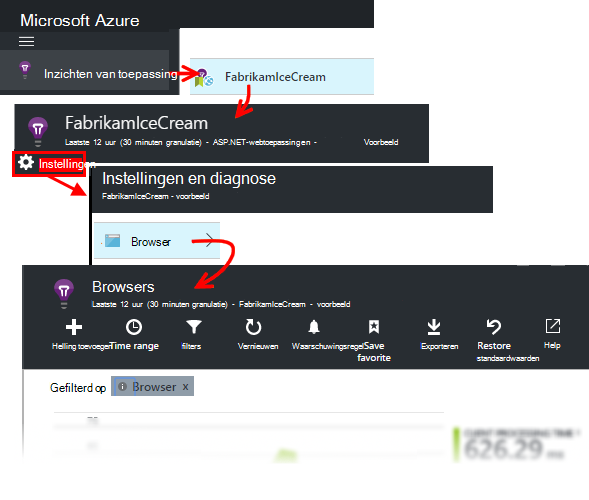

<properties
    pageTitle="Inzichten voor JavaScript toepassing web apps | Microsoft Azure"
    description="Pagina weergeven en sessies telt, web-clientgegevens, ophalen en gebruikspatronen bijhouden. Uitzonderingen en prestatieproblemen in JavaScript webpagina's te detecteren."
    services="application-insights"
    documentationCenter=""
    authors="alancameronwills"
    manager="douge"/>

<tags
    ms.service="application-insights"
    ms.workload="tbd"
    ms.tgt_pltfrm="ibiza"
    ms.devlang="na"
    ms.topic="get-started-article"
    ms.date="08/15/2016"
    ms.author="awills"/>

# Toepassing inzichten voor webpagina 's

[AZURE.INCLUDE [app-insights-selector-get-started-dotnet](../../includes/app-insights-selector-get-started-dotnet.md)]

Meer informatie over de prestaties en het gebruik van de webpagina of de app. Als u inzichten van Visual Studio-toepassing aan het script van de pagina toevoegen, krijgt u de tijdsinstellingen van de pagina wordt geladen en AJAX-gesprekken, aantallen en details van browser uitzonderingen en AJAX storingen, gebruikers en telt sessie. Deze kunnen door de client-OS en pagina, browserversie, geografische locatie en andere dimensies worden gesegmenteerd. U kunt ook waarschuwingen instellen voor het aantal mislukte of langzame pagina laden.

U kunt toepassing inzichten webpagina's - u slechts een klein stukje JavaScript toevoegen. Als uw webservice [Java](app-insights-java-get-started.md) of [ASP.NET](app-insights-asp-net.md)is, kunt u integreren telemetrie van uw server en clients.

Moet u een abonnement op [Microsoft Azure](https://azure.com). Als uw team een organisatie-abonnement heeft, vraag de eigenaar aan uw Microsoft-Account toevoegen. Er is een gratis prijzen laag ontwikkeling en het gebruik van kleinschalige won't kosten.

## Inzichten van toepassing voor uw website instellen

Eerst moet u inzichten toepassing toevoegen aan uw webpagina's? U kunt al hebt gedaan. Als u toepassing inzichten toevoegen aan uw web app in het dialoogvenster Nieuw Project in Visual Studio, is het script vervolgens toegevoegd. In dat geval hoeft u niet meer te doen.

Anders moet u een codefragment als volgt uw webpagina's toevoegen.

### Een toepassing inzichten bron openen

De bron van de inzichten van toepassing is waarin gegevens over de prestaties en het gebruik van de pagina wordt weergegeven. 

Inloggen op [portal Azure](https://portal.azure.com).

Als u al een controle van de serverkant van uw app ingesteld, al hebt u een bron:

Als u nog geen hebt, maakt u deze:

*Al vragen?* [Meer informatie over het maken van een bron](app-insights-create-new-resource.md).

### De SDK-script toevoegen aan uw toepassing of webpagina 's

Ophalen in de Quick Start het script voor webpagina's:

Vlak voordat het script invoegen de `</head>` -tag van elke pagina die u wilt bijhouden. Als uw website een basispagina heeft, kunt u het script er plaatsen. Bijvoorbeeld:

* In een project voor ASP.NET MVC, zou u deze plaatsen`View\Shared\_Layout.cshtml`
* Open in een SharePoint-site in het regelpaneel [Site-instellingen / basispagina](app-insights-sharepoint.md).

Het script bevat de instrumentatie sleutel waarmee de gegevens in de bron van de inzichten van toepassing. 

([Meer uitleg van het script](http://apmtips.com/blog/2015/03/18/javascript-snippet-explained/))

*(Als u een kader met bekende webpagina, zoek rond adapters inzichten van toepassing. For example, er is [een module AngularJS](http://ngmodules.org/modules/angular-appinsights).)*

## Gedetailleerde configuratie

Er zijn verschillende [parameters](https://github.com/Microsoft/ApplicationInsights-JS/blob/master/API-reference.md#config) kunt u instellen, hoewel in de meeste gevallen beter niet u moet. U kunt bijvoorbeeld uitschakelen of beperken van het aantal aanroepen van Ajax gemeld per pagina weergeven (verkeer verminderen). Of u kunt instellen dat de foutopsporingsmodus hebben telemetrie snel verplaatsen door middel van de pijpleiding zonder een batch wordt verwerkt.

Zoek deze regel in het codefragment wilt instellen, en meer door komma's gescheiden items toevoegen na het:

    })({
      instrumentationKey: "..."
      // Insert here
    });

De [beschikbare parameters](https://github.com/Microsoft/ApplicationInsights-JS/blob/master/API-reference.md#config) omvatten:

    // Send telemetry immediately without batching.
    // Remember to remove this when no longer required, as it
    // can affect browser performance.
    enableDebug: boolean,

    // Don't log browser exceptions.
    disableExceptionTracking: boolean,

    // Don't log ajax calls.
    disableAjaxTracking: boolean,

    // Limit number of Ajax calls logged, to reduce traffic.
    maxAjaxCallsPerView: 10, // default is 500

    // Time page load up to execution of first trackPageView().
    overridePageViewDuration: boolean,

    // Set these dynamically for an authenticated user.
    appUserId: string,
    accountId: string,

## De toepassing uitvoeren

Voer uw web app, gebruikt u het een tijdje telemetrie genereren en wacht een paar seconden. U kunt uitvoeren met behulp van de toets **F5** op de ontwikkelcomputer of publiceert en laat gebruikers met het spelen.

Als u controleren de telemetrie dat een web app verzendt naar de inzichten van toepassing wilt, gebruikt u hulpmiddelen van uw browser (**F12** in veel browsers). Gegevens worden verzonden naar dc.services.visualstudio.com.

## Verken de prestatiegegevens van uw browser

Open de blade Browsers om prestatiegegevens samenvoegen van browsers voor gebruikers weer te geven.

*Nog geen gegevens? Klik op * *vernieuwen* * boven aan de pagina. Nog steeds niets? Zie [Probleemoplossing](app-insights-troubleshoot-faq.md).*

De blade Browsers is een [metrische Explorer blade](app-insights-metrics-explorer.md) met vooraf ingestelde filters en selecties van de grafiek. U kunt het bereik, filters en configuratie van de grafiek als u wilt, en het resultaat opslaan als favoriet bewerken. Klik op **Standaardwaarden herstellen** om terug te gaan naar de oorspronkelijke configuratie van blade.

## Pagina laden prestaties

Boven is een gesegmenteerde rekeningschema pagina laden tijden. De totale hoogte van de grafiek geeft de gemiddelde tijd om te laden en weergeven van pagina's van uw app in browsers voor gebruikers. De tijd wordt gemeten vanaf wanneer de browser het initiële HTTP-verzoek tot alle synchrone laden gebeurtenissen zijn stuurt, verwerkt met inbegrip van de lay-out en het uitvoeren van scripts. Het bevat geen asynchrone taken zoals het laden van onderdelen van AJAX-aanroepen.

De grafiek segmenten laadtijd van het totaal aantal pagina's in de [standaard tijdsinstellingen gedefinieerd door het W3C](http://www.w3.org/TR/navigation-timing/#processing-model). 

Houd er rekening mee dat het *netwerk verbinden* vaak lager dan u verwachten, is zou omdat het een gemiddelde over alle aanvragen van de browser naar de server. Veel afzonderlijke aanvragen hebben een verbindingstijd 0 omdat er al een actieve verbinding met de server.

### Langzame laden?

Langzame pagina wordt geladen, zijn een belangrijke bron van ontevredenheid voor uw gebruikers. Als de grafiek langzame pagina wordt geladen geeft, is het gemakkelijk te doen van diagnostisch onderzoek.

De grafiek wordt het gemiddelde van alle laden van de pagina in uw app. Als u wilt zien als het probleem is beperkt tot bepaalde pagina's, stukje naar beneden in de blade, indien er een raster gesegmenteerd door pagina-URL:

U ziet de paginatelling voor weergave en een standaarddeviatie. Als het aantal pagina's zeer laag is, is niet vervolgens het probleem dat gebruikers veel. Een hoge standaarddeviatie (vergelijkbaar met het gemiddelde zelf) geeft aan dat veel variatie tussen de afzonderlijke metingen.

**Zoom in op een URL en een pagina weergeven.** Klik op de paginanaam zien een blade van browser grafieken gefilterd om URL; en klik vervolgens op een exemplaar van een pagina weergeven.

Klik op `...` voor een volledige lijst van eigenschappen voor die gebeurtenis, of de gesprekken met Ajax en verwante gebeurtenissen controleren. Langzame Ajax oproepen van invloed zijn op de algemene pagina laadtijd als ze synchroon worden. Verwante gebeurtenissen zijn serveraanvragen voor dezelfde URL (als u de inzichten van toepassing op de webserver hebt ingesteld).

**De prestaties van de pagina in de tijd.** Terug op het blad Browsers de laadtijd van pagina weergave raster te wijzigen in een lijndiagram te zien alsof er pieken op bepaalde tijdstippen:

**Met andere dimensies in segmenten.** Uw pagina's zijn misschien langzamer te laden op een bepaalde browser, de client-OS of de plaats van de gebruiker? Een nieuwe grafiek toevoegen en experimenteren met de **Group by** -dimensie.

## AJAX-prestaties

Zorg ervoor dat AJAX oproepen in uw webpagina's en uitvoert. Ze worden vaak gebruikt voor het delen van uw pagina asynchroon vullen. Hoewel de algemene pagina direct laden kunt, gebruikers kunnen worden dele tenietgedaan door lege webonderdelen, staart wachten op gegevens die worden weergegeven in deze.

AJAX oproepen vanuit uw webpagina's worden weergegeven op het blad Browsers als afhankelijkheden.

Overzicht van grafieken in het bovenste gedeelte van het blad zijn:

en gedetailleerde rasters lagere omlaag:

Klik op een rij voor specifieke details.

> [AZURE.NOTE] Als u het filter van de Browsers op het blad verwijderen, worden server- en AJAX-afhankelijkheden opgenomen in deze grafieken. Klik op standaardinstellingen herstellen om het opnieuw configureren van het filter.

Ga naar het raster afhankelijkheid fouten **Inzoomen in mislukte Ajax oproepen** en klikt u op een rij om te zien van specifieke exemplaren.

Klik op `...` voor de volledige telemetrie voor een Ajax-oproep.

### Geen oproepen Ajax gemeld?

AJAX-oproepen bevatten alle HTTP-oproepen vanuit het script van uw webpagina. Als u niet ze gemeld ziet, controleren of het codefragment wordt niet ingesteld de `disableAjaxTracking` of `maxAjaxCallsPerView` [parameters](https://github.com/Microsoft/ApplicationInsights-JS/blob/master/API-reference.md#config).

## Browser-uitzonderingen

Op het blad Browsers is een overzichtstabel uitzonderingen en een raster van typen uitzondering verder naar beneden de blade.

Als er geen browser uitzonderingen vermeld, controleren of het codefragment wordt niet ingesteld de `disableExceptionTracking` [parameter](https://github.com/Microsoft/ApplicationInsights-JS/blob/master/API-reference.md#config).

## Afzonderlijke pagina weergeven gebeurtenissen controleren

Meestal pagina weergave telemetrie wordt geanalyseerd door de toepassing inzichten en ziet u alleen cumulatieve rapporten, gemiddeld over alle gebruikers. Maar voor foutopsporing, kunt u ook bekijken gebeurtenissen van afzonderlijke pagina weergeven.

De diagnostische zoeken instellen blade, Filters in de weergave pagina.

Selecteer een gebeurtenis in meer detail te zien. Klik op "..." om nog meer details zichtbaar op de detailpagina.

> [AZURE.NOTE] Als u de [zoekfunctie](app-insights-diagnostic-search.md)gebruiken, zoals u ziet, moet overeenkomen met de woorden: 'Abou' en 'bout' komen niet overeen 'Over'.

U kunt ook de krachtige [Analytics query language](app-insights-analytics-tour.md) gebruiken paginaweergaven zoeken.

### Pagina weergave-eigenschappen

* **Duur van de weergave pagina** 

 * Standaard om de tijd die nodig is voor het laden van de pagina van de client met volledige belasting (met inbegrip van hulpbestanden maar met uitzondering van asynchrone taken zoals Ajax roept). 
 * Als u `overridePageViewDuration` in de [paginaconfiguratie](#detailed-configuration), het interval tussen de client aanvragen voor het uitvoeren van de eerste `trackPageView`. Als u na de initialisatie van het script trackPageView van zijn normale positie verplaatst, wordt er een andere waarde te weerspiegelen.
 * Als `overridePageViewDuration` en een duur argument vindt u in de `trackPageView()` aanroept, wordt de waarde van het argument in plaats daarvan gebruikt. 

## Aangepaste pagina telt

Standaard is het aantal pagina's vindt plaats telkens wanneer die een nieuwe pagina in de browser van de client laadt.  Maar u kunt meer bezoekers te tellen. Bijvoorbeeld een pagina kan de inhoud ervan weergeeft in tabbladen en u wilt een pagina tellen wanneer de gebruiker tabbladen. Of JavaScript-code op de pagina nieuwe inhoud kunt laden zonder de URL van de browser wijzigen.

Plaats een oproep JavaScript als volgt op het desbetreffende punt in de clientcode:

    appInsights.trackPageView(myPageName);

De paginanaam bevatten dezelfde tekens als een URL, maar alles na de "#" of "?" wordt genegeerd.

## Gebruik bijhouden

Wilt u weten wat uw gebruikers met uw app doen?

* [Klik hier voor informatie over het gebruik van het bijhouden](app-insights-web-track-usage.md)
* [Meer informatie over aangepaste gebeurtenissen en statistieken API](app-insights-api-custom-events-metrics.md).

#### Video: Gebruik bijhouden

> [AZURE.VIDEO tracking-usage-with-application-insights]

## Volgende stappen

* [Gebruik bijhouden](app-insights-web-track-usage.md)
* [Aangepaste gebeurtenissen en statistieken](app-insights-api-custom-events-metrics.md)
* [Informatie over build-eenheid](app-insights-overview-usage.md)

