<properties 
    pageTitle="Maatstaven in toepassing inzichten verkennen | Microsoft Azure" 
    description="Het interpreteren van de grafieken in metrische explorer en het aanpassen van explorer metrische blades." 
    services="application-insights" 
    documentationCenter=""
    authors="alancameronwills" 
    manager="douge"/>

<tags 
    ms.service="application-insights" 
    ms.workload="tbd" 
    ms.tgt_pltfrm="ibiza" 
    ms.devlang="na" 
    ms.topic="article" 
    ms.date="10/15/2016" 
    ms.author="awills"/>
 
# Maatstaven in toepassing inzichten verkennen

Maatstaven in [Toepassing inzichten] [ start] worden gemeten waarden en de tellingen van de gebeurtenissen die worden verzonden in telemetrie vanuit uw toepassing. Ze helpen u prestatieproblemen detecteren en volgen van trends in hoe uw toepassing wordt gebruikt. Er is een breed scala van standaard metrics en u kunt ook uw eigen aangepaste metrische gegevens en gebeurtenissen maken.

Maatstaven en gebeurtenis tellingen worden weergegeven in de grafieken van de geaggregeerde waarden zoals totalen, gemiddelden of aantallen.

Hier is een grafiek:

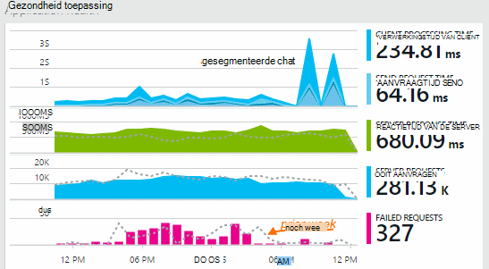

Sommige grafieken worden gesegmenteerd: de totale hoogte van de grafiek op elk moment is de som van de cijfers weergegeven. De legenda standaard bevat de grootste hoeveelheden.

Gestippelde lijnen wordt de waarde van de metric van een week eerder weergeven.

## Tijdsbereik

Kunt u het tijdsbereik vallen onder de grafieken en rasters op elke bladeserver.

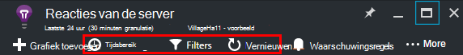

Als u bepaalde gegevens die nog niet is verschenen verwacht, klikt u op vernieuwen. Grafieken zelf vernieuwen met tussenpozen, maar de intervallen voor grotere tijdsbereik langer zijn. Het kost tijd om gegevens via de pijpleiding analyse naar een diagram in de release-modus.

Als u wilt inzoomen op een deel van een diagram, sleept u over het:

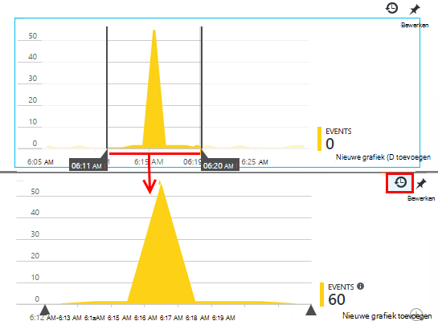

Klik op de knop ongedaan maken in-en uitzoomen om te herstellen.

## Granulatie en punt waarden

Plaats uw muis op de grafiek de waarden van de parameters op dat moment wordt weergegeven.

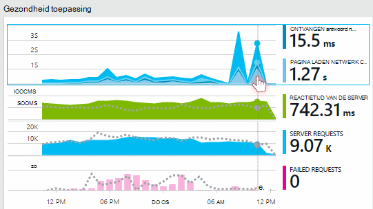

De waarde van de metrische gegevens op een bepaald punt is op de voorafgaande controle-interval samengevoegd. 

De controle-interval of 'granulatie' wordt weergegeven aan de bovenkant van het blad. 

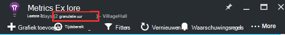

U kunt de granulatie in het blad tijd bereik aanpassen:

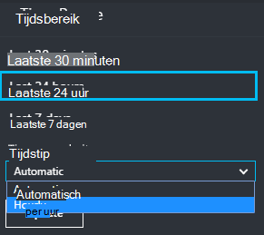

De beschikbare wisselkoersmodellen is afhankelijk van de periode die u selecteert. De expliciete wisselkoersmodellen zijn de alternatieven voor de "automatic" granulatie voor het tijdsbereik. 

## Explorer metrics

Klik op de grafiek in het blad overzicht te zien van een meer gedetailleerde reeks verwante grafieken en rasters. U kunt deze grafieken en rasters te concentreren op de details die u geïnteresseerd bent in bewerken.

Of hoeft u alleen op de knop statistieken Explorer in de kop van het blad Overzicht.

Klik bijvoorbeeld op via de web-app mislukte aanvragen grafiek:

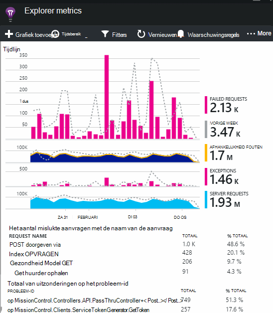

## Wat betekenen de cijfers?

De legenda aan de zijkant standaard bevat meestal de geaggregeerde waarde gedurende de periode van de grafiek. Als u de muisaanwijzer op de grafiek, wordt de waarde op dat moment.

Elk gegevenspunt in de grafiek is een totaal van de waarden van de in de voorgaande voorbeeldinterval of "granulariteit" ontvangen. De granulatie wordt weergegeven aan de bovenkant van het blad en is afhankelijk van de algehele tijdschaal van de grafiek.

Metrische gegevens kunnen op verschillende manieren worden samengevoegd: 

 * **Som** is de som van de waarden van alle gegevenspunten ontvangen via het controle-interval, of de periode van de grafiek.
 * **Gemiddelde** deelt het totaal door het aantal gegevenspunten ontvangen via het interval.
 * Telt het aantal **unieke** worden tellingen van accounts en gebruikers gebruikt. Via het controle-interval, of over de periode van de grafiek ziet de afbeelding u de telling van de verschillende gebruikers in die tijd zien.

U kunt de samenvoegingsmethode wijzigen:

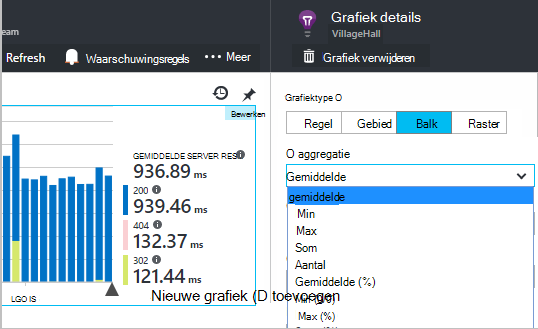

De standaardmethode voor elke maateenheid wordt weergegeven wanneer u een nieuwe grafiek maakt of wanneer alle parameters zijn uitgeschakeld:

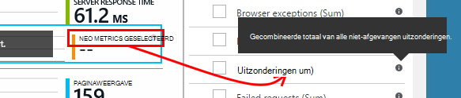

## Bewerken van grafieken en rasters

Een nieuwe grafiek toevoegen aan het blad:

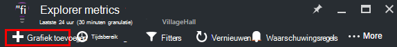

Selecteer **bewerken** in een bestaande of nieuwe grafiek te bewerken dat wordt weergegeven:

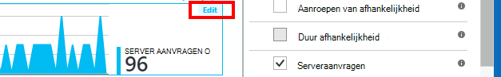

Hoewel er beperkingen van de combinaties die samen kunnen worden weergegeven, kunt u meer dan één waarde in een grafiek weergeven. Als u ervoor een metric kiest, zijn sommige van de andere uitgeschakeld. 

Als u [aangepaste metrische gegevens] gecodeerd[ track] in uw app (aanroepen van TrackMetric en TrackEvent) ze zal hier worden vermeld.

## Uw gegevens in segmenten

U kunt bijvoorbeeld een metric door eigenschap - splitsen om het vergelijken van paginaweergaven op clients met verschillende besturingssystemen. 

Selecteer een diagram of raster, overschakelen op groepering en kies een eigenschap groeperen op:

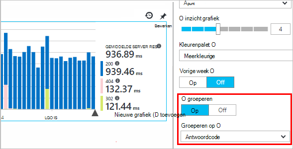

> [AZURE.NOTE] Als u groeperen gebruikt, bieden de typen gebied en staafdiagram een gestapeld weergegeven. Dit is geschikt wanneer de methode van samenvoeging som is. Maar waar is het samenvoegingstype gemiddelde, kiest u de lijn- of weergave typen. 

Als u [aangepaste metrische gegevens] gecodeerd[ track] in uw app en deze waarden van eigenschappen bevatten, kunt u de eigenschap in de lijst selecteren.

Is het diagram te klein voor gesegmenteerde gegevens? Pas de hoogte:

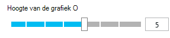

## De gegevens filteren

Alleen de cijfers voor een geselecteerde reeks waarden bekijken:

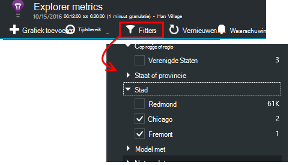

Als u niet alle waarden voor een bepaalde eigenschap selecteert, is hetzelfde als het selecteren van alle: Er is geen filter voor die eigenschap.

U ziet de tellingen van gebeurtenissen naast de waarde voor elke eigenschap. Wanneer u waarden van een eigenschap selecteert, worden de aantallen naast andere waarden van eigenschap worden aangepast.

Filters toepassen op alle grafieken in een bladeserver. Als u wilt dat verschillende filters toegepast op andere diagrammen maken en opslaan van verschillende maatstaven blades. Als u wilt, kunt u grafieken van verschillende bladen aan het dashboard, vastmaken zodat u ze naast elkaar kunt zien.

### Bot en web test verkeer verwijderen

Gebruik het filter **reële of synthetische verkeer** en **echte**controleren.

U kunt ook filteren op **bron van synthetische verkeer**.

### Eigenschappen toevoegen aan de lijst met filters

Wilt u filteren telemetrie voor een categorie van eigen keuze? Bijvoorbeeld, misschien u verdeeld in verschillende categorieën gebruikers en u wilt dat uw gegevens door deze categorieën onderverdelen.

[Uw eigen eigenschap maken](app-insights-api-custom-events-metrics.md#properties). Deze eigenschap instellen in een [Telemetrie initialiseren](app-insights-api-custom-events-metrics.md#telemetry-initializers) zodat deze worden weergegeven in alle telemetrie - met inbegrip van de standaard telemetrie verzonden door verschillende modules van de SDK.

## Het grafiektype bewerken

Merk op dat u tussen de rasters en grafieken schakelen kunt:

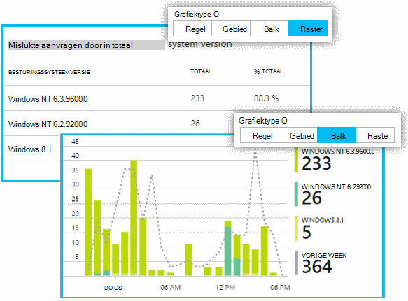

## Sla uw metrics blade

Wanneer u sommige grafieken hebt gemaakt, kunt u deze als favoriet opslaan. U kunt delen met andere teamleden als een organisatie gebruikt.

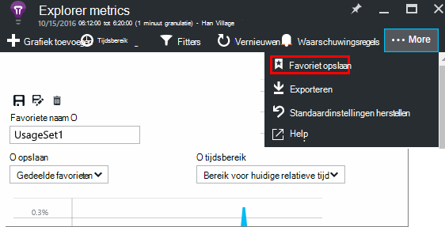

Zie het blad opnieuw, **Ga naar het overzicht blade** en Favorieten openen:

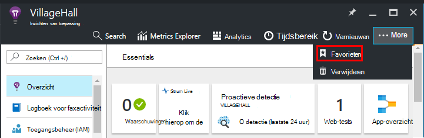

Als u bij het opslaan van relatieve periode, wordt het blad bijgewerkt met de meest recente maatstaven. Als u Absolute tijdsbereik hebt gekozen, wordt deze telkens dezelfde gegevens weergegeven.

## Het blad opnieuw instellen

Als u een blade bewerken, maar vervolgens u wilt teruggaan naar de oorspronkelijke set opgeslagen, klikt u op beginwaarden.

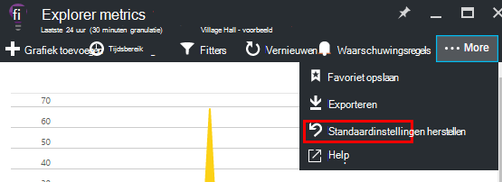

## Live gegevensstroom Metrics: instant maatstaven voor het toezicht op sluiten

Live statistieken Stream ziet u uw toepassing metrics rechts op dit moment zeer, met een bijna real-time vertraging van 1 seconde. Dit is bijzonder nuttig wanneer u een nieuwe build vrijgeven bent en zorg ervoor dat alles werkt zoals verwacht of onderzoekt een incident in real-time.

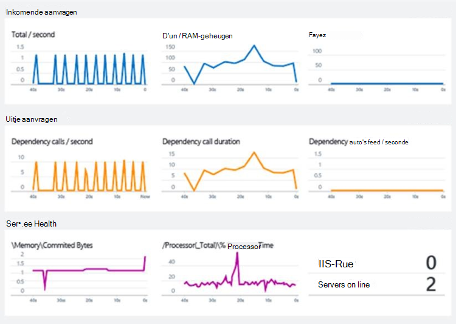

Anders dan bij Metrics Explorer weergegeven Metrics livestream een vaste set parameters. De gegevens persistent alleen voor omdat deze in de grafiek, en vervolgens verwijderd. 

Live statistieken Stream is beschikbaar bij toepassing inzichten SDK voor ASP.NET versie 2.1.0 of hoger.

## Waarschuwingen instellen

Als u wilt worden gewaarschuwd via e-mail van ongebruikelijke waarden van een metriek, een waarschuwing toevoegen. U kunt een e-mailbericht verzenden aan de account administrators of aan specifieke e-mailadressen.

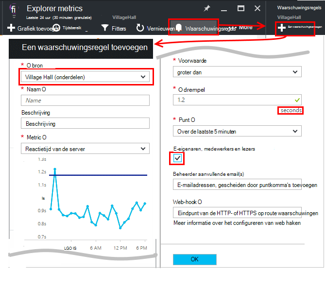

[Meer informatie over waarschuwingen][alerts].

## Exporteren naar Excel

U kunt de metrische gegevens die worden weergegeven in Verkenner metrische gegevens naar een Excel-bestand exporteren. De geëxporteerde gegevens bevat gegevens van alle grafieken en tabellen, zoals weergegeven in de portal. 

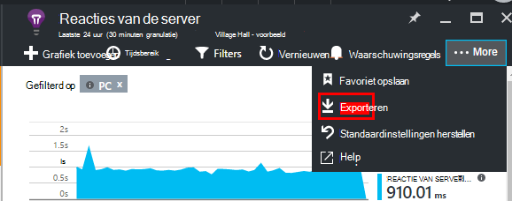

De gegevens voor elke grafiek of tabel is geëxporteerd naar een afzonderlijk blad in het Excel-bestand.

Wat u ziet is wat er wordt geëxporteerd. Het tijdsbereik of filters wijzigen als u wilt wijzigen van het bereik van de gegevens die u exporteert. Voor tabellen, als de opdracht **laden meer** zichtbaar is, kunt u erop klikken voordat u op exporteren als u meer gegevens geëxporteerd.

*Werkt alleen voor Internet Explorer en Chrome exporteren op dit moment. We proberen over het toevoegen van ondersteuning voor andere browsers.*

## Doorlopende exporteren

Als u wilt dat gegevens die voortdurend worden geëxporteerd, zodat u deze extern kunt verwerken, kunt u [doorlopend exporteren](app-insights-export-telemetry.md).

### Power BI

Als u nog meer weergaven van uw gegevens, kunt u [exporteren naar Power BI](http://blogs.msdn.com/b/powerbi/archive/2015/11/04/explore-your-application-insights-data-with-power-bi.aspx).

## Analytics

[Analytics](app-insights-analytics.md) is een meer veelzijdige manier voor het analyseren van uw telemetrie met behulp van een krachtige querytaal. Te gebruiken als u wilt combineren of de resultaten van de statistieken berekenen of verkennen in de deph van de recente prestaties van uw app uit te voeren. Aan de andere kant Metrics Explorer gebruiken als u automatisch vernieuwen grafieken op het dashboard en waarschuwingen.

## Het oplossen van problemen

*Ik zie niet alle gegevens in de grafiek.*

* Filters toepassen op de grafieken op het blad. Zorg ervoor dat u een filter die worden uitgesloten van de gegevens op een andere niet instellen terwijl u op één grafiek concentreren zich. 

    Als u andere filters instellen voor verschillende grafieken maakt in verschillende bladen, deze opslaan als afzonderlijke Favorieten. Als u wilt, kunt u ze vastmaken aan het dashboard zodat u ze naast elkaar kunt zien.

* Als u een grafiek op een eigenschap die is gedefinieerd op de metric groepeert, wordt er niets in de grafiek. Probeer uit te schakelen op groeperen of verschillende groepen kiezen.
* Prestatiegegevens (CPU, I/O snelheid, enzovoort) voor Java webservices, Windows desktop apps [IIS web-apps en services als u de statuscontrole installeert](app-insights-monitor-performance-live-website-now.md)en [Azure Cloud Services](app-insights-azure.md)beschikbaar is. Het is niet beschikbaar voor Azure websites.

## Volgende stappen

* [Gebruik met de inzichten van de toepassing controleren](app-insights-overview-usage.md)
* [Met de diagnostische zoeken](app-insights-diagnostic-search.md)

<!--Link references-->

[alerts]: app-insights-alerts.md
[start]: app-insights-overview.md
[track]: app-insights-api-custom-events-metrics.md

 