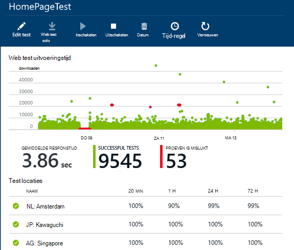
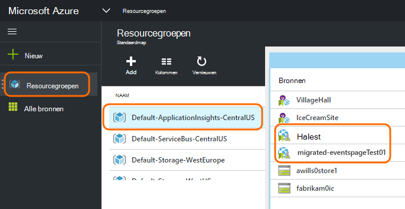
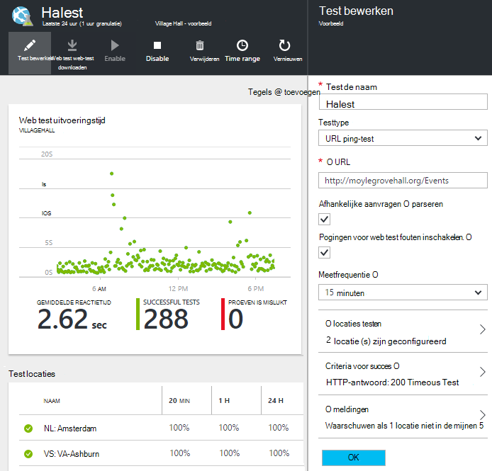

<properties 
    pageTitle="Azure eindpunt migreren naar toepassing inzichten beschikbaarheid Tests" 
    description="Klassieke toezicht op Azure eindpunt tests migreren in toepassing inzichten beschikbaarheid getest door 31 oktober 2016."
    services="application-insights" 
    documentationCenter=""
    authors="soubhagyadash" 
    manager="douge"/>

<tags 
    ms.service="application-insights" 
    ms.workload="tbd" 
    ms.tgt_pltfrm="ibiza" 
    ms.devlang="na" 
    ms.topic="article" 
    ms.date="07/25/2016" 
    ms.author="awills"/>
 
# Verplaatsen van Azure eindpunt controle op beschikbaarheid van Tests die toepassing inzichten

Gebruikt u [controle eindpunt](https://blogs.msdn.microsoft.com/mast/2013/03/03/windows-azure-portal-update-configure-web-endpoint-status-monitoring-preview/) voor uw Azure apps? Op *31 oktober 2016*Vervang we deze door de nieuwe en krachtigere [beschikbaarheid tests](app-insights-monitor-web-app-availability.md). Wij hebben enkele van de nieuwe tests al gemaakt hoewel ze uitgeschakeld zijn tot en met 31 oktober 2016. 

U kunt de nieuwe tests bewerken en de switch zelf doen als u wilt. U vindt deze [Azure portal](https://portal.azure.com) in de resourcegroep van de standaard-ApplicationInsights-CentralUS.

## Wat zijn beschikbaarheid proeven?

Testen van beschikbaarheid is een functie van Azure die voortdurend wordt gecontroleerd of een website of service van en uitgevoerd door het verzenden van HTTP-aanvragen aan (één ping-tests of Visual Studio web tests) van maximaal 16 locaties over de hele wereld. 

Deze tests zijn in de [klassieke Azure portal](https://manage.windowsazure.com)genoemd controle eindpunt. Ze zijn beperkter in hun scope. De nieuwe tests voor de beschikbaarheid van zijn een aanzienlijke verbetering:

* Maximaal 10 Visual Studio web tests of ping-tests per resource inzichten van toepassing. 
* Maximaal 16 locaties over de hele wereld test aanvragen verzenden naar uw web app. Meer controle over de testcriteria voor succes. 
* Een website of service - niet alleen Azure web apps testen.
* Testen van nieuwe pogingen: minder fout-positieve signalen als gevolg van tijdelijke netwerkproblemen. 
* Webhooks kunnen HTTP POST meldingen ontvangen voor de waarschuwingen.

Meer informatie over de [beschikbaarheid van tests hier](app-insights-monitor-web-app-availability.md).

Beschikbaarheid van tests zijn onderdeel van [Visual Studio-toepassing inzichten](app-insights-overview.md), waar is een uitbreidbare analytics-service voor een webtoepassing.

## Dus wat gebeurt er met mijn eindpunt test?

* We hebben uw eindpunt prestatietests op de nieuwe inzichten beschikbaarheid tests gekopieerd.
* De nieuwe beschikbaarheid tests zijn momenteel uitgeschakeld en nog de oude eindpunt tests worden uitgevoerd.
* De signalering van regels *niet* zijn gemigreerd. De nieuwe tests hebben in eerste instantie ingesteld met een standaardregel:
 * Triggers als locatie van meer dan 1 fouten in 5 minuten rapporteert.
 * E-mail verzenden aan de beheerders van het abonnement.

In de [Azure portal](https://portal.azure.com)vindt u de gemigreerde tests in de resourcegroep "Standaard-ApplicationInsights-CentralUS". De namen van de test worden voorafgegaan 'Migrated-'. 

## Wat moet ik doen?

* Als we op uw tests te migreren gemist, zijn de nieuwe tests voor beschikbaarheid [eenvoudig te installeren](app-insights-monitor-web-app-availability.md).

### Optie A: doet niets. Laat het ons.

Wij zullen **op 31 oktober 2016** :

* De oude eindpunt tests uit te schakelen.
* Kunnen de gemigreerde beschikbaarheid proeven.

### Optie B: u beheren en/of inschakelen van de nieuwe tests.

* Controleer en bewerk de nieuwe tests beschikbaar in de nieuwe [portal Azure](https://portal.azure.com). 
 * Bekijk de criteria van de trigger
 * Bekijk de e-mailontvangers
* De nieuwe tests inschakelen
* We zullen de oudere eindpunt prestatietests op 31 oktober 2016 uitschakelen 

### Optie C: Opt out

Als u niet dat beschikbaarheid tests gebruiken wilt, kunt u deze verwijderen in [Azure portal](https://portal.azure.com). Er is ook een koppeling voor afmelden onderaan in de e-mailberichten.

We zullen nog steeds de oude eindpunt tests op 31 oktober 2016 verwijderen. 

## Hoe bewerk ik de nieuwe tests

Aanmelden bij de [Azure portal](https://portal.azure.com) en de tests 'Migrated-' web zoeken: 

Bewerken en/of de test inschakelen:

## Hoe komt dat?

Betere service. De oude service endpoint is veel smaller. Voor eenvoudige ping-tests vanaf 3 geo locaties op een VM in Azure of web app kunt u slechts twee URL's opgeven. Nieuwe tests meerledige web tests van maximaal 16 locaties kunnen uitvoeren en kunt u maximaal 10 tests voor één toepassing. U kunt elke URL testen - het hoeft niet te worden een Azure-site.

De nieuwe tests worden afzonderlijk geconfigureerd vanaf het web app of VM die u wilt testen. 

Wij zijn de testen om ervoor te zorgen dat u controle over hen tijdens het gebruik van de nieuwe portal gaan migreren. 

## Wat is de inzichten van toepassing?

De nieuwe beschikbaarheid tests zijn onderdeel van de [Inzichten van Visual Studio-toepassing](app-insights-overview.md). Hier is een [video van 2 minuten](http://go.microsoft.com/fwlink/?LinkID=733921).

## Ik betaal voor de nieuwe proeven?

De gemigreerde tests worden ingesteld in een bron toepassing inzichten in het standaard gratis plan. Dit kan maximaal 5 miljoen punten. Die omvat gemakkelijk het gegevensvolume dat tests momenteel worden gebruikt. 

Natuurlijk als toepassing inzichten zoals en meer beschikbaarheid tests maken of meer van de controle van de prestaties en de diagnostische functies nemen vervolgens genereert u meer gegevenspunten.  Het resultaat zou alleen wel dat u het quotum voor het gratis plan kan worden bereikt. U ontvangt een factuur tenzij u aangeeft dat u voor de Standard of Premium plannen. 

[Meer informatie over de prijzen van de inzichten van toepassing en het toezicht op quota](app-insights-pricing.md). 

## Wat is en wordt niet gemigreerd?

Behouden van uw oude eindpunt tests:

* Eindpunt-URL moet worden getest.
* Geo locaties waarvan de aanvragen worden verzonden.
* Meetfrequentie blijft 5 minuten.
* Test-out blijft 30 seconden. 

Niet gemigreerd:

* Signaal-regel. De regel die we hebben ingesteld om triggers wanneer 1 locatie fouten in 5 minuten rapporteert.
* Ontvangers. E-mailberichten ontvangt de abonnement-eigenaren en eigenaren van collega. 

## Hoe vind ik de nieuwe tests

U kunt een van de nieuwe tests nu bewerken als u wilt. Aanmelden bij de [Azure portal](https://portal.azure.com), **Resourcegroepen** openen en selecteer de **Standaard-ApplicationInsights-CentralUS**. In die groep vindt u de nieuwe webpagina testen. [Meer informatie over de nieuwe tests voor de beschikbaarheid](app-insights-monitor-web-app-availability.md).

Houd er rekening mee dat de nieuwe waarschuwingsberichten worden verzonden vanaf dit adres: App inzichten waarschuwingen(ai-noreply@microsoft.com)

## Wat gebeurt er als ik niets doen?

Optie A zijn van toepassing. We de gemigreerde tests inschakelen en instellen van de standaard waarschuwingsregels zoals hierboven vermeld. U moet toevoegen van een aangepaste waarschuwingsregels geadresseerden zoals hierboven vermeld. Wij wordt het oude eindpunt prestatietests uitgeschakeld. 

## Waar kan ik feedback geven over dit? 

Bedankt voor uw feedback. Stuur [ons een e-mail](mailto:vsai@microsoft.com). 

