<properties
    pageTitle="Vaststellen van prestatieproblemen met op een IIS-website actief | Microsoft Azure"
    description="De prestaties van de website controleren zonder deze opnieuw te implementeren. Gebruik zelfstandige of bij toepassing inzichten SDK afhankelijkheid telemetrie ophalen."
    services="application-insights"
    documentationCenter=".net"
    authors="alancameronwills"
    manager="douge"/>

<tags
    ms.service="application-insights"
    ms.workload="tbd"
    ms.tgt_pltfrm="ibiza"
    ms.devlang="na"
    ms.topic="get-started-article"
    ms.date="10/24/2016"
    ms.author="awills"/>

# Web-apps instrument bij uitvoering met inzichten van toepassing

*Inzichten van toepassing is in het afdrukvoorbeeld.*

U kunt een live web app met inzichten in de Visual Studio-toepassing instrument zonder te wijzigen of implementeren van uw code. In uw toepassingen worden gehost door een IIS-server op de ruimten die u installeert statuscontrole; of als ze Azure web apps bent of in een VM Azure uitvoert, kunt u de toepassing inzichten extensie installeren. (Er zijn ook afzonderlijke artikelen over [J2EE web apps live](app-insights-java-live.md) en [Azure Cloud Services](app-insights-cloudservices.md)implementeren.)

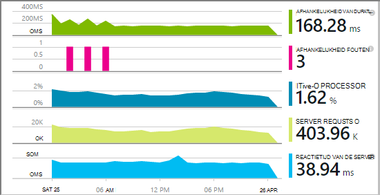

U hebt een keuze uit drie routes toepassing inzichten toepassen op uw .NET-toepassingen:

* **Tijd gemaakt:** [De toepassing inzichten SDK toevoegen] [greenbrown] aan uw web app-code. 
* **Uitvoering:** Instrument uw web app op de server, zoals hierna omschreven, zonder opnieuw samenstellen en opnieuw te distribueren code.
* **Beide:** De SDK inbouwen in uw web app-code en de runtime-extensies zijn ook van toepassing. Profiteer van het beste van beide opties. 

Hier volgt een overzicht van wat er op elke route:

||Bouwtijd|Bewerkingstijd|
|---|---|---|
|Aanvragen & uitzonderingen|Ja|Ja|
|[Meer gedetailleerde uitzonderingen](app-insights-asp-net-exceptions.md)||Ja|
|[Diagnostische gegevens van afhankelijkheid](app-insights-asp-net-dependencies.md)|In .NET 4.6 +|Ja|
|[Systeemprestatiemeteritems](app-insights-performance-counters.md)||IIS of Azure cloud-service niet Azure web app.|
|[API voor aangepaste telemetrie][api]|Ja||
|[Integratie van Trace-logboek](app-insights-asp-net-trace-logs.md)|Ja||
|[Paginagegevens & gebruiker weergeven](app-insights-javascript.md)|Ja||
|Niet nodig om te bouwen code|Nee||

## Uw web app instrument tijdens runtime

Moet u een abonnement op [Microsoft Azure](http://azure.com) .

### Als uw toepassing een Azure web app of Cloud-Service

* Selecteer toepassing inzichten op het bedieningspaneel van de app in Azure. 

    [Meer informatie](app-insights-azure.md).

### Als uw toepassing wordt gehost op de IIS-server

1. Aanmelden met beheerdersreferenties op de IIS-webserver.
2. Downloaden en uitvoeren van het [installatieprogramma Status Monitor](http://go.microsoft.com/fwlink/?LinkId=506648).
4. In de installatiewizard aanmelden bij Microsoft Azure.

    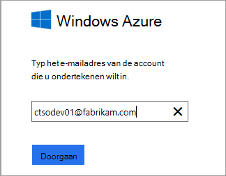

    *Verbindingsfouten? Zie [problemen oplossen](#troubleshooting).*

5. Kies de webtoepassing is geïnstalleerd of de website die u wilt controleren, moet u de bron waarin u de resultaten bekijken in het portal Application inzichten configureren.

    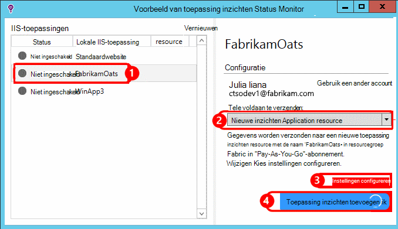

    Normaal gesproken kiest u voor het configureren van een nieuwe resource en de [resourcegroep][roles].

    Een bestaande bron anders gebruiken als u al een [website test] ingesteld[ availability] voor uw site of [web-client controleren][client].

6. IIS opnieuw starten.

    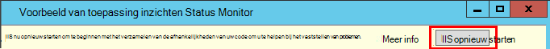

    Uw web-service worden onderbroken voor een korte tijd.

6. Merk op dat ApplicationInsights.config is ingevoegd in de webtoepassingen die u wilt controleren.

    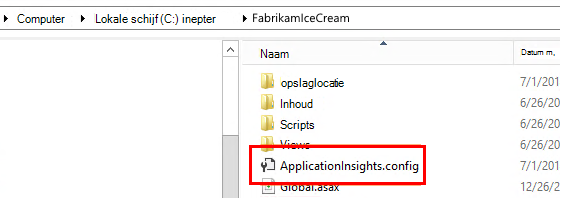

   Er zijn ook enkele wijzigingen in web.config.

#### Wilt u (opnieuw) later configureren?

Nadat u de wizard hebt voltooid, kunt u de agent opnieuw configureren wanneer u maar wilt. U kunt dit ook gebruiken als u de agent hebt geïnstalleerd, maar er enkele problemen met de initiële installatie is.

## Weergave prestaties telemetrie

Inloggen op [de portal Azure](https://portal.azure.com), Ga toepassing inzichten en opent u de resource die u hebt gemaakt.

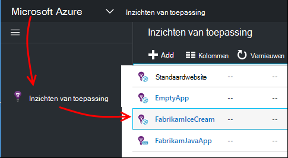

Open de prestaties blade aanvraag, responstijd, afhankelijkheid en andere gegevens.

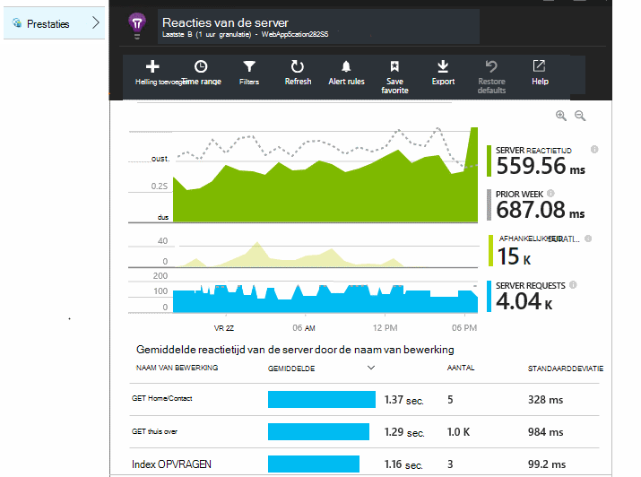

Klik op de grafiek om een meer gedetailleerde weergave te openen.

U kunt [bewerken, ordenen, opslaan](app-insights-metrics-explorer.md), en grafieken of het hele blad naar een [dashboard](app-insights-dashboards.md)vastmaken.

## Afhankelijkheden

De grafiek duur afhankelijkheid wordt door het aanroepen van uw app externe onderdelen, zoals databases, REST API's of Azure blob-opslag is de tijd.

Segmenten van de grafiek door het aanroepen van de verschillende afhankelijkheden: de grafiek bewerken, groepering inschakelen en vervolgens groeperen op afhankelijkheid, de afhankelijkheid van het Type of de prestaties van de afhankelijkheid.

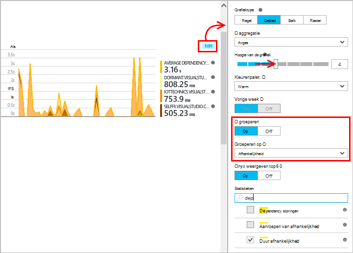

## Prestatiemeteritems 

(Niet voor Azure web apps.) Klik op Servers op het blad Overzicht voor een overzicht van grafieken van prestatiemeteritems server zoals CPU-gebruik voor bewoning en geheugen.

Als er meerdere exemplaren van de server, wilt u mogelijk de grafieken wilt groeperen op rol exemplaar bewerken.

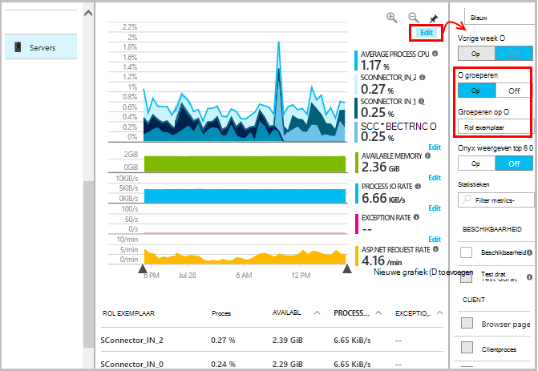

U kunt ook [de set prestatiemeteritems die worden gemeld door de SDK te wijzigen](app-insights-configuration-with-applicationinsights-config.md#nuget-package-3). 

## Uitzonderingen

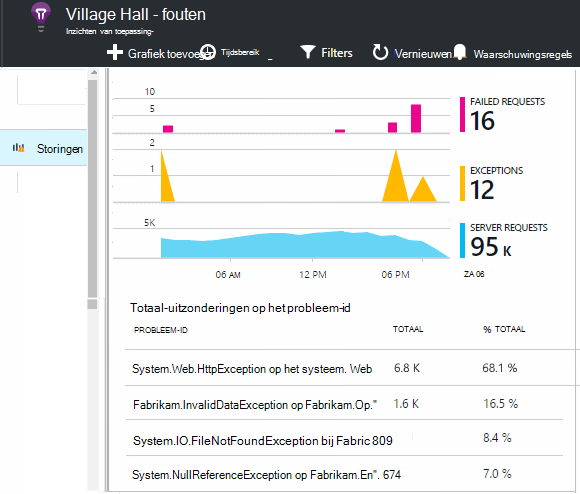

U kunt inzoomen op specifieke uitzonderingen (van de laatste zeven dagen) en stacktraces en gegevens opvragen.

## Bemonstering

Als uw toepassing veel gegevens worden verzonden en u de toepassing inzichten SDK voor ASP.NET versie 2.0.0-beta3 of hoger gebruikt, kan de functie apparaatafhankelijke bemonstering werken en slechts een percentage van de telemetrie verzenden. [Meer informatie over de bemonstering.](app-insights-sampling.md)

## Het oplossen van problemen

### Verbindingsfouten

U moet [enkele uitgaande poorten](app-insights-ip-addresses.md#outgoing-ports) openen in de firewall van uw server toestaan statuscontrole werkt.

### Geen telemetrie?

  * Uw site gebruiken om bepaalde gegevens te genereren.
  * Wacht een paar minuten, zodat de gegevens ontvangen en klik vervolgens op **vernieuwen**.
  * Open diagnostische zoeken (de tegel zoeken) afzonderlijke gebeurtenissen bekijken. Gebeurtenissen worden vaak weergegeven in diagnostische zoeken voordat statistische gegevens worden weergegeven in de grafieken.
  * Status Monitor openen en selecteer de toepassing in het linkerdeelvenster. Controleren of er berichten voor deze toepassing in de sectie 'Configuratie meldingen' diagnostische gegevens:

  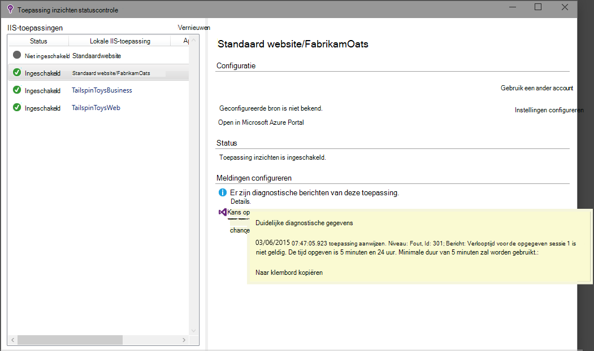

  * Zorg ervoor dat de dat Firewall van uw uitgaande gegevensverkeer op de hierboven genoemde poorten.
  * Op de server, als u een bericht over 'onvoldoende machtigingen' ziet, probeert u het volgende:
    * Selecteer de groep van toepassingen in IIS-beheer, open **Geavanceerde instellingen**en onder **Procesmodel** ziet u de identiteit.
    * Toevoegen in het Configuratiescherm van de Computer management deze identiteit aan de groep Prestatiemetergebruikers.
  * Als u geïnstalleerd op uw server van MMA/SCOM hebt, kunnen sommige versies conflicteren. Zowel SCOM en statuscontrole verwijderen en opnieuw installeren van de meest recente versies.
  * Zie [problemen oplossen bij][qna].

## Systeemvereisten

OS ondersteuning voor statuscontrole van toepassingen inzichten op Server:

- Windows Server 2008
- Windows Server 2008 R2
- Windows Server 2012
- Windows server 2012 R2

met het laatste SP en .NET Framework 4.0 en 4.5

Op de client Windows 7, 8 en 8.1, opnieuw met .NET Framework 4.0 en 4.5

Er is ondersteuning voor IIS: IIS 7, 7.5, 8, 8.5 (IIS is vereist)

## Automatisering met PowerShell

U kunt starten en stoppen via PowerShell op de IIS-server controleren.

Eerst importeert u de module inzichten van toepassing:

`Import-Module 'C:\Program Files\Microsoft Application Insights\Status Monitor\PowerShell\Microsoft.Diagnostics.Agent.StatusMonitor.PowerShell.dll'`

Ontdek welke apps worden gecontroleerd:

`Get-ApplicationInsightsMonitoringStatus [-Name appName]`

* `-Name`(Optioneel) De naam van een web app.
* De controle van de status voor elk web app (of de benoemde app) inzichten die toepassing weergegeven in deze IIS-server.

* Deze eigenschap retourneert `ApplicationInsightsApplication` voor elke toepassing:
 * `SdkState==EnabledAfterDeployment`: App wordt gecontroleerd en bij uitvoering is geïmplementeerd door het hulpprogramma Status Monitor of door `Start-ApplicationInsightsMonitoring`.
 * `SdkState==Disabled`: De app is niet geïmplementeerd voor toepassing inzichten. Het is nooit geïmplementeerd of runtime controleren met het hulpprogramma Status Monitor of is uitgeschakeld `Stop-ApplicationInsightsMonitoring`.
 * `SdkState==EnabledByCodeInstrumentation`: De app is geïmplementeerd door de SDK aan de broncode toe te voegen. De SDK kan worden bijgewerkt of gestopt.
 * `SdkVersion`de versie wordt gebruikt voor het controleren van deze app.
 * `LatestAvailableSdkVersion`de versie die momenteel beschikbaar bevat in de galerie NuGet. Gebruik de app upgrade naar deze versie, `Update-ApplicationInsightsMonitoring`.

`Start-ApplicationInsightsMonitoring -Name appName -InstrumentationKey 00000000-000-000-000-0000000`

* `-Name`De naam van de toepassing in IIS
* `-InstrumentationKey`De ikey van de toepassing inzichten bron waar u de resultaten worden weergegeven.

* Deze cmdlet alleen van invloed op toepassingen die worden niet al geïmplementeerd - dat wil zeggen SdkState == NotInstrumented.

    De cmdlet heeft geen invloed op een toepassing die al is geïmplementeerd, door de SDK aan de code toe te voegen tijdens build of tijdens het uitvoeren van een eerdere gebruik van deze cmdlet.

    De SDK-versie die wordt gebruikt om de app instrument is de versie die het laatst is gedownload naar deze server.

    Om de nieuwste versie downloaden, gebruikt u Update ApplicationInsightsVersion.

* Deze eigenschap retourneert `ApplicationInsightsApplication` op succes. Als dit mislukt, wordt een trace naar stderr.

    
          Name                      : Default Web Site/WebApp1
          InstrumentationKey        : 00000000-0000-0000-0000-000000000000
          ProfilerState             : ApplicationInsights
          SdkState                  : EnabledAfterDeployment
          SdkVersion                : 1.2.1
          LatestAvailableSdkVersion : 1.2.3

`Stop-ApplicationInsightsMonitoring [-Name appName | -All]`

* `-Name`De naam van een toepassing in IIS
* `-All`Controle van alle toepassingen in deze IIS-server die reageert`SdkState==EnabledAfterDeployment`

* Stopt de opgegeven toepassingen controleren en instrumentation verwijdert. Deze functie werkt alleen voor toepassingen die u hebt is geïmplementeerd tijdens de uitvoering met het gereedschap Status controleren of de begin-en ApplicationInsightsApplication. (`SdkState==EnabledAfterDeployment`)

* Deze eigenschap retourneert een ApplicationInsightsApplication.

`Update-ApplicationInsightsMonitoring -Name appName [-InstrumentationKey "0000000-0000-000-000-0000"`]

* `-Name`: De naam van een web app in IIS.
* `-InstrumentationKey`(Optioneel). Met deze optie wijzigt de bron waarnaar de telemetrie van de app wordt gestuurd.
* Deze cmdlet:
 * Upgrades de benoemde app naar de versie van de SDK gedownload laatst op deze computer. (Werkt alleen als `SdkState==EnabledAfterDeployment`)
 * Als u een sleutel instrumentation opgeeft, wordt de benoemde app geconfigureerd om telemetrie verzenden naar de bron met die sleutel. (Werkt als `SdkState != Disabled`)

`Update-ApplicationInsightsVersion`

* De meest recente inzichten SDK voor toepassing naar de server gedownload.

## Volgende stappen

* [Web tests maken] [ availability] om ervoor te zorgen dat uw site blijft live.
* [Gebeurtenissen en logboeken zoeken] [ diagnostic] om u te helpen bij het vaststellen van problemen.
* [Toevoegen web client telemetrie] [ usage] uitzonderingen van de code van de webpagina bekijken en kunt u oproepen traceren invoegen.
* [Toepassing inzichten SDK toevoegen aan uw web service-code] [ greenbrown] zodat u tracering invoegen kunt en logboek in de code roept.

<!--Link references-->

[api]: app-insights-api-custom-events-metrics.md
[availability]: app-insights-monitor-web-app-availability.md
[client]: app-insights-javascript.md
[diagnostic]: app-insights-diagnostic-search.md
[greenbrown]: app-insights-asp-net.md
[qna]: app-insights-troubleshoot-faq.md
[roles]: app-insights-resources-roles-access-control.md
[usage]: app-insights-web-track-usage.md
