<properties
    pageTitle="Beschikbaarheid en de reactiesnelheid van een website controleren | Microsoft Azure"
    description="Web tests in de inzichten van de toepassing instellen. Ontvang berichten als een website niet beschikbaar of traag reageert."
    services="application-insights"
    documentationCenter=""
    authors="alancameronwills"
    manager="douge"/>

<tags
    ms.service="application-insights"
    ms.workload="tbd"
    ms.tgt_pltfrm="ibiza"
    ms.devlang="na"
    ms.topic="get-started-article"
    ms.date="09/07/2016"
    ms.author="awills"/>

# Beschikbaarheid en de reactiesnelheid van een website controleren

Nadat u hebt uw web app of de website naar een willekeurige server geïmplementeerd, kunt u web tests instellen voor het controleren van de beschikbaarheid en flexibiliteit. [Visual Studio-toepassing inzichten](app-insights-overview.md) verzendt webverzoeken aan uw toepassing met regelmatige tussenpozen van punten over de hele wereld. Wordt u gewaarschuwd als de toepassing niet reageert of traag reageert.

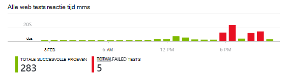

U kunt een web tests voor HTTP- of HTTPS-eindpunt die toegankelijk is vanaf het openbare internet instellen.

Er zijn twee soorten web test:

* [Ping URL testen](#create): een eenvoudige test die u in de portal Azure maken kunt.
* [Testen met meerdere stappen web](#multi-step-web-tests): die u maakt in Visual Studio Ultimate of Visual Studio Enterprise en uploaden naar de portal.

U kunt maximaal 10 web tests per bron van toepassing.

## 1. een bron voor uw lijsten maken

Sla deze stap over als u al [een toepassing inzichten resource instellen hebt] [ start] voor deze toepassing, en u wilt voor een overzicht van de beschikbaarheid van rapporten op dezelfde plaats.

Aanmelden voor het [Microsoft Azure](http://azure.com), gaat u naar de [portal Azure](https://portal.azure.com)en maakt u een bron inzichten van toepassing.

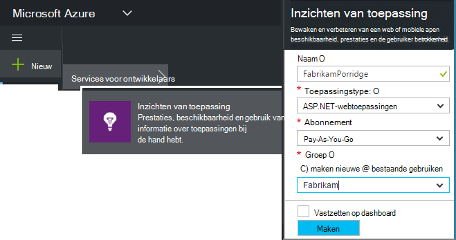

Klik op **alle bronnen** openen van het blad Overzicht voor de nieuwe bron.

## 2. Maak een URL ping test

Zoek naar de tegel beschikbaarheid in uw bron inzichten van toepassing. Klik om te openen de blade Web tests voor uw toepassing en een test van het web toevoegen.

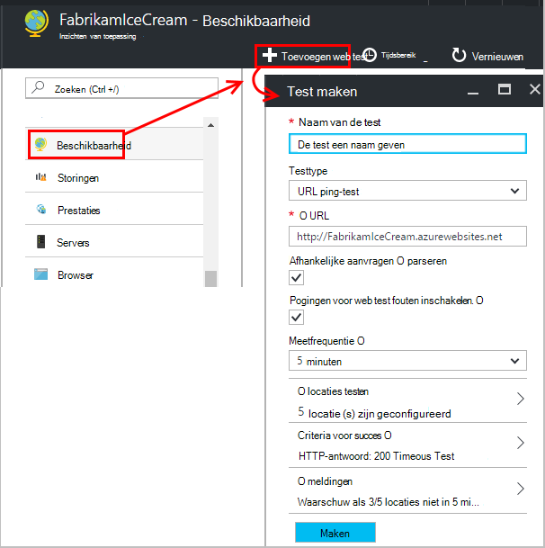

- **De URL** moet van het openbare internet zichtbaar zijn. Hierbij kan een queryreeks & #151; dus bijvoorbeeld u gebruik kan maken van uw database iets. Als de URL worden omgezet in een omleiding, volgen we tot 10 omleidingen.
- **Afhankelijke aanvragen parseren**: afbeeldingen, scripts,, Stijlbestanden en andere bronnen van de pagina als onderdeel van de test worden aangevraagd en de responstijd opgenomen tijden bevat. De test mislukt als al deze bronnen kunnen niet worden gedownload binnen de time-out voor de hele test.
- **Pogingen inschakelen**: als de test mislukt, wordt opnieuw geprobeerd na een korte interval. Een fout wordt gemeld als drie opeenvolgende pogingen mislukken. Verdere tests worden vervolgens uitgevoerd op de gebruikelijke frequentie. Opnieuw is tijdelijk geschorst totdat het volgende succes. Deze regel wordt onafhankelijk toegepast op elke testlocatie. (Het is raadzaam deze instelling. Gemiddeld verdwijnen ongeveer 80% van de storingen op probeer het opnieuw.)
- **Frequentie test**: bepaalt hoe vaak de test wordt uitgevoerd vanaf elke testlocatie. Met een frequentie van vijf minuten en test vijf locaties, is uw site getest met gemiddeld elke minuut.
- **Test locaties** zijn de plaatsen uit waar onze servers webverzoeken verstuurt naar uw URL. Kies meer dan één zodat u problemen in uw website van netwerkproblemen kunt onderscheiden. U kunt maximaal 16 locaties.

- **Criteria voor succes**:

    **Time-out van de test**: deze waarde wilt worden gewaarschuwd over trage reacties verminderen. De test wordt geteld als een fout als de antwoorden van uw site niet binnen deze termijn zijn ontvangen. Als u **afhankelijke aanvragen parseren**, vervolgens alle afbeeldingen, bestanden in de stijl, moeten scripts en andere afhankelijke bronnen zijn ontvangen binnen deze periode.

    **HTTP-antwoord**: de geretourneerde statuscode die wordt geteld als een groot succes. 200 is de code die aangeeft dat een normale webpagina is geretourneerd.

    **Inhoud overeen**: een tekenreeks, zoals "Welkom!" We testen plaatsvindt in elk antwoord. Het moet gewoon string zonder jokertekens. Vergeet dan niet dat als u uw wijzigingen in de pagina inhoud mogelijk moet u deze bijwerken.

- **Waarschuwingen** zijn standaard naar u worden verzonden als er fouten op drie locaties, meer dan vijf minuten. Een storing in één locatie is waarschijnlijk een probleem met het netwerk, en niet een probleem met uw site. Kunt u de drempelwaarde voor de meer of minder gevoelig maar u kunt ook wijzigen wie de e-mailberichten worden verzonden.

    U kunt een [webhook](../monitoring-and-diagnostics/insights-webhooks-alerts.md) die wordt aangeroepen wanneer een waarschuwing wordt gegenereerd instellen. (Maar houd er rekening mee dat op dit moment, query-parameters niet via als eigenschappen doorgegeven worden.)

### Meer URL's testen

Voeg meer tests. Voor het voorbeeld als uw startpagina te testen, kunt u ervoor zorgen dat de database wordt uitgevoerd door het testen van de URL voor een zoekopdracht.

## 3. uw web testresultaten bekijken

Resultaten worden weergegeven in de blade Web Test na 1-2 minuten.

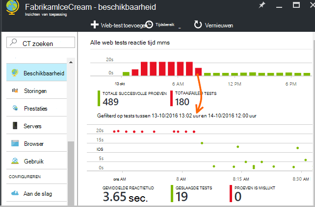

Klik op een balk in de grafiek overzicht voor een meer gedetailleerde weergave van de periode.

Deze grafieken combineren resultaten voor alle web-tests van deze toepassing.

## Als u fouten ziet

Klik op een rode stip.

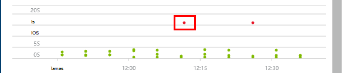

Schuif naar beneden en klik op een test waar minder dan 100% succes.

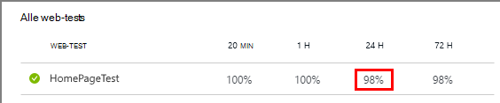

De resultaten van die test openen.

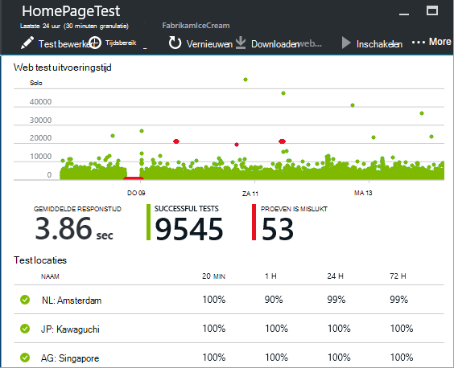

De test wordt uitgevoerd vanuit verschillende locaties & #151; Kies een plaats waar de resultaten zijn minder dan 100%.

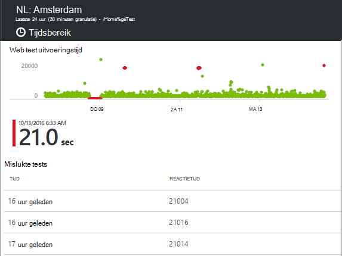

Ga naar de **test is mislukt** en kies vervolgens een resultaat.

Klik op het resultaat evalueren ervan in de portal en waarom deze niet zien.

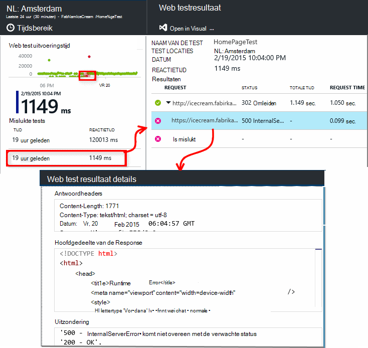

U kunt ook downloaden van het bestand met resultaten en deze controleren in Visual Studio.

*Als een fout gerapporteerd, maar ziet er OK?* Controleer of alle afbeeldingen, scripts, opmaakmodellen en andere bestanden die door de pagina wordt geladen. Als deze fout optreedt, wordt de test gerapporteerd als mislukt, zelfs als de belangrijkste HTML-pagina wordt geladen OK.

## Meerdere stappen web tests

U kunt controleren een scenario dat betrekking heeft op een reeks webadressen. Bijvoorbeeld, als u een website voor verkoop controleren wilt, kunt u testen of toevoegen van items aan het winkelen werkt goed winkelwagen.

Het scenario vastleggen met behulp van Visual Studio wilt maken met meerdere stappen test, en vervolgens de opname uploaden naar de inzichten van toepassing. Toepassing inzichten het scenario met tussenpozen terugspelen en controleert of de antwoorden.

Merk op dat u niet met gecodeerd functies in uw tests: de stappen scenario moeten worden opgenomen als een script in het bestand .webtest.

#### 1. een scenario vastleggen

Gebruik Visual Studio Enterprise of Ultimate wilt opnemen een websessie.

1. Maak een project web performance test.

    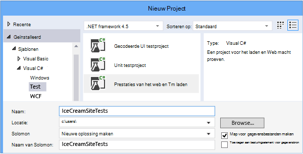

2. Open het bestand .webtest en beginnen met opnemen.

    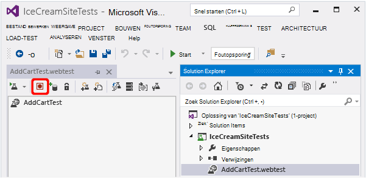

3. De acties van de gebruiker wilt nabootsen in de test te doen: open uw website, een product toevoegen aan de winkelwagen, enzovoort. Stop de test.

    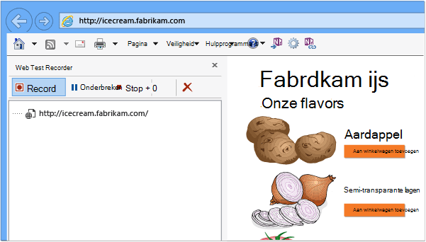

    Maak een lange scenario niet. Er is een limiet van 100 stappen en op 2 minuten.

4. De test om te bewerken:
 - Validaties om te controleren van de ontvangen tekst- en codes toevoegen.
 - Verwijder alle overbodige interacties. Ook kunt u de afhankelijke aanvragen voor foto's of ad of tracking sites verwijderen.

    Houd er rekening mee dat u alleen het testscript bewerken kunt-is niet mogelijk aangepaste code toevoegen of andere tests web call. Geen lussen invoegen in de test. U kunt plug-ins van web standard test.

5. De test uitvoeren in Visual Studio om ervoor te zorgen dat het werkt.

    De web-test-runner een webbrowser wordt geopend en herhaalt de acties die u hebt opgenomen. Controleer of dat deze werkt zoals u verwacht.

    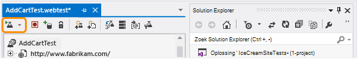

#### 2. de web-test uploadt naar inzichten van toepassing

1. Maak een nieuwe web test in de portal Application inzichten.

    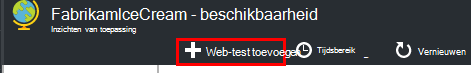

2. Selecteer meerdere stappen test, en upload het bestand .webtest.

    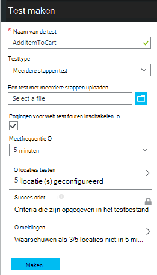

    De locaties van de test, frequentie en alert parameters ingesteld op dezelfde manier als voor ping-tests.

De testresultaten en eventuele fouten op dezelfde manier als voor één url tests weergeven.

Een veelvoorkomende oorzaak van fout is dat de test te lang wordt uitgevoerd. Het kan niet langer dan twee minuten uitgevoerd.

Vergeet niet dat de bronnen van een pagina moeten correct worden geladen voor de test te kunnen uitvoeren, inclusief scripts, opmaakmodellen, afbeeldingen, enzovoort.

Houd er rekening mee dat de web-test volledig moet worden opgenomen in het bestand .webtest: u gecodeerde functies niet gebruiken in de test.

### Tijd en willekeurige getallen aan te sluiten op uw test meerdere stappen

Stel dat u bij het testen van een hulpprogramma dat tijdafhankelijke gegevens zoals voorraden afkomstig uit een externe feed. Wanneer u uw website testen opneemt, hebt u bepaalde tijden, maar u deze instelt als parameters van de test, begintijd en eindtijd.

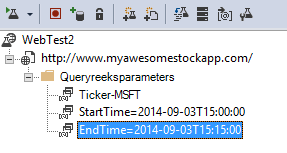

Wanneer u de test uitvoert, moet de gewenste eindtijd altijd op dit moment, en starttijd 15 minuten geleden.

Web Test Plug-ins kunt u de tijden voorzien.

1. Een test web plug-in voor elke variabele parameterwaarde die u wilt toevoegen. Kies in de werkbalk web test **Web Test Plugin toevoegen**.

    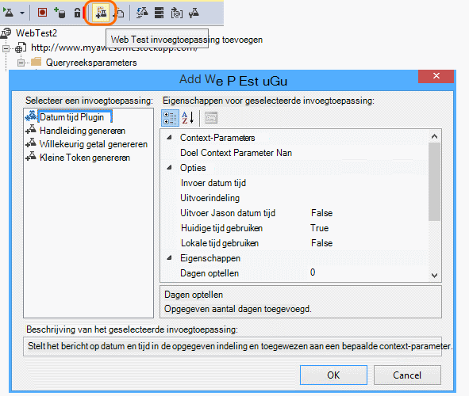

    In dit voorbeeld gebruiken we twee exemplaren van de datum-tijd-invoegtoepassing. Een exemplaar is voor '15 minuten geleden' en 'nu'.

2. Open de eigenschappen van elke invoegtoepassing. Een naam geven en het gebruik van de huidige tijd ingesteld. Voor een van hen, ingestelde toevoegen minuten = -15.

    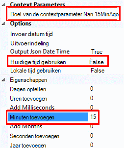

3. Test parameters in het web, {{naam}} als u verwijst naar de naam van een invoegtoepassing gebruiken.

    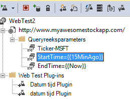

Upload uw test nu de portal. De dynamische waarden wordt gebruikt op elke uitvoering van de test.

## Omgaan met-in

Als uw gebruikers zich met uw app aanmelden, hebt u verschillende opties voor het simuleren van aanmelden zodat u pagina's achter het aanmelden kunt testen. De benadering die u gebruikt, hangt af van het type beveiliging van de app.

In alle gevallen moet u een account maken in uw toepassing voor de testen. Beperk de machtigingen van deze testaccount, indien mogelijk, zodat er geen mogelijkheid om de web-tests op het gebied van echte gebruikers.

### Eenvoudige gebruikersnaam en wachtwoord

Een web-test op de gebruikelijke manier registreren. Verwijder eerst de cookies.

### SAML-verificatie

Gebruik de SAML-invoegtoepassing die beschikbaar is voor web-tests.

### Het geheim van de client

Als uw app een route-in dat betrekking heeft op een geheim van de client heeft, gebruikt u die route. Azure Active Directory (AAD) is een voorbeeld van een service die een client biedt geheime aanmelden. AAD is het geheim van de client de sleutel App.

Dit is een test van een Azure web app met behulp van een sleutel app web:

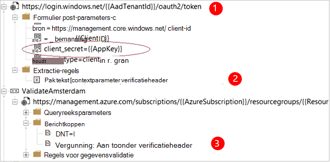

1. Token worden opgehaald uit het geheim van de client (AppKey) met AAD.
2. Pak aan toonder token uit reactie.
3. Aan toonder token in de koptekst van de vergunning met API aanroepen.

Zorg ervoor dat de web-test een werkelijke client is-dat wil zeggen, een eigen app AAD heeft - en haar clientId + appkey gebruiken. Uw service beproeven heeft ook een eigen app in AAD: de appID URI van dit app wordt weerspiegeld in de web test in het veld 'bron'.

### Open verificatie

Een voorbeeld van open verificatie zich aanmeldt met uw Microsoft of Google-account. Veel apps die gebruik OAuth Geef de geheime plaats, zodat de eerste tactiek die mogelijkheid onderzoeken.

Als de test met behulp van OAuth aanmelden moet, is de algemene aanpak:

 * Gebruik een hulpprogramma als Fiddler te onderzoeken van het verkeer tussen de webbrowser de verificatiesite en uw app.
 * Twee of meer aanmeldingen met andere computers of browsers, uitvoeren of met lange tussenpozen (voor tokens vervallen).
 * Door het vergelijken van verschillende sessies, het token dat wordt doorgegeven van de verifiërende site, vervolgens aan de server van uw app na inloggen doorgegeven wordt terug te identificeren.
 * Een web-test met behulp van Visual Studio registreren.
 * De tokens, wanneer het token van de verificator wordt geretourneerd als u de parameter en het gebruik ervan in de query om de site te voorzien.
 (Visual Studio probeert te voorzien van de test, maar is niet juist de tokens voorzien.)

## Bewerken in- of uitschakelen van een test

Open een afzonderlijke test om te bewerken of uit te schakelen.

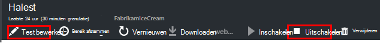

U kunt testen voor web uitschakelen tijdens het uitvoeren van onderhoud op uw service.

## Prestatietests

U kunt een load test uitvoeren op uw website. Net als bij de test beschikbaarheid kunt u eenvoudige aanvragen of meerdere stappen aanvragen verzenden van onze punten over de hele wereld. In tegenstelling tot een test beschikbaarheid worden veel aanvragen verzonden, meerdere gelijktijdige gebruikers te simuleren.

Open in het blad overzicht **Instellingen** **Prestatietests**. Als u een test maakt, wordt u uitgenodigd om verbinding te maken met een Visual Studio Team Services-account te maken.

Wanneer de test voltooid is, kunt u responstijden en succes tarieven worden weergegeven.

## Automatisering

* [Gebruik PowerShell-scripts voor het instellen van een website test](https://azure.microsoft.com/blog/creating-a-web-test-alert-programmatically-with-application-insights/) automatisch.
* Instellen van een [webhook](../monitoring-and-diagnostics/insights-webhooks-alerts.md) die wordt aangeroepen wanneer een waarschuwing wordt gegenereerd.

## Heb je vragen? Problemen?

* *Kan ik code aanroepen vanuit mijn web-test*

    Nr. De stappen van de test moet in het bestand .webtest. En u kunt aanroepen van andere tests van het web of lussen te gebruiken. Maar er zijn diverse plug-ins die nuttig kunnen zijn.

* *Is HTTPS ondersteund?*

    We ondersteunen TLS 1.1 en TLS 1.2.

* *Is er een verschil tussen "web tests" en "beschikbaarheid tests"?*

    We de twee termen door elkaar gebruiken.

* *Ik wil graag gebruik beschikbaarheid proeven op onze interne server achter een firewall wordt uitgevoerd.*

    Configureer uw brandscherm aanvragen toestaan van de [IP-adressen van webpagina testen agenten](app-insights-ip-addresses.md#availability).

* *Een webpagina met meerdere stappen test uploaden mislukt*

    Er is een limiet van 300 K.

    Lussen worden niet ondersteund.

    Verwijzingen naar andere webpagina tests worden niet ondersteund.

    Gegevensbronnen worden niet ondersteund.

* *Mijn test meerdere stappen uitvoeren niet.*

    Er is een limiet van 100 aanvragen per test.

    De test is gestopt als deze wordt uitgevoerd langer dan twee minuten.

* *Hoe kan ik een test uitvoeren met clientcertificaten?*

    Wij niet ondersteunen, helaas.

## Video

> [AZURE.VIDEO monitoring-availability-with-application-insights]

## Volgende stappen

[Diagnoselogboeken zoeken][diagnostic]

[Het oplossen van problemen][qna]

[IP-adressen van web test agenten](app-insights-ip-addresses.md)

<!--Link references-->

[azure-availability]: ../insights-create-web-tests.md
[diagnostic]: app-insights-diagnostic-search.md
[qna]: app-insights-troubleshoot-faq.md
[start]: app-insights-overview.md
