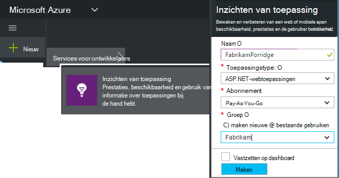
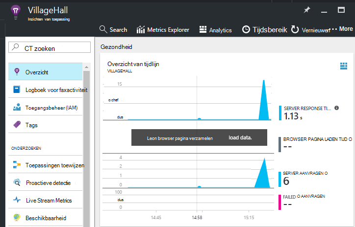

<properties
    pageTitle="Toepassing inzichten SDK voor het controleren van uw app Node.js toevoegen | Microsoft Azure"
    description="Analyseren van gebruik, beschikbaarheid en prestaties van uw op locatie of de webtoepassing Microsoft Azure met inzichten van toepassing."
    services="application-insights"
    documentationCenter=""
    authors="alancameronwills"
    manager="douge"/>

<tags
    ms.service="application-insights"
    ms.workload="tbd"
    ms.tgt_pltfrm="ibiza"
    ms.devlang="na"
    ms.topic="get-started-article"
    ms.date="08/30/2016"
    ms.author="awills"/>


# <a name="add-application-insights-sdk-to-monitor-your-nodejs-app"></a>Toepassing inzichten SDK voor het controleren van uw app Node.js toevoegen

*Inzichten van toepassing is in het afdrukvoorbeeld.*

[Inzichten van Visual Studio-toepassing](app-insights-overview.md) controleert uw live toepassing om u te helpen [opsporen en onderzoeken van prestatieproblemen en uitzonderingen](app-insights-detect-triage-diagnose.md)en [Ontdek hoe uw app wordt gebruikt](app-insights-overview-usage.md). Het is geschikt voor toepassingen die worden gehost op uw eigen IIS-servers in de bedrijfsruimten of Azure VMs zoals Azure web apps.


De SDK bevat automatische verzameling tarieven voor binnenkomende HTTP-aanvragen en antwoorden, prestatiemeteritems (CPU, geheugen, RPS) en niet-verwerkte uitzonderingen. U kunt bovendien aangepaste aanroepen voor het bijhouden van afhankelijkheden, metrische of andere gebeurtenissen toevoegen.


#### <a name="before-you-start"></a>Voordat u begint

Hebt u nodig:

* Visual Studio 2013 of later. Later is beter.
* Een abonnement op [Microsoft Azure](http://azure.com). Als uw team of organisatie een Azure-abonnement heeft, kunt de eigenaar u aan toevoegen, met uw [Microsoft-account](http://live.com).

## <a name="add"></a>Maak een bron toepassing inzichten

Aanmelden bij de [Azure portal][portal], en een nieuwe toepassing inzichten bron maken. Een [resource] [ roles] in Azure is een exemplaar van een service. Deze bron is waar telemetrie van uw app worden geanalyseerd en aan u gepresenteerd.



Kies Overige als het toepassingstype. De keuze van het toepassingstype wordt de Standaardinhoud van de eigenschappen en de resource-blades zichtbaar in [De Verkenner Metrics][metrics].

#### <a name="copy-the-instrumentation-key"></a>Kopieer de sleutel Instrumentation

De sleutel geeft de bron, en installeert u deze snel in de SDK om gegevens naar de bron.


## <a name="sdk"></a>De SDK installeren in uw toepassing

```
npm install applicationinsights --save
```

## <a name="usage"></a>Gebruik

Hiermee schakelt u aanvragen controleren, niet-verwerkte uitzondering bijhouden en prestaties van het systeem controleren (CPU/geheugen/RPS).

```javascript

var appInsights = require("applicationinsights");
appInsights.setup("<instrumentation_key>").start();
```

De sleutel instrumentation kan ook worden ingesteld in de omgevingsvariabele APPINSIGHTS_INSTRUMENTATIONKEY. Als dit gebeurt, is geen argument nodig bij het aanroepen van `appInsights.setup()` of `appInsights.getClient()`.

U kunt de SDK zonder telemetrie verzenden: de sleutel instrumentation ingesteld op een niet-lege tekenreeks.


## <a name="run"></a>Voer het project

Uw toepassing wordt uitgevoerd en probeer het zelf: verschillende pagina's voor het genereren van sommige telemetrie openen.


## <a name="monitor"></a>Uw telemetrie weergeven

Terug naar de [portal Azure](https://portal.azure.com) en blader naar de resource inzichten van toepassing.


Zoeken naar gegevens in de pagina overzicht. Op het eerste ziet maar u een of twee punten. Bijvoorbeeld:



Klik op een grafiek om te zien meer gedetailleerde statistieken. [Meer informatie over parameters.][perf]

#### <a name="no-data"></a>Er zijn geen gegevens?

* Gebruik de toepassing, zodat sommige telemetrie genereert verschillende pagina's te openen.
* Open de tegel [Zoeken](app-insights-diagnostic-search.md) om afzonderlijke gebeurtenissen te bekijken. Soms duurt het gebeurtenissen iets terwijl langer ophalen via de pijpleiding maatstaven.
* Wacht een paar seconden en klikt u op **vernieuwen**. Grafieken regelmatig zelf vernieuwen, maar u kunt handmatig vernieuwen als je voor bepaalde gegevens wacht kunnen worden weergegeven.
* Zie [problemen oplossen bij][qna].

## <a name="publish-your-app"></a>Publiceren van uw app

Nu uw toepassingen distribueren naar IIS of Azure en bekijk de gegevens worden verzameld.


#### <a name="no-data-after-you-publish-to-your-server"></a>Er zijn geen gegevens nadat u op de server publiceren?

Deze poorten voor uitgaand verkeer openen in de firewall van uw server:

+ `dc.services.visualstudio.com:443`
+ `f5.services.visualstudio.com:443`


#### <a name="trouble-on-your-build-server"></a>Problemen op de server samenstellen?

Raadpleeg [dit artikel oplossen](app-insights-asp-net-troubleshoot-no-data.md#NuGetBuild).


## <a name="customized-usage"></a>Aangepaste toepassingen 

### <a name="disabling-auto-collection"></a>Het uitschakelen van auto-collectie

```javascript
import appInsights = require("applicationinsights");
appInsights.setup("<instrumentation_key>")
    .setAutoCollectRequests(false)
    .setAutoCollectPerformance(false)
    .setAutoCollectExceptions(false)
    // no telemetry will be sent until .start() is called
    .start();
```

### <a name="custom-monitoring"></a>Aangepaste controle

```javascript
import appInsights = require("applicationinsights");
var client = appInsights.getClient();

client.trackEvent("custom event", {customProperty: "custom property value"});
client.trackException(new Error("handled exceptions can be logged with this method"));
client.trackMetric("custom metric", 3);
client.trackTrace("trace message");
```

[Meer informatie over de API van de telemetrie](app-insights-api-custom-events-metrics.md).

### <a name="using-multiple-instrumentation-keys"></a>Met behulp van meerdere instrumentation sleutels

```javascript
import appInsights = require("applicationinsights");

// configure auto-collection with one instrumentation key
appInsights.setup("<instrumentation_key>").start();

// get a client for another instrumentation key
var otherClient = appInsights.getClient("<other_instrumentation_key>");
otherClient.trackEvent("custom event");
```

## <a name="examples"></a>Voorbeelden

### <a name="tracking-dependency"></a>Bijhouden van afhankelijkheid

```javascript
import appInsights = require("applicationinsights");
var client = appInsights.getClient();

var startTime = Date.now();
// execute dependency call
var endTime = Date.now();

var elapsedTime = endTime - startTime;
var success = true;
client.trackDependency("dependency name", "command name", elapsedTime, success);
```


### <a name="manual-request-tracking-of-all-get-requests"></a>Handmatige aanvraag bijhouden van alle aanvragen voor "GET"

```javascript
var http = require("http");
var appInsights = require("applicationinsights");
appInsights.setup("<instrumentation_key>")
    .setAutoCollectRequests(false) // disable auto-collection of requests for this example
    .start();

// assign common properties to all telemetry sent from the default client
appInsights.client.commonProperties = {
    environment: process.env.SOME_ENV_VARIABLE
};

// track a system startup event
appInsights.client.trackEvent("server start");

// create server
var port = process.env.port || 1337
var server = http.createServer(function (req, res) {
    // track all "GET" requests
    if(req.method === "GET") {
        appInsights.client.trackRequest(req, res);
    }

    res.writeHead(200, { "Content-Type": "text/plain" });
    res.end("Hello World\n");
}).listen(port);

// track startup time of the server as a custom metric
var start = +new Date;
server.on("listening", () => {
    var end = +new Date;
    var duration = end - start;
    appInsights.client.trackMetric("StartupTime", duration);
});
```

## <a name="next-steps"></a>Volgende stappen

* [Controleer uw telemetrie in de portal](app-insights-dashboards.md)
* [Analytics query's via uw telemetrie schrijven](app-insights-analytics-tour.md)


<!--Link references-->

[knowUsers]: app-insights-overview-usage.md
[metrics]: app-insights-metrics-explorer.md
[perf]: app-insights-web-monitor-performance.md
[portal]: http://portal.azure.com/
[qna]: app-insights-troubleshoot-faq.md
[roles]: app-insights-resources-roles-access-control.md
