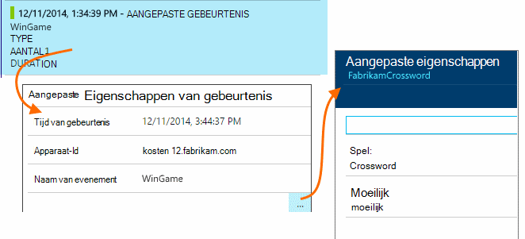

<properties
    pageTitle="Gebruiksanalyse met inzichten van toepassing"
    description="Overzicht van de gebruiksanalyse met inzichten van toepassing"
    services="application-insights"
    documentationCenter=""
    authors="alancameronwills"
    manager="douge"/>

<tags
    ms.service="application-insights"
    ms.workload="tbd"
    ms.tgt_pltfrm="ibiza"
    ms.devlang="multiple"
    ms.topic="article" 
    ms.date="04/08/2016"
    ms.author="awills"/>

# Gebruiksanalyse met inzichten van toepassing

Weten hoe mensen gebruiken in uw toepassing kunt u uw ontwikkelingswerk gericht op de scenario's die voor hen het belangrijkst zijn, en zo inzicht te krijgen in de doelen die zij zoeken makkelijker of moeilijker te bereiken.

Toepassing inzichten bieden een duidelijk beeld van het gebruik van uw toepassing helpt u om uw gebruikers ervaring te verbeteren, en voldoen aan uw zakelijke doelstellingen.

Toepassing inzichten werkt voor zowel zelfstandige apps (op iOS, Android en Windows) en web apps (die worden gehost op .NET of J2EE). 

## Inzichten van de toepassing aan uw project toevoegen

Om te beginnen, krijgt u een gratis account met [Microsoft Azure](https://azure.com). (Na de proefperiode kunt u doorgaan met de vrij laag van de service.)

Maken in de [portal Azure](https://portal.azure.com)een bron inzichten van toepassing. Dit is waar ziet u de gegevens en de prestaties over uw app.

**Als uw app een app apparaat is** toevoegen de inzichten Application SDK aan uw project. De exacte procedure is afhankelijk van uw [IDE- en](app-insights-platforms.md). Voor Windows-apps gewoon met de rechtermuisknop op het project in Visual Studio en kies "Add Application inzichten."

**Als een web app is,** open de Quick Start-blade en krijgt het codefragment toevoegen aan uw webpagina's. Ze publiceren met dit fragment.

U kunt ook inzichten toepassing toevoegen aan uw [ASP.NET](app-insights-asp-net.md) - of [J2EE](app-insights-java-get-started.md) -servercode te combineren telemetrie van zowel client als server.

### Voer het project en bekijk de eerste resultaten

Uw project uitvoeren in de foutopsporingsmodus voor een paar minuten en gaat u naar de [portal Azure](https://portal.azure.com) en blader naar de projectresource in inzichten van toepassing.

Publiceer uw app meer Telemetrie en weten wat uw gebruikers met de app doen.

## Analytics uit de doos

Op de paginaweergaven naast elkaar om te zien, details van gebruik.

Plaats de muisaanwijzer in het lege gedeelte boven een grafiek voor een overzicht van de aantallen op een bepaald punt. De nummers weergeven anders de waarde over de periode, zoals een gemiddelde, een totaal of een aantal van verschillende gebruikers over de periode samengevoegd.

Gebruikers worden geteld in webtoepassingen, met behulp van cookies. Een persoon die gebruikmaakt van verschillende browsers, worden cookies gewist of gebruikt de PRIVACYFUNCTIE wordt meerdere keren geteld.

Een websessie wordt na 30 minuten inactiviteit geteld. Een sessie op een telefoon of een ander apparaat wordt geteld wanneer de app is geschorst gedurende meer dan een paar seconden.

Klik op de grafiek meer detail te zien. Bijvoorbeeld:

(In dit voorbeeld is van een website, maar de grafieken voor toepassingen die worden uitgevoerd op apparaten lijken.)

Vergelijken met de vorige week te zien als dingen wilt wijzigen:

Vergelijk twee maatstaven, bijvoorbeeld gebruikers en nieuwe gebruikers:

Gegevens te groeperen (segment) op een eigenschap, zoals de Browser, besturingssysteem of plaats:

## Gebruik van de pagina

Klik op de paginaweergaven naast elkaar weergeven als u een onderverdeling van de meest populaire pagina's:

In het bovenstaande voorbeeld is van een website met spellen. Hieruit kunnen we direct zien:

* Gebruik niet is verbeterd in de afgelopen week. Misschien moeten we denken over optimalisatie voor zoekmachines?
* Veel minder mensen Zie spelletjes pagina's dan de introductiepagina. Waarom niet onze homepage aantrekken van mensen om te spelen?
* 'Crossword' is de meest populaire spel. We moeten voorrang geven aan nieuwe ideeën en er verbeteringen.

## Aangepaste reeksspatiëring

Stel dat in plaats van de uitvoering van elk spel in een aparte pagina, u wilt ze refactoring alles in de dezelfde app voor één pagina, met de meeste van de functionaliteit die is gecodeerd als Javascript in de pagina. Hierdoor kan de gebruiker snel schakelen tussen een spel en de andere, of zelfs hebben verschillende spelletjes op één pagina.

Maar u wilt toch inzichten van de toepassing aan te melden, het aantal keren elk spel wordt geopend, op dezelfde manier als wanneer deze zich op een afzonderlijke webpagina's. Dat is heel eenvoudig: alleen een aanroep van de telemetrie-module in uw JavaScript op de record die is geopend met een nieuwe pagina waar u wilt invoegen:

    telemetryClient.trackPageView(game.Name);

## Aangepaste gebeurtenissen

U kunt de telemetrie op tal van manieren om te begrijpen hoe uw toepassing wordt gebruikt. Maar niet altijd wilt berichten verwisselt met paginaweergaven. Aangepaste gebeurtenissen in plaats daarvan gebruiken. U kunt ze uit apparaat apps, webpagina's of een webserver verzenden:

(JavaScript)

    telemetryClient.trackEvent("GameEnd");

(C#)

    var tc = new Microsoft.ApplicationInsights.TelemetryClient();
    tc.TrackEvent("GameEnd");

(VB)

    Dim tc = New Microsoft.ApplicationInsights.TelemetryClient()
    tc.TrackEvent("GameEnd")

De meest voorkomende aangepaste gebeurtenissen worden vermeld op het blad Overzicht.

Klik op de kop van de tabel voor een overzicht van de totale aantal gebeurtenissen. U kunt de grafiek segment door verschillende kenmerken, zoals de naam van de gebeurtenis:

De bijzonder nuttige functie van tijdlijnen is dat u wijzigingen met andere maatstaven en gebeurtenissen correleren kan. Op momenten dat er meer spellen worden gespeeld, verwacht u verweesde spellen ook een stijging zien. Maar de stijging van de afgebroken spellen onevenredig is, u wilt weten of de hoge belasting veroorzaakt door problemen die gebruikers onaanvaardbaar vinden.

## Detailinformatie specifieke gebeurtenissen

Als u een beter begrip van hoe een typische sessie gaat, kunt u zich richten op een specifieke gebruikerssessie met een bepaald type gebeurtenis.

In dit voorbeeld wordt gecodeerd we een aangepaste gebeurtenis 'NoGame', die wordt aangeroepen als de gebruiker meldt zich af zonder daadwerkelijk een spel wordt gestart. Waarom zou een gebruiker doen? Misschien als we enkele specifieke exemplaren lager, je wij geven een aanwijzing.

De aangepaste gebeurtenissen ontvangen vanuit de app worden weergegeven op het blad Overzicht:

Klik op de gebeurtenis die van belang en selecteer recente criteria voldoen:

We bekijken alle telemetrie voor de sessie waarin die NoGame gebeurtenis zich heeft voorgedaan.

Er zijn geen uitzonderingen, zodat de gebruiker is niet verhinderd door een fout.

We kunnen alle soorten telemetrie, met uitzondering van paginaweergaven uitfilteren voor deze sessie:

En nu kunnen we zien dat deze gebruiker ingelogd simpelweg naar de meest recente scores controleren. Misschien moeten we overwegen ontwikkelen van een gebruiker verhaal dat beter doen. (En we moeten implementeren voor een aangepaste gebeurtenis rapport wanneer dit specifieke artikel plaatsvindt.)

## Filteren, zoeken en segmenteren van uw gegevens met eigenschappen
U kunt willekeurige codes en numerieke waarden koppelen aan gebeurtenissen.

JavaScript op de client

    appInsights.trackEvent("WinGame",
        // String properties:
        {Game: currentGame.name, Difficulty: currentGame.difficulty},
        // Numeric measurements:
        {Score: currentGame.score, Opponents: currentGame.opponentCount}
    );

C# op server

    // Set up some properties:
    var properties = new Dictionary <string, string>
        {{"game", currentGame.Name}, {"difficulty", currentGame.Difficulty}};
    var measurements = new Dictionary <string, double>
        {{"Score", currentGame.Score}, {"Opponents", currentGame.OpponentCount}};

    // Send the event:
    telemetry.TrackEvent("WinGame", properties, measurements);

VB op server

    ' Set up some properties:
    Dim properties = New Dictionary (Of String, String)
    properties.Add("game", currentGame.Name)
    properties.Add("difficulty", currentGame.Difficulty)

    Dim measurements = New Dictionary (Of String, Double)
    measurements.Add("Score", currentGame.Score)
    measurements.Add("Opponents", currentGame.OpponentCount)

    ' Send the event:
    telemetry.TrackEvent("WinGame", properties, measurements)

Eigenschappen koppelen aan bezoekers op dezelfde manier:

JavaScript op de client

    appInsights.trackPageView("Win",
        {Game: currentGame.Name},
        {Score: currentGame.Score});

In diagnostische zoeken, moet u de eigenschappen weergeven door te klikken op door middel van een afzonderlijk exemplaar van een gebeurtenis.

Gebruik het veld zoeken voor een overzicht van de gebeurtenissen die hebben plaatsgevonden met een bepaalde eigenschappenwaarde.

## A | B testen

Als u niet welke variant van een functie succesvoller zal zijn weet, laat u beide, waardoor elke toegankelijk voor andere gebruikers. Het succes van elk meten en vervolgens verplaatst naar een uniforme versie.

Voor deze techniek kunt u verschillende codes toevoegen aan de telemetrie die door elke versie van uw app wordt verzonden. U kunt dit doen door de eigenschappen te definiëren in de actieve TelemetryContext. Deze standaardeigenschappen worden toegevoegd aan elk telemetrie bericht dat de toepassing wordt verzonden - niet alleen uw aangepaste berichten, maar ook de standaard telemetrie.

In de portal Application inzichten kun je vervolgens steeds te filteren en groeperen (segment) uw gegevens op de tags, om de verschillende versies vergelijken.

C# op server

    using Microsoft.ApplicationInsights.DataContracts;

    var context = new TelemetryContext();
    context.Properties["Game"] = currentGame.Name;
    var telemetry = new TelemetryClient(context);
    // Now all telemetry will automatically be sent with the context property:
    telemetry.TrackEvent("WinGame");

VB op server

    Dim context = New TelemetryContext
    context.Properties("Game") = currentGame.Name
    Dim telemetry = New TelemetryClient(context)
    ' Now all telemetry will automatically be sent with the context property:
    telemetry.TrackEvent("WinGame")

Afzonderlijke telemetrie kunt negeren de standaardwaarden.

U kunt een universele initialiseren instellen zodat alle nieuwe TelemetryClients automatisch uw context gebruikt.

    // Telemetry initializer class
    public class MyTelemetryInitializer : ITelemetryInitializer
    {
        public void Initialize (ITelemetry telemetry)
        {
            telemetry.Properties["AppVersion"] = "v2.1";
        }
    }

In de initialisatiefunctie app zoals Global.asax.cs:

    protected void Application_Start()
    {
        // ...
        TelemetryConfiguration.Active.TelemetryInitializers
        .Add(new MyTelemetryInitializer());
    }

## Build - eenheid - informatie

Wanneer u analytics gebruiken, wordt het een geïntegreerd onderdeel ontwikkelingscyclus - niet alleen wat die u denkt over om te helpen problemen op te lossen. Hier volgen enkele tips:

* De belangrijkste metric van uw toepassing bepalen. Wilt u dat gebruikers zoveel mogelijk, of u liever een kleine groep gebruikers tevreden? Wilt u bezoeken of verkoop te maximaliseren?
* Plan voor het meten van elk artikel. Wanneer een schets van een nieuwe gebruiker verhaal of functie of een plan voor het bijwerken van een bestaande, altijd bedenken hoe u meet het succes van de wijziging. Voordat u begint codering, vraag "welk effect dit heeft op onze metrics, als het werkt? Moeten we volgen alle nieuwe gebeurtenissen?"
En natuurlijk als de functie live is, Controleer of u de analytics bekijken en reageren op de resultaten.
* Andere metrische gegevens betrekking op de belangrijkste metric. Bijvoorbeeld, als u een functie 'Favorieten' toevoegen, u wilt weten hoe vaak gebruikers Favorieten toevoegen. Maar het is misschien meer interessant om te weten hoe vaak komen ze terug naar hun Favorieten. En, bovenal, klanten die werken met Favorieten uiteindelijk kopen van uw product?
* Canarische testen. Een schakeloptie functie waarmee u een nieuwe functie om zichtbaar te maken alleen voor bepaalde gebruikers kunt instellen. Inzichten van toepassing om te zien of de nieuwe functie wordt gebruikt in de manier waarop die u het beoogde gebruik. Pas vervolgens vrijgeven aan een breder publiek.
* Neem contact op met uw gebruikers! Analytics is niet genoeg op zichzelf, maar vullen elkaar aan het onderhouden van een goede klantrelatie.

## Meer informatie

* [Opsporen, uw beoordelen wanneer bent en onderzoeken, crashes en problemen met de prestaties in uw app](app-insights-detect-triage-diagnose.md)
* [Aan de slag met de inzichten van toepassing op verschillende platformen](app-insights-detect-triage-diagnose.md)

## Video

> [AZURE.VIDEO usage-monitoring-application-insights]

 
