<properties 
    pageTitle="Toepassing inzichten zelfstudie | Microsoft Azure" 
    description="Gebruik en de prestaties van uw webtoepassing live volgen.  Uw beoordelen wanneer bent problemen opsporen en onderzoeken. Continu bewaken en verbeteren van succes met uw gebruikers." 
    services="application-insights" 
    documentationCenter=""
    authors="alancameronwills" 
    manager="douge"/>

<tags 
    ms.service="application-insights" 
    ms.workload="tbd" 
    ms.tgt_pltfrm="ibiza" 
    ms.devlang="na" 
    ms.topic="article" 
    ms.date="10/15/2016" 
    ms.author="awills"/>
 
# Toepassing inzichten - Inleiding

Inzichten van Visual Studio-toepassing is een uitbreidbare analytics-service waarbij uw live-webtoepassing wordt gecontroleerd. U kunt detecteren en vaststellen van prestatieproblemen met en begrijpen wat gebruikers eigenlijk doen met de app. Het ontworpen voor ontwikkelaars bij het continu verbeteren van prestaties en het gebruiksgemak. Het werkt voor apps gehost op een groot aantal verschillende platforms, waaronder .NET, Node.js en J2EE, in ruimten of in de cloud. 

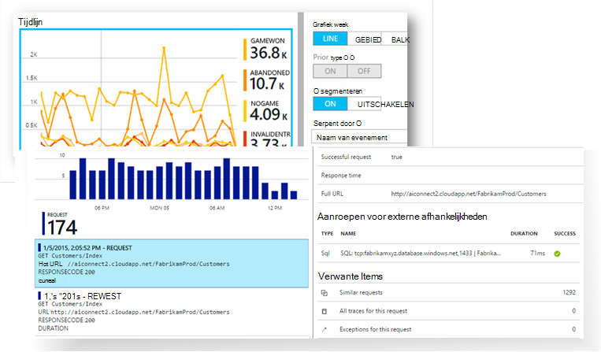

[Bekijk de intro-animatie](https://www.youtube.com/watch?v=fX2NtGrh-Y0).

## Hoe werkt het?

U een kleine instrumentation-pakket installeren in uw toepassing en een resource toepassing inzichten in de portal voor Microsoft Azure instellen. De instrumenten bewaakt uw app en telemetriegegevens verzendt naar de portal. De portal geeft u statistische grafieken en bevat krachtige zoekfuncties waarmee u eventuele problemen opsporen.

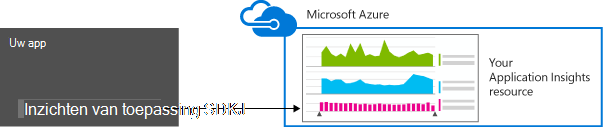

Toepassing inzichten heeft verschillende [modules standaard instrumentatie](app-insights-configuration-with-applicationinsights-config.md) die verschillende soorten telemetrie zoals aanvraag responstijden, uitzonderingen en afhankelijkheid gesprekken te verzamelen. U kunt ook [code schrijven voor het verzenden van aangepaste telemetrie](app-insights-api-custom-events-metrics.md) op de portal.

### Wat is de overhead?

De impact op de prestaties van uw app is erg klein. Bijhouden van gesprekken zijn zijn niet-blokkerende en batch verwerkt en verzonden in een afzonderlijke thread. 

## Wat doet het?

Inzichten van toepassing is gericht op het ontwikkelingsteam om te begrijpen hoe uw app presteert en hoe deze wordt gebruikt. Het biedt:

Telemetrie-typen:

* HTTP-verzoek tarieven, responstijden, succes te behalen.
* Afhankelijkheid (http- & SQL) call tarieven, responstijden, succes te behalen.
* Sporen van de uitzondering van de server en de client.
* Het diagnoselogboek van sporen.
* In de weergave pagina telt, gebruikers- en telt, browser laadtijden, uitzonderingen.
* AJAX oproep tarieven, responstijden en succes te behalen.
* Prestatiemeteritems van de server.
* Aangepaste telemetrie van client en server.
* Segmentatie door klant, browserversie, versie van het besturingssysteem, serverexemplaar, aangepaste afmetingen en meer.
* Beschikbaarheid van tests

Diagnose- en analytische hulpmiddelen:

* Handmatige en slimme waarschuwingen defecten vertoont en andere statistieken en beschikbaarheid.
* Grafieken in de tijd van de geaggregeerde statistieken.
* Diagnostische zoeken op exemplaren van de aanvragen, uitzonderingen, aangepaste gebeurtenissen, logboek sporen, bezoekers, afhankelijkheid en AJAX roept. 
* Analytics - een krachtige querytaal via de telemetrie
* Dashboards - opstellen de grafieken die u nodig hebt voor het controleren van alle onderdelen van uw app.

## Hoe kan ik gebruiken?

### Monitor

Inzichten van de toepassing installeren in uw web app, web-tests beschikbaarheid, instellen en:

* Instellen van een dashboard voor uw team-ruimte om te laden, reactievermogen en de prestaties van uw afhankelijkheden, AJAX oproepen en laden van pagina in de gaten houden. 
* Ontdek de traagste zijn en de meeste mislukte aanvragen.
* Live Stream bekijken wanneer u een nieuwe versie, om te weten dat er onmiddellijk een afbraak implementeert.

### Diagnose

Wanneer u een waarschuwing ontvangt of een probleem ontdekt:

* Storingen correleren met uitzonderingen, afhankelijkheid oproepen en sporen.
* Onderzoek- en traceerlogboeken stackdumps.

### Beoordelen

Meten van de effectiviteit van elke nieuwe functie die u implementeert.

* Plan om te meten hoe klanten nieuwe UX en zakelijke functies gebruiken.
* Schrijf aangepaste telemetrie in uw programmacode aan te melden, gebruik.
* Elke ontwikkelingscyclus baseren op harde bewijzen van telemetrie.

## Aan de slag

Inzichten van toepassing is een van de vele services die worden gehost in Microsoft Azure en telemetrie er verzonden voor analyse en presentatie. Dus voordat u iets anders doet, u een abonnement op [Microsoft Azure moet](http://azure.com). Het is gratis aanmelden en kunt u de gratis [tier prijzen](https://azure.microsoft.com/pricing/details/application-insights/) van toepassing inzichten. Als uw organisatie al een abonnement heeft, kunnen zij aan uw Microsoft-account toevoegen. 

Er zijn verschillende manieren om aan de slag. Beginnen met afhankelijk van wat het beste voor u werkt. U kunt de andere later toevoegen.

* **AT runtime: instrument van uw web app op de server.** De update van de code voorkomt. U moet uw server beheerder toegang.
 * [**IIS in ruimten of in een VM**](app-insights-monitor-performance-live-website-now.md)
 * [**Azure web app of VM**](app-insights-monitor-performance-live-website-now.md#if-your-app-runs-as-an-azure-web-app)
 * [**J2EE**](app-insights-java-live.md)
* **Op tijd: inzichten toepassing toevoegen aan uw code.** Kunt u schrijven de aangepaste Telemetrie en instrument back-end en desktop apps.
 * [Visual Studio](app-insights-asp-net.md) 2013 update 2 of hoger.
 * Java in [Eclips](app-insights-java-eclipse.md) of [andere hulpprogramma 's](app-insights-java-get-started.md)
 * [Node.js](app-insights-nodejs.md)
 * [Andere platforms](app-insights-platforms.md)
* **[Uw webpagina's instrument](app-insights-javascript.md)** voor paginaweergave, AJAX en andere telemetrie client-side.
* **[Beschikbaarheid van tests](app-insights-monitor-web-app-availability.md)** - ping van de website regelmatig van onze servers.

> [AZURE.NOTE]  Op dit moment misschien wilt u alleen opvragen over en experimenteren. Maar als u wilt zien welke inzichten toepassing kunt doen, lees verder...

## Bekijk de Metrics

Voer uw app - hetzij in de foutopsporingsmodus op de ontwikkelcomputer of door deze naar een server te implementeren - en deze gebruiken voor een tijdje. Meldt u zich aan de [Azure portal](https://portal.azure.com).

Ga naar een van uw app toepassing inzichten overzicht blade:

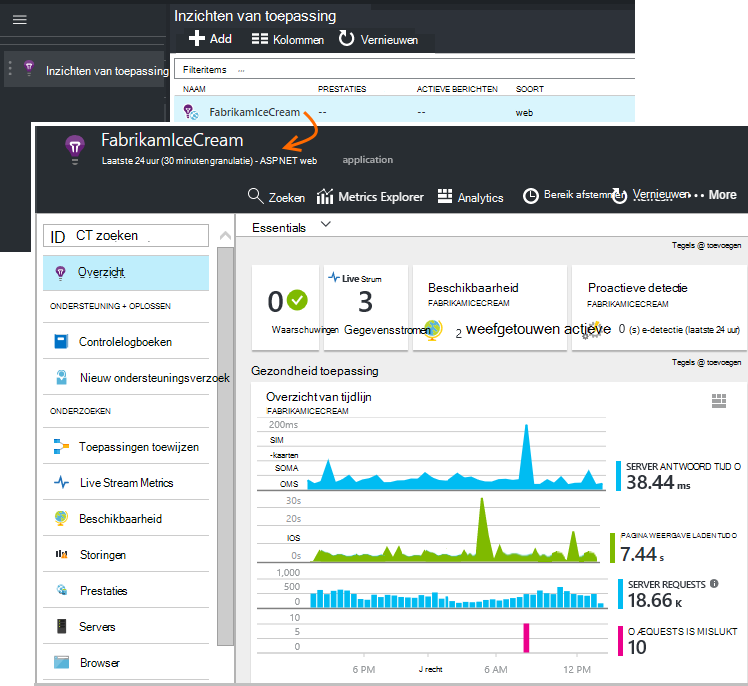

Het overzicht kunt u direct zien hoe uw app presteert. U kunt laden (uitgedrukt als percentage van de aanvragen) vergelijken met de tijd uw app te moeten reageren op de aanvragen. Als er een onevenredige toename van de reactietijd wanneer de belasting toeneemt, wilt u mogelijk meer resources toewijzen aan uw app. Als er meer mislukte antwoorden rechts nadat u een nieuwe build geïmplementeerd, vervolgens u mogelijk wilt terugdraaien.

#### Meer informatie

Klik op in een diagram voor een meer gedetailleerde reeks grafieken. De grafiek van de reactietijd van de Server leidt bijvoorbeeld tot grafieken die aanvraag tarieven, responstijden en de reactietijden van de afhankelijkheden (services die uw app).  

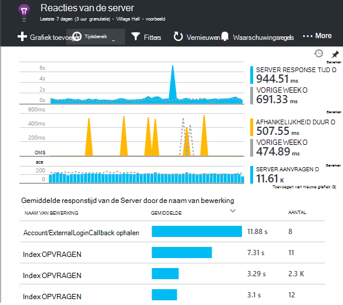

De grafiek afhankelijkheden is nuttig omdat u kunt u zien of de databases en REST API's die gebruikmaakt van uw app goed reageert of vertragingen veroorzaken.

#### Een grafiek aanpassen

Probeer een van deze diagrammen te bewerken. Als uw web app op een collectie van exemplaren van de server wordt uitgevoerd, kunt u bijvoorbeeld op de instanties van de andere server de reactietijden vergelijken:

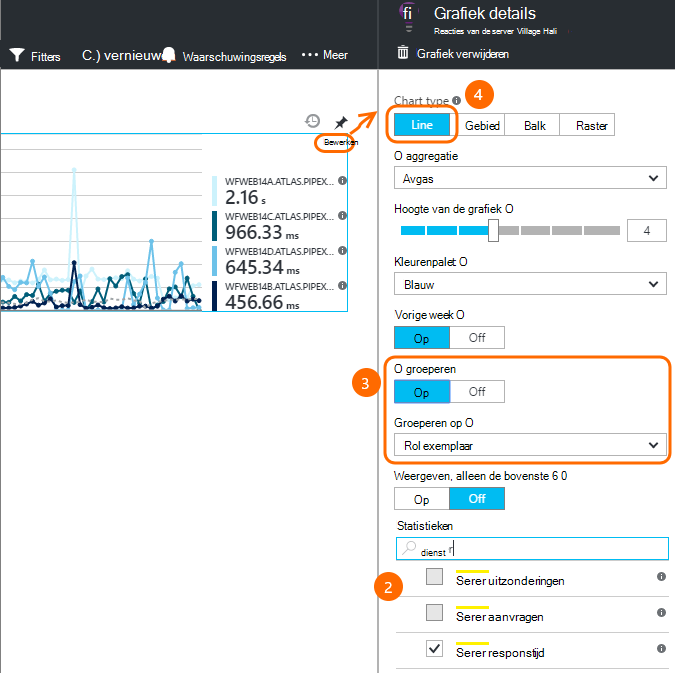

1. Plaats de muisaanwijzer op de grafiek en klik op bewerken.
2. Kies een maateenheid. Meerdere parameters kunnen worden weergegeven in een grafiek, maar alleen in bepaalde combinaties: wellicht een metric uitschakelen voordat u die u wilt selecteren.
3. Gebruik Group By metric door een eigenschap in segmenten. In dit voorbeeld geven we aparte regels voor verschillende responstijden. 

    Houd er rekening mee dat u moet een geldige eigenschap voor de metric selecteren of de grafiek niet alle gegevens weergegeven.
4. Selecteer een grafiektype. Gebied- en staafdiagrammen tonen een gestapelde weergave geschikt wanneer het samenvoegingstype 'Sum'.

[Meer informatie over het verkennen van statistieken](app-insights-metrics-explorer.md).

## Zoekgegevens

Om een probleem te onderzoeken, is het nuttig om te controleren van de specifieke gebeurtenis exemplaren.

Klik op een grafiek metrische exemplaargegevens wilt doorzoeken met relevante filters en tijdsbereik. Klik bijvoorbeeld via server verzoek tellingen op individueel verzoek rapporten zien. 

Of u kunt rechtstreeks naar de exemplaargegevens van zoeken op de overzichtspagina:

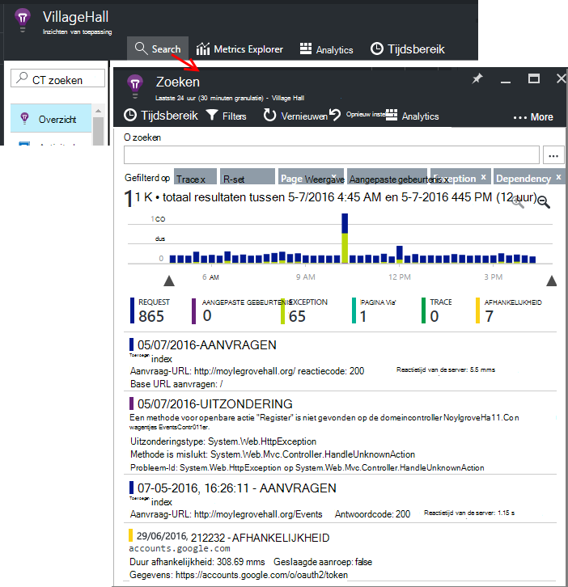

Filters gebruiken om de focus op bepaalde soorten gebeurtenis en gekozen waarden:

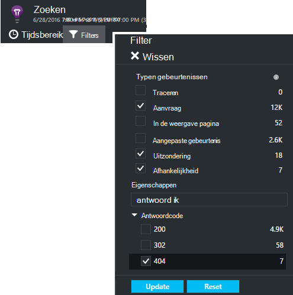

Klik op "..." om een volledige lijst van eigenschappen of andere gebeurtenissen die zijn gekoppeld aan dezelfde aanvraag open. In dit voorbeeld heeft de mislukte aanvraag een rapport met bijbehorende uitzondering:

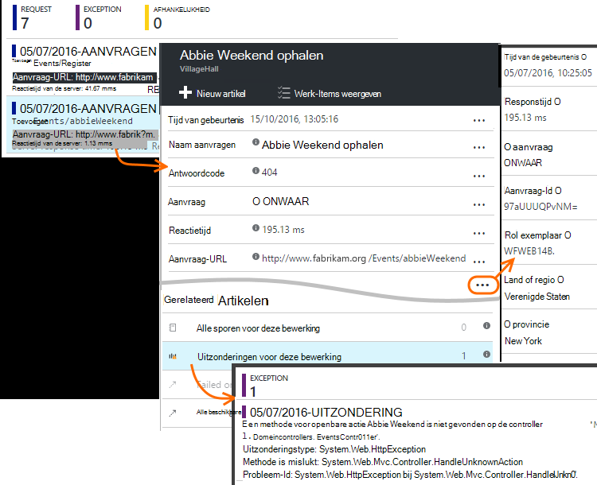

Een gebeurtenis - in dit voorbeeld wordt de uitzondering gerelateerde - Open en kunt u een artikel (als u Visual Studio Team Services gebruiken voor het bijhouden van taken). 
 
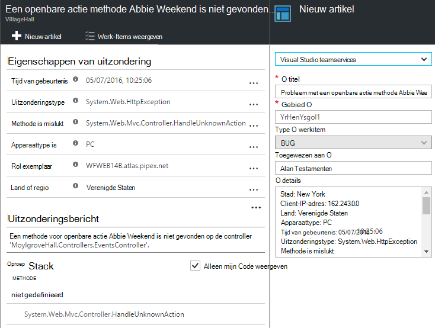

## Analytics

[Analytics](app-insights-analytics.md) is een nog krachtigere Zoek- en functie, waarin u SQL-achtige query's via telemetriegegevens, hetzij schrijven kunt om te zoeken naar specifieke problemen of om statistische informatie te verzamelen.

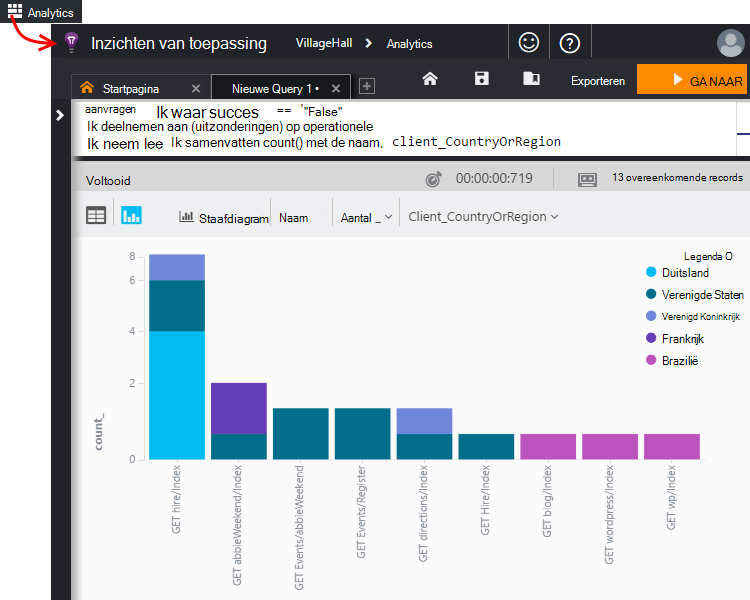

De zelfstudie openen om te zien en voorbeelden van query's uitvoeren op uw gegevens, of het langer [zelfstudie, scenario](app-insights-analytics-tour.md)lezen. IntelliSense vraagt u de query's die u kunt gebruiken en er is een [volledige taal](app-insights-analytics-reference.md). 

Query's worden meestal beginnen met de naam van een stream telemetrie zoals aanvragen, uitzonderingen of afhankelijkheden. Pop open het schema balk links voor een overzicht van de beschikbare telemetrie stromen. De query is een pijpleiding van de [query](app-insights-analytics-reference.md#queries-and-operators) , zoals `where` - een boolean-filter - of `project` -welke nieuwe eigenschappen berekent. `summarize`[aggregaten exemplaren](app-insights-analytics-tour.md#aggregate-groups-of-rows)te groeperen door u definieert functies en functies van aggregatie vervolgens toe te passen op de gegroepeerde gegevens.

Resultaten kunnen worden [weergegeven in tabellen of verschillende soorten grafieken](app-insights-analytics-tour.md#charting-the-results).

## Aangepaste telemetrie

De ingebouwde telemetrie die u door de inzichten van de toepassing installeren kunt u telt, succespercentages, analyseren en de reactietijd voor webverzoeken op uw app en afhankelijkheden - dat wil zeggen, de gesprekken vanuit de app naar SQL, REST API's. Ook krijgt u sporen van de uitzondering, en (met de Status van de Monitor op uw server) systeemprestatiemeteritems. Als u de client-fragment aan uw webpagina's toevoegen, krijgt u de pagina weergave tellingen en laadtijden client uitzonderingen en AJAX Beltarieven succes en het antwoord. 

Analyseren van alle deze telemetrie kan u vertellen veel over de prestaties en het gebruik van uw app. Maar soms die niet voldoende. U kunt de lengte van een wachtrij controleren zodat u van de prestaties afstemmen kunt; of verkoop tellen en deze segmenten op locatie; of op de client, weten hoe vaak gebruikers op een bepaalde knop te klikken zodat u de gebruikerservaring kunt afstemmen.

De [Toepassing inzichten API](app-insights-api-custom-events-metrics.md) -aanroepen biedt `TrackEvent(name)` en `TrackMetric(name, value)` , zodat u uw eigen aangepaste gebeurtenissen en statistieken kunt verzenden. Er zijn vergelijkbare oproepen voor de client.

Als uw webpagina een game app voor één pagina is, kunt u een regels invoegen op de juiste plaatsen aan te melden als de gebruiker wint of een spel verliest:

    
    appInsights.trackEvent("WinGame");
    ...
    appInsights.trackEvent("LoseGame");

Vervolgens kunt wij grafiek telt het aantal aangepaste gebeurtenis segmenteren ze met de gebeurtenisnaam:

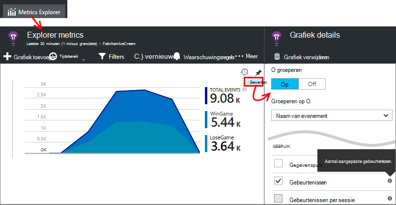

### Sporen van logboek

Voor diagnostische doeleinden is een aangepaste gebeurtenis `TrackTrace(message)` die u kunt gebruiken voor het uitvoeren van sporen. U kunt zoeken in de functies zoeken en analyse van de inhoud van het bericht kan niet langer zijn dan de naam van een gebeurtenis. 

Als u al een registratie kader zoals Log4Net, NLog, Log4J of System.Diagnostic.Trace, en deze aanroepen trace kunnen worden onderschept door de inzichten van de toepassing en de andere telemetrie weergegeven. De Visual Studio tools worden automatisch de juiste SDK module toevoegen.

## Dashboards

Veel toepassingen bestaan uit verschillende onderdelen, zoals een webservice en een of meer processors weer beëindigen. Elk onderdeel wordt gecontroleerd door een afzonderlijke toepassing inzichten resource. Als uw systeem wordt uitgevoerd op Azure, kan u worden met - en controle - services zoals gebeurtenis hubs en machine ook leren. 

U kunt selecteren van de meest interessante grafieken uit verschillende apps en ze vast aan een Azure [dashboard](app-insights-dashboards.md), zodat u voortdurend op het hele systeem dat voor het controleren van uw gehele systeem. 

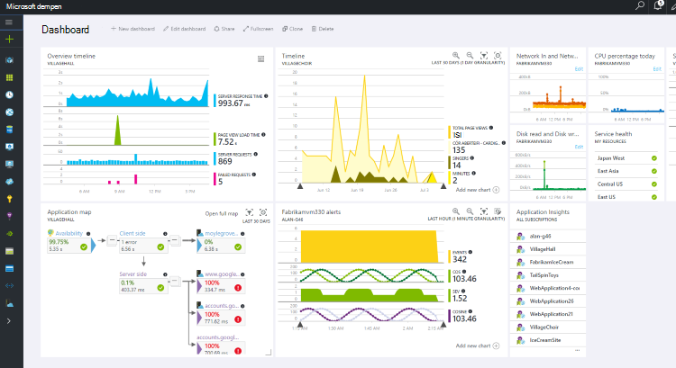

In feite kunt u meerdere dashboards maken - bijvoorbeeld een team kamer-dashboard voor de controle van de gezondheid algemeen stelsel; een dashboard ontwerp dat zich op het gebruik van andere functies richt. een apart dashboard voor onderdelen van de test; enzovoort.  

Dashboards, zoals bronnen, kunnen worden gedeeld tussen teamleden.

## Ontwikkeling in Visual Studio

Als u Visual Studio voor het ontwikkelen van uw app gebruikt, vindt u verschillende toepassing inzichten's ingebouwd. 

### Diagnostische zoeken

Het venster zoeken bevat gebeurtenissen die zijn geregistreerd. (Als u aangemeld bij Azure bij het instellen van de toepassing inzichten, u zult kunnen bepaalde gebeurtenissen in de portal te zoeken.)

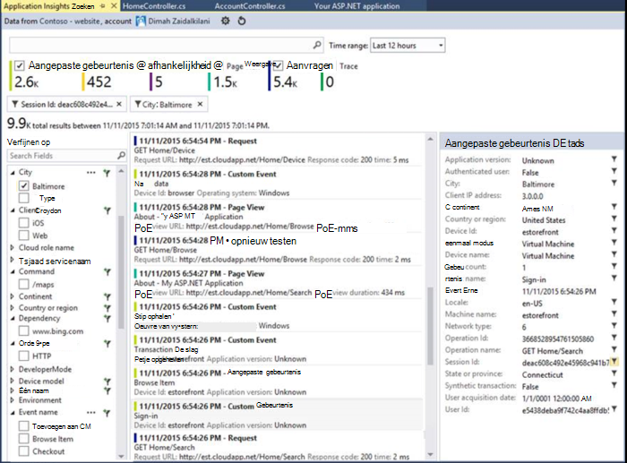

De vrije tekst zoekopdracht werkt op alle velden in de gebeurtenissen. Bijvoorbeeld zoeken voor een deel van de URL van een pagina. of de waarde van een eigenschap, zoals client plaats; of bepaalde woorden in een traceerlogboek.

Klik op een gebeurtenis om de gedetailleerde eigenschappen te bekijken.

U kunt ook het tabblad gerelateerde artikelen om u te helpen bij het vaststellen van mislukte aanvragen of uitzonderingen openen.

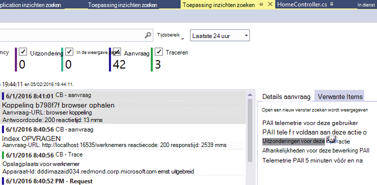

### Diagnostische gegevens hub

De Hub Diagnostics (Visual Studio 2015 of later) toont de telemetrie inzichten Application server wordt gegenereerd. Dit werkt zelfs als u ervoor gekozen alleen te installeren van de SDK, zonder deze verbinding te maken met een bron in de portal Azure.

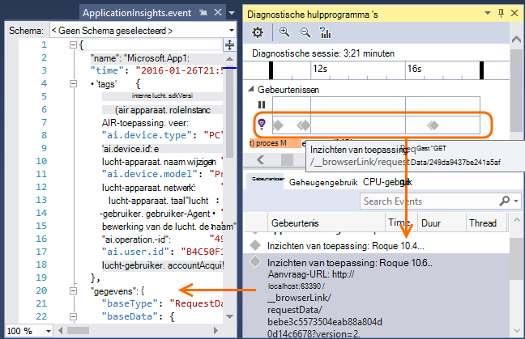

### Uitzonderingen

Als [uitzondering toezicht ingesteld](app-insights-asp-net-exceptions.md), wordt in het venster Zoeken uitzondering rapporten weergeven. 

Klik op een uitzondering als u een stacktrace. Als de code van de app geopend in Visual Studio is, kunt u door middel van de stacktrace op de betreffende regel van de code.

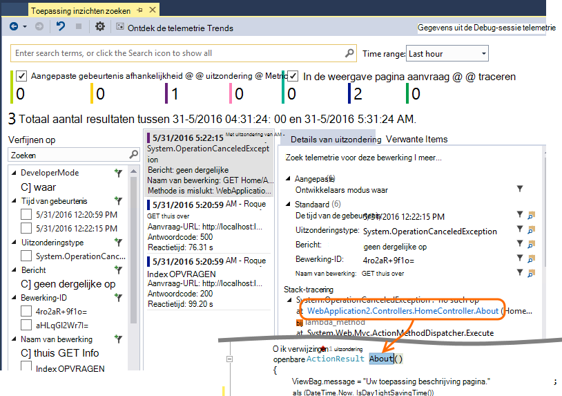

Bovendien in de regel Code Lens boven elke methode ziet u een aantal van de uitzonderingen die zijn vastgelegd door toepassing inzichten in de afgelopen 24 uur.

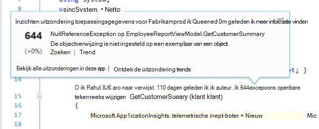

### Lokale controle

(Van Visual Studio 2015 Update 2) Als u nog niet hebt geconfigureerd voor de SDK voor het verzenden van de Portal Application inzichten telemetrie (zodat er geen sleutel instrumentation in ApplicationInsights.config) wordt het venster Diagnostiek telemetrie van uw meest recente foutopsporingssessie weergegeven. 

Dit is wenselijk als u een vorige versie van uw app al hebt gepubliceerd. Wilt u niet de telemetrie van de foutopsporing sessies worden verward met de telemetrie op de portal Application inzichten vanuit de gepubliceerde app.

Het is ook handig als u een [aangepaste telemetrie](app-insights-api-custom-events-metrics.md) u fouten opsporen wilt voordat telemetrie naar de portal verzonden.

* *Op het eerste, ik volledig inzichten telemetrie naar de portal verzonden toepassing geconfigureerd. Maar nu ik zou willen zien van de telemetrie alleen in Visual Studio.*

 * Er is een optie lokale diagnostische gegevens zoeken, zelfs als uw app telemetrie naar de portal verzendt in de instellingen van het venster zoeken.
 * Commentaar van de lijn wilt stoppen die worden verzonden naar de portal telemetrie, `<instrumentationkey>...` van ApplicationInsights.config. Als u klaar bent met opmerking telemetrie opnieuw verzenden om de portal te verwijderen.

## Trends

Trends is een hulpprogramma van Visual Studio voor het visualiseren van de werking van uw app na verloop van tijd. 

Kies **Verkennen telemetrie Trends** uit de knop toepassing inzichten of toepassing inzichten zoekvenster. Kies een van de vijf algemene query's aan de slag. U kunt verschillende datasets op basis van telemetrie typen tijd bereiken en andere eigenschappen kunt analyseren. 

Kies een van de opties van de afwijking in de vervolgkeuzelijst ' weergave ' om afwijkingen in de gegevens. De filteropties onder aan het venster kunnen eenvoudig specifieke subsets van de telemetrie specificeren.

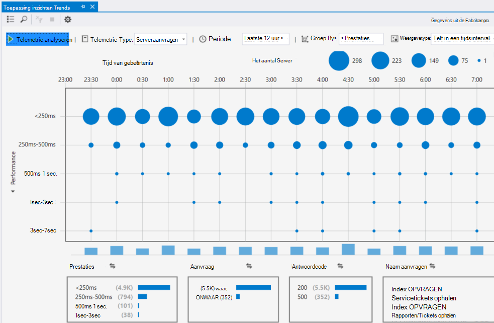

## Vrijgeven van een nieuwe build

### Live Stream Metrics

Live statistieken Stream ziet u uw toepassing metrics rechts op dit moment zeer, met een bijna real-time vertraging van 1 seconde. Dit is bijzonder nuttig wanneer u een nieuwe build vrijgeven bent en zorg ervoor dat alles werkt zoals verwacht of onderzoekt een incident in real-time.

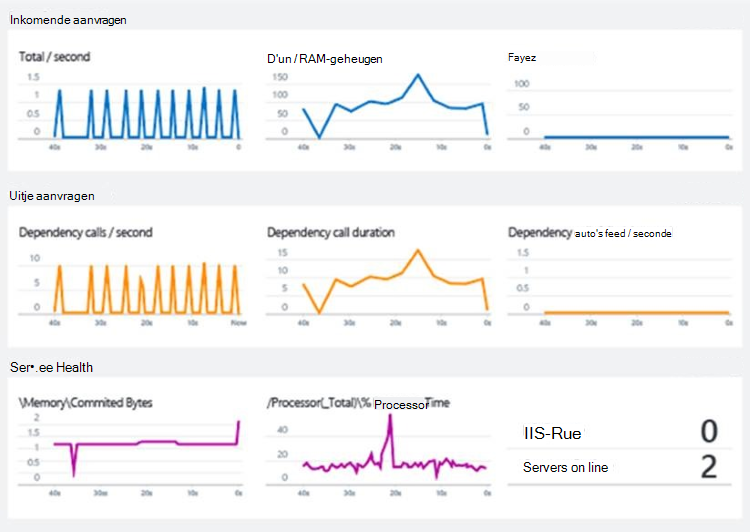

Anders dan bij Metrics Explorer weergegeven Metrics livestream een vaste set parameters. De gegevens persistent alleen voor omdat deze in de grafiek, en vervolgens verwijderd. 

### Aantekeningen

[Release-aantekeningen](app-insights-annotations.md) op metrics grafieken weergeven waarin u een nieuwe build geïmplementeerd. Ze maken het gemakkelijk om te zien of uw wijzigingen geen invloed op de prestaties van de toepassing hadden. Automatisch worden gemaakt door de [Services van Visual Studio Team system bouwen](https://www.visualstudio.com/en-us/get-started/build/build-your-app-vs)en u kunt ook [maakt ze vanuit PowerShell](#create-annotations-from-powershell).

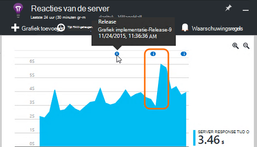

Release-aantekeningen zijn een functie van de cloud-gebaseerde build en versie service van Visual Studio Team Services. 

## Waarschuwingen

Als er iets met de app misgaat, zult u weten onmiddellijk. 

Toepassing inzichten biedt drie soorten waarschuwing, die per e-mail worden geleverd.

### Proactieve diagnostische gegevens 

[Proactieve diagnostics](app-insights-proactive-failure-diagnostics.md) automatisch instellen - u hoeft niet te configureren. Indien uw site genoeg verkeer heeft, krijgt u een e-mail als er een stijging van de mislukte aanvragen die ongebruikelijk is voor de tijd van de dag of de aanvraag. De waarschuwing bevat diagnostische gegevens. 

Hier ziet u een waarschuwing voor een voorbeeld. 

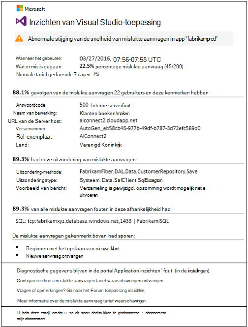

Een tweede soort proactieve detectie ontdekt de correlaties tussen fouten en factoren zoals locatie, client-OS of browsertype.

### Metrische waarschuwingen

U kunt [metrische waarschuwingen](app-insights-alerts.md) om te bepalen wanneer een metric een drempelwaarde voor een bepaalde periode - bijvoorbeeld telt het aantal mislukte, geheugen of paginaweergaven snijdt.

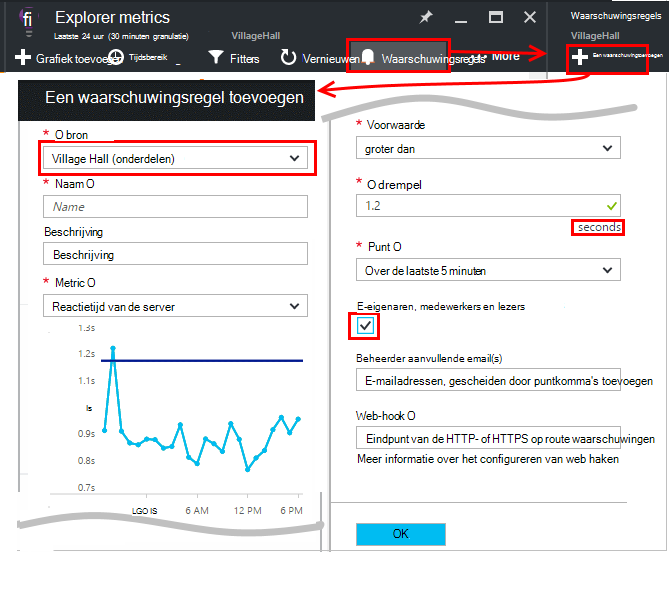

### Beschikbaarheid

[Beschikbaarheid van web tests](app-insights-monitor-web-app-availability.md) verzenden aanvragen naar uw site uit onze servers op verschillende locaties over de hele wereld. Zij laat u weten wanneer uw site is niet beschikbaar op het internet, of reageert traag. 

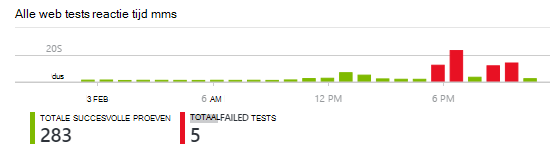

## Exporteren

Er zijn verschillende manieren om uw telemetriegegevens uit de portal inzichten van toepassing:

* [Doorlopende exporteren](app-insights-export-telemetry.md) is ideaal als u wilt grote delen van de telemetrie langer dan de bewaarperiode standaard behouden.
* [Metrics](app-insights-metrics-explorer.md#export-to-excel) tabellen, search en [Analytics](app-insights-analytics.md) resultaten kunnen alle worden geëxporteerd naar een Excel-werkblad. 
* De Data Access-REST API kan worden gebruikt om te zoeken en ophalen van gegevens, waaronder het uitvoeren van query's Analytics. De API is momenteel in privé-voorbeeld. [Meer informatie over het lidmaatschap van de voorvertoning](https://visualstudio.uservoice.com/forums/357324-application-insights/suggestions/4999529-make-data-accessible-via-apis-for-custom-processin).
* U kunt [query Power BI Analytics](app-insights-export-power-bi.md) dashboards exporteren en de resultaten bekijken in Power BI-visualisaties kunnen automatisch worden vernieuwd.

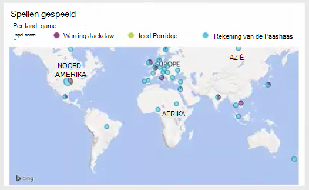
 
## Gegevensbeheer

Er zijn beperkingen op het gebruik van de inzichten van toepassing, die tot op zekere hoogte is afhankelijk van het tarievenstelsel die u kiest. De belangrijkste zijn op:

* Telemetrie tarief per minuut
* Gegevenspunt Aantal per maand
* Bewaarperiode voor gegevens

[Bemonstering](app-insights-sampling.md) is een mechanisme voor de kosten te verlagen en het tegengaan van procesbeperking. Het wordt een deel van de telemetrie, zodat een representatief monster verwijderd. Gekoppelde items (zoals de aanvragen die ze hebben veroorzaakt en uitzonderingen) worden bewaard of genegeerd bij elkaar. Voor ASP.NET-toepassingen, bemonstering wordt automatisch en wordt toegepast in de app; anders kunt u instellen dat moet worden toegepast op de opname op de portal.

## Volgende stappen

Aan de slag bij uitvoering met:

* [IIS-server](app-insights-monitor-performance-live-website-now.md)
* [J2EE-server](app-insights-java-live.md)

Aan de slag op tijd met:

* [ASP.NET](app-insights-asp-net.md)
* [Java](app-insights-java-get-started.md)
* [Node.js](app-insights-nodejs.md)

## Ondersteuning en feedback

* Problemen en vragen:
 * [Het oplossen van problemen][qna]
 * [MSDN-Forum](https://social.msdn.microsoft.com/Forums/vstudio/home?forum=ApplicationInsights)
 * [StackOverflow](http://stackoverflow.com/questions/tagged/ms-application-insights)
 * [Ondersteuning voor ontwikkelaars](app-insights-get-dev-support.md)
* Uw suggesties:
 * [UserVoice](https://visualstudio.uservoice.com/forums/357324)
* Blog:
 * [Toepassing inzichten blog](https://azure.microsoft.com/blog/tag/application-insights)

## Video 's

[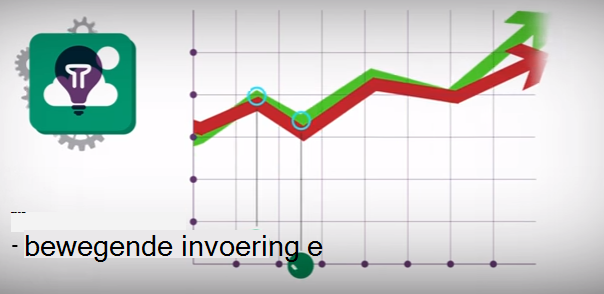](https://www.youtube.com/watch?v=fX2NtGrh-Y0)

> [AZURE.VIDEO 218]

> [AZURE.VIDEO usage-monitoring-application-insights]

> [AZURE.VIDEO performance-monitoring-application-insights]

> [Inleidende animatie](https://www.youtube.com/watch?v=fX2NtGrh-Y0)

<!--Link references-->

[android]: https://github.com/Microsoft/ApplicationInsights-Android
[azure]: ../insights-perf-analytics.md
[client]: app-insights-javascript.md
[desktop]: app-insights-windows-desktop.md
[detect]: app-insights-detect-triage-diagnose.md
[greenbrown]: app-insights-asp-net.md
[ios]: https://github.com/Microsoft/ApplicationInsights-iOS
[java]: app-insights-java-get-started.md
[knowUsers]: app-insights-overview-usage.md
[platforms]: app-insights-platforms.md
[portal]: http://portal.azure.com/
[qna]: app-insights-troubleshoot-faq.md
[redfield]: app-insights-monitor-performance-live-website-now.md

 