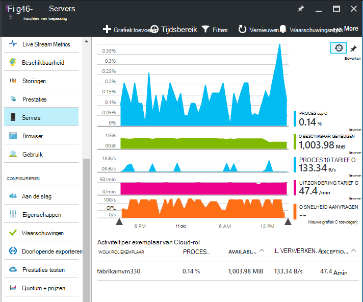
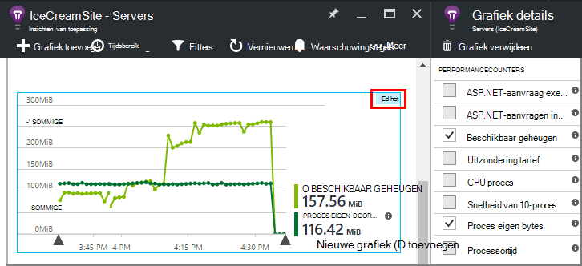
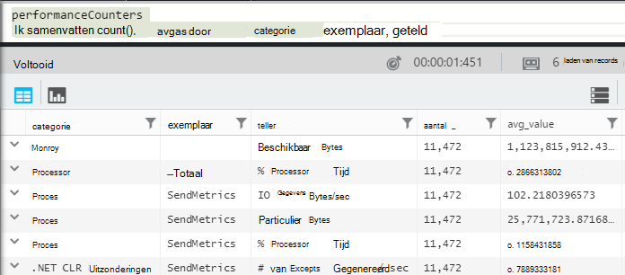
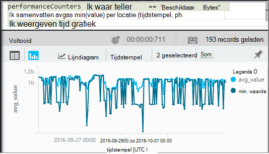
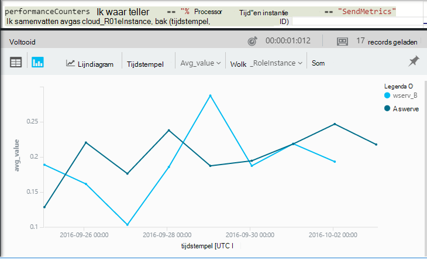

<properties 
    pageTitle="Prestatiemeteritems in inzichten toepassing | Microsoft Azure" 
    description="Systeem monitor en aangepaste prestatiemeters van .NET in inzichten van toepassing." 
    services="application-insights" 
    documentationCenter=""
    authors="alancameronwills" 
    manager="douge"/>

<tags 
    ms.service="application-insights" 
    ms.workload="tbd" 
    ms.tgt_pltfrm="ibiza" 
    ms.devlang="na" 
    ms.topic="article" 
    ms.date="10/11/2016" 
    ms.author="awills"/>
 
# <a name="system-performance-counters-in-application-insights"></a>Systeemprestatiemeteritems in inzichten van toepassing


Windows biedt een groot aantal [prestatie-items](http://www.codeproject.com/Articles/8590/An-Introduction-To-Performance-Counters) zoals exploitatievorm CPU, geheugen, schijf en netwerkgebruik. Ook kunt u uw eigen. [Toepassing inzichten](app-insights-overview.md) kunt deze prestatiemeteritems weergeven als uw toepassing wordt uitgevoerd onder IIS op een host in ruimten of virtuele machine waarvoor u beheerdersrechten hebt. De grafieken geven de bronnen die beschikbaar zijn voor uw toepassing live en kunnen helpen bij het identificeren van onevenwichtige belasting tussen exemplaren van de server.

Prestatiemeteritems worden weergegeven in de blade Servers, inclusief een tabel die segmenten door het serverexemplaar.



(Prestatiemeteritems zijn niet beschikbaar voor Azure Web Apps. Maar u kunt [verzenden Azure diagnostische test uit om inzichten van toepassing](app-insights-azure-diagnostics.md).)

## <a name="configure"></a>Configureren

Als toepassing inzichten statuscontrole nog niet is geïnstalleerd op uw servercomputers, moet u installeren om te zien van prestatiemeteritems.

Downloaden en [Statuscontrole installer](http://go.microsoft.com/fwlink/?LinkId=506648) op elk serverexemplaar. Als dit al geïnstalleerd, hoeft u niet opnieuw installeren.

* *Ik heb [de SDK toepassing inzichten in mijn app geïnstalleerd](app-insights-asp-net.md) tijdens de ontwikkeling. Moet ik nog steeds de Status Monitor?*

    Ja, statuscontrole is vereist voor het verzamelen van prestatiemeteritems voor ASP.NET-webtoepassingen. Zoals u al weet misschien, kunt Status Monitor ook worden gebruikt voor [monitor web apps die al zijn live](app-insights-monitor-performance-live-website-now.md), zonder de SDK installeren tijdens de ontwikkeling.


## <a name="view-counters"></a>Items weergeven

De blade Servers bevat een aantal prestatiemeteritems. 

Overzicht van andere items bewerken van de grafieken in de blade Servers of open een nieuwe [Maatstaven Explorer](app-insights-metrics-explorer.md) blade en nieuwe grafieken toevoegen. 

De beschikbare items worden weergegeven als parameters wanneer u een grafiek bewerkt.



Een [dashboard](app-insights-dashboards.md) maken en ze vastmaken aan het overzicht van de meest nuttige grafieken op één plaats.

## <a name="add-counters"></a>Items toevoegen

Als het gewenste prestatiemeteritem niet wordt weergegeven in de lijst met parameters, namelijk de inzichten Application SDK is niet worden verzameld op uw webserver. U kunt hiervoor configureren.

1. Ontdek welke items beschikbaar in uw server zijn met behulp van deze PowerShell-opdracht op de server:

    `Get-Counter -ListSet *`

    (See [`Get-Counter`](https://technet.microsoft.com/library/hh849685.aspx).)

1. Open ApplicationInsights.config.

 * Als u tijdens de ontwikkeling, toepassing inzichten aan uw app toegevoegd ApplicationInsights.config in uw project te bewerken en vervolgens opnieuw op uw servers implementeren.
 * Als u een web app tijdens runtime instrument Status Monitor gebruikt, vindt u de ApplicationInsights.config in de hoofdmap van de toepassing in IIS. Dat er in elk serverexemplaar bijwerken.

2. De richtlijn prestaties verzamelaar bewerken:

 ```XML

    <Add Type="Microsoft.ApplicationInsights.Extensibility.PerfCounterCollector.PerformanceCollectorModule, Microsoft.AI.PerfCounterCollector">
      <Counters>
        <Add PerformanceCounter="\Objects\Processes"/>
        <Add PerformanceCounter="\Sales(photo)\# Items Sold" ReportAs="Photo sales"/>
      </Counters>
    </Add>

```

U kunt vastleggen standaard items en die dat u zelf hebt geïmplementeerd. `\Objects\Processes`een voorbeeld van een standaard item beschikbaar op alle Windows-systemen. `\Sales(photo)\# Items Sold`is een voorbeeld van een aangepaste teller die kan worden geïmplementeerd in een webservice. 

De indeling is `\Category(instance)\Counter"`, of gewoon voor de categorieën die geen exemplaren, `\Category\Counter`.

`ReportAs`is vereist voor de itemnamen die niet overeenkomen met `[a-zA-Z()/-_ \.]+` -dat wil zeggen, ze bevatten tekens die niet in de volgende sets: letters ronde haken, schuine streep, afbreekstreepjes, onderstrepingstekens, ruimte, dot.

Als u een exemplaar opgeeft, wordt deze als een dimensie 'CounterInstanceName' van de gerapporteerde metric geïnd.

### <a name="collecting-performance-counters-in-code"></a>Het verzamelen van prestatiemeteritems in code

Als u wilt verzamelen systeemprestatiemeteritems en stuur ze naar de inzichten van toepassing, kunt u het onderstaande stukje aanpassen:

    var perfCollectorModule = new PerformanceCollectorModule();
    perfCollectorModule.Counters.Add(new PerformanceCounterCollectionRequest(
      @"\.NET CLR Memory([replace-with-application-process-name])\# GC Handles", "GC Handles")));
    perfCollectorModule.Initialize(TelemetryConfiguration.Active);

Of u kunt hetzelfde doen met aangepaste metrische gegevens die u hebt gemaakt:

    var perfCollectorModule = new PerformanceCollectorModule();
    perfCollectorModule.Counters.Add(new PerformanceCounterCollectionRequest(
      @"\Sales(photo)\# Items Sold", "Photo sales"));
    perfCollectorModule.Initialize(TelemetryConfiguration.Active);

## <a name="performance-counters-in-analytics"></a>Prestatiemeteritems in Analytics

U kunt zoeken en weergeven van prestatierapporten item in [Analytics](app-insights-analytics.md).


Het schema **performanceCounters** beschrijft de `category`, `counter` naam, en `instance` van de prestatieobjecten.  De telemetrie voor elke toepassing ziet u alleen de items voor die toepassing. Bijvoorbeeld, als u wilt zien zijn welke items beschikbaar: 



(Hier 'Exemplaar' verwijst naar het exemplaar van het prestatiemeteritem niet de rol of de server machine exemplaar. De naam van het exemplaar meestal segmenten items zoals processortijd door de naam van de toepassing of proces.)

Een grafiek van het beschikbare geheugen ophalen over de afgelopen periode: 




Net als andere telemetrie, **performanceCounters** ook een kolom is `cloud_RoleInstance` die aangeeft dat de identiteit van het exemplaar van de host-server waarop de toepassing wordt uitgevoerd. Voorbeeld, vergelijk de prestaties van uw app op verschillende computers: 




## <a name="aspnet-and-application-insights-counts"></a>ASP.NET en telt inzichten van toepassing

*Wat is het verschil tussen de uitzondering rente en metrics uitzonderingen?*

* *Uitzondering tarief* is een systeem Prestatiemeter. De CLR telt alle verwerkte en onverwerkte uitzonderingen die worden gegenereerd en de totale in de controle-interval worden gedeeld door de lengte van het interval. De toepassing inzichten SDK dit resultaat verzamelt en stuurt dit naar de portal.
* *Uitzonderingen* is een telling van de TrackException-rapporten ontvangen door de portal in het controle-interval van de grafiek. Het bevat alleen de verwerkte uitzonderingen waar u TrackException aanroept in uw code en alle [niet-verwerkte uitzonderingen](app-insights-asp-net-exceptions.md)niet opnemen hebt geschreven. 

## <a name="alerts"></a>Waarschuwingen

Net als andere metrics kunt u [een signaal instellen](app-insights-alerts.md) om te waarschuwen als een prestatiemeteritem gaat buiten een limiet die u opgeeft. Open de blade waarschuwingen en klikt u op waarschuwing toevoegen.


## <a name="next"></a>Volgende stappen

* [Bijhouden van afhankelijkheid](app-insights-asp-net-dependencies.md)
* [Uitzondering bijhouden](app-insights-asp-net-exceptions.md)