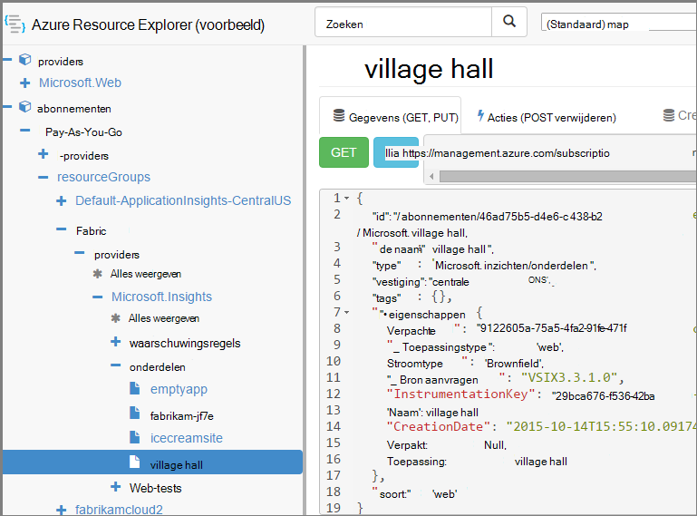

<properties 
    pageTitle="Toepassing inzichten resources met PowerShell maken" 
    description="Via programmering maken toepassing inzichten bronnen als onderdeel van uw build." 
    services="application-insights" 
    documentationCenter=""
    authors="alancameronwills" 
    manager="douge"/>

<tags 
    ms.service="application-insights" 
    ms.workload="tbd" 
    ms.tgt_pltfrm="ibiza" 
    ms.devlang="na" 
    ms.topic="article" 
    ms.date="03/02/2016" 
    ms.author="awills"/>
 
# <a name="create-application-insights-resources-using-powershell"></a>Toepassing inzichten resources met PowerShell maken

In dit artikel wordt beschreven hoe u een bron [Toepassing inzichten](app-insights-overview.md) in Azure om automatisch te maken. U kunt bijvoorbeeld doen als onderdeel van een proces. U kunt met de fundamentele inzichten van toepassing-resource [beschikbaarheid web tests](app-insights-monitor-web-app-availability.md), [waarschuwingen instellen](app-insights-alerts.md), maken en andere Azure resources maken.

De sleutel tot het maken van deze bronnen is JSON-sjablonen voor [Azure Resource Manager](../powershell-azure-resource-manager.md). Kortom, het is de procedure: download de JSON-definities van de bestaande middelen; voorzien van bepaalde waarden zoals; en voer vervolgens de sjabloon als u wilt een nieuwe bron maken. Kunt u verschillende bronnen samen pakket, maken ze allemaal in één gaat - bijvoorbeeld een monitor app met beschikbaarheid van tests, waarschuwingen en opslag voor continue exporteren. Er zijn enkele nuances aan sommige van de parameteriseringen, we hier leggen.

## <a name="one-time-setup"></a>Eenmalige setup

Als u nog niet met uw abonnement Azure voordat PowerShell gebruikt:

De module Azure Powershell installeren op de computer waarop de scripts worden uitgevoerd:

1. Installeer [Microsoft Web Platform Installer (v5 of hoger)](http://www.microsoft.com/web/downloads/platform.aspx).
2. Gebruik het Microsoft Azure Powershell te installeren.

## <a name="copy-the-json-for-existing-resources"></a>De JSON voor bestaande bronnen kopiëren

1. Instellen [Inzichten van toepassing](app-insights-overview.md) voor een project lijkt op de door die u gewenste om automatisch te genereren. Web tests en waarschuwingen toevoegen als u wilt.
2. Maak een nieuw bestand met .json - roepen we het `template1.json` in dit voorbeeld. Deze inhoud kopiëren naar het:


    ```JSON

        {
          "$schema": "https://schema.management.azure.com/schemas/2015-01-01/deploymentTemplate.json#",
          "contentVersion": "1.0.0.0",
          "parameters": {
            "appName": { "type": "string" },
            "webTestName": { "type": "string" },
            "url": { "type": "string" },
            "text": { "type" : "string" }
          },
          "variables": {
            "testName": "[concat(parameters('webTestName'), 
               '-', toLower(parameters('appName')))]"
            "alertRuleName": "[concat(parameters('webTestName'), 
               '-', toLower(parameters('appName')), 
               '-', subscription().subscriptionId)]"
          },
          "resources": [
            {
              // component JSON file contents
            },
            {
              //web test JSON file contents
            },
            {
              //alert rule JSON file contents
            }
 
            // Any other resources go here
          ]
        }
    
    ```

    Met deze sjabloon stelt één beschikbaarheid test naast de belangrijkste bron.


2. [Azure Resource Manager](https://resources.azure.com/)openen. Navigeren naar `subscriptions/resourceGroups/<your resource group>/providers/Microsoft.Insights/components`, de bron van de toepassing. 

    

    *Onderdelen* zijn de fundamentele inzichten van toepassing bronnen voor het weergeven van toepassingen. Er zijn afzonderlijke resources voor de bijbehorende waarschuwingsregels en beschikbaarheid web proeven.

3. Kopieer de JSON van het onderdeel naar de juiste plaats in `template1.json`.
6. Deze eigenschappen verwijderen:
  * `id`
  * `InstrumentationKey`
  * `CreationDate`
4. Open de secties webtests en alertrules en de JSON voor afzonderlijke items in de sjabloon kopiëren. (Niet kopiëren van de knooppunten webtests of alertrules: Ga naar de items onder hen.)

    Elke website-test heeft een bijbehorende waarschuwingsregel zodat u van deze te kopiëren.

    De test van de webpagina moet gaan voordat de waarschuwingsregel.

5. Om te voldoen aan het schema, voeg deze regel in elke resource:

    `"apiVersion": "2014-04-01",`

    (Het schema ook hierover een klacht over het hoofdlettergebruik van de resourcenamen `Microsoft.Insights/*` -- maar deze *niet* wijzigen.)


## <a name="parameterize-the-template"></a>De sjabloon voorzien

U hebt nu vervangen door de namen van specifieke parameters. Om te [voorzien van een sjabloon](../resource-group-authoring-templates.md), moet u expressies met behulp van een [set Help-functies](../resource-group-template-functions.md)schrijven. 

U kan voorzien van slechts een deel van een tekenreeks, dus `concat()` tekenreeksen bouwen.

Hier vindt u voorbeelden van de die u zult willen maken. Er zijn verschillende exemplaren van elke vervanging. Mogelijk moet u anderen in uw sjabloon. Deze voorbeelden gebruiken de parameters en variabelen die hebben we gedefinieerd boven in de sjabloon.

zoeken | vervangen door
---|---
`"hidden-link:/subscriptions/.../components/MyAppName"`| `"[concat('hidden-link:',`<br/>` resourceId('microsoft.insights/components',` <br/> ` parameters('appName')))]"`
`"/subscriptions/.../alertrules/myAlertName-myAppName-subsId",` | `"[resourceId('Microsoft.Insights/alertrules', variables('alertRuleName'))]",`
`"/subscriptions/.../webtests/myTestName-myAppName",` | `"[resourceId('Microsoft.Insights/webtests', parameters('webTestName'))]",`
`"myWebTest-myAppName"` | `"[variables(testName)]"'`
`"myTestName-myAppName-subsId"` | `"[variables('alertRuleName')]"`
`"myAppName"` | `"[parameters('appName')]"`
`"myappname"`(kleine letter) | `"[toLower(parameters('appName'))]"`
`"<WebTest Name=\"myWebTest\" ...`<br/>` Url=\"http://fabrikam.com/home\" ...>"`|`[concat('<WebTest Name=\"',` <br/> `parameters('webTestName'),` <br/> `'\" ... Url=\"', parameters('Url'),` <br/> `'\"...>')]" `


## <a name="set-dependencies-between-the-resources"></a>Afhankelijkheden instellen tussen de bronnen

Azure moet de middelen in strikte volgorde instellen. Toevoegen om te controleren of een installatie is voltooid voordat de volgende begint afhankelijkheidslijnen worden weergegeven:

* Test de resource in het web:

    `"dependsOn": ["[resourceId('Microsoft.Insights/components', parameters('appName'))]"],`

* In de waarschuwing bron:

    `"dependsOn": ["[resourceId('Microsoft.Insights/webtests', variables('testName'))]"],`

## <a name="create-application-insights-resources"></a>Toepassing inzichten resources maken

1. In PowerShell, meld u aan bij Azure

    `Login-AzureRmAccount`

2. Voer een opdracht als volgt:

    ```PS

        New-AzureRmResourceGroupDeployment -ResourceGroupName Fabrikam `
               -templateFile .\template1.json `
               -appName myNewApp `
               -webTestName aWebTest `
               -Url http://myapp.com `
               -text "Welcome!"
               -siteName "MyAzureSite"

    ``` 

    * -ResourceGroupName is de groep waar u de nieuwe resources maken.
    * -Sjabloonbestand moeten plaatsvinden voordat de aangepaste parameters.
    * -De naam van de resource voor het maken van toepassing.
    * -webTestName de naam van de test van het web te maken.
    * -Url de url van uw web app.
    * -Een teksttekenreeks die wordt weergegeven op uw webpagina.
    * -Sitenaam - indien een Azure website gebruikt


## <a name="define-metric-alerts"></a>Metrische waarschuwingen definiëren

Er is een [methode van het instellen van waarschuwingen PowerShell](app-insights-alerts.md#set-alerts-by-using-powershell).


## <a name="an-example"></a>Een voorbeeld

Hier is het volledige onderdeel, web test en test alert websjabloon die ik heb gemaakt:

``` JSON

{
  "$schema": "https://schema.management.azure.com/schemas/2015-01-01/deploymentTemplate.json#",
  "contentVersion": "1.0.0.0",
  "parameters": {
    "webTestName": { "type": "string" },
    "appName": { "type": "string" },
    "URL": { "type": "string" },
    "text": { "type" : "string" }
  },
  "variables": {
    "alertRuleName": "[concat(parameters('webTestName'), '-', toLower(parameters('appName')), '-', subscription().subscriptionId)]",
    "testName": "[concat(parameters('webTestName'), '-', toLower(parameters('appName')))]"
  },
  "resources": [
    {
      //"id": "[resourceId('Microsoft.Insights/components', parameters('appName'))]",
      "apiVersion": "2014-04-01",
      "kind": "web",
      "location": "Central US",
      "name": "[parameters('appName')]",
      "properties": {
        "TenantId": "9122605a-471fc50f8438",
        "Application_Type": "web",
        "Flow_Type": "Brownfield",
        "Request_Source": "VSIX3.3.1.0",
        "Name": "[parameters('appName')]",
        //"CreationDate": "2015-10-14T15:55:10.0917441+00:00",
        "PackageId": null,
        "ApplicationId": "[parameters('appName')]"
      },
      "tags": { },
      "type": "microsoft.insights/components"
    },
    {
      //"id": "[resourceId('Microsoft.Insights/webtests', variables('testName'))]",
      "name": "[variables('testName')]",
      "apiVersion": "2014-04-01",
      "type": "microsoft.insights/webtests",
      "location": "Central US",
      "tags": {
        "[concat('hidden-link:', resourceId('microsoft.insights/components', parameters('appName')))]": "Resource"
      },
      "properties": {
        "provisioningState": "Succeeded",
        "Name": "[parameters('webTestName')]",
        "Description": "",
        "Enabled": true,
        "Frequency": 900,
        "Timeout": 120,
        "Kind": "ping",
        "RetryEnabled": true,
        "Locations": [
          {
            "Id": "us-va-ash-azr"
          },
          {
            "Id": "emea-nl-ams-azr"
          },
          {
            "Id": "emea-gb-db3-azr"
          }
        ],
        "Configuration": {
          "WebTest": "[concat(
             '<WebTest   Name=\"', 
                parameters('webTestName'), 
              '\"  Id=\"32cfc791-aaad-4b50-9c8d-993c21beb218\"   Enabled=\"True\"         CssProjectStructure=\"\"    CssIteration=\"\"  Timeout=\"120\"  WorkItemIds=\"\"         xmlns=\"http://microsoft.com/schemas/VisualStudio/TeamTest/2010\"         Description=\"\"  CredentialUserName=\"\"  CredentialPassword=\"\"         PreAuthenticate=\"True\"  Proxy=\"default\"  StopOnError=\"False\"         RecordedResultFile=\"\"  ResultsLocale=\"\">  <Items>  <Request Method=\"GET\"         Guid=\"a6f2c90b-61bf-b28hh06gg969\"  Version=\"1.1\"  Url=\"', 
              parameters('Url'), 
              '\" ThinkTime=\"0\"  Timeout=\"300\" ParseDependentRequests=\"True\"         FollowRedirects=\"True\" RecordResult=\"True\" Cache=\"False\"         ResponseTimeGoal=\"0\"  Encoding=\"utf-8\"  ExpectedHttpStatusCode=\"200\"         ExpectedResponseUrl=\"\" ReportingName=\"\" IgnoreHttpStatusCode=\"False\" />        </Items>  <ValidationRules> <ValidationRule  Classname=\"Microsoft.VisualStudio.TestTools.WebTesting.Rules.ValidationRuleFindText, Microsoft.VisualStudio.QualityTools.WebTestFramework, Version=10.0.0.0, Culture=neutral, PublicKeyToken=b03f5f7f11d50a3a\" DisplayName=\"Find Text\"         Description=\"Verifies the existence of the specified text in the response.\"         Level=\"High\"  ExectuionOrder=\"BeforeDependents\">  <RuleParameters>        <RuleParameter Name=\"FindText\" Value=\"', 
              parameters('text'), 
              '\" />  <RuleParameter Name=\"IgnoreCase\" Value=\"False\" />  <RuleParameter Name=\"UseRegularExpression\" Value=\"False\" />  <RuleParameter Name=\"PassIfTextFound\" Value=\"True\" />  </RuleParameters> </ValidationRule>  </ValidationRules>  </WebTest>')]"
        },
        "SyntheticMonitorId": "[variables('testName')]"
      }
    },
    {
      //"id": "[resourceId('Microsoft.Insights/alertrules', variables('alertRuleName'))]",
      "name": "[variables('alertRuleName')]",
      "apiVersion": "2014-04-01",
      "type": "microsoft.insights/alertrules",
      "location": "East US",
      "dependsOn": [
        "[resourceId('Microsoft.Insights/components', parameters('appName'))]",
        "[resourceId('Microsoft.Insights/webtests', variables('testName'))]"
      ],
      "tags": {
        "[concat('hidden-link:', resourceId('Microsoft.Insights/components', parameters('appName')))]": "Resource",
        "[concat('hidden-link:', resourceId('Microsoft.Insights/webtests', variables('testName')))]": "Resource"
      },
      "properties": {
        "name": "[variables('alertRuleName')]",
        "description": "",
        "isEnabled": true,
        "condition": {
          "$type": "Microsoft.WindowsAzure.Management.Monitoring.Alerts.Models.LocationThresholdRuleCondition, Microsoft.WindowsAzure.Management.Mon.Client",
          "odata.type": "Microsoft.Azure.Management.Insights.Models.LocationThresholdRuleCondition",
          "dataSource": {
            "$type": "Microsoft.WindowsAzure.Management.Monitoring.Alerts.Models.RuleMetricDataSource, Microsoft.WindowsAzure.Management.Mon.Client",
            "odata.type": "Microsoft.Azure.Management.Insights.Models.RuleMetricDataSource",
            "resourceUri": "[resourceId('microsoft.insights/webtests', variables('testName'))]",
            "metricName": "GSMT_AvRaW"
          },
          "windowSize": "PT15M",
          "failedLocationCount": 2
        },
        "action": {
          "$type": "Microsoft.WindowsAzure.Management.Monitoring.Alerts.Models.RuleEmailAction, Microsoft.WindowsAzure.Management.Mon.Client",
          "odata.type": "Microsoft.Azure.Management.Insights.Models.RuleEmailAction",
          "sendToServiceOwners": true,
          "customEmails": [ ]
        },
        "provisioningState": "Succeeded",
        "actions": [ ]
      }

    }
  ]
}

```

## <a name="see-also"></a>Zie ook

Andere artikelen voor automatisering:

* [Maken van een toepassing inzichten bron](app-insights-powershell-script-create-resource.md) - snelle methode zonder een sjabloon te gebruiken.
* [Waarschuwingen instellen](app-insights-powershell-alerts.md)
* [Web tests maken](https://azure.microsoft.com/blog/creating-a-web-test-alert-programmatically-with-application-insights/)
* [Azure diagnostische gegevens verzenden naar inzichten van toepassing](app-insights-powershell-azure-diagnostics.md)
* [Release-aantekeningen maken](https://github.com/Microsoft/ApplicationInsights-Home/blob/master/API/CreateReleaseAnnotation.ps1)
