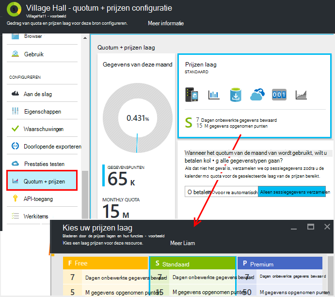
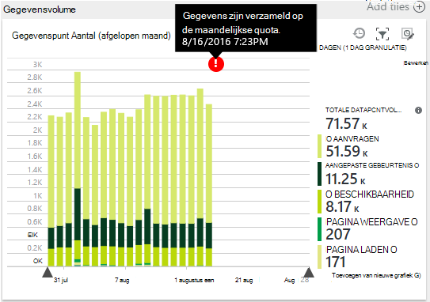
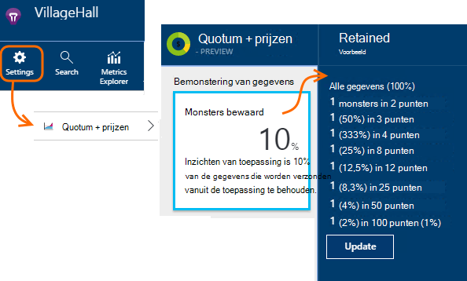
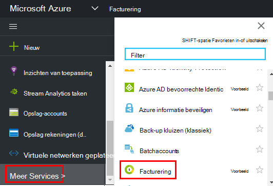

<properties 
    pageTitle="Prijzen en de quota voor toepassing inzichten beheren | Microsoft Azure" 
    description="Kies de prijs plan dat u nodig hebt, telemetrie volumes beheren" 
    services="application-insights" 
    documentationCenter=""
    authors="alancameronwills" 
    manager="douge"/>

<tags 
    ms.service="application-insights" 
    ms.workload="tbd" 
    ms.tgt_pltfrm="ibiza" 
    ms.devlang="na" 
    ms.topic="article" 
    ms.date="10/13/2016" 
    ms.author="awills"/>

# Prijzen en de quota voor toepassing inzichten beheren

*Inzichten van toepassing is in het afdrukvoorbeeld.*

[Prijzen] [ pricing] voor [Visual Studio-toepassing inzichten] [ start] is gebaseerd op het gegevensvolume per toepassing. Er is een aanzienlijke vrij laag waarin u optimaal van de functies met een aantal beperkingen.

Elke toepassing inzichten resource in rekening wordt gebracht als een afzonderlijke service en draagt bij aan de factuur voor uw abonnement op Azure.

[Zie het tarievenstelsel][pricing].

## Quota- en planning voor uw toepassing inzichten resource bekijken

U kunt het quotum + prijzen blade uit de toepassing van de resource-instellingen openen.

De keuze van het tarievenstelsel van invloed op:

* [Maandelijkse Quota](#monthly-quota) - het bedrag van de telemetrie die u elke maand kunt analyseren.
* [Snelheid](#data-rate) - de hoogste snelheid waarmee gegevens van uw app kunnen worden verwerkt.
* [Doorlopend export](#continuous-export) - of kunt u gegevens exporteren naar andere programma's en services.

Deze limieten worden afzonderlijk ingesteld voor elke resource inzichten van toepassing.

### Gratis proefversie van Premium

Wanneer u een nieuwe toepassing inzichten bron maakt, wordt het in de vrij laag.

U kunt op elk moment overschakelen naar de evaluatieversie voor 30 dagen gratis Premium. Dit geeft u de voordelen van de Premium-laag. Na 30 dagen, wordt automatisch overgeschakeld naar wat u trapsgewijs zijn vóór - tenzij u expliciet een andere laag. Selecteert u de laag die u op elk gewenst moment tijdens de proefperiode dat wilt, maar krijgt u nog de gratis proefversie tot het einde van de periode van 30 dagen.

## Maandelijkse Quota

* In elke kalendermaand, kunt uw toepassing sturen van een bepaalde hoeveelheid telemetrie aan inzichten van toepassing. Het quotum voor de prijzen vrij laag is momenteel 5 miljoen punten per maand en aanzienlijk meer voor andere regelingen; u kunt meer kopen als u het quotum bereikt.  Zie het [tarievenstelsel] [ pricing] voor de werkelijke cijfers. 
* Het quotum is afhankelijk van de prijzen laag die u hebt gekozen.
* Het quotum wordt van middernacht UTC op de eerste dag van elke maand geteld.
* De grafiek gegevens punten geeft aan hoeveel van de quota van deze maand is gebruikt.
* Het quotum wordt gemeten in *gegevenspunten.* Een enkel gegevenspunt is een aanroep naar een van de methoden bijhouden of expliciet wordt genoemd in de code, of door een van de standaard telemetrie modules. Er kunnen meerdere gekoppelde eigenschappen en parameters.
* Gegevenspunten worden gegenereerd door:
 * [SDK-modules](app-insights-configuration-with-applicationinsights-config.md) die automatisch gegevens verzamelen, bijvoorbeeld een aanvraag of een crash te rapporteren of om prestaties te meten.
 * [API](app-insights-api-custom-events-metrics.md) `Track...` oproepen die u hebt geschreven, zoals `TrackEvent` of `trackPageView`.
 * [Beschikbaarheid web tests](app-insights-monitor-web-app-availability.md) die u hebt ingesteld.
* Terwijl u fouten opspoort, kunt u de gegevenspunten worden verzonden vanaf uw app in het venster Visual Studio uitvoer bekijken. Clientgebeurtenissen kunnen worden gezien door het openen van dat het tabblad netwerk in uw browser de foutopsporing deelvenster (meestal F12).
* *Sessiegegevens* wordt niet meegeteld in het quotum. Dit omvat tellingen van gebruikers, sessies, milieu en apparaatgegevens.
* Als u tellen van punten door middel van inspectie wilt, kunt u ze op verschillende plaatsen vinden:
 * Elk item die wordt weergegeven in [Diagnostische zoeken](app-insights-diagnostic-search.md)HTTP-aanvragen, uitzonderingen, logboek sporen, bezoekers, afhankelijkheid gebeurtenissen en aangepaste gebeurtenissen.
 * Elke Ruwe meting van een [metriek](app-insights-metrics-explorer.md) , zoals een Prestatiemeter. (De punten die u op de grafieken ziet zijn meestal samengestelde waarden van meerdere punten van onbewerkte gegevens.)
 * Elk punt in een grafiek web beschikbaarheid is ook een aggregaat van verscheidene gegevenspunten.
* U kunt ook afzonderlijke gegevenspunten aan de bron controleren tijdens de foutopsporing:
 * Als u uw app in de foutopsporingsmodus in Visual Studio uitvoert, is de gegevenspunten worden vastgelegd in het venster uitvoer. 
 * Als u client gegevenspunten, openen van de browser foutopsporing (meestal F12) en open het tabblad netwerk.
* De gegevenssnelheid kan worden (standaard) verminderd met [adaptieve bemonstering](app-insights-sampling.md). Dit betekent dat, als het gebruik van de app verhoogt de snelheid telemetrie verhogen Won't net zoals u zou verwachten.

### Overdosering

Als uw toepassing meer dan de maandelijkse quota verzendt, kunt u:

* Betalen voor extra gegevens. Zie het [tarievenstelsel] [ pricing] voor meer informatie. U kunt deze optie vooraf. Deze optie is niet beschikbaar in de vrije prijzen laag.
* Upgrade uw prijzen laag.
* Niets doen. Sessiegegevens nog steeds worden vastgelegd, maar andere gegevens in diagnostische zoeken of metrics Verkenner niet weergegeven.

## Hoeveel ben ik het verzenden van gegevens?

De grafiek onder aan de prijzen blade toont de toepassing van punt gegevensvolume, gegroepeerd op het gegevenstype. (U kunt ook deze grafiek maken in Explorer Metric.)

Klik op de grafiek voor meer details of sleep over het en (+) op voor de details van een periode.

De grafiek toont de omvang van de gegevens die na de [bemonstering](app-insights-sampling.md)bij de service Application inzichten aankomen.

Als het gegevensvolume uw maandelijkse quotum bereikt, verschijnt er een aantekening in de grafiek.

## Gegevenssnelheid

Naast de maandelijkse quota zijn bandbreedtebeperking beperkt de gegevenssnelheid. Voor de vrije [prijzen laag] [ pricing] de limiet is 200 punten per seconde worden gemiddeld meer dan 5 minuten en voor de betaalde het lagen is 500/s worden gemiddeld meer dan 1 minuut. 

Er zijn drie buckets worden apart geteld:

* [TrackTrace oproepen](app-insights-api-custom-events-metrics.md#track-trace) en [Logboeken vastgelegd](app-insights-asp-net-trace-logs.md)
* [Uitzonderingen](app-insights-api-custom-events-metrics.md#track-exception), beperkt tot 50 punten/s.
* Alle andere telemetrie (bezoekers, sessies, aanvragen, afhankelijkheden, metrics, aangepaste gebeurtenissen, testresultaten web).

*Wat gebeurt er als mijn app groter is dan het tarief per seconde?*

* Het volume van de gegevens die uw app verzendt elke minuut wordt beoordeeld. Als deze groter is dan het per seconde gemiddeld op de minuut, weigert de server bepaalde aanvragen. De SDK buffers van de gegevens en vervolgens opnieuw probeert te verzenden, een stijging van spreiden over enkele minuten. Als uw app voortdurend gegevens op hoger dan de bandbreedteregeling verzendt, worden sommige gegevens wordt neergezet. (De ASP.NET, Java en JavaScript-SDK's probeert te verzenden op deze manier en andere SDK's kunnen gewoon neerzetten, de snelheid van de gegevens.)

Als beperking optreedt, wordt er een kennisgeving waarschuwing dat dit is gebeurd.

*Hoe weet ik hoeveel gegevenspunten mijn app verzendt?*

* Open instellingen/Quota en prijzen te zien dat de grafiek gegevensvolume.
* Of in Explorer Metrics, een nieuwe grafiek toevoegen en selecteer **gegevenspunt volume** als de metric. Overschakelen op groeperen en groep door **het gegevenstype**.

## De snelheid verminderen

Als u de bandbreedteregeling grenzen, zijn hier wat u zoal die kunt doen:

* Gebruik [de bemonstering](app-insights-sampling.md). Deze technologie verkleint de gegevenssnelheid zonder uw metrics scheeftrekken en zonder te verstoren, de mogelijkheid om te navigeren tussen verwante items in de zoekopdracht.
* [Limiet voor het aantal Ajax aanroepen die kunnen worden gerapporteerd](app-insights-javascript.md#detailed-configuration) in elke paginaweergave of af te melden van Ajax-switch.
* Verzameling modules die u niet nodig door te [bewerken ApplicationInsights.config hebt](app-insights-configuration-with-applicationinsights-config.md)uitschakelen. Bijvoorbeeld, misschien dat de prestatiemeteritems of afhankelijkheid gegevens inessential zijn.
* Vooraf samengestelde metrics. Als u hebt aanroepen van TrackMetric in uw toepassing, kunt u verkeer beperken met behulp van de overbelasting waarin de berekening van het gemiddelde en de standaarddeviatie van een partij van metingen. Of u kunt een [pakket van vooraf te verzamelen](https://www.myget.org/gallery/applicationinsights-sdk-labs). 

## Bemonstering

[Bemonstering](app-insights-sampling.md) is een vermindering van de snelheid waarmee telemetrie is verzonden naar uw app, behoudt de mogelijkheid om gebeurtenissen vinden tijdens zoekacties diagnostische en behoudt juiste gebeurtenis telt. 

Bemonstering is een effectieve manier kosten verlagen en uw maandelijkse quota te blijven. De bemonstering algoritme behoudt gerelateerde items van telemetrie, zodat, bijvoorbeeld wanneer u de zoekfunctie gebruiken, u de aanvraag betrekking heeft op een bepaalde uitzonderingen vindt. Het algoritme behoudt ook juiste aantallen, zodat u de juiste waarden in de Explorer Metric voor aanvraag tarieven, uitzondering tarieven en andere tellingen bekijken.

Er zijn verschillende vormen van de bemonstering.

* [Adaptieve bemonstering](app-insights-sampling.md) is de standaardinstelling voor de ASP.NET-SDK, die automatisch wordt aangepast aan de omvang van de telemetrie die uw app verzendt. Werkt het automatisch in de SDK in uw web app, zodat de telemetrie-verkeer op het netwerk wordt verminderd. 
* *Bemonstering van de opname* is een alternatief die wordt toegepast op het punt waar telemetrie van uw app de service Application inzichten voert. Dit heeft geen invloed op de omvang van de telemetrie van uw app verzonden, maar vermindert het volume door de service worden bewaard. U kunt het verlagen van de quota door telemetrie van browsers en andere SDK's gebruikt.

Bemonstering van ingestie stelt het besturingselement wordt ingesteld in de quota + blade prijzen:

> [AZURE.WARNING] De waarde die wordt weergegeven op de tegel monsters bewaard geeft alleen de waarde die u hebt ingesteld voor de bemonstering van de opname. De bemonsteringsfrequentie die werkzaam zijn in de SDK in de app niet wordt weergegeven. 
> 
> Als de binnenkomende telemetrie is al op de SDK bemonsterd, ingestie bemonstering niet toegepast.
 
Gebruiken om te ontdekken de werkelijke samplefrequentie, ongeacht waar deze is toegepast, een [query Analytics](app-insights-analytics.md) zoals deze:

    requests | where timestamp > ago(1d)
  	| summarize 100/avg(itemCount) by bin(timestamp, 1h) 
  	| render areachart 

Bewaard in elke record, `itemCount` geeft het nummer van de oorspronkelijke records die het vertegenwoordigt, gelijk is aan 1 + het aantal vorige verwijderde records. 

## Bekijk de factuur voor uw abonnement op Azure

Toepassing worden inzichten toegevoegd aan uw rekening Azure. U ziet de details van uw Azure in het gedeelte facturering van de Azure portal of in de [Portal voor Azure facturering](https://account.windowsazure.com/Subscriptions)op rekening. 

## Naam limieten

1.  Maximaal 200 unieke metrische namen en 200 unieke eigenschap voor uw toepassing. Metrische opnemen gegevens die worden verzonden via TrackMetric als metingen bij andere gegevenstypen, zoals gebeurtenissen.  [Metrics en eigenschapnamen] [ api] zijn globaal per sleutel instrumentation.
2.  [Eigenschappen] [ apiproperties] kan worden gebruikt voor het filteren en groeperen-op slechts zolang zij minder dan 100 unieke waarden voor elke eigenschap hebben. Nadat het aantal unieke waarden met meer dan 100, kunt u nog steeds zoeken de eigenschap, maar niet meer gebruiken voor filters of groeperen op.
3.  Standaardeigenschappen, zoals de naam vragen en de URL zijn beperkt tot 1000 unieke waarden per week. Na 1000 unieke waarden, zijn aanvullende waarden gemarkeerd als 'Andere waarden'. De oorspronkelijke waarden kunnen nog steeds worden gebruikt voor het doorzoeken van volledige tekst en filteren.

Als u dat uw toepassing is deze limieten overschrijdt, kunt u het opsplitsen van de gegevens tussen de verschillende instrumenten toetsen - dat wil zeggen [nieuwe inzichten Application resources maken](app-insights-create-new-resource.md) en bepaalde gegevens te verzenden naar de nieuwe instrumenten-sleutels. Misschien vindt u dat het resultaat beter is gestructureerd. U kunt [dashboards](app-insights-dashboards.md#dashboards) gebruiken om de verschillende maatstaven op hetzelfde scherm, zodat deze aanpak u hiermee niet de mogelijkheid beperkt om verschillende maatstaven vergelijken. 

## Overzicht limieten

[AZURE.INCLUDE [application-insights-limits](../../includes/application-insights-limits.md)]

<!--Link references-->

[api]: app-insights-api-custom-events-metrics.md
[apiproperties]: app-insights-api-custom-events-metrics.md#properties
[start]: app-insights-overview.md
[pricing]: http://azure.microsoft.com/pricing/details/application-insights/

 