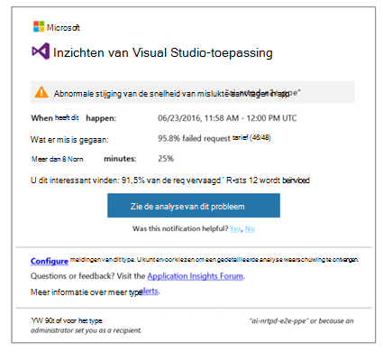
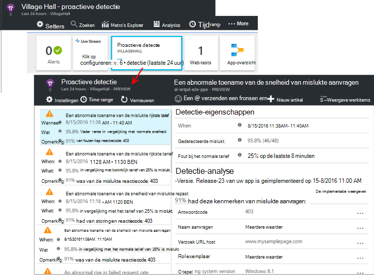

<properties 
    pageTitle="Proactieve diagnostische gegevens in inzichten toepassing | Microsoft Azure" 
    description="Toepassing inzichten voert automatische grondige analyse van de telemetrie app en waarschuwt u voor mogelijke problemen." 
    services="application-insights" 
    documentationCenter="windows"
    authors="rakefetj" 
    manager="douge"/>

<tags 
    ms.service="application-insights" 
    ms.workload="tbd" 
    ms.tgt_pltfrm="ibiza" 
    ms.devlang="na" 
    ms.topic="article" 
    ms.date="08/15/2016" 
    ms.author="awills"/>

#  Proactieve diagnostische gegevens in inzichten van toepassing

 Proactieve Diagnostics waarschuwt automatisch u voor potentiële prestatieproblemen in uw webtoepassing. Slimme analyse van de telemetrie die uw app naar de [Inzichten van Visual Studio-toepassing verzendt](app-insights-overview.md)wordt uitgevoerd. Als er een plotselinge toename van defecten vertoont of ongewone patronen in de prestaties van de client of de server, krijgt u een waarschuwing. Deze functie heeft geen configuratie nodig. Als uw toepassing voldoende telemetrie stuurt werkt.

Detectie van proactieve waarschuwingen kunt u openen van de e-mails die u ontvangt, en van de bladeserver proactieve detectie.

## Bekijk uw proactieve detectie

U kunt detectie op twee manieren vinden:

* **U ontvangt een e-mail** van inzichten van toepassing. Hier volgt een voorbeeld:

    

    Klik op de grote knop om meer details in de portal.

* **Naast de proactieve detectie** op van uw app overzicht blade bevat een aantal recente meldingen. Klik op de tegel voor een overzicht van recente meldingen.

Selecteer een waarschuwing naar de details te zien.

## Welke problemen worden gedetecteerd?

Er zijn drie soorten detectie:

* [Proactieve failure rate diagnostische gegevens](app-insights-proactive-failure-diagnostics.md). We gebruiken machine leren voor het instellen van het verwachte rendement van mislukte aanvragen voor uw app, correleren met de belasting en andere factoren. Als het percentage mislukkingen buiten de verwachte envelop gaat, sturen we een waarschuwing.
* [Proactieve prestatiecontrole](app-insights-proactive-performance-diagnostics.md). We zoeken naar afwijkende patronen in responstijden en defecten vertoont elke dag. We correleren deze problemen met de eigenschappen van de locatie, browser, client-OS, server-instantie en tijd van de dag.
* [Azure Cloud Services](https://azure.microsoft.com/blog/proactive-notifications-on-cloud-service-issues-with-azure-diagnostics-and-application-insights/). U krijgt waarschuwingen als uw app in Azure Cloud Services wordt gehost en een exemplaar van de rol van storingen bij het opstarten, frequente recycling of runtime loopt vast.

(De help-koppelingen in elk bericht gaat u naar de betreffende artikelen.)

## Volgende stappen

Deze diagnostische hulpmiddelen kunt u de telemetrie van uw app controleren:

* [Metrische explorer](app-insights-metrics-explorer.md)
* [Explorer zoeken](app-insights-diagnostic-search.md)
* [Analytics - krachtige querytaal](app-insights-analytics-tour.md)

Proactieve diagnostische gegevens zijn volledig automatisch. Maar u wilt misschien sommige meer waarschuwingen instellen?

* [Handmatig geconfigureerde metrische waarschuwingen](app-insights-alerts.md)
* [Beschikbaarheid van web-tests](app-insights-monitor-web-app-availability.md) 

