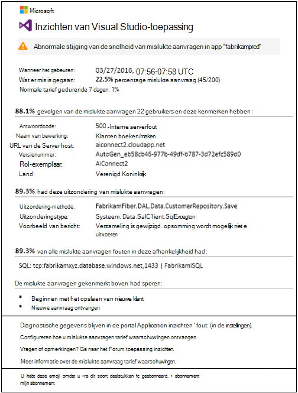
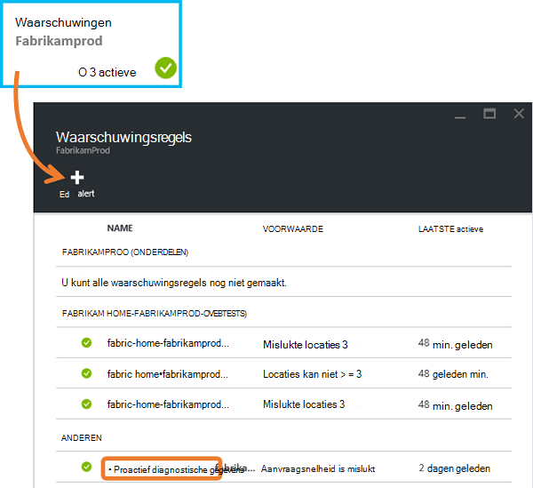
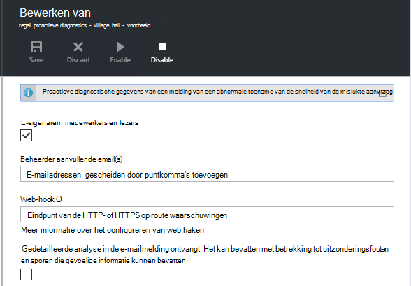
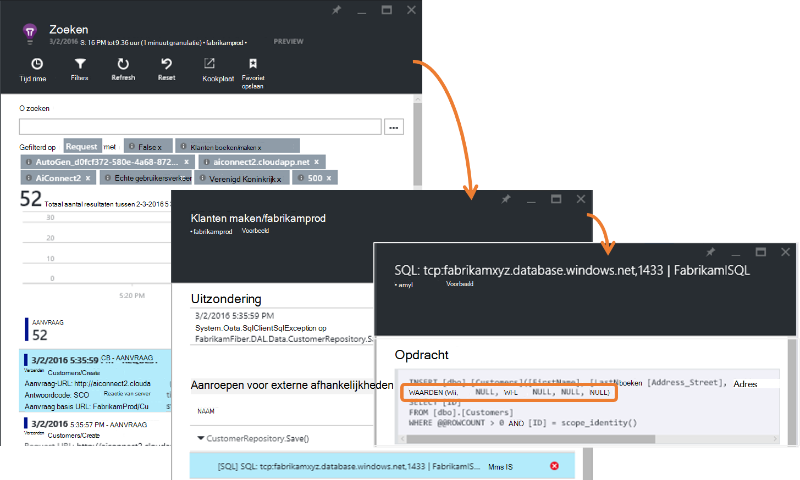
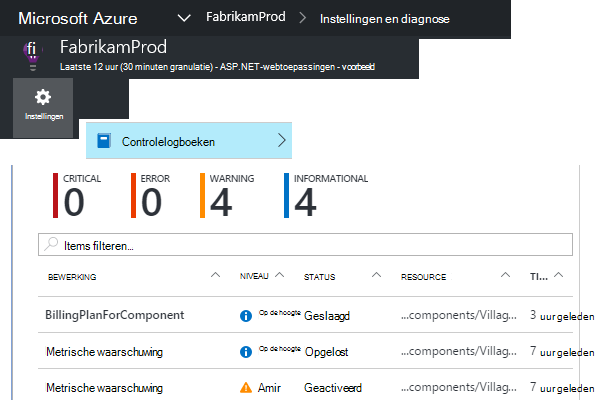
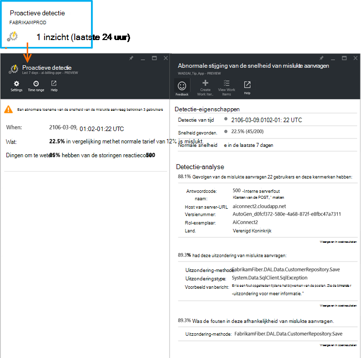

<properties 
    pageTitle="Proactieve Failure Rate diagnostische gegevens in inzichten van toepassing | Microsoft Azure" 
    description="Maakt u attent op ongebruikelijke veranderingen in de frequentie van mislukte aanvragen voor uw web app en diagnostische analyse. Er is geen configuratie nodig." 
    services="application-insights" 
    documentationCenter=""
    authors="yorac" 
    manager="douge"/>

<tags 
    ms.service="application-insights" 
    ms.workload="tbd" 
    ms.tgt_pltfrm="ibiza" 
    ms.devlang="na" 
    ms.topic="article" 
    ms.date="10/12/2016" 
    ms.author="awills"/>
 
# Proactieve Failure Rate diagnostische gegevens

[Inzichten van Visual Studio-toepassing](app-insights-overview.md) automatisch een melding in bijna real-time als er een abnormale toename van de frequentie van fouten in uw web app. Een ongebruikelijke stijging van het aantal HTTP-aanvragen als mislukt gemeld wordt gedetecteerd. Dit zijn meestal met responscodes in de 400 - en 500-bereiken. Om u te helpen uw beoordelen wanneer bent en diagnose van het probleem, is een analyse van de kenmerken van mislukte aanvragen en verwante telemetrie in de kennisgeving verstrekte. Er zijn koppelingen naar de portal Application inzichten voor verdere diagnose. De functie moet geen installatie of configuratie, zoals deze machine learning algoritmen gebruikt om te voorspellen het normale percentage.

Deze functie werkt voor Java, ASP.NET en web apps, die zijn ondergebracht in de cloud of op uw eigen servers. Het werkt ook voor elke toepassing die aanvraag telemetrie genereert - bijvoorbeeld als u de rol van een werknemer die roept [TrackRequest()](app-insights-api-custom-events-metrics.md#track-request). 

Na [Toepassing inzichten voor uw project](app-insights-overview.md)instellen en die uw app genereert een bepaald minimumbedrag van telemetrie, proactieve storing diagnostics duurt 24 uur voor de normale werking van uw app, meer is ingeschakeld en als deze waarschuwingen kunt verzenden.

Hier ziet u een waarschuwing voor een voorbeeld. 

> [AZURE.NOTE] Standaard krijgt u een kortere indeling e dan in dit voorbeeld. Maar u kunt [overschakelen naar deze gedetailleerde indeling](#configure-alerts).

U ziet dat u leest:

* Het percentage mislukkingen in vergelijking met normale app gedrag.
* Hoeveel gebruikers ondervinden – zodat u hoeveel weet zorgen te maken.
* Een kenmerkend patroon dat is gekoppeld aan de storingen. In dit voorbeeld wordt een bepaalde reactiecode, naam (bewerking) en app versie. Meteen weet u waar u moet beginnen met zoeken in uw code. Andere mogelijkheden kunnen zijn van een bepaalde browser of client-besturingssysteem.
* De uitzondering, logboek sporen en afhankelijkheidsfout (databases of andere externe componenten) die worden weergegeven aan de gekarakteriseerde mislukte aanvragen moet worden gekoppeld.
* Links naar relevante zoekopdrachten op de telemetrie in inzichten van toepassing.

## Voordelen van proactieve waarschuwingen

Gewone [metrische waarschuwingen](app-insights-alerts.md) geven er mogelijk een probleem. Maar proactieve storing diagnose begint het diagnostische werk voor u uitvoeren van veel van de analyse die u anders moet zelf. Krijgt u de resultaten netjes verpakt, zodat u snel naar de hoofdmap van het probleem.

## Hoe het werkt

Proactieve Diagnostics voor Real Time Monitor in de buurt van ontvangen de telemetrie van uw app, en met name de frequentie van mislukte aanvragen. Deze metriek telt het aantal aanvragen waarvoor de `Successful request` de eigenschap is ingesteld op false. Standaard `Successful request== (resultCode < 400)` (tenzij u aangepaste code hebt geschreven [filter](app-insights-api-filtering-sampling.md#filtering) of [TrackRequest](app-insights-api-custom-events-metrics.md#track-request) gesprekken te genereren). 

De prestaties van uw app heeft een typisch patroon van gedrag. Bepaalde aanvragen worden meer gevoelig voor storing dan andere; en het totale percentage mislukkingen oplopen naarmate de belasting toeneemt. Proactieve storing diagnose leren vinden deze afwijkingen van de computer gebruikt. 

Zoals telemetrie vandaan in toepassing inzichten uw web app, vergelijkt proactieve storing diagnose het huidige gedrag met de patronen zien de afgelopen paar dagen. Als een abnormale stijging van het percentage mislukkingen wordt waargenomen ten opzichte van eerdere prestaties, wordt een analyse geactiveerd.

Wanneer een analyse wordt geactiveerd, wordt de service een cluster-analyse uitgevoerd op de mislukte aanvragen, om te proberen vast te stellen van een patroon van de waarden die de storingen kenmerkt. De analyse heeft ontdekt dat de meeste fouten over een bepaald resultaatcode, naam, URL van de Server host en rol exemplaar zijn in het bovenstaande voorbeeld. De analyse heeft daarentegen heeft ontdekt dat de eigenschap client-besturingssysteem is verdeeld over meerdere waarden, en dus wordt het niet weergegeven.

Wanneer de service wordt geïmplementeerd met deze telemetrie, vindt u de analysator een uitzondering en een afhankelijkheidsfout die zijn gekoppeld aan de aanvragen in het cluster dat het heeft geïdentificeerd met een voorbeeld van de logboeken voor het traceren die zijn gekoppeld aan de aanvragen.

De uiteindelijke analyse is naar u verzonden als waarschuwing, tenzij u er geen hebt geconfigureerd.

U kunt controleren van de status van de waarschuwing en in het blad waarschuwingen van uw toepassing inzichten bron configureren als de [meldingen die u handmatig instellen](app-insights-alerts.md). Maar in tegenstelling tot andere waarschuwingen, u hoeft niet te installeren of proactieve storing diagnostische gegevens configureren. Als u wilt, kunt u uitschakelen of de e-mailadressen van doel wijzigen.

## Waarschuwingen configureren 

U kunt diagnostische gegevens van proactieve uitschakelen, de geadresseerden van het e-mailadres wijzigen, een webhook maken of gebruik te maken van meer gedetailleerde waarschuwingsberichten.

Open de pagina met waarschuwingen. Proactieve Diagnostics is opgenomen en de waarschuwingen die u handmatig hebt ingesteld en kunt u zien of deze momenteel in de waarschuwing staat is.

Klik op de melding om deze te configureren.

De mededeling dat u proactief diagnostische gegevens kunt uitschakelen, maar kan niet worden verwijderd (of maakt u een nieuwe).

#### Gedetailleerde waarschuwingen

Als u 'Ontvangen gedetailleerde analyse' wordt het e-mailbericht meer diagnostische gegevens bevatten. Soms zult u mogelijk een diagnose alleen van de gegevens in het e-mailbericht. 

Er is een gering gevaar dat de meer gedetailleerde waarschuwing kan gevoelige informatie bevatten, omdat deze uitzondering en trace berichten bevat. Dit zou echter alleen gebeuren als uw code tot gevoelige informatie in deze berichten leiden kan. 

## Gesorteerd en diagnose van een waarschuwing

Een waarschuwing geeft aan dat een abnormale toename van de snelheid van de mislukte aanvraag is gevonden. Het is waarschijnlijk dat er een probleem is met de app of de omgeving.

Uit het percentage van de aanvragen en het aantal gebruikers die worden beïnvloed, kunt u bepalen hoe urgent het probleem is. In het bovenstaande voorbeeld het percentage mislukkingen van 22.5% vergeleken met een normale tarief van 1%, geeft aan dat een probleem is op. Aan de andere kant werden alleen 11 gebruikers beïnvloed. Als uw app, kunt u zou kunnen beoordelen hoe ernstig is.

In veel gevallen is u mogelijk om een diagnose van het probleem snel uit naam van de aanvraag, uitzondering, afhankelijkheid storingen en trace gegevens. 

Er zijn enkele andere aanwijzingen. Het percentage mislukkingen van afhankelijkheid in het volgende voorbeeld is gelijk aan het tarief uitzondering (89,3%). Dit duidt erop dat de uitzondering direct vanuit de afhankelijkheidsfout ontstaat-zodat u een goed beeld van waar u begint te zoeken in uw code.

U kunt verdere onderzoeken gaat de koppelingen in de sectie u rechtstreeks naar een [zoekpagina](app-insights-diagnostic-search.md) , worden de betrokken aanvragen, uitzondering, afhankelijkheid of sporen. Of de [Azure portal](https://portal.azure.com)opent, gaat u naar de bron van de inzichten van toepassing voor uw app en open de blade storingen.

In dit voorbeeld klikt u op de koppeling 'View details van afhankelijkheid fouten' wordt geopend zoeken-blade inzichten van toepassing op de SQL-instructie met de hoofdoorzaak: nulwaarden wanneer bij verplichte velden opgegeven en niet gevalideerd tijdens het opslaan worden kan bewerking.

## Recente meldingen bekijken

U controleert de waarschuwingen in de portal door **controlelogboeken-instellingen**te openen.

Klik op de melding om de volledige details.

Of klik op **proactieve detectie** om direct naar de meest recente melding:

## Wat is het verschil...

Proactieve failure rate diagnostics aanvulling op andere gelijksoortige maar afzonderlijke functies van Application inzichten. 

* [Metric waarschuwingen](app-insights-alerts.md) worden ingesteld door u en een breed scala aan statistieken zoals CPU bezetting, aanvraag tarieven, pagina laden tijden, enzovoort kunt controleren. U kunt ze gebruiken om u te waarschuwen, bijvoorbeeld als u wilt meer bronnen toevoegen. Daarentegen, proactieve storing diagnostische gegevens betrekking hebben op een klein aantal essentiële parameters (momenteel alleen mislukte aanvraag tarief), ontworpen om u te waarschuwen u in real-time wijze als van uw web app is niet in de buurt van aanvragen verhoogt de snelheid aanzienlijk in vergelijking met de normale werking van de web app.

    Proactieve failure rate diagnostics past automatisch de drempel in reactie op de heersende omstandigheden.

    Proactieve failure rate diagnostics start de diagnostische werk voor u. 
* [Proactieve prestatiecontrole](app-insights-proactive-performance-diagnostics.md) machine intelligence ook ontdekken ongewone patronen in uw statistieken worden gebruikt en u geen configuratie is vereist. Maar in tegenstelling tot proactieve failure rate diagnostische programma's voor prestatiecontrole proactieve beoogt de segmenten van de verzamelleiding gebruik die mogelijk niet goed worden bediend - bijvoorbeeld door bepaalde pagina's op een bepaald type browser vinden. De analyse dagelijks wordt uitgevoerd en als een resultaat wordt gevonden, is het waarschijnlijk veel minder urgente dan een waarschuwing. Daarentegen de analyse voor proactieve storing diagnostics continu op binnenkomende telemetrie wordt uitgevoerd en u krijgt binnen enkele minuten als server storing tarieven groter zijn dan verwacht.

## Als u een waarschuwing storing proactieve tarief diagnostische gegevens ontvangt

*Waarom hebben ik deze waarschuwing ontvangen?*

*   Er is een abnormale toename van de snelheid van mislukte aanvragen in vergelijking met de normale basislijn van de voorafgaande periode vastgesteld. Na analyse van de fouten en de bijbehorende telemetrie denken we er is een probleem dat in moet worden gezocht. 

*De melding betekent dat er is wel degelijk een probleem?*

*   We proberen om te attenderen op app onderbreking of degradatie, hoewel alleen u volledig in de semantiek en de impact op de app of gebruikers inzicht.

*Dus u guys kijkt naar mijn gegevens?*

*   Nr. De service is volledig automatisch. U krijgt alleen de meldingen. Uw gegevens is [privé](app-insights-data-retention-privacy.md).

*Heb ik om u te abonneren op dit bericht* 

*   Nr. Elke toepassing verzonden aanvraag telemetrie heeft deze waarschuwingsregel.

*Kan ik een abonnement opzeggen of de meldingen worden verzonden naar Mijn collega's, in plaats daarvan krijgen?*

*   Ja, In regels, klikt u op regel proactieve diagnostische gegevens om deze te configureren. U kunt de waarschuwing uitschakelen of wijzigen van de geadresseerden voor de waarschuwing. 

*Het e-mailbericht verloren gegaan. Waar vind ik de meldingen in de portal*

*   In de controlelogboeken. Klik op instellingen van de controlelogboeken, vervolgens een waarschuwing als u wilt zien van de ziektegeschiedenis, maar met beperkte gedetailleerde weergave.

*Sommige van de waarschuwingen van bekende problemen zijn en ik wil niet ontvangen.*

*   Waarschuwing onderdrukking hebben we op onze reserve.

## Volgende stappen

Deze diagnostische hulpmiddelen kunt u de telemetrie van uw app controleren:

* [Metrische explorer](app-insights-metrics-explorer.md)
* [Explorer zoeken](app-insights-diagnostic-search.md)
* [Analytics - krachtige querytaal](app-insights-analytics-tour.md)

Proactieve detectie zijn volledig automatisch. Maar u wilt misschien sommige meer waarschuwingen instellen?

* [Handmatig geconfigureerde metrische waarschuwingen](app-insights-alerts.md)
* [Beschikbaarheid van web-tests](app-insights-monitor-web-app-availability.md) 

