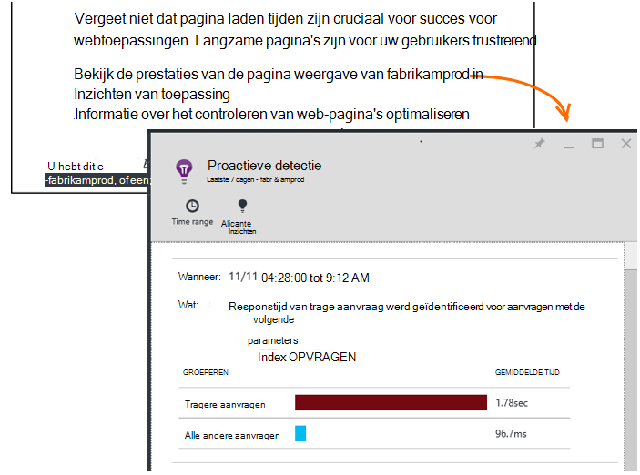

<properties 
    pageTitle="Inzichten van toepassing: De proactieve prestatiecontrole | Microsoft Azure" 
    description="Toepassing inzichten voert uitgebreide analyse van uw app Telemetrie en waarschuwt u van potentiële problemen." 
    services="application-insights" 
    documentationCenter="windows"
    authors="antonfrMSFT" 
    manager="douge"/>

<tags 
    ms.service="application-insights" 
    ms.workload="tbd" 
    ms.tgt_pltfrm="ibiza" 
    ms.devlang="na" 
    ms.topic="article" 
    ms.date="08/31/2016" 
    ms.author="awills"/>

#  Proactieve prestatiecontrole

*Inzichten van toepassing is in het afdrukvoorbeeld.*

[Visual Studio-toepassing inzichten](app-insights-overview.md) grondige analyse van de telemetrie app wordt uitgevoerd en kunnen waarschuwen voor mogelijke problemen met de prestaties. U bent waarschijnlijk gelezen omdat u een van onze proactieve waarschuwingen per e-mail ontvangen. 

Deze functie vereist geen installatie en wordt automatisch geactiveerd wanneer uw app voldoende telemetrie genereert.

## Wat zijn proactieve prestatiecontrole?

Ongebruikelijke patronen van de prestaties van uw app, ontdekt proactieve prestatiecontrole door een analyse van de telemetrie die uw app naar de inzichten van toepassing verzendt. 

In het bijzonder worden prestatieproblemen die sommige gebruikers alleen van invloed op of alleen van invloed op gebruikers in sommige gevallen gevonden.

Bijvoorbeeld, het kan een melding geven als uw app pagina's worden geladen veel langzamer op één type browser dan andere, of als aanvragen langzamer van een bepaalde server worden bediend. Het kan ook problemen met combinaties van de eigenschappen ontdekken, zoals langzaam pagina wordt geladen in een geografisch gebied op bepaalde tijdstippen van de dag.

Afwijkingen van deze zijn zeer moeilijk te detecteren door de gegevens te controleren, maar vaker dan u denkt. Vaak ze alleen oppervlak wanneer uw klanten klagen. Tegen die tijd is het te laat: de betreffende gebruikers al overschakelt naar uw concurrenten!

Op dit moment Bekijk onze algoritmen pagina laden tijden, responstijden aanvraag op de server en afhankelijkheid responstijden.  

U hoeft niet alle drempels of regels configureren. Machine learning en datamining-algoritmen worden gebruikt voor het detecteren van abnormale patronen. 

We hebben uw feedback zeer enthousiast. Laat ons weten hoe u kunt, hoe we proactieve detectie kunnen verbeteren en welke extra mogelijkheden u wenst toe te voegen. U kunt feedback geven via verzenden een glimlach/fronsen in de portal of een e-mail sturen naar AppInsightsML@microsoft.com. 

## Over de proactieve waarschuwing

* *Waarom hebben ik deze e-mail ontvangen?*
 * Proactieve detectie geanalyseerd de telemetrie uw toepassing verzonden naar toepassing inzichten en een prestatieprobleem gevonden in uw toepassing. 
* *De melding betekent dat er is wel degelijk een probleem?*
 * Nr. Het is gewoon een suggestie over iets dat u wilt kijken meer dicht. 
* *Wat moet ik doen?*
 * [Bekijk de gegevens gepresenteerd](#responding-to-an-alert). Metrics Explorer gebruiken om de prestaties in de tijd bekijken en extra statistieken analyseren. Zoekactie gebruiken voor het filteren van specifieke gebeurtenissen waarmee u de oorzaak bepalen. 
* *Dus u guys kijkt naar mijn gegevens?*
 * Nr. De service is volledig automatisch. U krijgt alleen de meldingen. Uw gegevens is [privé](app-insights-data-retention-privacy.md).

## Het detectieproces

* *Welke soorten afwijkingen van de prestaties worden gedetecteerd?*
 * De patronen die u zou vinden het kost tijd om te controleren voor uzelf. Bijvoorbeeld, slechte prestaties in een specifieke combinatie van locatie, tijdstip en platform.
* *De gegevens die zijn verzameld door de inzichten van de toepassing geanalyseerd?*
 * Niet op dit moment. Momenteel analyseren we laadtijd responstijd, reactietijd van de afhankelijkheid en de pagina aanvraag. Analyse van extra statistieken is binnenkort beschikbaar. 
* *Ik maak mijn eigen afwijking detectie regels?*
 * Nog niet. Maar u kunt:
 * [Waarschuwingen instellen](app-insights-alerts.md) die aangeven wanneer een metric een drempel overschrijdt.)
 * [Telemetrie exporteren](app-insights-export-telemetry.md) naar een [database](app-insights-code-sample-export-sql-stream-analytics.md) of [PowerBI](app-insights-export-power-bi.md) of [andere](app-insights-code-sample-export-telemetry-sql-database.md) tools, waar u kunt analyseren zelf.
* *Hoe vaak wordt de analyse uitgevoerd?*
 * We uitvoeren de analyse dagelijks op de telemetrie van de vorige dag.
* * Dus vervangt deze [metrische waarschuwingen](app-insights-alerts.md)?
 * Nr.  We doorvoeren detecteren elke abnormaal overwegen gedrag niet.

## Het onderzoeken van de kwesties in

Open het diagnostische rapport van het e-mailbericht of van de afwijkingen van de lijst.

* **Wanneer** wordt de tijd dat het probleem is aangetroffen.
* **Welke** beschrijving
 * Het probleem dat is aangetroffen;
 * De kenmerken van de reeks gebeurtenissen die we vinden weergegeven het gedrag van het probleem.
* De tabel vergelijkt de slecht presterende set met het gemiddelde gedrag van alle andere evenementen.

Klik op de koppelingen om de Metric Verkenner en zoek op relevante rapporten, gefilterd op de tijd en de eigenschappen van de trage prestaties set geopend.

Filters voor het verkennen van de Telemetrie en tijdsbereik wijzigen.

## Hoe kan ik de prestaties verbeteren?

Langzaam en mislukte antwoorden zijn een van de grootste frustraties voor gebruikers van de website, zoals u uit eigen ervaring weet. Het is dus belangrijk om de problemen te verhelpen.

### Triage

Ten eerste maakt het uit? Als een pagina altijd langzaam is worden geladen, maar slechts 1% van de bezoekers van uw site ooit hebben om deze te bekijken, misschien hebt u meer belangrijke dingen te denken. Aan de andere kant, als er slechts 1% van de gebruikers openen, maar deze uitzonderingen elke keer genereert, die mogelijk waard.

De instructie effect in het e-mailadres gebruiken als algemene richtlijn, maar houd er rekening mee dat dit niet het hele verhaal. Verzamelen van andere bewijzen te bevestigen.

U kunt de parameters van het probleem. Als afhankelijk van de Geografie is, stelt u de [beschikbaarheid van tests](app-insights-monitor-web-app-availability.md) , met inbegrip van die regio: er gewoon mogelijk netwerkproblemen in dat gebied. 

### Vaststellen van langzame pagina wordt geladen 

Waar is het probleem? Is de server traag reageren, de pagina erg lang is of de browser hoeft te veel van het werk weer te geven?

Open de metrische blade Browsers. De [gesegmenteerde weergave van de browser pagina laadtijd](app-insights-javascript.md#explore-your-data) ziet u waar de tijd vordert. 

* Als **Verzenden aanvraagtijd** hoog is, de server reageert traag of de aanvraag is een bericht met een grote hoeveelheid gegevens. Bekijk de [prestatiegegevens](app-insights-web-monitor-performance.md#metrics) te onderzoeken responstijden. 
* Stel [afhankelijkheid bijhouden](app-insights-dependencies.md) om te zien of de traagheid als gevolg van externe services of de database is.
* Als het **Ontvangen antwoord** dienstencomponent het belangrijkst is, zijn de pagina en de afhankelijke onderdelen - JavaScript, CSS, afbeeldingen enzovoort (maar niet asynchroon geladen gegevens) lang. Instellen van een [test voor beschikbaarheid](app-insights-monitor-web-app-availability.md)en moet u de optie voor het afhankelijke onderdelen instellen. Als u sommige resultaten krijgt, opent u de details van een resultaat en uitvouwen om te zien of de belasting tijden van andere bestanden.
* Hoog **tijd voor verwerking van de Client** stelt scripts langzaam worden uitgevoerd. Als de oorzaak niet duidelijk is, kunt u bepaalde timing code toevoegen en verzenden de tijden in trackMetric aanroepen.

### Langzame pagina's verbeteren

Er is een volledige van advies over het verbeteren van de reacties van de server en de pagina laden tijden, zodat we proberen Won't te herhalen hier alle web. Hier volgen enkele tips die u waarschijnlijk al weten, maar voor je denkt:

* Langzame laden omdat er grote bestanden: de scripts en andere onderdelen asynchroon geladen. Gebruik de bundeling van script. De hoofdpagina opsplitsen in widgets die hun gegevens apart te laden. Gewone oude HTML voor lange tabellen niet verzenden: gebruik van een script voor het aanvragen van de gegevens als JSON of andere compact-bestand en vervolgens vult u de tabel in de plaats. Er zijn geweldige kaders te helpen met dit alles. (Ze ook leiden tot grote scripts, natuurlijk.)
* Trage server afhankelijkheden: rekening houden met de geografische locaties van uw componenten. Bijvoorbeeld, als u Azure gebruikt, controleert u of de webserver en de database in dezelfde regio. Query's ophalen meer informatie dan ze nodig hebben? Caching of help batchen zou?
* Problemen met capaciteit: Bekijk de serverstatistieken van responstijden en telt aanvraag. Als de reactietijden onevenredig met pieken in aantallen van de aanvraag pieksnelheden, is het waarschijnlijk dat uw servers worden uitgerekt. 

## E-mailberichten

* *Heb ik voor een abonnement op deze service meldingen ontvangen?*
 * Nr. Onze bot regelmatig de gegevens van alle gebruikers van de toepassing inzichten enquêtes en meldingen worden verzonden als problemen worden vastgesteld.
* *Kan ik een abonnement opzeggen of de meldingen worden verzonden naar Mijn collega's, in plaats daarvan krijgen?*
 * Klik op de koppeling voor afmelden in de waarschuwing of het e-mailadres. 
 
    Dat lukt momenteel aan degenen die [schrijftoegang](app-insights-resources-roles-access-control.md)tot de bron van de inzichten van toepassing hebben.

    Ook kunt u de lijst met geadresseerden instellingen in de blade proactieve detectie.
* *Ik wil niet worden overspoeld met deze berichten.*
 * Ze zijn beperkt tot één per dag van de meest relevante probleem die we nog niet hebt gerapporteerd over. U won't herhalingen van elk bericht.
* *Als ik iets doen, krijg ik een herinnering?*
 * Nee, u krijgt een bericht over elk probleem slechts eenmaal. 
* *Het e-mailbericht verloren gegaan. Waar vind ik de meldingen in de portal*
 * In het overzicht van de inzichten van de toepassing van de app, klik op de tegel **Proactieve detectie** . U zult er alle meldingen van tot 7 dagen terug vinden.

## Volgende stappen

Deze diagnostische hulpmiddelen kunt u de telemetrie van uw app controleren:

* [Metrische explorer](app-insights-metrics-explorer.md)
* [Explorer zoeken](app-insights-diagnostic-search.md)
* [Analytics - krachtige querytaal](app-insights-analytics-tour.md)

Proactieve detectie zijn volledig automatisch. Maar u wilt misschien sommige meer waarschuwingen instellen?

* [Handmatig geconfigureerde metrische waarschuwingen](app-insights-alerts.md)
* [Beschikbaarheid van web-tests](app-insights-monitor-web-app-availability.md) 

