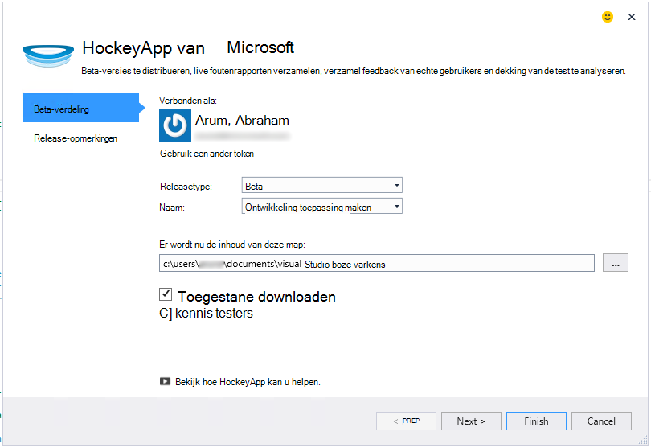
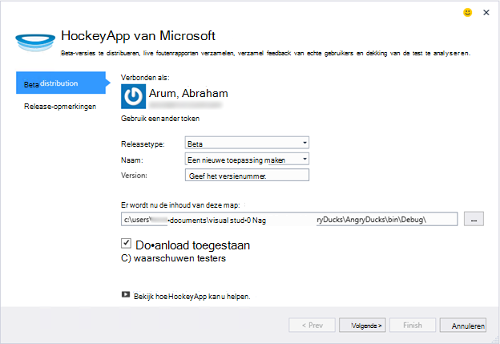
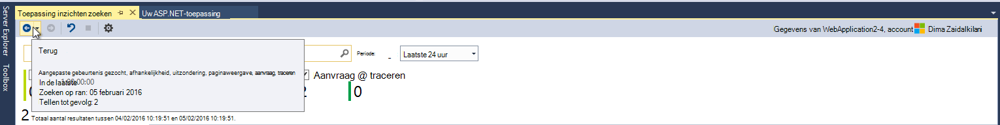
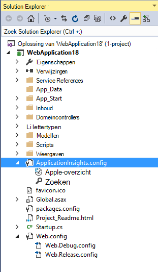

<properties
    pageTitle="Releaseopmerkingen bij Visual Studio-extensie voor ontwikkelaars Analytics"
    description="De meest recente updates voor Visual Studio tools voor ontwikkelaars Analytics."
    services="application-insights"
    documentationCenter=""
    authors="acearun"
    manager="douge"/>
<tags
    ms.service="application-insights"
    ms.workload="tbd"
    ms.tgt_pltfrm="ibiza"
    ms.devlang="na"
    ms.topic="article"
    ms.date="06/09/2016"
    ms.author="acearun"/>

# Release-opmerkingen voor Analytics-ontwikkelprogramma 's
Nieuw: toepassing inzichten en HockeyApp analytics in Visual Studio.
## Versie 7.0
### Visual Studio-toepassing inzichten Trends
Visual Studio-toepassing inzichten is een nieuw hulpprogramma in Visual Studio die u gebruiken kunt om te analyseren hoe uw app werkt. Kies om te beginnen op de werkbalkknop **Inzichten van toepassing** of in het zoekvenster toepassing inzichten **Telemetrie Trends ontdekken**. Of, in het menu **Beeld** klikt u op **Andere Windows**en klik op **Toepassing inzichten Trends**. Kies een van de vijf algemene query's aan de slag. U kunt verschillende gegevenssets gebaseerd op typen telemetrie, tijd bereiken en andere eigenschappen kunt analyseren. Anomalieën zoekt in uw gegevens, kiest u een van de opties van de afwijking in de vervolgkeuzelijst **Type weergave** . De filteropties onder aan het venster kunnen eenvoudig specifieke subsets van de telemetrie specificeren.

### Uitzonderingen in CodeLens
Telemetrie uitzondering wordt nu weergegeven in de CodeLens. Als u uw project hebt verbonden met de service Application inzichten, ziet u het aantal uitzonderingen die in elke methode in de productie in de afgelopen 24 uur zijn opgetreden. Vanuit CodeLens, kunt u gaan zoeken of Trends te onderzoeken van de uitzonderingen in meer detail.

### ASP.NET-Core-ondersteuning
Toepassing inzichten biedt nu ondersteuning voor ASP.NET Core RC2 projecten in Visual Studio. In het dialoogvenster **Nieuw Project** , zoals in de volgende schermafdruk kunt u inzichten van toepassing op nieuwe ASP.NET Core RC2 projecten toevoegen. Of toe te voegen aan een bestaand project, het project in de Solution Explorer met de rechtermuisknop en klik vervolgens op **Toepassing inzichten telemetrie toevoegen**.

ASP.NET 5 RC1 en RC2 van ASP.NET Core projecten kunt u ook nieuwe ondersteuning in het venster van het diagnostische hulpprogramma's hebben. Ziet u gebeurtenissen zoals aanvragen en uitzonderingen toepassing inzichten van uw ASP.NET-toepassing terwijl u lokaal op uw PC opsporen. Elke gebeurtenis, klikt u op **Zoeken** om in te zoomen voor meer informatie.

### HockeyApp voor Universal Windows apps
Beta-verdeling en de gebruiker feedback biedt HockeyApp symbolicated crash rapportage voor uw Universal Windows apps. We hebben eenvoudiger zelfs de HockeyApp SDK toevoegen: klik met de rechtermuisknop op het project voor Universal Windows en klik op **Hockey App - Crash Analytics inschakelen**. De SDK wordt geïnstalleerd, de crash-collectie wordt ingesteld en een HockeyApp middel in de cloud, zonder dat u hoeft uw app uploaden naar de service HockeyApp bepalingen.

Andere nieuwe functies:

* De zoekfunctie van toepassing inzichten sneller en intuïtiever zijn gewijzigd. Nu worden tijd bereiken en detail filters automatisch toegepast als u deze selecteert.
* Ook in Search toepassing inzichten is nu er een optie om naar de code rechtstreeks vanuit de telemetrie van de aanvraag.
* We hebt verbeteringen aan de HockeyApp-in-ervaring aangebracht.
* In diagnostische hulpprogramma's, wordt telemetrie productiegegevens voor uitzonderingen weergegeven.

## Versie 5.2
Wij zijn trots de invoering van de HockeyApp-scenario's in Visual Studio. De eerste integratie is in beta-verdeling van Universal Windows apps en Windows Forms-toepassingen van Visual Studio.

Met de bèta-verdeling uploaden u vroege versies van de apps naar HockeyApp voor distributie naar een geselecteerde subset van klanten of de testers. Bèta-verdeling, gecombineerd met HockeyApp crash-collectie en de gebruiker feedback-functies kunt u voorzien van waardevolle informatie over uw app voordat u een grote release. U kunt deze informatie om problemen te verhelpen met uw app zodat u kunt voorkomen of beperken van de toekomstige problemen, zoals lage app classificaties en negatieve feedback.

Ontdek hoe eenvoudig die het is om te uploaden voor bèta-verdeling van Visual Studio bouwt.
### Universal Windows apps
Het contextmenu voor een universele Windows app projectknooppunt bevat nu een optie voor het uploaden van uw build naar HockeyApp.

Kies het item en de HockeyApp uploaden wordt geopend. U moet een account HockeyApp voor het uploaden van uw build. Als u een nieuwe gebruiker bent, geen probleem. Een account maken is eenvoudig.

Wanneer u verbonden bent, ziet u het formulier in het dialoogvenster voor het uploaden.

Selecteer de inhoud te uploaden (een .appxbundle of .appx) en kies vrijgeven opties in de wizard. U kunt desgewenst release-opmerkingen op de volgende pagina. Kies **Voltooien** om te beginnen met het uploaden.

Wanneer de upload voltooid is, verschijnt de melding van een HockeyApp met bevestiging en een koppeling naar de app in de portal voor HockeyApp.

Dat is alles. U hebt zojuist een build voor bèta-verdeling met een paar muisklikken geüpload.

U kunt uw aanvraag op verschillende manieren in de portal HockeyApp beheren. Gebruikers, bekijkt foutenrapporten en de feedback, wijzigen van gegevens, enzovoort.

Zie de [HockeyApp Knowledge Base](http://support.hockeyapp.net/kb/app-management-2) voor meer informatie over het beheer van de app.

### Windows Forms-toepassingen
Het contextmenu voor een knooppunt voor het Windows-formulier bevat nu een optie voor het uploaden van uw build naar HockeyApp.

Hiermee opent het dialoogvenster voor het uploaden van HockeyApp, die vergelijkbaar met een in een universele Windows app is.

Opmerking een nieuw veld in de wizard voor het opgeven van de versie van de app. Voor Universal Windows apps, wordt de informatie opgehaald uit het manifest. Windows Forms-toepassingen, helaas geen equivalent voor deze functie. U moet deze handmatig opgeven.

De rest van de stroom is vergelijkbaar met Universal Windows apps: Kies build en opties vrijgeven, release toevoegen notities, uploaden en beheren in de portal voor HockeyApp.

Het is zo eenvoudig. Probeer het eens en laat ons weten wat u denkt.
## Versie 4.3
### Telemetrie van lokale debug sessies zoeken
Met deze release kunt u nu zoeken naar toepassing inzichten telemetrie gegenereerd in de sessie voor foutopsporing van Visual Studio. Vóór, kan u zoeken alleen gebruiken als u uw app geregistreerd met de inzichten van toepassing. Nu moet de app alleen de toepassing inzichten SDK als u wilt zoeken naar lokale telemetrie geïnstalleerd.

Als u een ASP.NET-toepassing met de SDK van toepassing inzichten, doen de volgende stappen uit als u wilt zoeken.

1. Fouten opsporen in uw toepassing.
2. Toepassing inzichten zoeken in een van de volgende manieren openen:
    - In het menu **Beeld** klikt u op **Andere Windows**en klik op **Toepassing inzichten zoeken**.
    - Klik op de knop **Toepassing inzichten** .
    - In de Solution Explorer, vouw **ApplicationInsights.config**uit en klik vervolgens op **Zoeken debug-sessie telemetrie**.
3. Als u nog niet hebt aangemeld bij toepassing inzichten, wordt het venster zoeken wordt geopend in de foutopsporingsmodus sessie telemetrie.
4. Klik op het pictogram **Zoeken** voor uw lokale telemetrie.

## Versie 4.2
In deze release, hebben we toegevoegd functies waarmee u gegevens gemakkelijker in het kader van gebeurtenissen, met de mogelijkheid om de code van Gegevensgebeurtenissen voor meer en een probleemloze ervaring uw registratie gegevens verzenden naar toepassing inzichten gaan zoeken. Deze uitbreiding wordt maandelijks bijgewerkt. Als u feedback of functie aanvragen, verzenden naar aidevtools@microsoft.com.
### Ervaring Nee en klik op aanmelden
Als u al NLog, log4net of System.Diagnostics.Tracing gebruikt, hebt u geen zorgen te maken over het verplaatsen van al uw sporen op de inzichten van toepassing. Wij hebben de toepassing inzichten logboekregistratie adapters in deze release geïntegreerd met de normale configuratie ervaring.
Als u al een van deze kaders logboekregistratie is geconfigureerd, is de volgende sectie wordt beschreven hoe deze.
**Als u toepassing inzichten al hebt toegevoegd:**
1. Klik met de rechtermuisknop op het projectknooppunt en klik vervolgens op **Toepassing inzichten**en klik op **Inzichten van toepassing configureren**. Zorg ervoor dat u de juiste adapter toevoegen in het configuratievenster ziet.
2. Wanneer u de oplossing, Noteer ook het pop-upvenster dat wordt weergegeven op de bovenste rechts van het scherm en klik op **configureren**.

Als u de logboekregistratie-adapter is geïnstalleerd, start de toepassing en zorg ervoor dat de gegevens op het tabblad Diagnostische hulpprogramma's als volgt:

### Te gaan of zoek de code waarin de telemetrie gebeurteniseigenschap wordt uitgestoten
Met de release van de nieuwe gebruiker kan klikken op een willekeurige waarde in detail en dit wordt gezocht naar overeenkomende tekst in de huidige geopende oplossing. Resultaten worden weergegeven in de Visual Studio "Gevonden resultaten" lijst zoals hieronder wordt weergegeven:

### Nieuw zoekvenster voor wanneer u niet bent aangemeld bij
We hebben het uiterlijk van het zoekvenster toepassing inzichten waarmee u kunt zoeken uw gegevens terwijl uw app in productie is verbeterd.

### Zie alle telemetrie gebeurtenissen die zijn gekoppeld aan de gebeurtenis
We hebben hebt een nieuw tabblad, met vooraf gedefinieerde query's voor alle gegevens met betrekking tot de gebeurtenis telemetrie dat de gebruiker bekijkt, naast het tabblad details van gebeurtenissen toegevoegd. Een aanvraag heeft bijvoorbeeld een veld **-ID van bewerking**genoemd. Elke gebeurtenis die is gekoppeld aan dit verzoek heeft dezelfde waarde voor **Bewerking-ID**. Als een uitzondering voordoet tijdens de bewerking wordt de aanvraag verwerkt, krijgt de uitzondering dezelfde bewerking-ID als het verzoek om het gemakkelijker te vinden. Als u op zoek bent op een verzoek, klikt u op **alle telemetrie voor deze bewerking** als u wilt openen een nieuw tabblad dat de nieuwe zoekresultaten worden weergegeven.

### Forward en Back-geschiedenis in zoeken
Nu kunt u gaan heen en weer tussen de zoekresultaten.

## Versie 4.1
Deze versie wordt geleverd met een aantal nieuwe functies en updates. U moet Update 1 hebben geïnstalleerd om deze update te installeren.

### Methode in de broncode van een uitzondering gaan
Nu, als u uitzonderingen van uw app productie in het venster toepassing inzichten zoeken, kunt u springen naar de methode in uw code waar de uitzondering zich voordoet. U hoeft alleen het juiste project is geladen en inzichten toepassing zorgt voor de rest! (Zie de release-opmerkingen voor versie 4.0 in de volgende secties voor meer informatie over het zoekvenster toepassing inzichten,.)

Hoe werkt het? Zelfs als een oplossing niet geopend is, kunt u toepassingen inzichten zoeken gebruiken. De stack trace-gebied een informatiebericht wordt weergegeven, en veel van de items in de stacktrace niet beschikbaar.

Als het bestandsinformatie beschikbaar is, sommige items mogelijk koppelingen, maar de oplossing gegevensitem nog steeds zichtbaar.

Als u op de hyperlink klikt, gaat u naar de locatie van de geselecteerde methode gaan in uw code. Is er mogelijk een verschil in het versienummer, maar de functie, om te gaan naar de juiste versie van het Wetboek, komen in latere versies.

### Nieuwe ingangspunten voor het zoeken optreden in de Solution Explorer
U kunt nu zoeken openen via de Solution Explorer.

### Een melding weergegeven als publiceren is voltooid
Een pop-up dialoogvenster weergegeven wanneer het project wordt online gepubliceerd, zodat u kunt uw gegevens toepassing inzichten in de productie.

## Versie 4.0

### Search toepassing inzichten gegevens vanuit Visual Studio
Als u de zoekfunctie in de portal van de inzichten van toepassing, nu in Visual Studio kunt u filteren en zoeken op gebeurtenistypen, waarden en tekst, en vervolgens afzonderlijke gebeurtenissen controleren.

### Gegevens die afkomstig zijn van de lokale computer in diagnostische hulpprogramma's Zie

U kunt uw telemetrie, naast andere gegevens opsporen, bekijken op de pagina Visual Studio diagnostische hulpprogramma's. Alleen ASP.NET 4.5 wordt ondersteund.

### De SDK je Azure aan uw project toevoegen

U hoeft niet langer aan te melden Azure toepassing inzichten pakketten toevoegen aan het project via het dialoogvenster **Nieuw Project** of in het menu project. Als je je aanmeldt, worden de SDK geïnstalleerd en geconfigureerd voor het verzenden van telemetrie op de portal als vóór. Als u niet bent aangemeld, de SDK worden toegevoegd aan uw project en telemetrie voor de diagnostische hub wordt gegenereerd. U kunt deze later configureren als u wilt.

### Ondersteuning voor apparaten

Bij *Connect();* 2015, we [aangekondigd](https://azure.microsoft.com/blog/deep-diagnostics-for-web-apps-with-application-insights/) dat onze ervaring developer voor mobiele apparaten HockeyApp is. HockeyApp helpt u bij het verdelen van beta-versies aan de testers, verzamelen en alle crashes van uw app analyseren en feedback te verzamelen van uw klanten rechtstreeks.
HockeyApp ondersteunt uw app op welke u maken, wilt of dat er iOS, Android, of Windows of een cross-platform oplossing als Xamarin, Cordova of de eenheid van het platform.

In toekomstige versies van de toepassing inzichten extensie zult stellen we een meer geïntegreerde ervaring tussen HockeyApp en Visual Studio. Nu kunt u beginnen met HockeyApp door gewoon de verwijzing NuGet. Raadpleeg de [documentatie](http://support.hockeyapp.net/kb/client-integration-windows-and-windows-phone) voor meer informatie.
