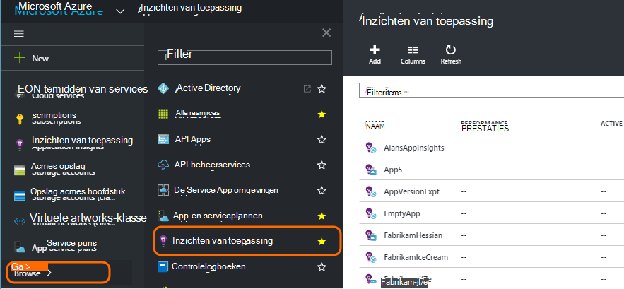
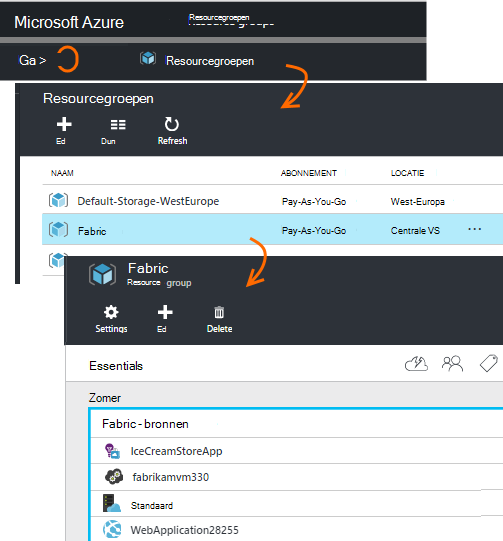
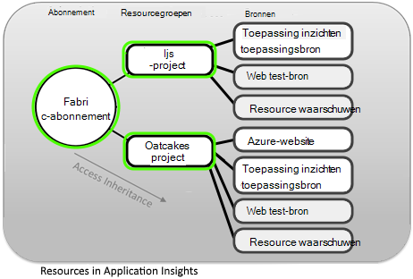
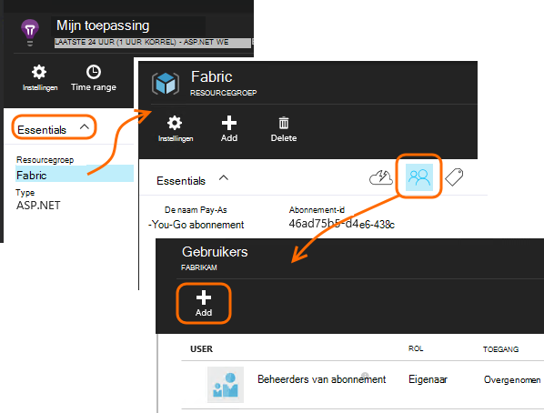
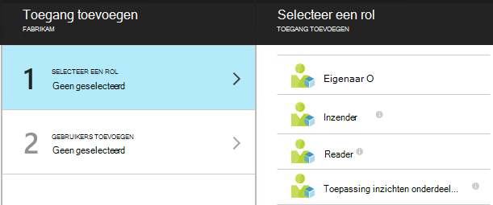
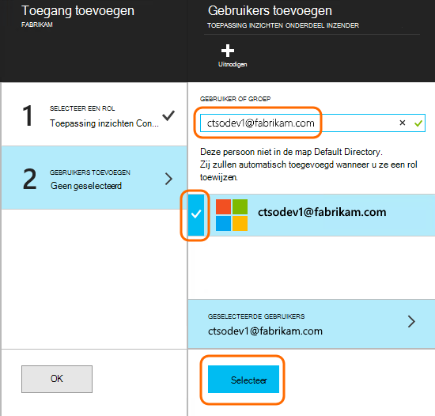

<properties
    pageTitle="Bronnen, rollen en toegangsbeheer in de inzichten van toepassing"
    description="Eigenaren, medewerkers en lezers van de inzichten van uw organisatie."
    services="application-insights"
    documentationCenter=""
    authors="alancameronwills"
    manager="douge"/>

<tags
    ms.service="application-insights"
    ms.workload="tbd"
    ms.tgt_pltfrm="ibiza"
    ms.devlang="na"
    ms.topic="article"
    ms.date="05/07/2016"
    ms.author="awills"/>

# Bronnen, rollen en toegangsbeheer in de inzichten van toepassing

U kunt bepalen wie heeft gelezen en toegang tot uw gegevens in een Visual Studio- [Toepassing inzichten]bijwerken[start], met behulp van [toegangsbeheer op basis van functies in Microsoft Azure](../active-directory/role-based-access-control-configure.md).

> [AZURE.IMPORTANT] Toegang voor gebruikers in de **resourcegroep of een abonnement** waartoe uw toepassingsbron behoort - niet in de bron zelf toewijzen. De **toepassing inzichten onderdeel Inzender** rol toewijzen. Op deze manier een uniform beheer van toegang tot het web tests en signalen samen met de bron van uw toepassing. [Meer informatie](#access).

## Bronnen, groepen en abonnementen

Eerst enkele definities:

* **Resource** - een exemplaar van een service van Microsoft Azure. Uw toepassing inzichten bron verzamelt, analyseert en de telemetriegegevens verzonden vanuit uw toepassing worden weergegeven.  Andere soorten Azure bronnen zijn webtoepassingen, databases en VMs.

    Alle resources, terecht op de [Azure Portal][portal], log in en klik op Bladeren.

    

* [**Resourcegroep** ] [ group] -elke resource deel uitmaakt van een groep. Een groep is een handige manier voor het beheren van gerelateerde bronnen, met name voor toegangsbeheer. Bijvoorbeeld in één resourcegroep kan u plaats een Web App, een bron van de inzichten van toepassing voor het controleren van de app en een resource opslag als geëxporteerde gegevens wilt behouden.

    

* [**Abonnement**](https://manage.windowsazure.com) - toepassing inzichten of andere Azure bronnen gebruiken wanneer u zich aanmeldt een Azure-abonnement. Elke groep behoort tot één Azure abonnement, waar u uw pakket prijs kiezen en, als het een organisatie-abonnement de leden en hun toegangsrechten kiezen.
* [**Microsoft-account** ] [ account] -de gebruikersnaam en het wachtwoord waarmee u zich kunt aanmelden bij Microsoft Azure abonnementen, XBox Live, Outlook.com en andere Microsoft-diensten.

## Toegangsbeheer in de resourcegroep

Het is belangrijk te begrijpen dat naast de resource die u hebt gemaakt voor uw toepassing, er ook afzonderlijke verborgen bronnen voor waarschuwingen en web-tests zijn. Ze zijn gekoppeld aan dezelfde [resourcegroep](#resource-group) als uw toepassing. Mogelijk hebt u andere Azure diensten er, zoals websites of opslag ook plaatsen.

Toegang tot deze bronnen die daarom te aangeraden wordt beheren:

* Toegang beheren op het niveau van de **resourcegroep of abonnement** .
* De rol van **Inzender Application inzichten Component** aan gebruikers toewijzen. Hierdoor kunnen ze web tests, waarschuwingen en inzichten toepassing bronnen, zonder dat u toegang tot andere diensten in de groep bewerken.

## Om toegang te bieden aan een andere gebruiker

U moet hebben eigenaar op het abonnement of de resourcegroep.

De gebruiker moet beschikken over een [Microsoft-Account][account], of toegang tot hun [Organisatie Microsoft-Account](..\active-directory\sign-up-organization.md). U kunt toegang geven aan personen en aan gebruikersgroepen die zijn gedefinieerd in Azure Active Directory.

#### Ga naar de resourcegroep

De gebruiker er toevoegen.

Of u kunt de hoofdmap en de gebruiker toevoegen aan het abonnement.

#### Selecteer een rol

Rol | In de resourcegroep
---|---
Eigenaar | Alles, met inbegrip van de toegang van gebruikers kunt wijzigen
Inzender | Alles, met inbegrip van alle resources kunt bewerken
Toepassing inzichten onderdeel Inzender | Toepassing inzichten resources, web-tests en waarschuwingen kunt bewerken
Reader | Kunnen weergeven maar niet niets wijzigen

'Bewerken' omvat het maken, verwijderen en bijwerken:

* Bronnen
* Web-tests
* Waarschuwingen
* Doorlopende exporteren

#### Selecteer de gebruiker

Als de gebruiker die niet in Active directory, kunt u iedereen met een Microsoft-account uitnodigen.
(Als deze services, zoals Outlook.com, OneDrive, Windows Phone of XBox Live gebruikt, beschikken over een Microsoft-account.)

## Gebruikers en rollen

* [Toegangsbeheer in Azure op basis van rollen](../active-directory/role-based-access-control-configure.md)

<!--Link references-->

[account]: https://account.microsoft.com
[group]: ../resource-group-overview.md
[portal]: https://portal.azure.com/
[start]: app-insights-overview.md
