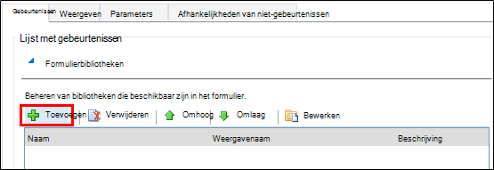
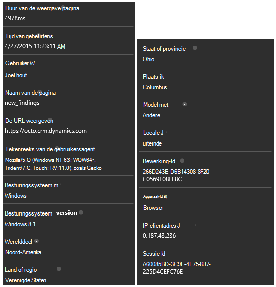

<properties 
    pageTitle="Procedure: Microsoft Dynamics CRM met inzichten van de toepassing controleren" 
    description="Telemetrie u vanuit Microsoft Dynamics CRM Online met behulp van inzichten van toepassing. Overzicht van setup, het ophalen van gegevens, visualisatie en export." 
    services="application-insights" 
    documentationCenter=""
    authors="mazharmicrosoft" 
    manager="douge"/>

<tags 
    ms.service="application-insights" 
    ms.workload="tbd" 
    ms.tgt_pltfrm="ibiza" 
    ms.devlang="na" 
    ms.topic="article" 
    ms.date="11/17/2015" 
    ms.author="awills"/>
 
# Procedure: Telemetrie inschakelen voor Microsoft Dynamics CRM Online met behulp van inzichten van toepassing

In dit artikel wordt beschreven hoe u met telemetriegegevens ophalen uit [Microsoft Dynamics CRM Online](https://www.dynamics.com/) met behulp van [Visual Studio-toepassing inzichten](https://azure.microsoft.com/services/application-insights/). We zien door het volledige proces van toepassing inzichten script toe te voegen aan uw toepassing, het vastleggen van gegevens en weergave van gegevens.

>[AZURE.NOTE] De [Bladeren van de monsteroplossing](https://dynamicsandappinsights.codeplex.com/).

## Inzichten toepassing toevoegen aan nieuwe of bestaande CRM Online exemplaar 

Voor het controleren van uw toepassing, kunt u een toepassing inzichten SDK toevoegen aan uw toepassing. Telemetrie verzendt de SDK naar de [portal Application inzichten](https://portal.azure.com), kunt u onze krachtige analyse en diagnostische hulpprogramma's, of de gegevens exporteren naar opslag.

### Maakt u een bron toepassing inzichten in Azure

1. [Een account in Microsoft Azure](http://azure.com/pricing)aanvragen. 
2. Inloggen op de [portal Azure](https://portal.azure.com) en een nieuwe toepassing inzichten resource toevoegen. Dit is waar uw gegevens worden verwerkt en weergegeven.

    

    ASP.NET te kiezen als het toepassingstype.

3. Open het tabblad Quick Start en het script code.

    

**De pagina open te houden** terwijl u de volgende stap in een ander browservenster. U moet de code snel. 

### Een JavaScript web-bron maakt in Microsoft Dynamics CRM

1. Open uw exemplaar van CRM Online en u aanmelden met beheerdersbevoegdheden.
2. Open Microsoft Dynamics CRM-instellingen, aanpassingen, aanpassen het systeem

    
    
    

    

3. Een JavaScript-bron maken.

    

    Een naam geven en selecteer **Script (JScript)** de teksteditor openen.

    
    
4. Kopieer de code van de inzichten van toepassing. Tijdens het kopiëren van zorg script-tags wordt genegeerd. Zie hieronder screenshot:

    

    De code bevat de sleutel instrumenten waarmee de toepassingsbron inzichten.

5. Opslaan en publiceren.

    

### Instrument formulieren

1. Open het formulier Account in Microsoft CRM Online.

    

2. Open de eigenschappen van het formulier

    

3. De JavaScript webresource die u hebt gemaakt toevoegen

    

    

4. Opslaan en publiceren van uw aanpassingen.

## Metrische gegevens vastgelegd

U hebt nu ingesteld telemetrie vastleggen voor het formulier. Wanneer het wordt gebruikt, worden gegevens verzonden naar de bron van de inzichten van toepassing.

Hier vindt u voorbeelden van de gegevens die u ziet.

#### Gezondheid toepassing

Browser uitzonderingen:

Klik op de grafiek als u meer informatie:

#### Gebruik

#### Browsers

#### Geolocation

#### Aanvraag voor Inside pagina weergeven

## Voorbeeld van code

[De voorbeeldcode bladeren](https://dynamicsandappinsights.codeplex.com/).

## Power BI

U kunt zelfs grondigere analyse doen als u [de gegevens exporteren naar Microsoft Power BI](app-insights-export-power-bi.md).

## Microsoft Dynamics CRM oplossing

[Hier is de oplossing geïmplementeerd in Microsoft Dynamics CRM] (https://dynamicsandappinsights.codeplex.com/).

## Meer informatie

* [Wat is de inzichten van toepassing?](app-insights-overview.md)
* [Toepassing inzichten voor webpagina 's](app-insights-javascript.md)
* [Meer voorbeelden en zelfstudies](app-insights-code-samples.md)

 
