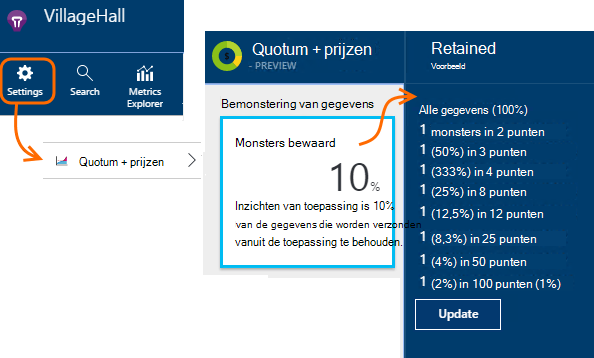

<properties 
    pageTitle="Bemonstering in toepassing inzichten telemetrie | Microsoft Azure" 
    description="Hoe u kunt het volume van de telemetrie onder controle houden." 
    services="application-insights" 
    documentationCenter="windows"
    authors="vgorbenko" 
    manager="douge"/>

<tags 
    ms.service="application-insights" 
    ms.workload="tbd" 
    ms.tgt_pltfrm="ibiza" 
    ms.devlang="na" 
    ms.topic="article" 
    ms.date="08/30/2016" 
    ms.author="awills"/>

#  <a name="sampling-in-application-insights"></a>Bemonstering in de inzichten van toepassing

*Inzichten van toepassing is in het afdrukvoorbeeld.*


Bemonstering is dat een functie van [Visual Studio-toepassing inzichten](app-insights-overview.md) is de aanbevolen manier minder telemetrie verkeer en opslag behoud van een statistisch correcte analyse van toepassingsgegevens. Het filter selecteert u items die zijn gekoppeld, zodat u tussen items navigeren kunt als u de diagnostische onderzoeken.
Als metrische telt wordt aan u gepresenteerd in de portal, zijn ze renormalized rekening te houden met de bemonstering, minimaliseren de invloed op de statistieken.

Bemonstering beperkt u het verkeer, kunt u binnen de quota voor maandelijkse gegevens en kunt u beperken voorkomen.

## <a name="in-brief"></a>In het kort:

* Bemonstering 1 in *n* records behoudt en de rest wordt verwijderd. Dit kan bijvoorbeeld 1: 5-gebeurtenissen, een sampling-frequentie van 20% behouden. 
* De bemonstering gebeurt automatisch als uw toepassing een heleboel telemetrie, in ASP.NET web server apps verzendt.
* U kunt ook instellen dat bemonstering handmatig, hetzij in de portal op de pagina prijzen. of in de ASP.NET-SDK in het .config-bestand, het netwerkverkeer ook beperken.
* Als u aangepaste gebeurtenissen in logboek registreren en u ervoor zorgen wilt dat een reeks gebeurtenissen wordt bewaard of genegeerd bij elkaar, zorg dat ze dezelfde waarde bewerkingsnummer hebben.
* De deler bemonstering *n* wordt vermeld in elke record in de eigenschap `itemCount`, die in de zoekresultaten wordt weergegeven onder de weergavenaam 'aanvraag count' of 'gebeurtenis count'. Wanneer de bemonstering niet in werking, `itemCount==1`.
* Als u query's Analytics schrijft, moet u [rekening houden met de bemonstering](app-insights-analytics-tour.md#counting-sampled-data). In het bijzonder, niet alleen records geteld, moet u `summarize sum(itemCount)`.


## <a name="types-of-sampling"></a>Soorten bemonstering


Er zijn drie alternatieve bemonsteringsmethoden:

* **Adaptieve bemonstering** past automatisch het volume van de telemetrie van de SDK in uw ASP.NET-toepassing verzonden. Standaard van SDK v 2.0.0-beta3. Momenteel beschikbaar voor server-side telemetrie alleen ASP.NET. 
* **Vast tarief bemonstering** vermindert u het volume van de telemetrie van zowel uw ASP.NET-server en uw gebruikers browsers verzonden. Stelt u het tarief. De bemonstering, de client en server worden gesynchroniseerd zodat die, in zoeken u tussen verwante paginaweergaven en aanvragen navigeren kunt.
* **Bemonstering van ingestie** verkleint het volume van de telemetrie behouden door de service Application inzichten, met een snelheid die u hebt ingesteld. Telemetrie-verkeer niet verminderen, maar u kunt houden in uw maandelijkse quota. 

Als Adaptief of vast tarief bemonstering in bewerking, is bemonstering van de opname uitgeschakeld.

## <a name="ingestion-sampling"></a>Bemonstering van opname

Deze vorm van bemonstering werkt op het punt waar de telemetrie van uw webserver, browsers en apparaten de inzichten Application service-eindpunt bereikt. Hoewel het niet de telemetrie-verkeer dat wordt verzonden vanuit de app verminderen, het minder verwerkt en bewaard (en in rekening gebracht) door de inzichten van toepassing.

Gebruik dit type van de bemonstering als uw app vaak over de maandelijkse quota gaat en u de optie hoeft van het gebruik van de typen SDK op basis van de bemonstering. 

Stel de samplefrequentie in de quota en de prijzen van blade:



Net als andere soorten bemonstering behoudt het algoritme telemetrie gerelateerde items. Bijvoorbeeld als u de telemetrie zoeken inspecteren bent, zult u het verzoek betrekking heeft op een bepaalde uitzondering vinden. Metric telt zoals aanvraag en snelheid uitzondering correct blijven behouden.

Gegevenspunten die zijn verwijderd door middel van steekproeven zijn niet beschikbaar in een functie van de inzichten van toepassing zoals [Doorlopend exporteren](app-insights-export-telemetry.md).

Bemonstering van de opname functioneren niet terwijl op basis van SDK adaptieve of vaste rente bemonstering uitgevoerd wordt. Als de samplefrequentie op de SDK is minder dan 100%, wordt de samplefrequentie voor opname die u instelt genegeerd.

> [AZURE.WARNING] De waarde die wordt weergegeven op de tegel geeft de waarde die u hebt ingesteld voor de bemonstering van de opname. Het wordt niet de werkelijke samplefrequentie vertegenwoordigen als SDK bemonstering uitgevoerd wordt.


## <a name="adaptive-sampling-at-your-web-server"></a>Adaptieve bemonstering op uw webserver

Adaptieve bemonstering is beschikbaar voor de toepassing inzichten SDK voor ASP.NET v 2.0.0-beta3 en hoger en is standaard ingeschakeld. 


Adaptieve bemonstering van invloed op de omvang van de telemetrie van uw server web app verzonden naar de service Application inzichten. Het volume wordt automatisch aangepast om binnen een opgegeven maximale snelheid van het verkeer houden.

Deze niet werken bij lage volumes van telemetrie, zodat een app in foutopsporing of een website met weinig gebruik, worden niet beïnvloed.

U bereikt het doelvolume door enkele van de telemetrie gegenereerd wordt genegeerd. Maar net als andere soorten bemonstering, behoudt het algoritme telemetrie gerelateerde items. Bijvoorbeeld als u de telemetrie zoeken inspecteren bent, zult u het verzoek betrekking heeft op een bepaalde uitzondering vinden. 

Metric telt zoals aanvraag en uitzondering worden aangepast om te compenseren voor de samplingfrequentie zodat ze ongeveer de juiste waarden tonen in Verkenner Metric.

Pakketten **van uw project NuGet bijwerken** naar de nieuwste versie van de *voorlopige versie* van de inzichten van toepassing: het project in de Solution Explorer met de rechtermuisknop, kies NuGet pakketten beheren, controleren **zijn voorlopige versie** en zoek naar Microsoft.ApplicationInsights.Web. 

In [ApplicationInsights.config](app-insights-configuration-with-applicationinsights-config.md), kunt u verschillende parameters in de `AdaptiveSamplingTelemetryProcessor` knooppunt. De cijfers zijn de standaardwaarden:

* `<MaxTelemetryItemsPerSecond>5</MaxTelemetryItemsPerSecond>`

    De snelheid van het doel dat wordt beoogd het adaptieve algoritme voor **op elke serverhost**. Als uw web app op veel hosts wordt uitgevoerd, verlaagt u deze waarde te blijven binnen de snelheid van de target-verkeer op de portal Application inzichten.

* `<EvaluationInterval>00:00:15</EvaluationInterval>` 

    Het interval waarmee de huidige telemetrie opnieuw worden geëvalueerd is. Evaluatie wordt uitgevoerd als een zwevend gemiddelde. U kunt dit interval korter als de telemetrie onderhevig aan de plotselinge bursts is.

* `<SamplingPercentageDecreaseTimeout>00:02:00</SamplingPercentageDecreaseTimeout>`

    Bij bemonstering veranderingspercentages waarde, hoe snel nadat we mogen lagere bemonsteringspercentage opnieuw met minder gegevens worden vastgelegd.

* `<SamplingPercentageIncreaseTimeout>00:15:00</SamplingPercentageIncreaseTimeout>`

    Bij bemonstering veranderingspercentages waarde, hoe snel nadat we mogen bemonsteringspercentage om meer gegevens vastleggen opnieuw te verhogen.

* `<MinSamplingPercentage>0.1</MinSamplingPercentage>`

    Bemonstering percentage varieert, is wat de laagste waarde die we mag instellen.

* `<MaxSamplingPercentage>100.0</MaxSamplingPercentage>`

    Bemonstering percentage varieert, is wat de maximale waarde mag we instellen.

* `<MovingAverageRatio>0.25</MovingAverageRatio>` 

    In de berekening van het zwevend gemiddelde wordt het gewicht aan de meest recente waarde toegewezen. Gebruik de waarde gelijk is aan of kleiner is dan 1. Kleinere waarden maken het algoritme minder reactief naar plotselinge wijzigingen.

* `<InitialSamplingPercentage>100</InitialSamplingPercentage>`

    De waarde die wordt toegewezen wanneer de app zojuist is gestart. Niet verlaagt dit terwijl u fouten opspoort. 

### <a name="alternative-configure-adaptive-sampling-in-code"></a>Alternatief: Adaptief bemonstering configureren in code

U kunt de code gebruiken in plaats van bemonstering in het .config-bestand aan te passen. Hiermee kunt u opgeven van een callback-functie die wordt aangeroepen wanneer de samplefrequentie opnieuw geëvalueerd wordt. U kunt dit bijvoorbeeld om erachter te komen welke sampling-frequentie wordt gebruikt.

Verwijder de `AdaptiveSamplingTelemetryProcessor` knooppunt uit het .config-bestand.


*C#*

```C#

    using Microsoft.ApplicationInsights;
    using Microsoft.ApplicationInsights.Extensibility;
    using Microsoft.ApplicationInsights.WindowsServer.Channel.Implementation;
    using Microsoft.ApplicationInsights.WindowsServer.TelemetryChannel;
    ...

    var adaptiveSamplingSettings = new SamplingPercentageEstimatorSettings();

    // Optional: here you can adjust the settings from their defaults.

    var builder = TelemetryConfiguration.Active.TelemetryProcessorChainBuilder;
    
    builder.UseAdaptiveSampling(
         adaptiveSamplingSettings,

        // Callback on rate re-evaluation:
        (double afterSamplingTelemetryItemRatePerSecond,
         double currentSamplingPercentage,
         double newSamplingPercentage,
         bool isSamplingPercentageChanged,
         SamplingPercentageEstimatorSettings s
        ) =>
        {
          if (isSamplingPercentageChanged)
          {
             // Report the sampling rate.
             telemetryClient.TrackMetric("samplingPercentage", newSamplingPercentage);
          }
      });

    // If you have other telemetry processors:
    builder.Use((next) => new AnotherProcessor(next));

    builder.Build();

```

([Meer informatie over processors telemetrie](app-insights-api-filtering-sampling.md#filtering)).


<a name="other-web-pages"></a>
## <a name="sampling-for-web-pages-with-javascript"></a>Bemonstering voor webpagina's met JavaScript

U kunt webpagina's voor de bemonstering van vaste rente vanaf elke server configureren. 

Wanneer u [de webpagina's voor inzichten toepassing configureren](app-insights-javascript.md), het fragment dat u van de portal Application inzichten ontvangt te wijzigen. (Bij ASP.NET-toepassingen, het fragment meestal komt in _Layout.cshtml.)  Voeg een regel zoals `samplingPercentage: 10,` voor de toets instrumentation:

    <script>
    var appInsights= ... 
    }({ 


    // Value must be 100/N where N is an integer.
    // Valid examples: 50, 25, 20, 10, 5, 1, 0.1, ...
    samplingPercentage: 10, 

    instrumentationKey:...
    }); 
    
    window.appInsights=appInsights; 
    appInsights.trackPageView(); 
    </script> 

Kies een percentage dat is bijna 100/N waarbij N een geheel getal voor het bemonsteringspercentage.  Bemonstering op dit moment ondersteunt geen andere waarden.

Als ook de bemonstering van vaste rente op de server, synchroniseren de clients en de server zodat die, in zoeken u tussen verwante paginaweergaven en aanvragen navigeren kunt.


## <a name="fixed-rate-sampling-for-aspnet-web-sites"></a>Bemonstering van de vaste rente voor de ASP.NET-websites

Bemonstering van vaste rente verlaagt het verkeer van uw webserver en de browser verzonden. In tegenstelling tot de adaptieve bemonstering vermindert telemetrie tegen een vaste rente, door u bepaald. Het ook synchroniseren van de client en server bemonstering zodat verwante items worden bewaard - bijvoorbeeld, zodat als u een pagina weergeven in zoekresultaten bekijkt, u de verwante aanvraag vindt.

De bemonstering algoritme behoudt gerelateerde artikelen. Voor elke HTTP-aanvraag worden gebeurtenis, en de bijbehorende gebeurtenissen gewist of verzonden. 

In Explorer Metrics, worden tarieven, zoals het aantal aanvragen en de uitzonderingen factor vermenigvuldigd een ter compensatie van de samplefrequentie, zodat ze ongeveer juist zijn.

1. **Bijwerken van uw project NuGet pakketten** naar de nieuwste versie van de *voorlopige versie* van de inzichten van toepassing. Het project in de Solution Explorer met de rechtermuisknop, kies beheren NuGet pakketten, **zijn voorlopige versie** en zoek naar Microsoft.ApplicationInsights.Web. 

2. **Uitschakelen van adaptieve bemonstering**: In [ApplicationInsights.config](app-insights-configuration-with-applicationinsights-config.md), verwijderen of aan de `AdaptiveSamplingTelemetryProcessor` knooppunt.

    ```xml

    <TelemetryProcessors>
    <!-- Disabled adaptive sampling:
      <Add Type="Microsoft.ApplicationInsights.WindowsServer.TelemetryChannel.AdaptiveSamplingTelemetryProcessor, Microsoft.AI.ServerTelemetryChannel">
        <MaxTelemetryItemsPerSecond>5</MaxTelemetryItemsPerSecond>
      </Add>
    -->
    

    ```

2. **De bemonstering van vaste rente module inschakelen.** In dit fragment toevoegen aan [ApplicationInsights.config](app-insights-configuration-with-applicationinsights-config.md):

    ```XML

    <TelemetryProcessors>
     <Add  Type="Microsoft.ApplicationInsights.WindowsServer.TelemetryChannel.SamplingTelemetryProcessor, Microsoft.AI.ServerTelemetryChannel">

      <!-- Set a percentage close to 100/N where N is an integer. -->
     <!-- E.g. 50 (=100/2), 33.33 (=100/3), 25 (=100/4), 20, 1 (=100/100), 0.1 (=100/1000) -->
      <SamplingPercentage>10</SamplingPercentage>
      </Add>
    </TelemetryProcessors>

    ```

> [AZURE.NOTE] Kies een percentage dat is bijna 100/N waarbij N een geheel getal voor het bemonsteringspercentage.  Bemonstering op dit moment ondersteunt geen andere waarden.


### <a name="alternative-enable-fixed-rate-sampling-in-your-server-code"></a>Alternatief: vaste rente bemonstering in de servercode inschakelen


In plaats van de parameter bemonstering in het .config-bestand instelt, kunt u code gebruiken. 

*C#*

```C#

    using Microsoft.ApplicationInsights.Extensibility;
    using Microsoft.ApplicationInsights.WindowsServer.TelemetryChannel;
    ...

    var builder = TelemetryConfiguration.Active.GetTelemetryProcessorChainBuilder();
    builder.UseSampling(10.0); // percentage

    // If you have other telemetry processors:
    builder.Use((next) => new AnotherProcessor(next));

    builder.Build();

```

([Meer informatie over processors telemetrie](app-insights-api-filtering-sampling.md#filtering)).


## <a name="when-to-use-sampling"></a>Wanneer de bemonstering wordt gebruikt?

Adaptieve bemonstering wordt automatisch ingeschakeld als u de SDK van ASP.NET versie 2.0.0-beta3 of hoger. Ongeacht welke SDK-versie u gebruikt, kunt u via ingestie bemonstering (op onze server).

U hoeft niet de bemonstering voor de meeste toepassingen voor kleine en middelgrote omvang. De meest accurate statistieken en de belangrijkste diagnostische informatie worden verkregen door het verzamelen van gegevens over alle activiteiten van uw gebruikers. 

 
De belangrijkste voordelen van de bemonstering zijn:

* Toepassing inzichten service druppels ("throttles") gegevenspunten als uw app verzendt een zeer hoge snelheid van telemetrie in korte tijd interval. 
* Binnen het [contingent](app-insights-pricing.md) van gegevenspunten voor de prijzen laag houden. 
* Netwerkverkeer beperken uit de collectie van telemetrie. 

### <a name="which-type-of-sampling-should-i-use"></a>Welk type van monsterneming moet ik gebruiken?


**Gebruik ingestie bemonstering als:**

* Vaak gaat u via uw maandelijkse telemetrie-quotum.
* U gebruikt een versie van de SDK die geen bemonsterings - bijvoorbeeld ondersteunt, de SDK voor Java of ASP.NET-versies eerder dan 2.
* U krijgt een heleboel telemetrie van webbrowsers van uw gebruikers.

**Gebruik vaste rente als bemonstering:**

* U gebruikt de toepassing inzichten SDK voor ASP.NET web services versie 2.0.0 of hoger, en
* U kunt gesynchroniseerde bemonstering tussen client en server, zodat wanneer u gebeurtenissen in de [zoekopdracht](app-insights-diagnostic-search.md)onderzoeken wilt, u tussen verwante gebeurtenissen op de client en server, zoals de paginaweergaven en HTTP-aanvragen navigeren kunt.
* Bent u zeker van de juiste bemonsteringspercentage voor uw app. Deze moet hoog genoeg zijn voor het verkrijgen van nauwkeurige statistieken, maar onder de snelheid die uw prijzen quotum en bandbreedteregeling grenzen overschrijdt. 


**Gebruik geavanceerde bemonstering:**

In alle andere gevallen wordt aangeraden adaptieve bemonstering. Dit is standaard ingeschakeld in de ASP.NET-server SDK, versie 2.0.0-beta3 of hoger. Het beperken niet verkeer tot een bepaalde minimale snelheid, zodat dit geen invloed op een site intensief wordt gebruikt.


## <a name="how-do-i-know-whether-sampling-is-in-operation"></a>Hoe weet ik of de bemonstering uitgevoerd wordt?

Gebruiken om te ontdekken de werkelijke samplefrequentie, ongeacht waar deze is toegepast, een [query Analytics](app-insights-analytics.md) zoals deze:

    requests | where timestamp > ago(1d)
  	| summarize 100/avg(itemCount) by bin(timestamp, 1h) 
  	| render areachart 

Bewaard in elke record, `itemCount` geeft het nummer van de oorspronkelijke records die het vertegenwoordigt, gelijk is aan 1 + het aantal vorige verwijderde records. 


## <a name="how-does-sampling-work"></a>Hoe werkt de bemonstering?

Vaste rente en adaptieve bemonstering zijn een functie van de SDK in ASP.NET-versies uit vanaf 2.0.0. Ingestie bemonstering kan is een functie van de service Application inzichten, en in werking als de SDK geen bemonstering voert. 

De bemonstering algoritme beslist welke artikelen telemetrie plaatsen en welke u wilt behouden (ongeacht of deze in de SDK of de service Application inzichten). De bemonstering beslissing is gebaseerd op verschillende regels die voor het behoud van alle verwante gegevenspunten intact onderhouden van een diagnostische ervaring in toepassing inzichten die uitvoerbaar en betrouwbare zelfs met een beperkte gegevensset is gericht. Bijvoorbeeld, als uw app verzendt voor een mislukte aanvraag extra telemetrie items (zoals uitzondering en sporen van deze aanvraag geregistreerd), bemonstering niet gesplitst dit verzoek en andere telemetrie. Deze wordt bijgehouden of ze allemaal tegelijk wordt neergezet. Wanneer u de gegevens voor de aanvraag in toepassing inzichten bekijkt, kunt u daarom altijd het verzoek en de bijbehorende telemetrie artikelen bekijken. 

Voor toepassingen die de "gebruiker" te definiëren (dat wil zeggen, meest voorkomende toepassingen), de bemonstering beslissing is gebaseerd op de hash van de gebruikers-id, wat betekent dat alle telemetrie voor een bepaalde gebruiker wordt bewaard of verwijderd. Voor de soorten toepassingen waarmee gebruikers (zoals webservices) niet is de beschikking bemonstering gebaseerd op bewerkings-id van de aanvraag. Ten slotte voor telemetrie artikelen die niet gebruiker noch bewerking-id instellen (voor voorbeeld telemetrie artikelen van asynchrone threads met geen HTTP-context zijn) bemonstering eenvoudig worden vastgelegd een percentage van items van elk type telemetrie. 

Wanneer de telemetrie voor u presenteren, past de service Application inzichten cijfers over de met hetzelfde percentage monsters die is gebruikt tijdens het ophalen van, ter compensatie van de ontbrekende gegevenspunten. Dus, bij het onderzoeken van de telemetrie in inzichten van toepassing, de gebruikers zien statistisch correcte benaderingen die zeer dicht bij de reële getallen zijn.

De nauwkeurigheid van de aanpassing is grotendeels afhankelijk van het bemonsteringspercentage van de geconfigureerde. Bovendien verhoogt de nauwkeurigheid voor toepassingen die een grote hoeveelheid in het algemeen dergelijke verzoeken van een groot aantal gebruikers verwerken. Aan de andere kant voor toepassingen die niet met een aanzienlijke belasting werken, is bemonstering niet nodig omdat deze toepassingen meestal alle hun telemetrie verzenden kunnen terwijl u binnen het contingent van beperken zonder verlies van gegevens. 

Houd er rekening mee dat inzichten van toepassing is voor deze typen niet maatstaven en sessies telemetrie typen sinds monster, vermindering van de precisie kan zeer ongewenste. 

### <a name="adaptive-sampling"></a>Adaptieve bemonstering

Adaptieve bemonstering wordt een component die controleert de huidige frequentie van de overdracht van de SDK en past u het bemonsteringspercentage om te blijven binnen de doel maximumsnelheid. De correctie op gezette tijden opnieuw wordt berekend en wordt op basis van een voortschrijdend gemiddelde van de uitgaande transmissiesnelheid.

## <a name="sampling-and-the-javascript-sdk"></a>Bemonstering en de SDK voor JavaScript

De client-side (JavaScript) SDK deelneemt aan vaste rente bemonstering in combinatie met de server-side-SDK. De geïnstrumenteerde's verzendt alleen client-side telemetrie van dezelfde gebruikers waarvoor het include-bestand gemaakt van haar beslissing 'sample in'. Deze logica is ontworpen om te zorgen voor de integriteit van de gebruikerssessie op client - en server-zijde. Hierdoor kunt u vanuit een bepaalde telemetrie item in inzichten van toepassing andere telemetrie items voor deze gebruiker of sessie vinden. 

*Client- en serverzijde telemetrie weergeven niet gecoördineerde voorbeelden zoals hierboven wordt beschreven.*

* Controleer of u vaste rente bemonstering zowel op de client en server ingeschakeld.
* Zorg ervoor dat de versie SDK 2.0 of hoger.
* Controleer of u hetzelfde bemonsteringspercentage in zowel de client als de server ingesteld.


## <a name="frequently-asked-questions"></a>Veelgestelde vragen 

*Waarom is niet een eenvoudige "collect X procent van elk type telemetrie" bemonstering?*

 *  Deze benadering bemonstering met een zeer hoge precisie in metrische benaderingen zou zorgen, zou kunnen correleren van diagnostische gegevens per gebruiker en sessie-verzoek essentieel voor de diagnostische gegevens is worden verbroken. Daarom een steekproef werkt beter met "alle telemetrie items verzamelen voor X procent van de gebruikers van de app" of "verzamelen alle telemetrie voor X procent van de verzoeken van de app" logica. Voor de telemetrie artikelen niet zijn gekoppeld aan de aanvragen (bijvoorbeeld achtergrond asynchrone verwerking), terug in de herfst is het "collect X procent van alle items voor elk type telemetrie." 

*Kan de bemonsteringspercentage wijzigen na verloop van tijd?*

 * Ja, geavanceerde sampling verandert geleidelijk het bemonsteringspercentage, op basis van de momenteel waargenomen omvang van de telemetrie.

 

*Als het gebruik van de bemonstering van vaste rente, hoe weet ik welke bemonstering percentage werkt het beste voor mijn app?*

* Eén manier is beginnen met adaptieve bemonstering, uitzoeken wat vereffent op (Zie de bovenstaande vraag) beoordelen en ga vervolgens naar de vaste rente bemonstering met die snelheid. 

    Anders hebt u te achterhalen. Analyseren van uw huidige telemetrie gebruik in AI en schatting van de omvang van de verzamelde telemetrie observeren beperken die zich voordoet. Deze drie ingangen, samen met uw geselecteerde prijzen laag voorstellen hoeveel u kunt verminderen van de omvang van de verzamelde telemetrie. Echter kan een toename van het aantal gebruikers of sommige andere shift in het volume van de telemetrie uw offerte ongeldig.

*Wat gebeurt er als ik bemonsteringspercentage te laag configureren?*

* De nauwkeurigheid van de benaderingen, minder met uiterst lage bemonsteringspercentage (over-aggressive bemonstering) inzichten toepassing probeert te compenseren de visualisatie van de gegevens voor het volume gegevens verminderen. Ook kan diagnostische ervaring negatief worden beïnvloed, zoals sommige van de minder vaak zwak of trage aanvragen kunnen worden bemonsterd uit.

*Wat gebeurt er als ik bemonsteringspercentage te hoog configureren?*

* Configureren van te hoog bemonsteringspercentage (niet agressief genoeg) resulteert in een onvoldoende vermindering van de omvang van de verzamelde telemetrie. Treden nog steeds telemetrie data nettoverlies met betrekking tot de beperking en de kosten van het gebruik van de inzichten van de toepassing kan niet hoger zijn dan u gepland als gevolg van overschot toeslagen.

*Op welke platforms kan ik bemonstering gebruiken?*

* Bemonstering ingestie kan automatisch voor elke telemetrie boven een bepaald volume optreden als de SDK geen bemonstering voert. Dit zou werken, bijvoorbeeld als uw app een Java-server gebruikt of als u een oudere versie van de SDK van ASP.NET.

* Als u versies van ASP.NET SDK 2.0.0 en hoger (Perfmon.msc in Azure of op uw eigen server), krijgt u adaptieve bemonstering standaard, maar u kunt overschakelen naar de vaste rente zoals hierboven beschreven. Met vaste rente bemonstering, de browser SDK worden automatisch gesynchroniseerd als verwante gebeurtenissen. 

*Er zijn bepaalde zeldzame gebeurtenissen die ik altijd wilt zien. Hoe krijg ik ze na de bemonstering module?*

 * Een afzonderlijk exemplaar van TelemetryClient met een nieuwe TelemetryConfiguration (niet standaard actief) initialiseren. Gebruiken voor het verzenden van de zeldzame gebeurtenissen.


## <a name="next-steps"></a>Volgende stappen

* [Filteren](app-insights-api-filtering-sampling.md) kan bieden meer strikte controle van wat de SDK worden verzonden.
