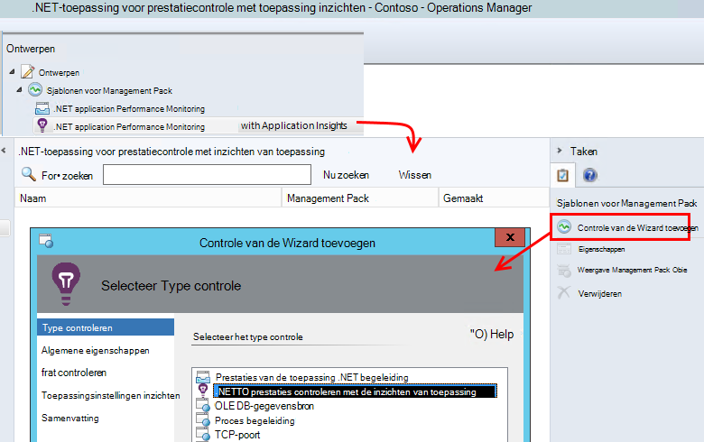
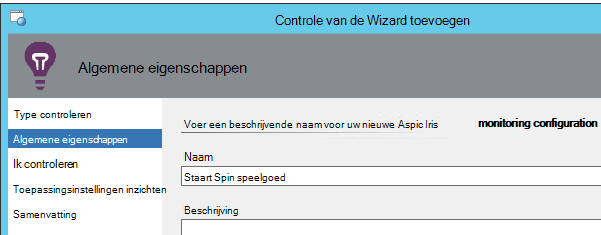
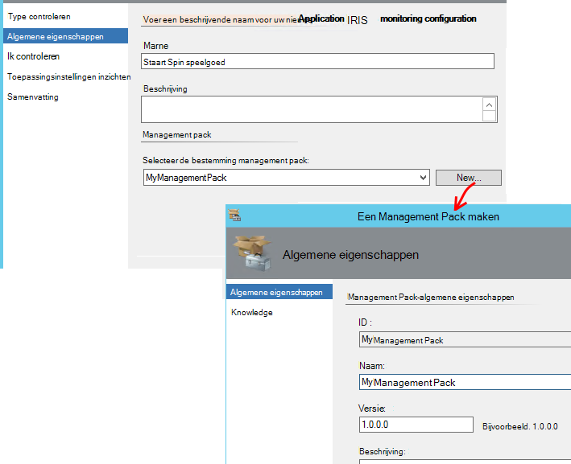
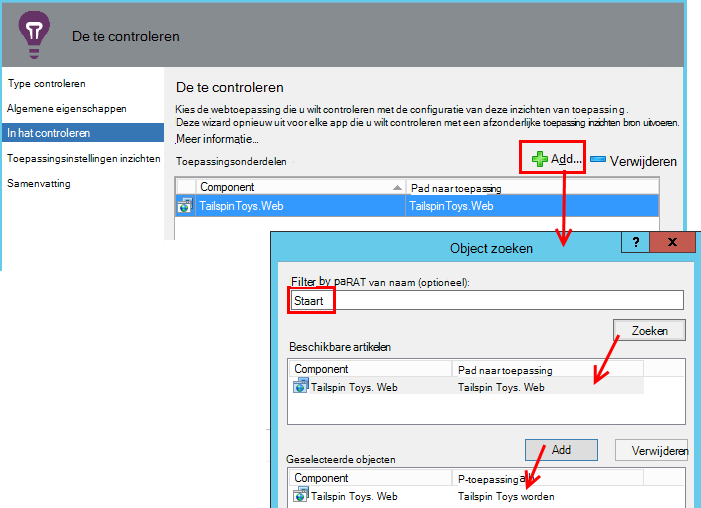
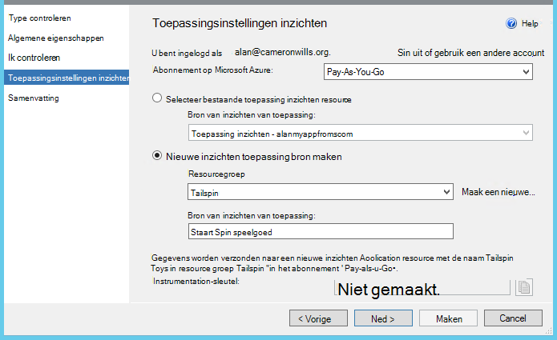
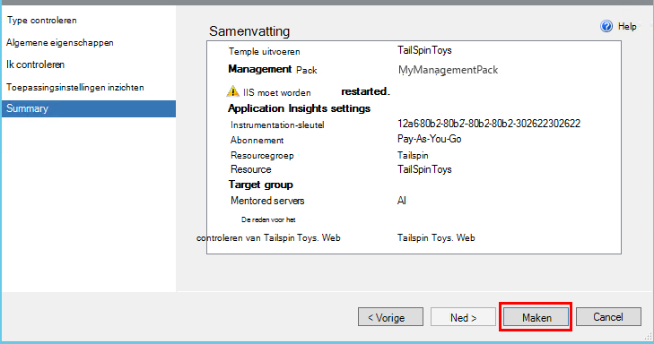
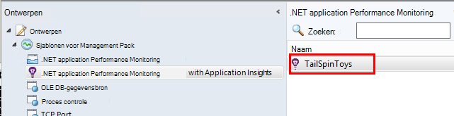
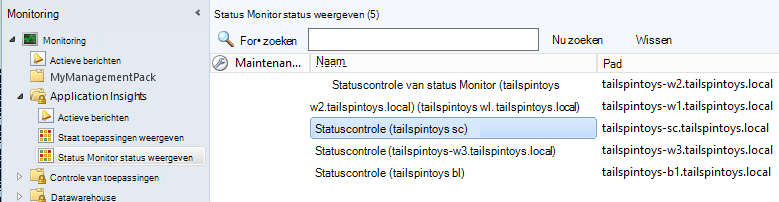

<properties 
    pageTitle="Integratie van SCOM met inzichten van toepassing | Microsoft Azure" 
    description="Als u een SCOM, prestaties controleren en diagnosticeren van problemen met de inzichten van toepassing. Uitgebreide dashboards, slimme waarschuwingen, krachtige diagnoseprogramma's en query's voor analyse." 
    services="application-insights" 
    documentationCenter=""
    authors="alancameronwills" 
    manager="douge"/>

<tags 
    ms.service="application-insights" 
    ms.workload="tbd" 
    ms.tgt_pltfrm="ibiza" 
    ms.devlang="na" 
    ms.topic="article" 
    ms.date="08/12/2016" 
    ms.author="awills"/>
 
# Toepassing prestaties controleren met behulp van de inzichten van toepassing voor SCOM

Als u System Center Operations Manager (SCOM) gebruikt voor het beheren van uw servers, kunt u prestaties bewaken en opsporen van prestatieproblemen met behulp van [Visual Studio-toepassing inzichten](app-insights-asp-net.md). Inzichten van de toepassing controleert binnenkomende aanvragen voor uw webtoepassing, uitgaande van de REST en SQL-aanroepen, uitzonderingen en logboek sporen. Het biedt dashboards met grafieken metrische en slimme waarschuwingen, evenals krachtige diagnostische zoeken en analytische query's via deze telemetrie. 

U kunt overschakelen op de inzichten van de toepassing controleren met behulp van een SCOM management pack.

## Voordat u begint

We ervan uitgaan dat:

* U bent bekend met SCOM en SCOM 2012 R2 of 2016 te gebruiken voor het beheer van uw IIS-webservers.
* U hebt al geïnstalleerd op uw servers een webtoepassing die u wilt controleren met de inzichten van toepassing.
* App framework-versie is .NET 4.5 of hoger.
* U hebt toegang tot een abonnement in [Microsoft Azure](https://azure.com) en zich aanmelden bij de [Azure portal](https://portal.azure.com). Uw organisatie kan een abonnement hebben en aan uw Microsoft-account kunt toevoegen.

(Het ontwikkelteam kan de [Toepassing inzichten SDK](app-insights-asp-net.md) in de web app maken. Deze build tijd instrumentation biedt hen meer flexibiliteit bij het schrijven van aangepaste telemetrie. Echter, het maakt niet uit: u kunt de stappen die hier worden beschreven, met of zonder de ingebouwde SDK.)

## (Één keer) Inzichten Application management pack installeren

Op de computer waar u de Operations Manager uitvoeren:

2. Een oude versie van het management pack verwijderen:
 1. Open in Operations Manager, beheer van de beheerpakketten. 
 2. Verwijder de oude versie.
1. Download en installeer het management pack uit de catalogus.
2. Operations Manager opnieuw.

## Een management pack maken

1. In Operations Manager, open **ontwerpen**, **.NET... met de inzichten van toepassing**, de **Wizard Controle toevoegen**en kies opnieuw **.NET... met de inzichten van toepassing**.

    

2. De configuratie na uw app naam. (U moet één app tegelijk instrument.)
    
    

3. Een nieuw management pack maakt op dezelfde wizardpagina, of Selecteer een pakket voor toepassing inzichten eerder gemaakte.

     (De inzichten Application [management pack](https://technet.microsoft.com/library/cc974491.aspx) is een sjabloon waarvan u een exemplaar maken. U kunt hergebruiken hetzelfde exemplaar later.)

    

4. Kies een toepassing die u wilt controleren. De zoekfunctie zoekt tussen apps geïnstalleerd op uw servers.

    

    Optionele controle in het veld scope kan worden gebruikt om een subset van uw servers, opgeven als u niet wilt dat de app in alle servers controleren.

5. U moet uw referenties voor het aanmelden bij Microsoft Azure opgeven op de volgende wizardpagina.

    Op deze pagina kunt u de toepassing inzichten bron waar u de telemetriegegevens worden geanalyseerd en worden weergegeven. 

 * Als de toepassing is geconfigureerd voor de inzichten van toepassing tijdens de ontwikkeling, de bestaande resource selecteren.
 * Anders maakt u een nieuwe resource met de naam van de app. Als er andere apps die deel uitmaken van hetzelfde systeem, plaatst u deze in dezelfde bronnengroep om toegang tot de telemetrie gemakkelijker te beheren.

    U kunt deze instellingen later wijzigen.

    

6. Voltooi de wizard.

    
    
Herhaal deze procedure voor elke toepassing die u wilt controleren.

Als u deze instellingen later wijzigen, opent u de eigenschappen van de monitor in het venster ontwerpen opnieuw.

## Controle controleren

Het beeldscherm dat u hebt geïnstalleerd, zoekt u naar uw app op elke server. Wanneer zij constateert dat de app, configureert de wizard toepassing inzichten Statuscontrole voor het controleren van de app. Indien nodig, worden eerst de Status Monitor op de server installeert.

U kunt controleren welke exemplaren van een toepassing heeft gevonden:

## Telemetrie in inzichten toepassing weergeven

Blader naar de resource voor de app in de [portal Azure](https://portal.azure.com). U [Zie grafieken waarin de telemetrie](app-insights-dashboards.md) van uw app. (Als deze nog niet maximaal op de hoofdpagina nog weergegeven, klikt u op Live Stream van Metrics.)

## Volgende stappen

* [Instellen van een dashboard](app-insights-dashboards.md) samen te brengen de belangrijkste grafieken toezicht op dit en andere toepassingen.
* [Meer informatie over statistieken](app-insights-metrics-explorer.md)
* [Waarschuwingen instellen](app-insights-alerts.md)
* [Diagnose van problemen met de prestaties](app-insights-detect-triage-diagnose.md)
* [Krachtige Analytics-query 's](app-insights-analytics.md)
* [Beschikbaarheid van web-tests](app-insights-monitor-web-app-availability.md)
